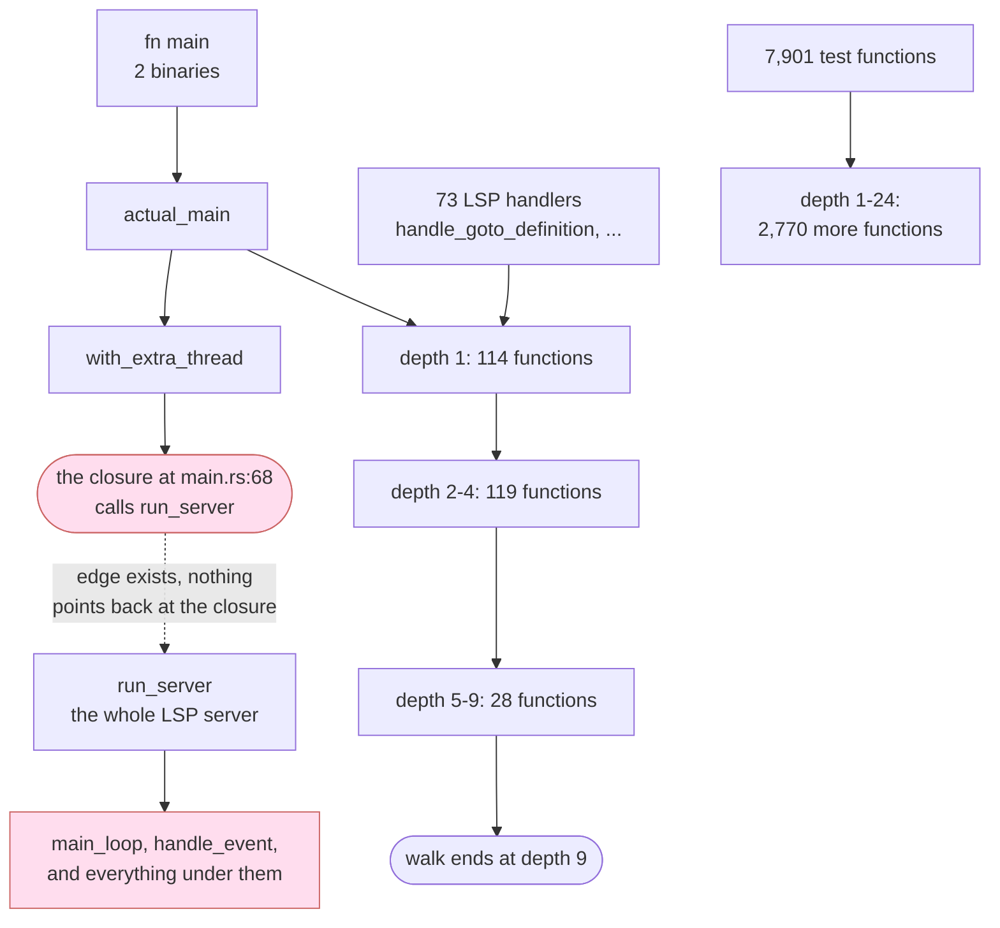

# Walking rust-analyzer's call graph with extract: what we found

## Contents

1. [The one-sentence version](#the-one-sentence-version)
2. [The numbers](#the-numbers)
3. [The crawl, drawn](#the-crawl-drawn)
4. [Where the walk from main dies](#where-the-walk-from-main-dies)
5. [The top 5 problems, in plain words](#the-top-5-problems-in-plain-words)
6. [What we could not measure](#what-we-could-not-measure)
7. [The one next action](#the-one-next-action)

## The one-sentence version

`extract` read all 1,481 Rust files of the rust-analyzer source without a single
crash, timeout or error, then built a call graph from them that connects only
about a third of the calls, and a walk starting at `fn main` reaches under 2% of
the program's functions.

## The numbers

| question | answer |
|---|---|
| files read | 1,481 |
| files that failed, hung, or printed a warning | 0 |
| facts produced | 5,595,506 |
| call sites found | 138,223 |
| call sites turned into a graph edge | 48,723, so 35% |
| functions in the corpus | 19,190 |
| functions a walk from `fn main` and the 73 LSP request handlers reaches | 336, so 1.75% |
| functions a walk from the 7,901 `#[test]` functions reaches | 10,671, so 56% |
| functions nothing reaches | 8,262 |

The reading half is clean. The connecting half is where the work is.

## The crawl, drawn



13 shapes, two of them pink: that is the dead end. Everything under
`run_server` is real, working, present in the data, and cut off from `main` by
a single closure.

## Where the walk from main dies

```
step 0  main                  calls actual_main
step 1  actual_main           calls with_extra_thread, setup_logging, 3 more
step 2  with_extra_thread     calls nothing we can see
        the real source says:  with_extra_thread(.., move || run_server(None))
        the graph says:        closure@2180  ->  run_server
        the problem:           nothing is ever named "closure@2180",
                               so the walk cannot step onto it
step 3  run_server            calls run_session, which calls the main loop,
                              which calls handle_event, which has 45 outgoing
                              calls.  All of it sits there, unreachable.
```

Same shape, 3,837 more times: one in seven of every edge we found starts at a
closure, and 934 functions are reachable only through one.

## The top 5 problems, in plain words

**1. Calls written inside a macro are invisible.** `format!("{}", helper())`
does not count as calling `helper`. Neither does `assert_eq!(helper(), 1)` or
`vec![helper()]`. The corpus contains 17,184 macro calls. Rust test code is
written almost entirely inside them, which is a large part of why so many test
functions look like they call nothing.

**2. A closure ends the walk.** A call written inside `|| ...` gets recorded as
coming from the closure, and nothing can then follow the chain through it. This
is what hides rust-analyzer's entire server from `fn main`.

**3. One generated file blows the time budget on its own.** A 352 KB file with
2,508 functions in it parses in a tenth of a second and takes 12 seconds to
resolve. The cost grows roughly with the cube of how many functions are in one
file, so doubling the file makes it eight times slower. Because that one file
cannot finish, its whole crate has to be cut into pieces to finish at all, and
cutting it up throws away 373 perfectly good connections between the pieces.

**4. The graph ignores the module a call names.** rust-analyzer's `main`
function calls `rustc_wrapper::main()`, a different function in a different
file. We record it as `main` calling itself. The information needed to get it
right is already sitting in the data, unread. 294 connections in the corpus
point at the wrong file for this reason.

**5. When a call resolves to nothing, nothing says why.** 89,500 of 138,223
calls produce no connection, and the output is silent about all of them. There
is no way, from the output alone, to tell "this calls the standard library"
from "two functions share this name so we gave up" from "we have a bug here".
Working out the split took a separate reconstruction, and it is:

| why the call is not in the graph | share |
|---|---|
| calls something outside the corpus, standard library or a dependency | 37% |
| the name is used by several functions, so we decline to guess | 47% |
| lost to the timeout in problem 3 | 4% |
| lost because we had to cut the corpus into crates to finish | 11% |
| a genuine bug in the extractor | 0.4% |

That last row is the good news: once you account for the deliberate policy and
the two performance problems, the extractor is wrong about very little.

## What we could not measure

We wanted to compare our graph against the one rust-analyzer builds for itself.
The copy of rust-analyzer installed on this machine crashes when asked to index
the rust-analyzer source, so that comparison could not be run on the full
corpus. `extract` handled the crash exactly right: it reported a named skip and
kept going rather than pretending the corpus was empty. Four small self-contained
crates could be indexed, and the comparison ran on those.

## The one next action

Fix problem 3. It is the cheapest of the five, the fix is local to two functions,
and it is the only one whose damage is indirect: it is currently costing 3,320
call sites of its own plus 373 more that had nothing wrong with them, purely
because one file cannot finish in time. A test fixture that measures the growth
curve is already committed.
