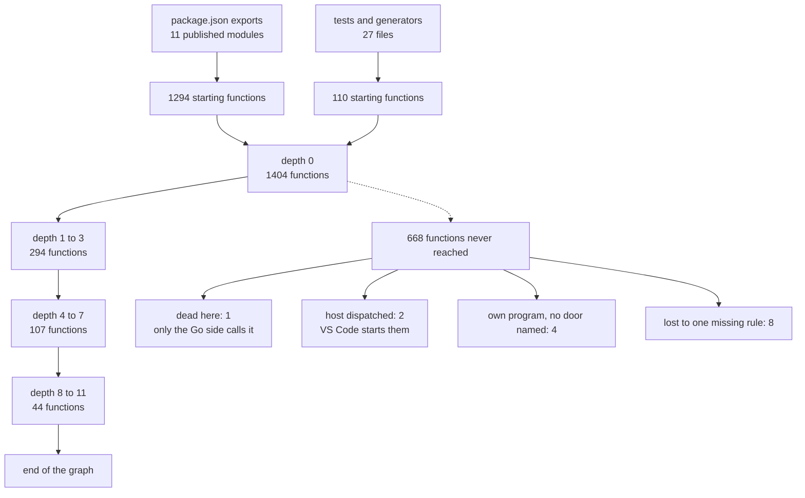

# TypeScript crawl, in plain words

## Contents

1. [What was done](#what-was-done)
2. [The corpus was not the one the brief expected](#the-corpus-was-not-the-one-the-brief-expected)
3. [Robustness: perfect](#robustness-perfect)
4. [The crawl](#the-crawl)
5. [How far the crawl reaches](#how-far-the-crawl-reaches)
6. [Against the real compiler index](#against-the-real-compiler-index)
7. [Top five kinks](#top-five-kinks)
8. [What one fix would buy](#what-one-fix-would-buy)

## What was done

The `extract` binary was pointed at Microsoft's TypeScript repository. Every
source file was parsed one at a time. Then the whole project was resolved into
a call graph. Then that graph was walked from the program's front doors to see
how much of the code it reaches. Then the same project was indexed
by the real TypeScript compiler and the two answers were put side by side.

## The corpus was not the one the brief expected

TypeScript's main branch is now written in Go. The files the brief named as
starting points do not exist. What is left in TypeScript is the npm package
that talks to the Go compiler, a VS Code extension, and three code generators:
271 files. Behind them sits a test suite of 12967 TypeScript files, which makes
an excellent parser stress test.

The front doors were substituted with the ones the package itself declares: the
eleven modules its `package.json` publishes.

## Robustness: perfect

13238 files. Zero crashes. Zero timeouts. Zero error messages. Nothing hit the
size limit. The largest file is 3.1 MB and takes 418 ms.

Eight files produce nothing at all, and all eight are an encoding problem:
seven are UTF-16 and one is not valid text. The tool reports success and an
empty result for each, so a caller reads them as "this file has no code."

## The crawl

The dashed branch is the interesting one. Of the ten largest unreached
functions that were opened, eight are unreachable for a single reason: the
three code generators are started through a shorthand import form the resolver
does not understand. One missing rule hides an entire subsystem.

## How far the crawl reaches

There are 2517 named functions and methods in the 271 files.

| starting from | reaches | share | deepest chain |
|---|---|---|---|
| the published package doors | 1566 | 62% | 8 calls |
| the tests and generators | 423 | 17% | 11 calls |
| both together | 1849 | 73% | 11 calls |

A caveat sits under those numbers. More than a third of all call edges say the
caller is an unnamed inline function. Nothing in the per-file output names
those, so a walker cannot tell whose code that was. Repairing the name by hand
raises what the tests can reach from 231 functions to 423, an 83% jump, and
deepens the longest chain from 8 to 11. Seven out of ten of those unnamed
callers cannot be repaired at all.

## Against the real compiler index

The real TypeScript indexer was run over the same code and produced 20159
edges to `extract`'s 5116. That gap is smaller than it looks: only about half
of the indexer's edges are calls. The rest are a function mentioning a type, a
parameter, or a constant.

Comparing only the call-shaped edges over the same files:

| question | answer |
|---|---|
| edges both agree on | 1467 |
| edges only the compiler found | 1331 |
| edges only `extract` found | 671 |
| of `extract`'s edges, how many the compiler confirms | 69% |
| of the compiler's real call edges, how many `extract` finds | 72% |

Thirty of the disagreements were opened and sorted. Most are not disagreements
at all: the two tools spell constructors and class methods differently. Of the
fifteen edges only the compiler had, five are names the corpus defines in more
than one file and `extract` deliberately declines to guess. Five are not calls.
Of the fifteen only `extract` had, four are simply wrong, and three are real
calls the compiler's own fold dropped.

## Top five kinks

**1. Adding the word `export` can delete a function.**
Two identical lines of code, one after the other. The first has its inner
function recorded. The second, with `export` in front, does not, and every call
that function makes disappears without a word. 413 call sites in this project
are lost this way.

**2. A method name is matched with no regard for what it was called on.**
If any class anywhere in the project has a method named `push`, then every
ordinary array `push` in the project is recorded as calling that method. 8% of
all recorded calls point at the wrong function for this reason. The worst
single case: 125 calls all pointing at the same wrong target.

**3. Type-only declaration files win call matches.**
A `.d.ts` file describes shapes; it holds no runnable code. 172 recorded calls
point into one anyway, because the name matched.

**4. A renamed import is invisible.**
`import runIt from "./generator.ts"` where the other file says
`export default function main()`. The connection between `runIt` and `main` is
never made, even though the tool already records every piece of information
needed to make it. Three occurrences here, and they are the reason eight of the
twenty largest unreached functions are unreached.

**5. Inline functions have no name to join on.**
When an anonymous inline function makes a call, the record says the caller is
"the thing at byte 54531". Nothing else in the output uses that as a name, so
the chain of who-calls-whom snaps at every callback. 37% of all edges.

## What one fix would buy

Kinks 1 and 5 are the same underlying gap seen from two sides, and they are the
expensive ones. Kink 4 is three lines of code in the corpus and hides an entire
subsystem. Kinks 2 and 3 are the opposite problem: not silence but confident
wrong answers, which is worse for anyone trusting the output.

Six small reproduction files are checked in alongside this report. Each is
under thirty lines, each states what it expects and what it gets, and each was
run against the binary to confirm it behaves exactly as written.
