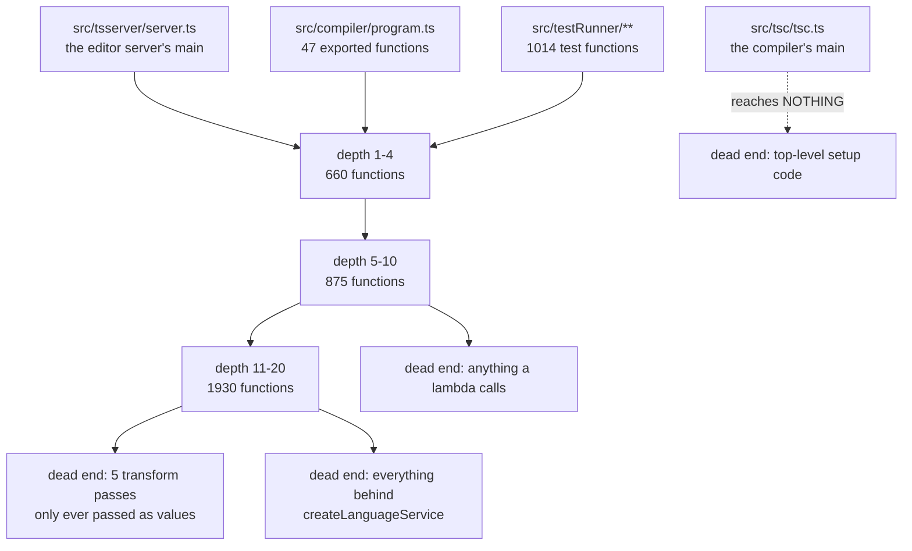
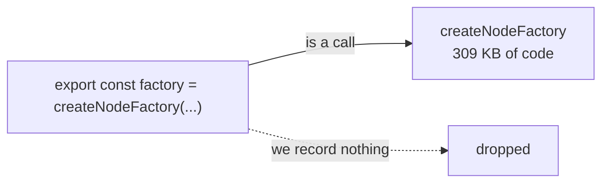

# Walking the TypeScript compiler with our extractor: what we found

## Contents

1. [What we did](#what-we-did)
2. [The crawl, drawn](#the-crawl-drawn)
3. [The numbers](#the-numbers)
4. [Top 5 problems, in plain words](#top-5-problems-in-plain-words)
5. [What is already fine](#what-is-already-fine)

## What we did

We took our `extract` tool and pointed it at the TypeScript compiler, the last
version still written in TypeScript itself. 701 source files, 20 MB of code.

Then we asked it one question: **starting from the compiler's entry point, what
code can you reach?** That is the call graph walk. If the tool is good, almost
everything in the compiler should be reachable, because almost everything in the
compiler runs.

## The crawl, drawn

The dotted line is the headline. The compiler's own `main` file reaches zero
functions. Everything the walk found, it found through the other three doors.

## The numbers

| question | answer |
|---|---|
| functions and methods in the compiler | 14,047 |
| reachable from the entry points | 5,854 (42%) |
| reachable if we fix one bug (lambdas) | 7,344 (52%) |
| call sites found | 99,542 |
| call sites we could connect to a definition | 75,089 (76%) |
| of those connections, how many point at the wrong thing | 3,175 (4%) |

We also asked TypeScript's own indexer the same question, on the 7,326
functions both tools agree exist:

| who is walking | reached |
|---|---|
| our tool | 2,752 (38%) |
| TypeScript's own indexer | 5,276 (72%) |

Reading that: we find three quarters of the calls, one in twenty-five of the
answers is wrong, and we walk to about half of where the real compiler walks.

Nothing crashed, nothing timed out, nothing was skipped for size. 19,818 files,
zero failures. The tool is stable; it is the accuracy that has gaps.

## Top 5 problems, in plain words

### 1. Code that runs at file load is invisible

The tool only records a call if the call sits inside a function. TypeScript sets
up half its machinery in statements at the top of a file, outside any function.
Those calls are thrown away. That is why `tsc.ts` reaches nothing: all eight of
its calls are top-level.

1,358 calls lost this way. 740 of them point at exactly one place, so there was
no ambiguity to worry about.

### 2. Arrow functions break the chain

When a call happens inside an arrow function (`x => doThing(x)`), the tool
records the caller as a made-up name like `closure@2973761`. Nothing else in the
output uses that name, so the chain snaps there.

Nearly a quarter of all connections, 17,592 of them, have this problem. Stitching
them back to the enclosing named function raises reachability from 42% to 52%.

### 3. The tool ignores the import lines it already reads

TypeScript funnels its whole compiler through one re-export file. So when
`binder.ts` writes `forEachChild(node)`, the import at the top of the file says
exactly which file that came from. The tool reads those import lines, writes them
into its output, and then does not use them: it matches on the bare name, sees
two files with a `forEachChild`, and gives up.

1,241 calls would resolve if it used what it already has. A separate flag,
`--deps`, already computes the exact lookup table needed.

### 4. It cannot tell a public function from a private one

`isIdentifier` is one of the most-called helpers in the compiler. There are two:
the real exported one, and a small private helper inside the parser that nobody
outside can see. The tool cannot tell them apart, so it refuses to answer.

465 calls to `isIdentifier`, 24 answered.

### 5. A method name on the wrong object

When code says `myArray.push(item)`, the tool throws away `myArray` and looks up
just `push`. The compiler happens to have a function called `push` in its tracing
module, so **2,064 array pushes across the codebase are recorded as calls into
the tracing module**. Same story for `fn.bind()`, `JSON.stringify()`, and
`regex.test()`.

The receiver is right there in the recorded data. It is read and then discarded.

## What is already fine

| thing | result |
|---|---|
| stability | 19,818 files, zero crashes, zero timeouts, zero size skips |
| speed | the 3 MB type checker parses in 388 ms |
| the module graph | 2,022 file-to-file edges, 41 of 42 misses are npm packages that are genuinely not there |
| default imports | a problem on the last corpus, zero cost on this one |
| memory | mostly fine, with one shape to watch: a 40 KB file of deeply nested expressions costs as much memory as the 3 MB type checker |

One thing outside our control: when we asked TypeScript's own indexer for a
second opinion, it silently skipped the two biggest files, including the type
checker itself. Our tool reported no warning about that, because it only warns
when a whole project fails, never when one file goes missing.
