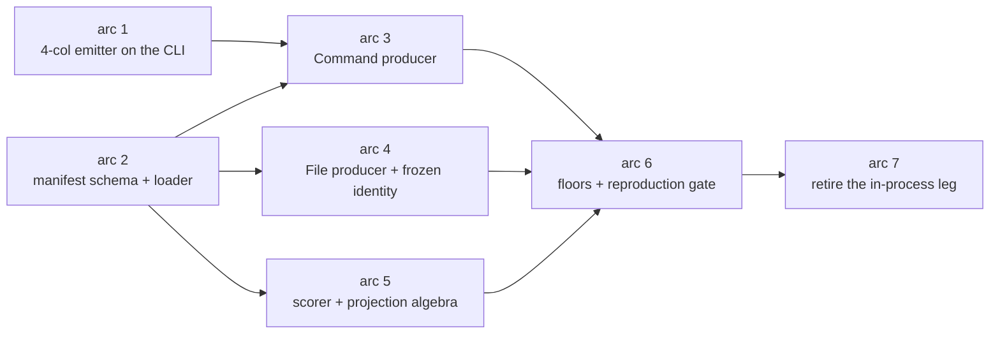

# Bench runtime: a measurement seam with no language, no engine and no dependency in scope

Design only. No `src/**` or `tests/**` edit lands with this document.

User word (2026-08-31): "i want commonality and non language/engine/deps scope
locked test runtime", after accepting option A: the committed oracle tsvs keep
`cost = None` forever, and only producers that run under the runtime from here
on carry real cost.

## TOC

1. [Build vs buy](#1-build-vs-buy)
2. [What exists today, measured](#2-what-exists-today-measured)
3. [Requirements the design is judged against](#3-requirements-the-design-is-judged-against)
4. [Layer 1: type signatures](#4-layer-1-type-signatures)
5. [Layer 2: pseudo-code bodies](#5-layer-2-pseudo-code-bodies)
6. [Layer 3: instance lifetimes](#6-layer-3-instance-lifetimes)
7. [Layer 4: storage layout, reads and writes, uniqueness](#7-layer-4-storage-layout-reads-and-writes-uniqueness)
8. [In-process or spawned: the priced fork](#8-in-process-or-spawned-the-priced-fork)
9. [Adding a language is a manifest row: the kotlin walk](#9-adding-a-language-is-a-manifest-row-the-kotlin-walk)
10. [Reproduction, the acceptance test](#10-reproduction-the-acceptance-test)
11. [Migration table: every script and every leg](#11-migration-table-every-script-and-every-leg)
12. [Arc list with dependency order](#12-arc-list-with-dependency-order)
13. [Forks, decided](#13-forks-decided)
13b. [Forks still open](#13b-forks-still-open)
13c. [Superseded by work that landed while this plan was written](#13c-superseded-by-work-that-landed-while-this-plan-was-written)
14. [Corrections to the brief](#14-corrections-to-the-brief)

---

## 1. Build vs buy

Repo law: no "write our own" for a common-shaped problem without a written
candidate-by-candidate analysis first. The problem reads as a declarative
benchmark matrix with subprocess timing, resource accounting and regression
floors, which is a well-served shape, so the analysis runs before any design.

Each candidate is judged against the requirements enumerated in
[section 3](#3-requirements-the-design-is-judged-against). The three that
decide every verdict:

- **R3**, the payload of a run is a row SET, not a scalar duration.
- **R4**, scoring applies per-pair set algebra before intersecting.
- **R1/R9**, a producer can have identity with no cost, and absent must be
  distinguishable from zero.

### 1.1 hyperfine

Statistical shell benchmark: warmup runs, N timed runs, mean/stddev/min/max,
`--export-json`.

| | |
|---|---|
| what it does | spawns a command repeatedly, reports wall distribution, exports JSON |
| what it cannot do here | discards the child's stdout, so the row set (the entire payload) is thrown away (R3). Reports wall/user/system only, with no peak RSS at any flag (R2 half-fails). No scoring, no floors, no per-case skip for an absent tool. |
| installed on this machine | no (`command -v hyperfine` empty) |
| verdict | **OUT as the runtime.** Its `--export-json` result schema is worth copying for the cost record shape, as a schema and not as a dependency. |

### 1.2 conbench

Benchmark result store plus regression detection (Voltron Data, Apache-2.0).
Client submits results to a server; the server does lookback z-score
regression detection across runs and machines.

| | |
|---|---|
| what it does | stores benchmark results with context (machine, commit), detects regressions statistically across runs and across machines |
| what it cannot do here | results are scalars with a unit; there is no row-set payload and no set intersection (R3, R4). No representation of an artifact that has identity and no cost (R9). It is a server plus a database to host, which is exactly the dependency the scope lock forbids (R8). |
| verdict | **OUT as the runtime.** Its cross-machine comparison is the one thing it does that we cannot trivially reproduce, and the "three unrelated machines" pain in section 2 is real, so it stays named as the candidate to revisit IF cross-machine regression statistics are ever wanted on top of the emission records. |

### 1.3 asv (airspeed velocity)

Matrix over configurations, tracked over commits, static HTML report.

| | |
|---|---|
| what it does | builds a python project at each commit, runs a benchmark matrix over parameter axes, tracks values over history, flags step changes |
| what it cannot do here | it builds and imports YOUR python package per commit; our producers are foreign binaries and committed files (R8, R9). Values are scalars, including its "tracking" benchmarks (R3). No set scoring (R4). No per-case unavailable state (R6). |
| installed | no |
| verdict | **OUT.** The parameter-matrix and step-change-report ideas are the good part and cost far less to reproduce than the python-package coupling costs to fight. |

### 1.4 bencher.dev

Ratchet and threshold service over CI. `bencher` CLI plus a server, self-hostable,
Apache-2.0/MIT. Adapters parse other harnesses' output into its metric model.

| | |
|---|---|
| what it does | per-branch baselines, thresholds with boundary limits, fails CI when a metric crosses a boundary. Genuinely strong at the floors job (R5). |
| what it cannot do here | metrics are scalars (latency, throughput, custom measures); no set intersection and no projections (R3, R4). No identity-without-cost artifact (R1, R9). Self-hosting is a server plus a database (R8). Its adapter model puts it ABOVE a harness, consuming that harness's output, so it never replaces the scorer. |
| verdict | **OUT as the runtime.** It is a real candidate for the floors layer specifically, and the emission record in [section 4](#4-layer-1-type-signatures) is deliberately shaped so a bencher adapter could consume it later without a redesign. |

### 1.5 criterion and iai-callgrind

In-process Rust micro-benchmarks. criterion resamples a closure statistically;
iai-callgrind counts instructions under valgrind.

| | |
|---|---|
| what they do | measure a Rust function inside the harness process, with strong statistics (criterion) or deterministic instruction counts (iai-callgrind) |
| what they cannot do here | the producer must be a Rust closure, so CodeQL, madge, joern and a committed tsv have no representation at all (R8, R9). The measurement is of the harness process, which is precisely the `RUSAGE_SELF` pid confusion that caused failure-mode 101 (R2). The payload is discarded (R3). iai-callgrind additionally needs valgrind, which does not run on darwin arm64. |
| verdict | **OUT, by a wide margin.** The shape is wrong at the first requirement: this is an accuracy harness whose observations carry cost, and not a micro-benchmark. |

### 1.6 pytest-benchmark

Fixture-driven timing with saved-JSON comparison and
`--benchmark-compare-fail`.

| | |
|---|---|
| what it does | times a python callable, min/max/mean/stddev, compares against a saved run, fails on a threshold. Covers R5 partially and R7 via pytest timeouts. |
| what it cannot do here | times a python callable in-process (R2, R3). No set scoring (R4). Puts python back in the runtime's own scope, and the whole direction of this work is to leave python (R8). |
| verdict | **OUT.** The migration in [section 11](#11-migration-table-every-script-and-every-leg) runs AWAY from python, so adopting a python harness inverts the goal. |

### 1.7 snakemake, nextflow, make, just

The runner half alone: a DAG of producers with cached artifacts, re-run when
inputs change.

| | |
|---|---|
| what they do | declare stages with inputs and outputs, skip stages whose inputs are unchanged, run independent stages concurrently. nextflow additionally writes a per-task `trace.txt` carrying wall and peak RSS, which satisfies R2 natively. |
| what they cannot do here | no scoring and no set algebra (R4), no asymmetric floors (R5), and a frozen artifact is an input file rather than a record with identity (R1, R9). snakemake needs python plus conda and nextflow needs a JVM, both of which break the dependency scope lock (R8). |
| installed | `just` 1.54.0 (already the repo's entry point, `v6/justfile`), `make` 3.81 (the BSD build shipped with darwin). snakemake, nextflow: no. |
| verdict | **OUT for the record and score half. `just` stays as the entry point, which it already is** (`v6/justfile:79-89`). The DAG-with-caching problem is not the hard part of this work: the case matrix is on the order of tens of rows, not thousands, and its stages are independent. Buying a workflow engine to schedule 20 independent commands adds a runtime dependency to solve a problem the design does not have. nextflow's `trace.txt` column set is worth copying as a schema. |

### 1.8 dvc

Pipeline plus artifact versioning. `dvc.yaml` declares stages as `cmd` + `deps`
+ `outs`; content-addressed artifact storage; `dvc exp` tracks metrics.

| | |
|---|---|
| what it does | versions large artifacts out of git, records the command that produced each, tracks scalar metrics per experiment. Genuinely aimed at R9. |
| what it cannot do here | no per-stage resource accounting worth the name (R2). Metrics are scalars in a JSON file, with no set scoring and no asymmetric floors (R4, R5). Python dependency (R8). |
| the problem we do not have | DVC exists to keep large artifacts out of git. The committed tsvs are already in git and are small: the largest oracle read for this plan, `ts5.oracle.call.tsv`, is 84,958 lines. There is no storage problem to solve. |
| verdict | **OUT.** Its `dvc.yaml` stage schema (cmd, deps, outs) is the closest existing thing to the manifest row this plan proposes, and [section 4](#4-layer-1-type-signatures) models the manifest on it deliberately. |

### 1.9 OpenTelemetry via hafley-observe

Already linked and installed: the optional dependency at
`v6/sprefa-extract/Cargo.toml:197`, installed by
`v6/sprefa-extract/src/trace.rs:257-266`.

| | |
|---|---|
| what it does | a transport for spans and metrics with attributes, already wired in this crate |
| what it cannot do here | it is a transport, and not a store, a scorer or a floors table (R4, R5, R10 all absent). OTel metrics have no absent value: a missing attribute against a zero is a convention rather than a type, which fails R1 exactly where the user's decision A needs it to hold. The natural OTel shape instruments the CURRENT process, reproducing the `RUSAGE_SELF` error of failure-mode 101 (R2). |
| verdict | **OUT for the record of truth. IN later as an optional emitter downstream of the record**, which is a named non-now arc in [section 12](#12-arc-list-with-dependency-order). |

### 1.10 The steelman combination

The fairest reading of the field is not any single tool but the stack
**`just` (runner) + hyperfine (cost) + self-hosted bencher (floors) + our
scorer**. It collapses under inspection:

| step | outcome |
|---|---|
| hyperfine spawns the producer | it discards stdout, so the rows are gone. The spawn leg has to be ours regardless. |
| once the spawn leg is ours | hyperfine has nothing left to contribute, and RSS was never in its output anyway. |
| bencher hosts the floors | the floors are 11 rows in a TSV today (`RATCHET.tsv`) with asymmetric tolerances (0.10 pt on accuracy, +15% wall, +10% rss) that its threshold model does not express. It also needs a server. |
| what is left | the manifest, the spawn-and-time leg, the scorer, the floors file. |

### 1.11 Verdict table and the decision

| candidate | R1/R9 identity without cost | R2 child cost | R3 rows as payload | R4 projected set scoring | R5 asymmetric floors | R8 no dep in scope | verdict |
|---|---|---|---|---|---|---|---|
| hyperfine | no | partial (no rss) | **no** | no | no | yes | out |
| conbench | no | no | **no** | no | yes | no (server) | out, revisit for cross-machine stats |
| asv | no | no | **no** | no | yes | no (python pkg) | out |
| bencher.dev | no | no | **no** | no | partial | no (server) | out, revisit for the floors layer |
| criterion / iai-callgrind | no | **no** (in-process) | no | no | no | no (Rust closure only) | out |
| pytest-benchmark | no | no | no | no | partial | no (python) | out |
| snakemake / nextflow | no | yes (nextflow trace) | no | no | no | no (python/JVM) | out |
| make / just | no | no | no | no | no | **yes** | `just` stays the entry point |
| dvc | partial | no | no | no | no | no (python) | out |
| OTel / hafley-observe | **no** | no | no | no | no | yes (already linked) | out now, optional emitter later |

**Decision.** No candidate covers R3, R4 and R1/R9 together, and those three
are the whole problem. The commodity half of the work (spawn a child, time it,
cap it, record wall and peak RSS) is bought as a METHOD rather than as code:
hyperfine's JSON result schema, nextflow's trace columns and dvc's stage schema
are copied as schemas, and the mechanism itself is 52 lines that already run on
this machine at `plans/extract-bench-2026-08-29/corpus-stats/run.py:99-151`.
The bespoke half (projected set scoring against oracles) is already written and
unit-tested in Rust at `v6/sprefa-extract/tests/bench/mod.rs`.

The runtime is therefore a manifest reader, a process spawner and the existing
scorer. The genuinely new code is the manifest and the spawner. Every
candidate's good idea enters as a schema, and none enters as a dependency.

---

## 2. What exists today, measured

Three unrelated measurement machines produce the numbers this repo quotes.

| producer kind | mechanism today | receipt |
|---|---|---|
| our extractor, ratchet | in-process `resolve_project`, 3 runs, median wall, `getrusage(RUSAGE_SELF)` | `v6/sprefa-extract/tests/bench/mod.rs:755-813`, RSS at `:817-827` |
| our extractor, corpus stats | spawned under `/usr/bin/time -l`, capped, killed at the cap, `overcap` recorded | `plans/extract-bench-2026-08-29/corpus-stats/run.py:99-151` |
| external tools | one-off scripts, hand-run, numbers hand-copied into REPORT.md tables | `plans/extract-{bench,crawl}-2026-08-29/*.py` |
| frozen artifacts | committed `.tsv`, no cost recorded anywhere except a prose install table | `plans/extract-bench-2026-08-29/TOOLS.REPORT.md:136-144` |

Counts, taken from the tree at `41333391a` (commands in
[section 14](#14-corrections-to-the-brief)):

| thing | count |
|---|---|
| python scripts across both plan dirs | 31 files, 4,496 lines |
| top-level committed `.tsv`, bench dir | 88 |
| top-level committed `.tsv`, crawl dir | 43 |
| `RATCHET.tsv` floor rows | 11 |
| `RATCHET.cost.tsv` | does not exist in this tree |
| cargo invocations behind `just extract-ratchet` | 4 (`v6/justfile:85-89`) |

### 2.1 The two seams

**The row seam exists and is good.** `src_path \t src_name \t dst_path \t
dst_name`, paths relative to the corpus root, names bare, module rows carrying
empty names (`COMMON.md:23-28`). Every tool in every pid already lands here.
This design does not touch its first four columns.

**The measurement seam does not exist.** Who ran, over what corpus, at what
tier, at what cost, scoring what. Today that lives in prose, in hand-typed
percents (`plans/extract-crawl-2026-08-29/ts.REPORT.md:632-637`) and in one
8-column TSV (`RATCHET.tsv`).

### 2.2 The pid boundary, which is the hard constraint

`tests/bench/mod.rs:819` calls `getrusage(RUSAGE_SELF)`. That number is
truthful only when the rows were produced by the scoring process. Failure-mode
101 (`docs/failure-modes.md`) records what the shared pid costs, and it names
three axes that failed SILENTLY in one session:

| axis | what happened | current guard |
|---|---|---|
| dev-profile build | walls ran 4 to 14x the release floors (rust 146.5 s against a 10.6 s ceiling, go 12.6 s against 3.2 s) and read as regressions | `assert!(!cfg!(debug_assertions))`, `tests/bench/mod.rs:758-762` |
| missing `rust-checker` feature | the field is inert, so the leg measured the syntax tier against checker floors | `assert!(corpus.lang != "rust" \|\| cfg!(feature = "rust-checker"))`, `tests/bench/mod.rs:765-768` |
| legs sharing one test process | a shared `getrusage` high-water meant a later leg inherited the heaviest leg's peak: ts5 read 1,698 MB against its 514 MB ceiling | none in code; the guard is the protocol in `v6/justfile:85-89`, one leg per process |

Every one of the three is a guard bolted on after the incident, and the third
has no code guard at all. A spawned producer makes all three unrepresentable
rather than asserted, which is the argument developed in
[section 8](#8-in-process-or-spawned-the-priced-fork).

### 2.3 The prototype that already runs

`corpus-stats/run.py` is a narrower version of the thing this plan designs, and
it works. Its output columns at `run.py:27` are identity, cost and row counts
in one table:

```
repo  lang  arm  sha  files  loc  rows_call  rows_type  rows_module
      unresolved  wall_s  peak_rss_mb  overcap  extract_describe
```

`STATS.tsv` carries 19 data rows over 14 repos, with `arm` taking `diet` (14
rows) and `checker` (5 rows). Reading that header against this design:

| STATS.tsv column | this design |
|---|---|
| `repo`, `sha` | `CorpusId` plus `corpus_sha` |
| `arm` | `Tier`, renamed to the vocabulary of `COMMON.md:75` |
| `extract_describe` | `source_version` |
| `wall_s`, `peak_rss_mb` | `Cost` |
| `overcap` | `Outcome::OverCap`, promoted from a boolean column to an outcome |
| `rows_*` | `row_count` per family |

The design is therefore a generalisation of something already measured on this
machine, and not a speculative build.

### 2.4 A semantic the scorer has and the file format hides

`load_tsv` collects into a `BTreeSet` (`tests/bench/mod.rs:596-601`), so the
on-disk row multiset becomes a set before scoring. That collapse is not
cosmetic on at least one committed oracle:

| oracle file | lines on disk | unique rows | duplicates collapsed |
|---|---|---|---|
| `ts5.oracle.call.tsv` | 84,958 | 59,356 | 25,602 |
| `ts.codeql2.call.tsv` | 53,140 | 53,140 | 0 |
| `go.codeql2.call.tsv` | 48,529 | 48,529 | 0 |
| `rust.codeql.call.tsv` | 52,744 | 52,744 | 0 |
| `rust.oracle.call.tsv` | 27,004 | 27,004 | 0 |
| `ts.madge.module.tsv` | 2,011 | 2,011 | 0 |

Command that prints it:
`for f in *.tsv; do echo "$f $(wc -l < $f) $(sort -u $f | grep -c .)"; done`.

One committed RATCHET row depends on the collapse:
`ts5.call.syntax vs ts5.oracle.call.tsv on TypeScript-5.9 src/** minus src/lib
(600 .ts files): recall 88.20% = 52,353 matched / 59,356 oracle edge-rows`.
Against the 84,958 lines on disk the same numerator reads 61.62%.

**Consequence for the design.** An emission record carries BOTH counts,
`row_count` (lines the producer emitted) and `unique_rows` (what the scorer
saw). Without the pair, a producer that emits every row 1.4 times is
indistinguishable from one that does not, and the only visible effect is a
denominator that silently moves.

---

## 3. Requirements the design is judged against

| id | requirement | where it comes from |
|---|---|---|
| R1 | identity without cost: a record carries tool, version, command, corpus, corpus sha, produced_at and row count with cost absent, and absent is distinguishable from zero | user decision A |
| R2 | cost is the CHILD's wall and peak RSS, stamped by the producer's own process | `docs/failure-modes.md` 101 |
| R3 | the payload of a run is a row set in the 4-col normal form | `COMMON.md:23-28` |
| R4 | scoring applies an ordered, per-pair projection before the byte-equal intersection | `tests/bench/mod.rs:1001-1014` |
| R5 | floors per (source, corpus, family, tier, oracle) on recall, precision, wall and rss, with asymmetric tolerances (0.10 pt, +15%, +10%) | `tests/bench/mod.rs:1019-1060`, `RATCHET.tsv` header |
| R6 | an absent tool reports `unavailable`, its cases skip loudly, rc stays 0 for that row | brief; matches `tests/bench/mod.rs:954-961, 988-994` |
| R7 | per-producer cap, killed at the cap, the kill is a reported outcome | 10-second law; `corpus-stats/run.py:122-132` |
| R8 | the runtime names no language, no engine type and no tool dependency in its own code | user word, scope lock |
| R9 | a frozen artifact is a first-class producer that never executes | user decision A |
| R10 | the accuracy columns of all 11 `RATCHET.tsv` rows re-derive exactly | brief |

---

## 4. Layer 1: type signatures

Every name below is language-free and engine-free. `Rust`, `TypeScript`, `Go`,
`python`, `node`, `cargo`, `ra_ap`, `resolve_project`, `ScipMode` and
`ResolveArms` appear nowhere in the runtime's types. They appear only as
manifest DATA.

### 4.1 Identity

```rust
/// Stable identity of a row producer. The manifest key. A frozen CodeQL tsv,
/// a spawned madge and our own extractor are all this one shape.
pub struct SourceId(pub String);        // "codeql", "madge", "joern", "sprefa"

/// A corpus is a checkout at a pinned sha, named once in the manifest.
pub struct CorpusId(pub String);        // "typescript-go", "rust-analyzer"

/// Closed by contract at COMMON.md:26-27. An unknown family is a manifest
/// load error, matching the panic at tests/bench/mod.rs:592.
#[derive(Clone, Copy, PartialEq, Eq, PartialOrd, Ord)]
pub enum Family { Call, Type, Module }

/// Closed by contract at COMMON.md:75. Applies to every producer, ours and
/// theirs alike: CodeQL is a checker-tier tool.
#[derive(Clone, Copy, PartialEq, Eq, PartialOrd, Ord)]
pub enum Tier { Syntax, Checker, Scip }

/// One cell of the matrix: this source, over this corpus, at this tier,
/// answering this family. The manifest is a list of these plus their bindings.
pub struct Case {
    pub source: SourceId,
    pub corpus: CorpusId,
    pub family: Family,
    pub tier: Tier,
    /// Placeholder bindings for the source's argument template. The kotlin
    /// walk in section 9 turns on this field existing.
    pub bindings: BTreeMap<String, String>,
}
```

### 4.2 The producer contract

```rust
/// Two kinds and no third. A producer either runs, or it is a committed file.
pub enum Producer {
    Command(CommandProducer),
    File(FileProducer),
}

pub struct CommandProducer {
    pub program: PathBuf,
    /// Templated. Placeholders resolve from Case::bindings plus the runtime's
    /// own {corpus_root}, {file_list}, {out_dir}. No language name is ever a
    /// placeholder NAME; a language name may only be a placeholder VALUE.
    pub args: Vec<ArgTemplate>,
    pub env: BTreeMap<String, String>,
    pub cwd: Option<PathBuf>,
    pub rows_from: RowSink,
    /// Per-producer, from the manifest. The 10-second law applies to the
    /// runtime's own path; a producer's cap is its declared budget.
    pub cap: Duration,
    /// Run before the case. A failing probe yields Outcome::Unavailable.
    pub availability: AvailabilityProbe,
    /// How this tool's native output becomes 4-col rows. `Passthrough` when
    /// the tool already emits the normal form.
    pub adapter: Adapter,
}

pub enum RowSink { Stdout, NamedFile(PathBuf) }

pub struct AvailabilityProbe {
    pub program: PathBuf,
    pub args: Vec<String>,          // typically ["--version"]
    /// Captured into Emission::source_version on success.
    pub version_from: VersionCapture,
}

/// A committed artifact. NOTE the absence: this variant has no cost field at
/// all, so a frozen tsv carrying a fake zero is unrepresentable rather than
/// merely discouraged. User decision A, enforced by the type.
pub struct FileProducer {
    pub rows_path: PathBuf,
    pub recorded: FrozenIdentity,
}

/// Hand-transcribed ONCE, from TOOLS.REPORT.md:136-144 and git log. Never
/// regenerated: no oracle is re-run by this design.
pub struct FrozenIdentity {
    pub tool: String,
    pub tool_version: String,
    pub command: String,            // the command that produced it, as recorded
    pub corpus: CorpusId,
    pub corpus_sha: String,
    pub produced_at: String,        // RFC 3339
    pub recorded_by: String,        // the commit that committed the tsv
}
```

### 4.3 Cost and outcome

```rust
/// Stamped from wait4 on the producer's own child. Never sampled from the
/// scoring process (failure-modes.md 101: legs sharing one process share a
/// getrusage high-water, and ts5 read 1,698 MB against a 514 MB ceiling).
///
/// Every field is Option independently of Cost itself being Option:
/// a killed child has a wall and an unreliable peak, and RSS capture can miss
/// (corpus-stats/run.py:145-150 leaves rss_mb empty when the regex does not
/// match).
pub struct Cost {
    pub wall_ms: Option<u64>,
    pub peak_rss_mb: Option<u64>,
    pub user_ms: Option<u64>,
    pub sys_ms: Option<u64>,
}

pub enum Outcome {
    Produced { rows: RowSet, cost: Option<Cost> },
    /// The tool is not on this machine. The case skips LOUDLY: a printed line
    /// naming the probe and its stderr, and rc stays 0 for that row (R6).
    Unavailable { probe: String, detail: String },
    /// Killed at the cap. A reported outcome and never a wait (R7).
    OverCap { cap: Duration, partial_rows: u32 },
    Failed { code: i32, stderr_tail: String },
}

/// One row of the record of truth. Identity is mandatory; cost is optional and
/// is None for every File producer, forever.
pub struct Emission {
    pub case: Case,
    pub source_version: String,
    pub command: String,            // exact argv, or "frozen" for a File
    pub corpus_sha: String,
    pub corpus_files: u32,
    pub produced_at: String,
    /// Rows the producer emitted, as lines.
    pub row_count: u32,
    /// Rows the scorer saw, after the multiset collapses to a set. The pair
    /// exists because ts5.oracle.call.tsv is 84,958 lines and 59,356 rows
    /// (section 2.4), and without both a duplicate-emitting producer is
    /// invisible.
    pub unique_rows: u32,
    pub outcome_kind: OutcomeKind,
    pub cost: Option<Cost>,
    pub runtime_sha: String,
}
```

### 4.4 Scoring and the projection algebra

The byte-equal 4-col intersection is the only `matched` (`COMMON.md:76`).
Projections run BEFORE it, and every projection in the tree today decomposes
into four generic operations over column indices. No operation names a
language; each is parameterised by data.

```rust
pub enum Side { Ours, Oracle, Both }
pub enum SetSource { Side(Side), CorpusFiles }

/// A named subset of rows, decided by a column test.
pub enum RowClass {
    Prefixed { col: u8, prefix: String },
    Tagged   { col: u8, value: String },
    Not(Box<RowClass>),
}

/// ORDER IS SIGNIFICANT: the rust projection scopes the oracle side before it
/// derives the ours-side scope from the already-scoped oracle
/// (tests/bench/mod.rs:486-500).
pub enum ProjectOp {
    /// Keep rows whose column `mine` appears in the set of column `theirs`
    /// drawn from `from`.
    ScopeByColumn { side: Side, mine: u8, theirs: u8, from: SetSource },
    /// Drop rows whose column `col` starts with `prefix`.
    DropByPrefix { side: Side, col: u8, prefix: String },
    /// Drop every row in `class`.
    DropClass { side: Side, class: RowClass },
    /// Drop a row in `shadowed` when a row in `by` shares its `key` columns.
    DropShadowed { side: Side, shadowed: RowClass, by: RowClass, key: Vec<u8> },
}
```

**The algebra reproduces both committed projections.** Each line was checked
against the code, and against the two unit tests that pin them
(`tests/bench/mod.rs:352-418` for go, `:532-585` for rust).

| existing projection | code | as ops |
|---|---|---|
| go, `go.codeql2.call.tsv` | `GoProjection { scope_oracle, closure: true, iface: Method }`, mod.rs:294-298 | `ScopeByColumn{Ours,0,0,Side(Oracle)}`, `DropByPrefix{Ours,1,"closure@"}`, `DropClass{Ours, Tagged{4,"implements"}}` |
| go, `go.oracle.call.vta.bare.tsv` | `iface: Impl`, mod.rs:299-303 | same first two, then `DropShadowed{Ours, shadowed: Not(Tagged{4,"implements"}), by: Tagged{4,"implements"}, key: [0,1,3]}` |
| rust, all three call oracles | `RustProjection { corpus_files, closure: true }`, mod.rs:446-451 | `ScopeByColumn{Oracle,2,·,CorpusFiles}`, then `ScopeByColumn{Ours,0,0,Side(Oracle)}`, then `DropShadowed{Both, shadowed: Prefixed{1,"closure@"}, by: Not(Prefixed{1,"closure@"}), key: [0,2,3]}` |
| every other family and corpus | mod.rs:999-1000, "Every other family and corpus scores raw" | the empty op list |

The `iface` distinction needs a `kind` value per row, which the 4-col form does
not carry. Today it rides beside the rows in a side map
(`NormalForms::call_kinds`, mod.rs:189). The design widens the row seam by
OPTIONAL TRAILING columns, leaving the first four byte-identical:

```
src_path \t src_name \t dst_path \t dst_name [\t kind [\t resolution_origin]]
```

Matching stays byte-equal on columns 0 to 3 only, so every committed 4-col
oracle joins unchanged and R10 is preserved.

```rust
pub struct Score { pub ours: u32, pub oracle: u32, pub overlap: u32,
                   pub recall: f64, pub precision: f64 }

/// COMMON.md:71. `contradicted` = the oracle names a different dst for the
/// same src.
pub struct Buckets { pub matched: u32, pub contradicted: u32, pub unjudged: u32 }

pub struct Pairing {
    pub ours: Case,
    pub oracle: Case,           // an oracle is a Case like any other producer
    pub projection: Vec<ProjectOp>,
}
```

An oracle being a `Case` is the point of the whole design: `go.codeql2.call.tsv`
is a `File` producer at `Tier::Checker` over `CorpusId("typescript-go")`, and
our extractor is a `Command` producer at `Tier::Syntax` over the same corpus.
The scorer sees two row sets and an op list, with no idea which one is ours.

### 4.5 Floors

```rust
pub struct Floor {
    pub pairing: PairingKey,        // (ours_case, oracle_case)
    pub recall: f64,
    pub precision: f64,
    pub wall_ms: Option<u64>,       // None while the pairing has no cost
    pub rss_mb: Option<u64>,
    pub measured_at_sha: String,
}

pub struct Tolerances {
    pub accuracy_pt: f64,           // 0.10
    pub wall_pct: f64,              // 15.0
    pub rss_pct: f64,               // 10.0
}
```

`wall_ms` and `rss_mb` are `Option` on a floor for the same reason they are on
a `Cost`: a pairing whose ours-side is a frozen file has no cost to floor.

---

## 5. Layer 2: pseudo-code bodies

```rust
// run_case(manifest, case) -> Emission
//   producer := manifest.producer(case.source)          // load error if absent
//   match producer:
//     File(f):
//       rows      := read_rows(f.rows_path)             // multiset
//       unique    := rows.collect::<BTreeSet<_>>()      // section 2.4
//       return Emission {
//         identity from f.recorded, row_count = rows.len(),
//         unique_rows = unique.len(), cost = None,      // absent BY TYPE
//         outcome = Produced }
//     Command(c):
//       probe := spawn(c.availability) with a 10s cap
//       if probe failed:
//         print "case {case}: unavailable ({probe}): {stderr}"   // LOUD, R6
//         return Emission { cost = None, outcome = Unavailable }
//       argv  := render(c.args, case.bindings + {corpus_root, file_list})
//       child := spawn(argv, cwd, env, new process group)
//       // The group matters: a killed child that spawned its own workers
//       // leaves orphans otherwise (corpus-stats/run.py:120,127).
//       (status, rusage, stdout) := wait4_with_cap(child, c.cap)
//       if capped:
//         killpg(child, SIGKILL)                        // R7, never a wait
//         return Emission { cost = Some(partial), outcome = OverCap }
//       rows   := c.adapter.to_normal_form(stdout or c.rows_from)
//       return Emission {
//         cost = Some(Cost from rusage),                // CHILD's, R2
//         row_count = rows.len(), unique_rows = set(rows).len(),
//         outcome = Produced }

// wait4_with_cap(child, cap) -> (status, rusage, bytes)
//   // The one place the runtime touches the OS resource API. RUSAGE_CHILDREN
//   // is wrong here: it accumulates over ALL reaped children of this process,
//   // so a second case inherits the first's numbers, which is failure-mode
//   // 101's third axis wearing a different hat. wait4 reports the rusage of
//   // THE reaped child, and is the only correct primitive.
//   deadline := now + cap
//   drain stdout and stderr on threads       // a full pipe deadlocks the child
//   loop:
//     if waitpid(child, WNOHANG) reaped: return wait4 rusage
//     if now > deadline: return Capped
//     sleep(poll interval)

// score(ours_rows, oracle_rows, corpus_files, ops) -> (Score, Buckets)
//   ours   := ours_rows.collect::<BTreeSet<_>>()
//   oracle := oracle_rows.collect::<BTreeSet<_>>()
//   for op in ops:                            // ORDER IS SIGNIFICANT
//     apply op to the side(s) it names, reading `from` as it stands NOW
//   overlap := key4(ours) & key4(oracle)      // byte-equal on cols 0..3 only
//   recall    := overlap / |oracle|
//   precision := overlap / |ours|

// check(emissions, floors, tolerances) -> Vec<Failure>
//   for each pairing with a floor:
//     if recall    < floor.recall    - accuracy_pt: fail
//     if precision < floor.precision - accuracy_pt: fail
//     if let Some(ceiling) = floor.wall_ms:
//        if cost.wall_ms > ceiling * (1 + wall_pct/100): fail
//     if let Some(ceiling) = floor.rss_mb:
//        if cost.peak_rss_mb > ceiling * (1 + rss_pct/100): fail
//     // A pairing whose emission is Unavailable or OverCap NEVER silently
//     // passes: it reports its own outcome kind as the verdict.

// bump(emissions, floors) -> floors        // BENCH_BUMP=1
//   improve accuracy floors upward only; lower cost ceilings only by a margin
//   over 10%, matching the RATCHET.tsv header rule.
```

---

## 6. Layer 3: instance lifetimes

| type | lifetime | notes |
|---|---|---|
| `Manifest` | process, immutable after load | read once at start, validated once, never mutated |
| `Producer` | a value inside the manifest, no state of its own | so two cases against one source cannot interfere |
| child process | exactly one case, killed at the cap | its process GROUP dies with it, so a producer that fans out leaves no orphans |
| `RowSet` | one case, dropped after that case is scored | `tests/bench/mod.rs:752-754` keeps only the last of 3 runs so earlier copies free before RSS is read; that comment becomes moot once cost comes from the child, because the harness's own heap no longer enters the number |
| `Emission` | appended to the log the moment its case ends, never held to the end of the run | required by the self-diagnosis law: the trail must answer "what was it doing" after a SIGKILL |
| `Floor` table | read once at start, compared at the end, rewritten only under `BENCH_BUMP` | a run that crashes never rewrites floors |
| `Score` | derived, never stored on its own | it is a pure function of two `RowSet`s and an op list, and storing it invites the two copies to disagree |

---

## 7. Layer 4: storage layout, reads and writes, uniqueness

### 7.1 The record of truth is append-only TSV

`RATCHET.tsv` is a committed, git-diffable TSV today, and R10 requires byte
reproduction of its accuracy columns. The record of truth therefore stays TSV.
A SQLite index is a later, optional arc ([section 7.4](#74-the-optional-sqlite-index)).

Three files, all under `plans/extract-eval-2026-08-31/`:

| file | shape | written when |
|---|---|---|
| `MANIFEST.tsv` | the case matrix and its producers, hand-edited | by a human adding a row |
| `EMISSIONS.tsv` | append-only, one row per case per run | during the run, flushed per case |
| `FLOORS.tsv` | the successor to `RATCHET.tsv`, one row per pairing | only under `BENCH_BUMP` |

`EMISSIONS.tsv` columns, with cost columns EMPTY (never `0`) when cost is
absent:

```
source  source_version  corpus  corpus_sha  corpus_files  family  tier
command  produced_at  row_count  unique_rows  outcome  wall_ms  peak_rss_mb
user_ms  sys_ms  runtime_sha
```

The empty-string convention is what `corpus-stats/run.py:145` already does for
a missed RSS capture, so the reader is a port rather than a new idea. The
loader parses an empty cost cell to `None` and a `0` to `Some(0)`, and a
`FileProducer` row can only ever produce the empty cell because its type has
no cost field to serialise.

### 7.2 Sequence of reads and writes

```
step 0  read MANIFEST.tsv           -> Manifest        (validate; unknown family = load error)
step 1  read FLOORS.tsv             -> Vec<Floor>      (missing file + no BUMP = hard stop)
step 2  for each case, in manifest order:
step 2a   probe availability        -> version | Unavailable   (10s cap on the probe)
step 2b   spawn, wait4, cap         -> Outcome + Cost
step 2c   adapt to 4-col rows       -> RowSet
step 2d   APPEND one Emission row   -> EMISSIONS.tsv   (flush; survives SIGKILL)
step 2e   drop the RowSet unless a pairing still needs it
step 3  for each pairing:
step 3a   apply ops in order        -> (ours', oracle')
step 3b   intersect on cols 0..3    -> Score, Buckets
step 4  compare against floors      -> Vec<Failure>
step 5  if BENCH_BUMP: rewrite FLOORS.tsv (improvements only)
step 6  print the table; rc = failures.is_empty()
```

Step 2d before step 3 is deliberate: the cost record lands before any scoring
runs, so a crash in the scorer still leaves the cost trail on disk.

### 7.3 Uniqueness conditions

| relation | key | rule |
|---|---|---|
| producer | `SourceId` | one row per source in `MANIFEST.tsv` |
| case | (`source`, `corpus`, `family`, `tier`) | a source may answer one family at one tier over one corpus exactly once |
| pairing | (`ours_case`, `oracle_case`) | a pairing names two cases that share `corpus` AND `family`; a cross-corpus or cross-family pairing is a load error |
| emission | (`case`, `runtime_sha`, `produced_at`) | append-only, so history accumulates; the latest per case wins at check time |
| floor | (`ours_case`, `oracle_case`) | exactly one floor per pairing |
| row, within a set | the full 4-col tuple | the set collapse of section 2.4, recorded in both `row_count` and `unique_rows` |

### 7.4 The optional SQLite index

If and when cross-run queries are wanted, the schema follows the repo law
(`.claude/skills/sql-relational-design`): integer surrogate keys, natural keys
in a dictionary with `UNIQUE`, no composite TEXT primary key.

```sql
CREATE TABLE source  (id INTEGER PRIMARY KEY, name TEXT NOT NULL UNIQUE);
CREATE TABLE corpus  (id INTEGER PRIMARY KEY, name TEXT NOT NULL,
                      sha TEXT NOT NULL, UNIQUE (name, sha));
CREATE TABLE bench_case (
  id      INTEGER PRIMARY KEY,
  source  INTEGER NOT NULL REFERENCES source(id),
  corpus  INTEGER NOT NULL REFERENCES corpus(id),
  family  INTEGER NOT NULL,      -- enum ordinal, never the text
  tier    INTEGER NOT NULL,      -- enum ordinal, never the text
  UNIQUE (source, corpus, family, tier));
CREATE TABLE emission (
  id           INTEGER PRIMARY KEY,
  bench_case   INTEGER NOT NULL REFERENCES bench_case(id),
  produced_at  TEXT NOT NULL,
  row_count    INTEGER NOT NULL,
  unique_rows  INTEGER NOT NULL,
  outcome      INTEGER NOT NULL, -- enum ordinal
  wall_ms      INTEGER,          -- NULL is absent; 0 is a measured zero
  peak_rss_mb  INTEGER,
  runtime_sha  TEXT NOT NULL);
```

`family`, `tier` and `outcome` are INTEGER ordinals rather than TEXT, per the
"no stringly-typed values" line of the skill, with the text recovered by a JOIN
at the read boundary. `wall_ms` NULL against `0` is the R1 distinction carried
into SQL, where NULL expresses it natively.

Costs, from `.claude/skills/sqlite-costs`: the whole table is on the order of
tens of rows per run, which is five to six orders of magnitude below the point
where any write-rate constant in that skill applies. The index is a
convenience, and it earns no performance argument either way.

---

## 8. In-process or spawned: the priced fork

The brief asks explicitly whether our extractor stays in-process as an
optimisation or becomes a plain `command`, with both priced.

### 8.1 In-process, what it costs and what it buys

| | |
|---|---|
| buys | no serialisation: rows stay `FlatFact` structs. Zero process-start cost. |
| costs, measured | all three axes of failure-mode 101. Two are guarded by asserts added AFTER the incident (`tests/bench/mod.rs:758-768`); the third, the shared `getrusage` high-water, has no code guard at all and is held only by the one-leg-per-process protocol in `v6/justfile:85-89`. |
| costs, structural | the runtime must LINK the engine, so `resolve_project`, `ResolveRequest` and `ScipMode` enter its scope, and R8 is violated at the root. |
| costs, permanent | CodeQL, madge, joern and a committed tsv can never take this path, so two mechanisms exist forever and the numbers from them are not comparable. |

### 8.2 Spawned, what it costs and what it buys

| | |
|---|---|
| buys | cost comes from `wait4` on that child, so the RSS is that producer's and nothing else's, and failure-mode 101's third axis becomes unrepresentable. |
| buys | the dev-profile trap becomes unrepresentable: the binary is a path, and its describe string is recorded per emission, exactly as `STATS.tsv`'s `extract_describe` column already does. |
| buys | the feature-flag trap becomes unrepresentable for the same reason: a binary built without a feature reports a different describe string, and the emission records it. |
| buys | ONE mechanism for every producer. The runtime links nothing, and R8 is literally true. |
| costs | a 4-col emitter must exist on the CLI. Today the normal form lives only in test code (`normal_form`, `tests/bench/mod.rs:183`). |
| costs | serialisation through a pipe. |

### 8.3 Pricing the serialisation cost

Arithmetic, labelled as an ESTIMATE and not a measurement, with the arc that
measures it named in [section 12](#12-arc-list-with-dependency-order) (arc 1):

| quantity | value | source |
|---|---|---|
| our rust call rows, projected | 51,679 oracle edge-rows at the same scale | `COMMON.md:62-63` worked example |
| bytes per 4-col row, estimate | ~60 | path plus name, two of each |
| bytes through the pipe, estimate | ~3 MB per family | 51,679 x 60 |
| current rust median wall | 13,465 ms | `RATCHET.tsv` rust rows |
| pipe write plus parse at ~1 GB/s, estimate | single-digit ms | 3 MB / 1 GB/s |

The estimate says the serialisation is on the order of 0.05% of a 13,465 ms
wall. Arc 1 measures it rather than trusting the estimate, and the measurement
is the gate on this recommendation.

### 8.4 Recommendation

**Spawn every producer, including ours.** The in-process path buys an
optimisation whose size the arithmetic puts near the noise floor, and it costs
the scope lock outright plus three failure modes that are guarded by asserts
rather than by construction. One mechanism for every producer is the whole
point of the user's ask.

The in-process leg is not deleted on day one. Arc 7 retires it after arc 6
proves the spawned path reproduces the accuracy columns, and the two asserts at
`tests/bench/mod.rs:758-768` delete with it, because the traps they guard stop
existing.

---

## 9. Adding a language is a manifest row: the kotlin walk

Kotlin is the honest test: `v6/sprefa-extract/src/lang/kotlin.rs` is 1,845
lines and has zero oracle today (`ls plans/extract-bench-2026-08-29/kotlin*`
returns nothing).

### 9.1 Rows that appear

| # | file | row |
|---|---|---|
| 1 | `MANIFEST.tsv`, corpus | `kotlin-corpus`, url, pinned sha, file rule |
| 2 | `MANIFEST.tsv`, case | source `sprefa`, corpus `kotlin-corpus`, family `call`, tier `syntax`, bindings `{}` |
| 3 | `MANIFEST.tsv`, case | source `codeql`, corpus `kotlin-corpus`, family `call`, tier `checker`, bindings `{language: "kotlin"}` |
| 4 | `MANIFEST.tsv`, pairing | ours = row 2, oracle = row 3, projection = the empty op list |
| 5 | `FLOORS.tsv` | one row, planted by `BENCH_BUMP=1` on the first run |

Rows 2 and 3 name existing producers. `sprefa` and `codeql` are already
manifest entries with an argument template; kotlin enters as a BINDING VALUE
(`{language: "kotlin"}`) consumed by CodeQL's existing `--language={language}`
template.

### 9.2 Code that does not change

| component | change |
|---|---|
| the runtime's types | none. No `Kotlin` variant exists to add, because `Family` and `Tier` are the only closed enums and neither is language-shaped. |
| the spawner | none. It renders a template and calls `wait4`. |
| the scorer | none. Two row sets and an op list. |
| the projection algebra | none, unless kotlin needs a projection, in which case it is an op LIST in row 4 and still not code. |
| `v6/sprefa-extract/src/lang/kotlin.rs` | none. It already exists and already emits rows. |

### 9.3 The one thing that is not free

CodeQL must have a kotlin database built for that corpus, and building it is a
`Command` producer run whose cap and cost the manifest declares. If the CodeQL
kotlin pack is absent on the machine, row 3 reports `Unavailable`, its pairing
skips loudly and rc stays 0 (R6). The kotlin case for OUR extractor still runs
and still records its cost, with no oracle to score against, which is exactly
the state `corpus-stats/STATS.tsv` is in today for 14 repos: volume columns
with no accuracy.

---

## 10. Reproduction, the acceptance test

### 10.1 What reproduces exactly

The accuracy columns of all 11 `RATCHET.tsv` rows. Recall and precision are
pure functions of two row sets and an op list, and the design preserves both:
the row seam's first four columns are untouched, the set collapse of section
2.4 is preserved, and section 4.4 shows each committed projection expressed as
ops with its pinning unit test named.

The ts5 checker pair from `plans/extract-crawl-2026-08-29/ts.REPORT.md`, in
full measure signature:

| row | signature |
|---|---|
| `ts.REPORT.md:637` | `ts5.call.checker vs ts.codeql2.call.tsv on TypeScript-5.9 src/** minus src/lib (600 .ts files): recall 97.33% = 51,719 matched / 53,140 oracle edge-rows; precision 70.36% = 51,719 matched / 73,502 our edge-rows` |
| `ts.REPORT.md:635` | `ts5.call.checker vs ts5.oracle.call.tsv on TypeScript-5.9 src/** minus src/lib (600 .ts files): recall 95.02% = 56,399 matched / 59,356 oracle edge-rows; precision 76.73% = 56,399 matched / 73,502 our edge-rows` |

Both denominators were re-derived from the committed files rather than copied:
`53,140` is the line count of `ts.codeql2.call.tsv`, and `59,356` is the unique
count of `ts5.oracle.call.tsv` against its 84,958 lines.

### 10.2 What does NOT reproduce byte for byte, and why

**The cost columns.** `RATCHET.tsv`'s `wall_ms` and `rss_mb` come from
`Instant` and `getrusage(RUSAGE_SELF)` inside the harness process
(`tests/bench/mod.rs:786-810`). Under the spawned design they come from `wait4`
on a child. These are different quantities:

| column | today | after | direction |
|---|---|---|---|
| `wall_ms` | the `resolve_project` call only | process start, plus the call, plus serialisation | slightly HIGHER |
| `rss_mb` | the harness process high-water, shared across legs in one process | that child's high-water alone | LOWER, and by an unknown margin |

The RSS direction is predictable from failure-mode 101's own evidence: ts5 read
1,698 MB against its 514 MB ceiling purely from sharing a process with heavier
legs. A child-scoped peak removes that contamination, so the honest expectation
is that some cost ceilings tighten.

**The acceptance test therefore splits in two**, and pretending otherwise would
be the wrong call:

| half | test |
|---|---|
| accuracy | all 11 rows reproduce EXACTLY, to the stored 2 decimal places. This is a hard gate on arc 6, and any drift is a defect in the port. |
| cost | a ONE-TIME re-baseline under a named migration commit that records the old and new value side by side per row, with the mechanism change stated. After that commit the cost floors ratchet normally. |

### 10.3 The reproduction command

```bash
# arc 6 acceptance, accuracy half
bench check --pairings-from FLOORS.tsv --accuracy-only
# expected: 11 rows, 0 failures, every recall and precision byte-equal to
# RATCHET.tsv at the same measured_at_sha
```

### 10.4 A gap this plan cannot close

The brief names `feat/extract-tier-axis` as the sibling lane landing a tier
column plus `RATCHET.cost.tsv`, and requires this design to subsume and
reproduce it. Neither `plans/extract-crawl-2026-08-29/TIER-AXIS.BRIEF.md` nor
`RATCHET.cost.tsv` exists in this tree, on any local branch, or on
`origin/main`. The coordinator was beeped. The design is built against
`RATCHET.tsv`'s 11 rows as they stand, with `Tier` as a first-class enum on
`Case` from the start ([section 4.1](#41-identity)), so a landing tier column
is a manifest column this design already carries rather than a change to it.
The claim to verify once the sibling lane lands: that its tier values are drawn
from `{syntax, checker, scip}` (`COMMON.md:75`) and not from the `{diet,
checker}` vocabulary that `corpus-stats/STATS.tsv` uses.

---

## 11. Migration table: every script and every leg

The brief cites 11 python scripts at 1,811 lines. The tree at `41333391a`
carries 31 across the two directories at 4,496 lines
([section 14](#14-corrections-to-the-brief)). All 31 are classified.

Three verdicts:

- **row**, replaced by a manifest row plus existing runtime code
- **ported**, already reimplemented in Rust, python kept as a reference
- **out of scope**, census and crawl analysis that classifies MISSES into named
  classes for lane briefs, which is not measurement and stays a one-off

### 11.1 Measurement scripts

| script | lines | does | verdict | replaced by |
|---|---|---|---|---|
| `bench/normalize.py` | 105 | tool output to 4-col normal form | ported | `normal_form`, `tests/bench/mod.rs:183`, with an agreement test at `tests/bench_normal_form.rs` |
| `bench/bench.py` | 40 | `a.tsv` vs `b.tsv` set compare | ported | `score`, `tests/bench/mod.rs:640` |
| `bench/go.project.py` | 77 | the go call projection | ported, then data | `go_project`, mod.rs:311, becoming a `ProjectOp` list |
| `bench/rust.project.py` | 135 | the rust call projection | ported, then data | `rust_project`, mod.rs:480, becoming a `ProjectOp` list. Its `--generic` flag is inert on this corpus and has no port (mod.rs:422-424); it deletes. |
| `bench/resolve_runs.py` | 158 | timed resolve runs | row | the `Command` producer's `wait4` leg |
| `bench/single_process_runs.sh` | n/a | timed single-process runs | row | same |
| `bench/corpus-stats/run.py` | 236 | spawn, cap, `/usr/bin/time -l`, counts | row | the `Command` producer. This file is the PROTOTYPE and its lines 99-151 are the port source. |
| `bench/jelly_convert.py` | 129 | jelly output to 4-col | row | an `Adapter` named in jelly's manifest row |
| `bench/pycg_convert.py` | 92 | PyCG output to 4-col | row | an `Adapter` named in PyCG's manifest row |
| `bench/pycg_score.py` | 175 | scoring for the python micro-suite | row | `score` plus a corpus row for the PyCG suite |
| `crawl/ts5.checker.measure.py` | 138 | the python twin of `tests/bench/mod.rs` | row | a tier-axis case row. `ts.REPORT.md:628-629` says the file stays the reference and is not edited, so it FREEZES rather than deletes. |
| `bench/fuzzy_bench.py` | 379 | fuzzy-match scoring | **fork** | fuzzy is not among the metrics of `COMMON.md:65-73`. See [section 13](#13-forks-needing-the-user). |

### 11.2 Census and crawl, out of the runtime's scope

Nineteen scripts classify MISSES into named classes for lane briefs. That is
gap analysis, and the runtime measures rather than classifies. They stay as
one-off scripts and this plan proposes no change to them.

| group | files | lines |
|---|---|---|
| go crawl and gap classification | `go.codeql_gap.py`, `go.crawl.py`, `go.gaps.bin2.py`, `go.gaps.classify.py` | 312 |
| rust crawl, excess, leak, paths, qualified | `rust.crawl.py`, `rust.excess.classify.py`, `rust.excess2.classify.py`, `rust.leak.classify.py`, `rust.paths3.census.py`, `rust.qualified.py` | 770 |
| ts crawl and gap classification | `ts.crawl.py`, `ts.gaps.classify.py`, `ts5.crawl.py`, `ts5.crawl.module.py`, `ts5.battery.py`, `ts5.callfam.py`, `ts5.resolve_analysis.py`, `ts5.scip_compare.py` | 972 |
| bench-side census | `rust.call_census.py`, `rust.type_census.py`, `section14.py` | 483 |

**Scope line, stated once:** the runtime records what a producer emitted and
what it scored. Deciding WHY a row is missing is a different job with a
different output shape, and folding it in would put language knowledge back
into the runtime's scope, which is the thing the user locked out.

### 11.3 The ratchet legs

`just extract-ratchet` (`v6/justfile:79-89`) runs 4 cargo invocations, not 5.

| # | leg | command | replaced by |
|---|---|---|---|
| 1 | `ratchet_ts5` | `cargo test --release --features cli --test ratchet_recall -- ratchet_ts5` | manifest cases for corpus `ts5`, plus `bench run` |
| 2 | `ratchet_go` | same, `ratchet_go` | manifest cases for corpus `go` |
| 3 | `ratchet_rust` | `--features cli,rust-checker`, `ratchet_rust` | manifest cases for corpus `rust` at `Tier::Checker`. The separate feature flag DISAPPEARS: the tier is a manifest value and the binary's describe string records which build produced the rows. |
| 4 | `bench_normal_form` | `--test bench_normal_form -- rust_normal_form_agrees_with_normalize_py_over_the_go_corpus` | stays, and becomes the gate on arc 1's CLI emitter |

The per-leg-per-process protocol that the recipe encodes as a shell loop stops
being a protocol and becomes the mechanism: one child per case, always.

---

## 12. Arc list with dependency order

Each arc is one PR.



| arc | deliverable | rail that proves it |
|---|---|---|
| 1 | a CLI flag emitting the 4-col normal form plus the optional `kind` column | byte-equal to `normal_form()` over the go corpus; extends the existing `bench_normal_form` test. Also MEASURES the serialisation cost that [section 8.3](#83-pricing-the-serialisation-cost) only estimates, and that measurement gates section 8.4's recommendation. |
| 2 | `MANIFEST.tsv` schema, loader, validation, `bench list` printing the case matrix | zero producers run; an unknown family or a cross-corpus pairing is a load error with a named row |
| 3 | the `Command` producer: spawn, `wait4`, cap, killpg, availability probe | a producer with a missing binary reports `Unavailable`, prints the probe and its stderr, and rc stays 0. A producer that sleeps past its cap is killed and reports `OverCap`. |
| 4 | the `File` producer plus a frozen identity row for each committed top-level tsv (88 + 43) | every row has tool, version, command, corpus, corpus sha, produced_at, row_count and unique_rows, and NO cost column. No oracle is regenerated. |
| 5 | the projection algebra; `go_project` and `rust_project` become op lists | the two existing unit tests (`tests/bench/mod.rs:352-418`, `:532-585`) pass unchanged against the op interpreter |
| 6 | `FLOORS.tsv` succeeding `RATCHET.tsv`, with a tier column | **the reproduction gate:** all 11 accuracy pairs byte-equal ([section 10.1](#101-what-reproduces-exactly)). Cost columns re-baselined in this same commit, old and new side by side. |
| 7 | `ratchet_recall.rs` calls the runtime; the two asserts at `tests/bench/mod.rs:758-768` delete | `just extract-ratchet` green with one child per case; failure-mode 101's three axes are unrepresentable rather than asserted, and the ledger entry gains a "rail replaced by construction" line |

Not now, and named so they are not forgotten: a SQLite index
([section 7.4](#74-the-optional-sqlite-index)), and an OTel emitter downstream
of `EMISSIONS.tsv` via the already-linked `hafley-observe`
(`v6/sprefa-extract/Cargo.toml:197`).

---

## 13. Forks, decided

Decided by the coordinator 2026-09-01 on the user's "sures", after #632 and
#633 landed the tier axis and the measure id. Each is reversible; say the word
and it flips.

| # | fork | decision | reason |
|---|---|---|---|
| 1 | does the runtime carry a fuzzy metric | **NO** | `COMMON.md:65-73` enumerates recall, precision, 3-bucket, wall and rss as the metrics that exist, and that list is the user's measure-signature law. A fourth metric is a contract change, not a runtime feature. `fuzzy_bench.py` stays a lab script and the runtime does not link it. |
| 2 | the one-time cost re-baseline | **ACCEPT, both values recorded** | the precedent already landed: `RATCHET.cost.tsv` in #632 planted the measured rust checker RSS with `docs/failure-modes.md` 105 naming it accepted under protest. The runtime's re-baseline follows the same shape, old and new side by side in the same commit. |
| 3 | where the manifest lives | **`v6/sprefa-extract/bench/`**, NOT a lab dir | labs die on landing, so `plans/extract-eval-2026-08-31/` cannot hold a file the harness reads at run time. The manifest is code-adjacent configuration and belongs beside the crate that parses it, versioned with it. The committed oracle tsvs stay where they are; the manifest names their paths. |
| 4 | `ts5.checker.measure.py` freezes or deletes | **DELETE, record the last-copy hash** | it existed because the Rust harness could not express `ts5 + checker`. #632 removed that limit and #633 put the pairing under a committed floor that runs on every `just extract-ratchet`. A floor a gate re-checks is a stronger reference than a script nobody runs. Labs-die-on-landing says record the hash in this doc and delete the file; the deletion belongs to arc 6, alongside the reproduction gate that replaces it. |

---

## 13b. Forks still open

None. Section 13 closed every row.

---

## 13c. Superseded by work that landed while this plan was written

Two PRs merged after this plan's receipts were gathered, and both move arcs 5
and 6 closer without changing the design.

| PR | what landed | effect on this plan |
|---|---|---|
| #632 | tier is a column: `score_case(Case{lang, family, tier, oracle})`, `RATCHET.tsv` keyed on all four, `RATCHET.cost.tsv` keyed on `(lang, tool, tier)` with a pid | the in-process half of arc 6 is done; the reproduction gate now has 18 accuracy rows to reproduce rather than 11, and cost already carries the producer's pid |
| #633 | the measure id `{lang}.{family}.{tier}.{oracle}`, oracle field holds `tool[-variant]`, file names moved to an `oracle_files()` lookup | arc 2's manifest gains a settled id spelling and a settled reason the file name is data rather than key: the map is not derivable, since ts5 scores against `ts.*` files for every tool but its own |

Section 14's correction that `RATCHET.cost.tsv` was absent is now stale: it
landed in #632.

| # | fork | why it needs a word |
|---|---|---|
| 1 | **Does the runtime carry a fuzzy metric?** `fuzzy_bench.py` is 379 lines and `fuzzy.RESULTS.tsv` is committed, but `COMMON.md:65-73` enumerates recall, precision, 3-bucket, wall and rss as the only metrics that exist. Adding a fourth metric is a contract change to the measure signature. | contract change |
| 2 | **The cost re-baseline of [section 10.2](#102-what-does-not-reproduce-byte-for-byte-and-why).** The 11 rows' `wall_ms` and `rss_mb` change meaning once. Accepting a one-time re-baseline with both values recorded is a call about the floors' history, and not a technical detail. | history of the floors |
| 3 | **Where the manifest lives.** This plan puts it under `plans/extract-eval-2026-08-31/`. A manifest that outlives the lab belongs somewhere durable, and the labs-die-on-landing law says the lab directory is not it. | file location |
| 4 | **`ts5.checker.measure.py` freezes rather than deletes** (`ts.REPORT.md:628-629` says it stays the reference). Confirming that a frozen python reference is wanted after the Rust path lands. | keeps python in the tree |

---

## 14. Corrections to the brief

Stated so the receipts in this document can be checked against the brief's.

| brief says | tree at `41333391a` says | command |
|---|---|---|
| `plans/extract-{bench,crawl}-2026-08-29/*.py`, 11 files, 1,811 lines | 31 files, 4,496 lines | `ls plans/extract-{bench,crawl}-2026-08-29/*.py \| wc -l`; `cat plans/extract-{bench,crawl}-2026-08-29/*.py \| wc -l` |
| 68 committed `.tsv` across 14 tools | 88 top-level in the bench dir, 43 in the crawl dir | `git ls-files plans/extract-bench-2026-08-29/ \| grep '\.tsv$' \| awk -F/ 'NF==3' \| wc -l` |
| 5 ratchet legs | 4 cargo invocations | `sed -n '79,89p' v6/justfile` |
| the ts5 checker pair `97.33 / 70.36` and `95.02 / 76.73` both at `ts.REPORT.md:637` | `:637` carries `97.33 / 70.36`; `95.02 / 76.73` is at `:635` | `sed -n '632,637p' plans/extract-crawl-2026-08-29/ts.REPORT.md` |
| read `plans/extract-crawl-2026-08-29/TIER-AXIS.BRIEF.md` | absent from the worktree, from every local branch and from `origin/main` | `find . -name '*TIER*' -not -path './.git/*'`; `git log --all -- '*TIER-AXIS*'` |
| `feat/extract-tier-axis` is landing `RATCHET.cost.tsv` | absent | `ls plans/extract-bench-2026-08-29/RATCHET*.tsv` |

Every other citation in the brief was checked and holds: `COMMON.md:23-28`,
`:58`, `:75`; `tests/bench/mod.rs:755-813`, `:817`, `:758-768`;
`v6/sprefa-extract/Cargo.toml:197`; `src/trace.rs:257-266`;
`docs/failure-modes.md` entry 101; and `src/lang/kotlin.rs` at exactly 1,845
lines.
