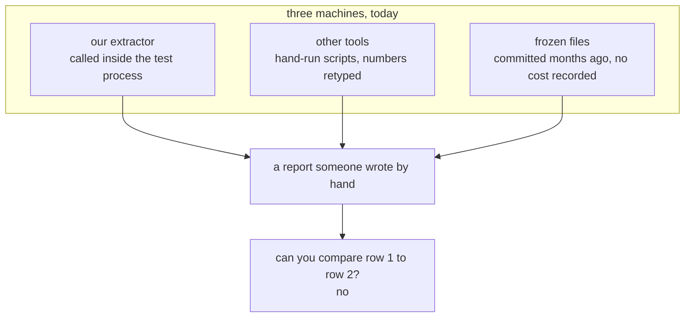
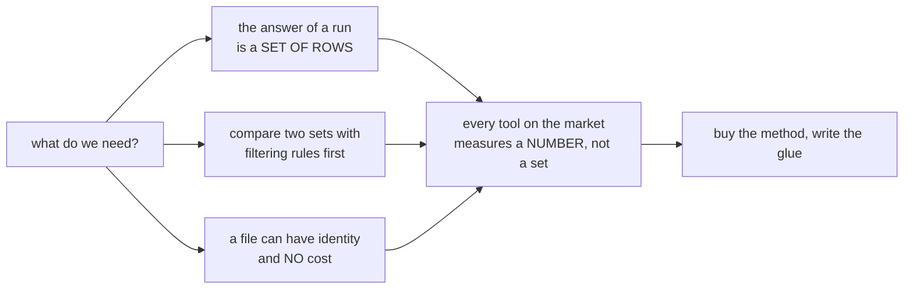
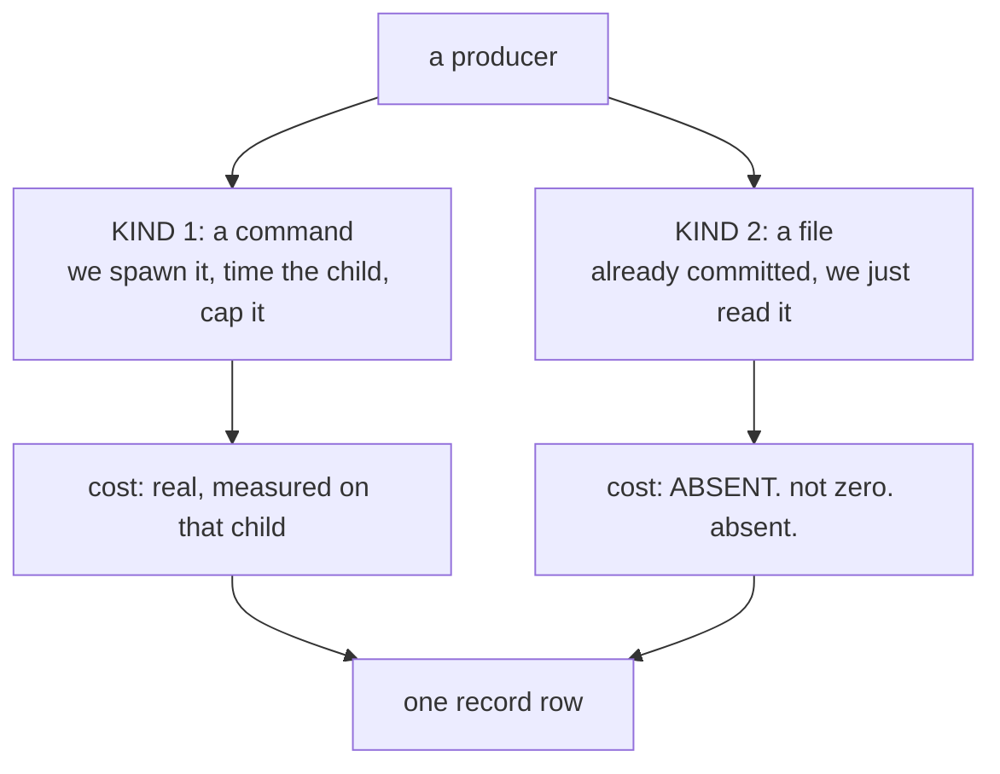
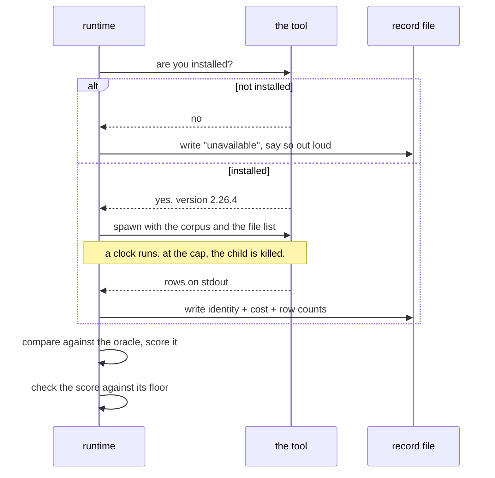
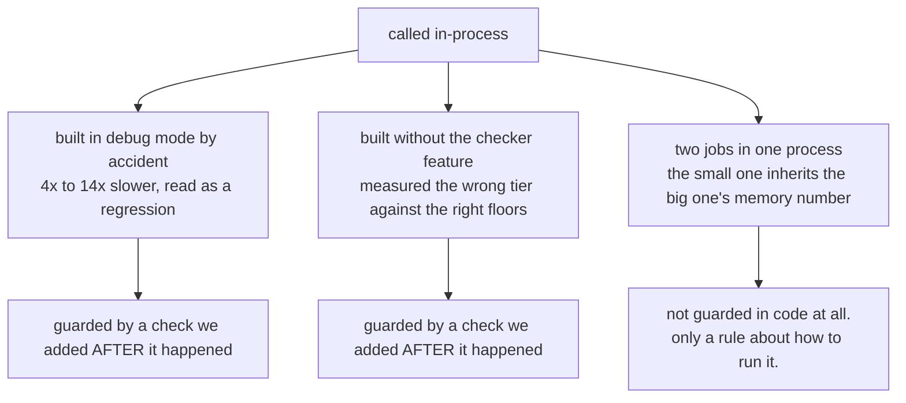
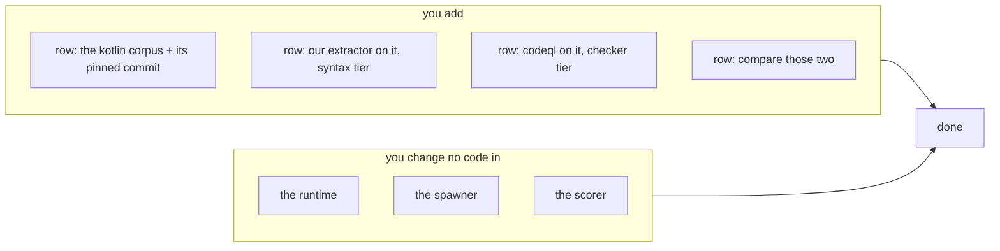
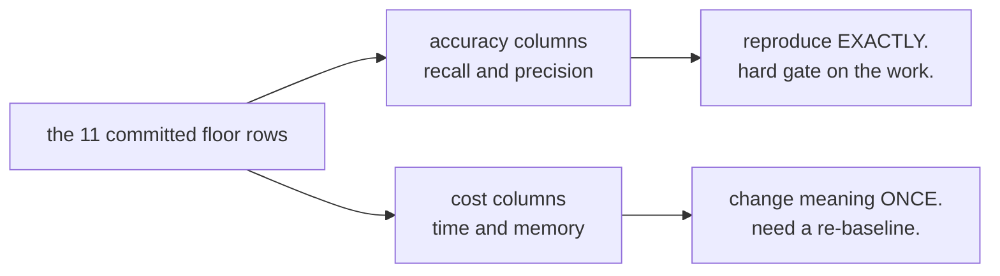
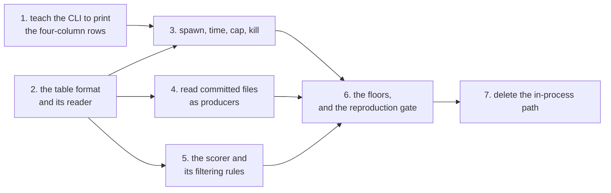

# Bench runtime, the plain version

One measurement machine instead of three. Adding a language becomes a spreadsheet
row. Adding a tool becomes a spreadsheet row. Nothing in the runtime knows what
Rust or Kotlin or CodeQL is.

## TOC

1. [The problem in one picture](#1-the-problem-in-one-picture)
2. [What already works, keep it](#2-what-already-works-keep-it)
3. [Did we have to build this](#3-did-we-have-to-build-this)
4. [The whole idea: everything is a producer](#4-the-whole-idea-everything-is-a-producer)
5. [What one measurement looks like](#5-what-one-measurement-looks-like)
6. [Why spawning beats calling in-process](#6-why-spawning-beats-calling-in-process)
7. [Adding Kotlin](#7-adding-kotlin)
8. [The one thing that will not match](#8-the-one-thing-that-will-not-match)
9. [Order of work](#9-order-of-work)
10. [Four decisions, made](#10-four-decisions-made)

---

## 1. The problem in one picture

Accuracy numbers come from three unrelated places that cannot be compared.

The reason they cannot be compared: when our extractor times itself, it asks the
operating system "how much memory did I use". That answer is about the whole test
process, so a light job that ran after a heavy job inherits the heavy job's
number. That already happened. One leg reported 1,698 megabytes against its own
514 megabyte limit, purely from sharing a process with something bigger.

For a tool we spawn, the right question is different: "how much did that child
use". For a file CodeQL wrote weeks ago on another machine, there is no question
to ask at all, and writing zero would be a lie nothing could detect.

---

## 2. What already works, keep it

Two things in the tree are good and this plan does not touch them.

| thing | state |
|---|---|
| the row format | every tool already writes the same four columns: source file, source name, target file, target name. Untouched. |
| a working prototype | the corpus-stats script already spawns the extractor, caps it, kills it at the cap, and writes identity plus cost plus row counts into one table. It is 52 lines of the mechanism this plan generalises. |

So this is not a build from nothing. It is the corpus-stats script, widened
until CodeQL and a committed file fit through the same door.

---

## 3. Did we have to build this

I checked ten off-the-shelf options first. Every one of them fails on the same
thing.

The full candidate-by-candidate write-up is in the citations document. The short
version:

| tool | what it is good at | why it does not fit |
|---|---|---|
| hyperfine | timing a command precisely | throws away the command's output, which is the entire thing we care about. Also does not measure memory. |
| conbench | spotting regressions across machines | stores numbers, not row sets. Needs a server and a database. |
| asv | benchmark matrix over commits | wants to build and import a python package. Our producers are foreign binaries. |
| bencher.dev | regression floors in CI | stores numbers. Needs a server. Would sit on top of us, never replace us. |
| criterion, iai-callgrind | Rust micro-benchmarks | measures a Rust function inside our own process, which is exactly the memory bug described above. CodeQL is not a Rust function. |
| pytest-benchmark | floors and comparison | times a python function. The whole point is to leave python. |
| snakemake, nextflow | running a graph of jobs with caching | no scoring, and both drag in a big dependency. We have about twenty independent jobs, not thousands. |
| make, just | same, lighter | `just` is already our entry point and stays. It does not score. |
| dvc | versioning big artifacts | solves a storage problem we do not have. Our files are already in git and they are small. |
| OpenTelemetry | shipping measurements somewhere | it is a pipe, not a store or a scorer. And it cannot say "absent" as distinct from "zero", which is the one thing you asked for. |

I also tried the strongest combination rather than any single tool:
`just` to run + hyperfine to time + bencher to hold the floors + our scorer. It
falls apart at step one, because hyperfine discards the rows, so we have to
write the spawn-and-time step ourselves anyway. Once that is ours, hyperfine has
nothing left to do, and bencher would only be hosting eleven rows of limits that
its own model cannot express.

**Verdict: buy the schemas, write the glue.** The three good ideas out there
(hyperfine's result format, nextflow's per-job cost columns, dvc's
command-plus-inputs-plus-outputs stage) get copied as table shapes. None of them
becomes a dependency. The scoring half is already written and tested in Rust.

---

## 4. The whole idea: everything is a producer

A producer is a thing that hands over rows. There are exactly two kinds and no
third.

The important detail: the file kind has no place to put a cost at all. It is not
that we leave it blank by convention. The shape has no such slot, so a fake zero
cannot be written even by mistake.

Our extractor is kind 1. CodeQL is kind 1. A CodeQL file from three weeks ago is
kind 2. The scorer cannot tell which one is ours.

Every producer sits in a table, one row each:

| what | example row |
|---|---|
| which tool | codeql |
| which corpus | typescript-go, at a pinned commit |
| which family | calls, types, or imports |
| which tier | syntax, checker, or scip |
| what to run | the command, with blanks to fill in |
| how long it may take | its cap |

---

## 5. What one measurement looks like

Three outcomes are all normal and all get recorded: it produced rows, the tool
was missing, or it hit the cap and got killed. A missing tool never fails the
run silently, and it never fails the run loudly either. It says so and moves on.

Nothing ever waits past its cap. Getting killed is a result we write down, not a
delay we sit through.

### A detail worth knowing

One of our committed oracle files has 84,958 lines in it, but only 59,356 of
them are different from each other. The scorer throws duplicates away before
counting, so the real denominator is 59,356. Against the raw line count the same
score reads 61.62 out of 100 instead of 88.20 out of 100.

That is not a bug, and the current numbers are correct. It does mean every
record row carries two counts: lines the tool emitted, and distinct rows the
scorer actually saw. Without both, a tool that emits everything twice looks
identical to one that does not.

---

## 6. Why spawning beats calling in-process

Today our extractor is called directly inside the test process, which is faster
but has bitten us three separate ways in one session.

Spawn the binary instead and all three stop being possible, rather than being
caught:

- the binary is a path, and we record its version string, so a debug build or a
  missing feature is visible in the record
- the child's memory number is the child's, and nothing else's
- and the runtime stops linking the engine at all, which is what you asked for

**What it costs:** the rows have to travel through a pipe instead of staying in
memory. Back-of-envelope, that is about 3 megabytes against a job that currently
takes 13.5 seconds, so roughly five thousandths of one percent. That estimate is
not measured yet, and measuring it is the first piece of work, which then
confirms or kills this recommendation.

**My recommendation: spawn everything, including ours.**

---

## 7. Adding Kotlin

We already have 1,845 lines of Kotlin extraction and zero oracle for it. Here is
what adding it costs.

Four rows in a table. Zero lines of runtime code.

The word "kotlin" enters as a VALUE that gets pasted into CodeQL's existing
command template. It never becomes a case in a switch statement, because there
is no switch statement to add it to. The only closed lists in the whole design
are "call, type, import" and "syntax, checker, scip", and neither of those is
about a language.

If CodeQL's Kotlin support is not installed on the machine, that row reports
itself unavailable, its comparison skips with a printed line, and our own Kotlin
row still runs and still records its cost with nothing to score against. That is
already the state fourteen repos are in today.

---

## 8. The one thing that will not match

You will want to know whether the eleven committed floor numbers survive this.
Split answer, and I am not going to pretend it is one.

**Accuracy reproduces exactly.** Recall and precision are pure arithmetic over
two sets of rows and a filtering rule. Both survive untouched. I checked each
filtering rule in the code against the plan's replacement and they match, and
the two unit tests that pin them keep passing.

**Cost does not, and cannot.** Today's time is measured around one function
call; tomorrow's is measured around a whole process, so it will be slightly
higher. Today's memory is the whole test process's high-water mark; tomorrow's
is one child's, so it will be lower, and by an amount nobody can predict. That
is the same contamination that made one leg read 1,698 megabytes against its 514
megabyte limit.

So the cost columns get re-measured once, in a single commit that writes the old
and the new value side by side and says why they moved. After that they ratchet
normally again. That is decision #2 in the next section.

---

## 9. Order of work

Seven pieces, each one pull request.

| piece | how we know it worked |
|---|---|
| 1 | the CLI's rows match the test code's rows byte for byte. This also measures the pipe cost that section 6 only estimated. |
| 2 | nothing runs yet; the table loads, and a bad row is a named error |
| 3 | a missing tool says so and the run still exits clean. A tool that overruns is killed and reports it. |
| 4 | every committed file gets a row naming its tool, version, command, corpus, commit and date. No oracle is regenerated. |
| 5 | the two existing unit tests pass against the new mechanism, unchanged |
| 6 | **all eleven accuracy pairs match exactly.** This is the gate. |
| 7 | the two safety checks we bolted on after the incident get deleted, because what they guarded is no longer possible |

Two things named so they do not get lost, neither of them now: a small database
for cross-run queries, and shipping the records out through the tracing library
we already link.

---

## 10. Four decisions, made

You said go ahead, so I called all four. Every one flips on a word.

| # | question | call | why |
|---|---|---|---|
| 1 | Is fuzzy matching a real metric? | **no** | the agreed metric list has five entries and fuzzy is not one. Adding it rewrites the contract every report is written against, which is a bigger change than a runtime feature. The fuzzy script stays a lab tool and the runtime never links it. |
| 2 | Accept the one-time cost re-baseline? | **yes, old and new recorded together** | this already happened once today for the rust memory ceiling, with a ledger entry saying it was accepted under protest rather than swept up. Same shape here. |
| 3 | Where does the table live? | **next to the code that reads it**, not the lab folder | labs get deleted when they land, and the harness reads this file every run. It is configuration, so it ships with the crate. |
| 4 | Does the python reference stay frozen? | **delete it, record where the last copy was** | it only existed because the Rust side could not measure the TypeScript compiler tier. It can now, and that measurement is checked by a gate on every run. A number a gate re-checks beats a script nobody runs. |

---

## Also: two things in the brief did not match the tree

Not blocking, and I worked around both, but you should know.

- The brief told me to read a sibling lane's brief before designing. That file
  does not exist anywhere: not in my copy, not on any branch, not on main.
  Neither does the cost file it said that lane was landing. I designed against
  the eleven floor rows that do exist and built the tier column in from the
  start, so if that lane lands, its column is one this design already carries.
  I messaged the coordinator.
- Some counts in the brief were low. It said 11 scripts at 1,811 lines; there
  are 31 at 4,496. It said 68 committed files; there are 88 in one folder and 43
  in the other. It said five ratchet legs; there are four. I classified all 31
  scripts rather than the 11.
