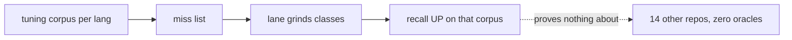
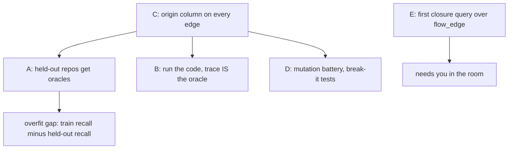

# extract eval plan, plain words

Worry: we tune each language against one test set and its miss list. Numbers go
up on that set; nothing proves they go up anywhere else.

## The problem drawn

## The five arcs

| arc | one line | new number it produces |
|---|---|---|
| C origin column | every edge says WHICH leg answered it | per-leg counts, drift alarms |
| D mutation battery | inject a duplicate def; the edge must vanish, never re-point | pass/fail invariants, no oracle needed |
| A held-out ratchet | the 14 corpus-stats repos get oracles, lanes never see their misses | overfit gap in pt, per language |
| B trace oracle | run PyCG suite mains under a tracer; executed calls are facts | recall on the classes we wrote stops for |
| E flow closure | first dl6 program joining flow_edge + call edges | a query no compiler answers |

## Order and why

1. **C** first: A, B, D all read the origin column.
2. **D** second: pure tests, zero new tooling, catches guessing legs today.
3. **A** third: go + python oracles are cheap (same vta tool, PyCG itself).
4. **B** fourth: python-only pilot, self-contained in the suite dir.
5. **E** last: design work with you.

## What you decide (sec 9 of PLAN.md)

1. Does the held-out gap ever BLOCK a merge, or only print.
2. Do held-out repos stay frozen forever.
3. Trace oracles for go/rust too, or python only.
4. The flow-closure program shape.
