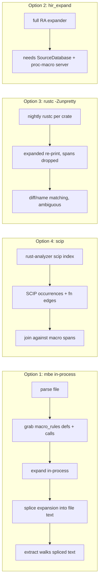

# Macro expansion lab, plain words

## The problem

Calls written inside a macro body are invisible to the extractor. rust-analyzer
has 13,868 macro invocations in its src tree. Four ways to see inside them were
measured on the same fixtures and the same corpus. One row of numbers per way,
then the pick.

## The four pipelines

## Numbers

| | mbe (1) | hir_expand (2) | rustc -Zunpretty (3) | scip (4) | syn (5) |
|---|---|---|---|---|---|
| what it covers | macro_rules only | everything | everything | everything, as facts | nothing |
| cost to run | 758 ms over 873 files | +2.32 MB binary, full db impl needed | 47 s over 42 crates, nightly | one index build | 0 |
| call sites gained | +4,843 | not built | not countable cleanly | 17,568 already exact | 0 |
| spans back to source | partial | full | none | exact | n/a |
| breaks per-file purity? | no | no | yes | yes | no |
| extra moving parts | 5 crates + salsa | a database and a server process | nightly toolchain | none new | none |

## What broke along the way

- rustc -Zunpretty throws away all span info, so expanded text cannot be mapped
  back except by guessing names. A macro that mints the same call twice makes
  the guess wrong.
- hir_expand links fine (30 s build) but to actually run it you must build
  rust-analyzer's whole database layer and spawn a proc-macro server.
- scip on the old nightly panicked (`No generics for EnumVariantId`); on
  rust-analyzer 1.100.0-nightly the panic is gone, rc=0, 173,502 fn edges.
- mbe cannot expand `format!`/`vec!`/derive macros, only `macro_rules`.

## The pick

- Tier 1: mbe in-process. Cheap, pure, +4,843 sites, plugs into the existing
  call walker.
- Tier 2: scip. Already exact, already shipped as a mode; needs a join, not new
  extraction.
