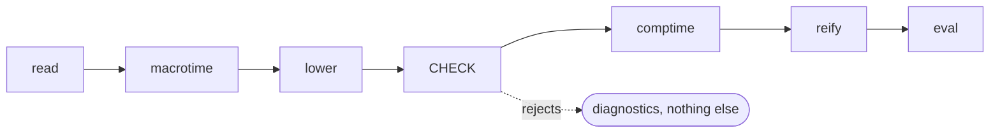
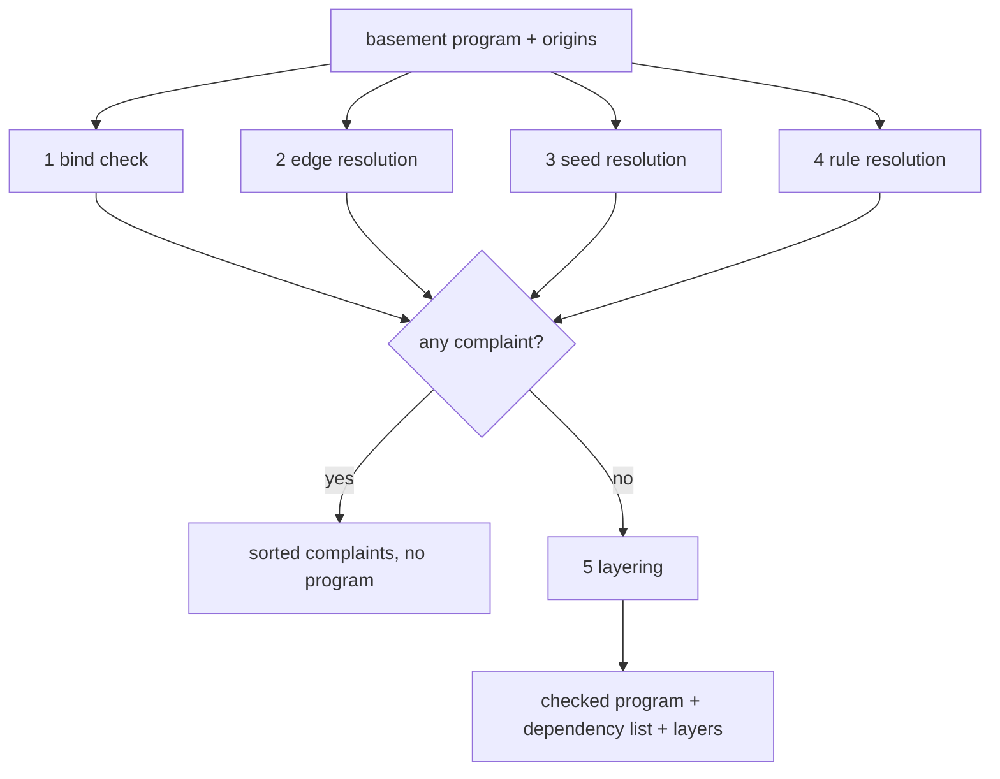
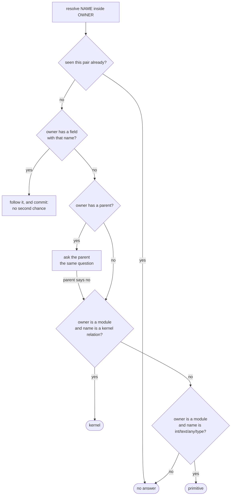
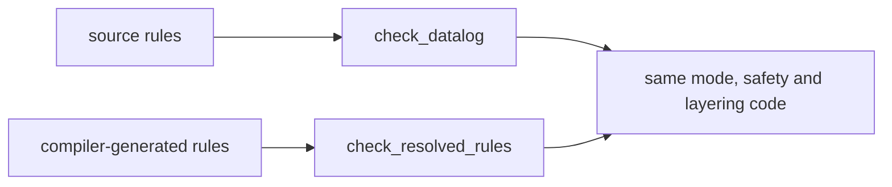
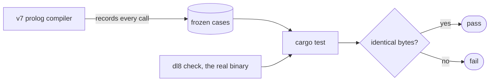

# The checker, in plain words

## Contents

1. [What the checker is](#what-the-checker-is)
2. [Where it sits](#where-it-sits)
3. [The five jobs](#the-five-jobs)
4. [How a name gets resolved](#how-a-name-gets-resolved)
5. [The mode check, step by step](#the-mode-check-step-by-step)
6. [The second door](#the-second-door)
7. [The Rust files](#the-rust-files)
8. [How we know it is right](#how-we-know-it-is-right)
9. [Things I would change but did not](#things-i-would-change-but-did-not)

---

## What the checker is

The lowerer turns your text into a graph plus a pile of rules, but it leaves
names unresolved. `point` in one rule might mean a type you declared, a kernel
relation, or nothing at all. The checker is the pass that decides, and that
says no when the answer is nothing at all.

It is a pure function. It reads no files, takes no clock, writes nothing.

## Where it sits



## The five jobs



1. **Bind check.** Every field of a type needs a unique name and a dense
   position count starting at zero. Two fields called `x` is a complaint.
2. **Edge resolution.** Every field's declared type has to point somewhere
   real.
3. **Seed resolution.** Facts you wrote down have to be fully concrete. No
   variables in a fact.
4. **Rule resolution.** Heads and goals have to name relations that exist,
   with the right number of slots, and the rule has to be answerable.
5. **Layering.** Rules that read a negated relation have to sit above it. A
   loop through a negation has no answer and is a complaint.

A complaint anywhere kills the whole result. You get the sorted list of
complaints and nothing else.

## How a name gets resolved

This is the one recursive part and the one place the order matters.



The word "commit" on the forward branch is the subtle bit. Once a field with
that name is found, that is the answer; if following it leads nowhere, the
whole question fails rather than falling through to the parent.

## The mode check, step by step

A rule body is read left to right. The checker carries two bags of variables.

| bag | what goes in it | who reads it |
|---|---|---|
| available | head variables, then everything a goal binds | positive goals |
| produced | starts empty, grows only when a goal is clean | negative goals |

Four kernel relations refuse to run backwards and say so:

| goal | needs bound first | otherwise |
|---|---|---|
| `int_lt`, `int_le`, `int_eq`, `int_ne`, `int_ge`, `int_gt` | both sides | underconstrained |
| `cons` | the list, or the head and the tail | underconstrained |
| `edge_ref` | the owner and the label | underconstrained |
| `intern` | the constructor and the arguments | underconstrained |

Negating any of the constructive four is always a complaint, no matter what
is bound.

```
rule:   (<- (reader ?Value) (point ?Value) (int_lt ?Value 3))

goal 1  available {Value}  produced {}         point binds Value        ok
goal 2  available {Value}  produced {Value}    both int_lt sides bound  ok
```

```
rule:   (<- (reader 1) (int_lt ?Left 3))

goal 1  available {}       produced {}         Left is not bound        COMPLAINT
```

## The second door

There are two ways in. The one above takes what the lowerer produced. The
other, `check_resolved_rules`, takes rules the compiler generated for itself,
whose names are already decided. It skips resolution and runs only the
declaration, slot-count, mode, safety and layering checks.



## The Rust files

```mermaid
flowchart TD
  api["_0_api: the spine"] --> graph["_1_graph: edge and origin lookup"]
  api --> resolve["_2_resolve: names, seeds, rules"]
  api --> bind["_3_bind: duplicate and dense checks"]
  api --> kernel["_5_kernel: the built-in graph"]
  api --> strata["_6_strata: layering and dependencies"]
  resolve --> mode["_4_mode: bound-variable fold"]
  resolved["_7_resolved: the second door"] --> mode
  resolved --> strata
  json["_8_json: the command line"] --> api
  json --> resolved
```

## How we know it is right

We ran the real v7 compiler over every test program it has and wrote down
every single call into the checker, with its exact input and its exact output.
172 calls, 75 of them genuinely different. The Rust binary is then run against
those recordings and has to produce the identical bytes. All 75 match.



The recordings of the whole test corpus are big, about 42 MB, so only a
representative slice lives in git: 19 recordings, 5 MB. The other 28 are
checked on demand and the count is written down next to them.

We also wrote eleven tiny programs on purpose, one per kind of complaint, so
every complaint the checker can make has a recording behind it.

## Things I would change but did not

Four places where v7 does something I would spell differently. I kept v7's
behavior in all four; they are decisions for you, not for me.

| # | what v7 does | what I would do |
|---|---|---|
| 1 | a head variable that only appears inside a `count` in the body counts as unsafe | count it as bound, the same way the head side already does |
| 2 | an unresolvable field type is reported by the field's name, not the missing type's name | name the thing that is actually missing |
| 3 | a head variable is treated as bound for a positive goal but not for a negative one | pick one and use it for both |
| 4 | a layering complaint gets a source location through the first door and none through the second | give it a location through both |

And three complaints the second door can produce on paper but never in
practice: the code that would return them always crashes into a different
check first and the whole call gives up instead. Worth fixing, not tonight.
