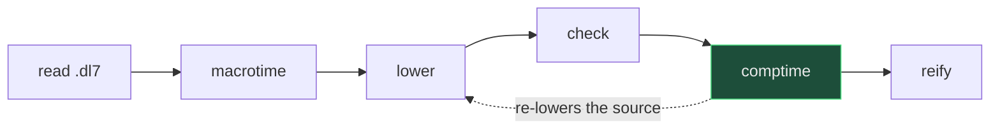
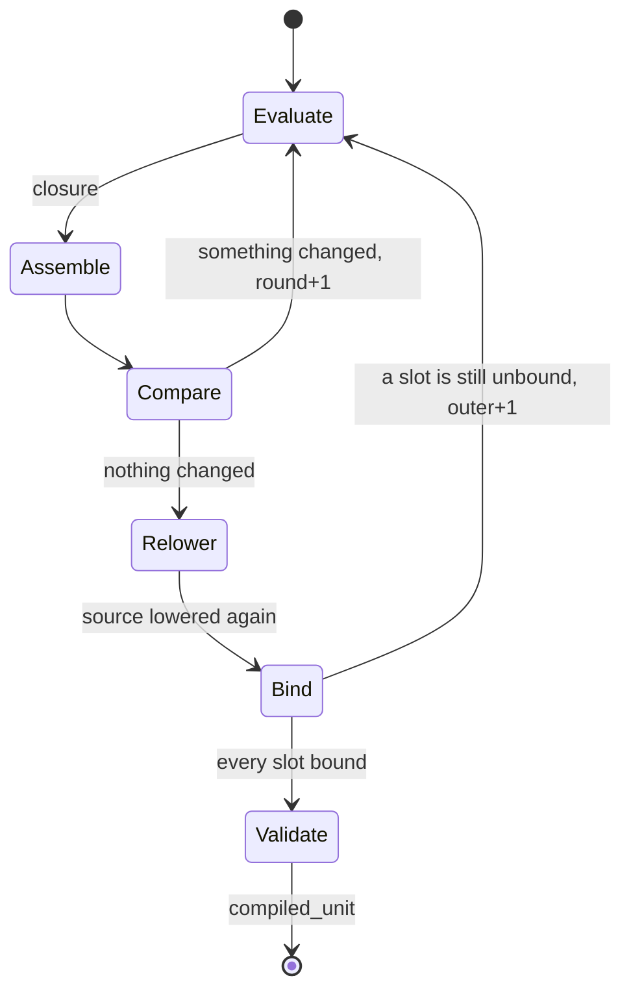
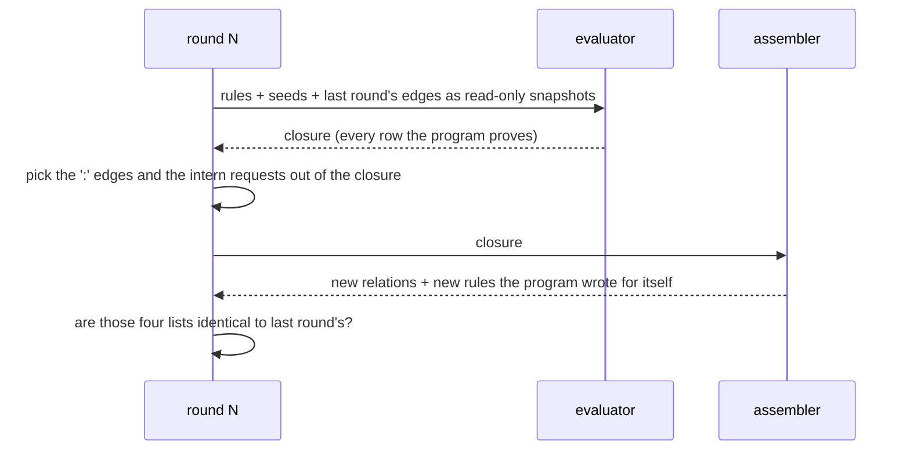
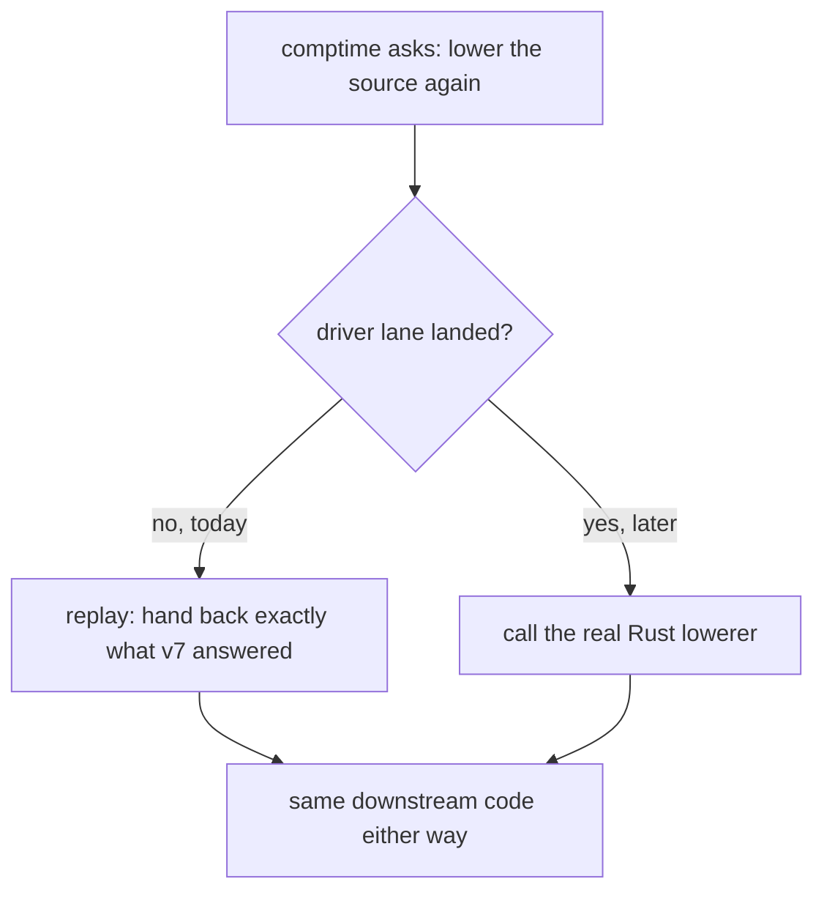

# comptime, in plain words

## TOC

| § | thing |
|---|---|
| 1 | where comptime sits |
| 2 | the two loops |
| 3 | what one round does |
| 4 | the one hole |
| 5 | files |
| 6 | what could bite |

## 1. where comptime sits

The green box is this lane. It is the second time the program runs the Datalog
evaluator. The first time is macrotime, expanding syntax. This time the program
is being run to work out its own types, and the rows it derives become MORE
program.

## 2. the two loops

Inner loop: run, assemble, compare, repeat. Capped at 16.
Outer loop: lower the source AGAIN now that the generated declarations exist,
and if a binding slot is still empty, run the whole inner loop again. Also
capped at 16.

Both caps are the same number from the same place, so worst case is 256
evaluations. Nothing in the corpus gets near that: the deepest fixture is
7 inner rounds in 1 outer pass.

## 3. what one round does

The snapshot trick is the point. A round never reads its own edges while it is
deriving them. It reads a frozen copy of last round's. That is what keeps
negation and counting honest: nothing half-derived is ever visible.

## 4. the one hole

"Lower the source again" needs the module lowerer, which is a different lane's
file and is not ported yet.

So the port is complete and byte-exact through the real binary, with one
swappable call. The replay is not a fake: it is v7's own recorded answer,
checked for shape on every call, and it fails loudly rather than guessing.

## 5. files

| file | job |
|---|---|
| `_1_api.rs` | the entry, and the output term |
| `_2_rounds.rs` | the inner loop |
| `_3_assemble.rs` | turn derived rows back into a program |
| `_4_host.rs` | check `sh`-hosted relations, then strip the planning rows |
| `_5_finish.rs` | the outer loop, key checks, the runtime program |
| `_6_json.rs` | case in, result out |

## 6. what could bite

| thing | why |
|---|---|
| cases are big | one real fixture's case is 2.5 MB, all prelude. The committed set is the shared prelude leg once plus one fixture; everything else is checked and counted, not committed. |
| both caps are 16 | one constant, two loops. Kept as v7 has it. A program that needed 17 rounds would be told "limit exhausted" with no hint which loop. |
| an assembler complaint throws away everything | one bad generated rule discards every generated rule in that round. Kept as v7 has it. |
