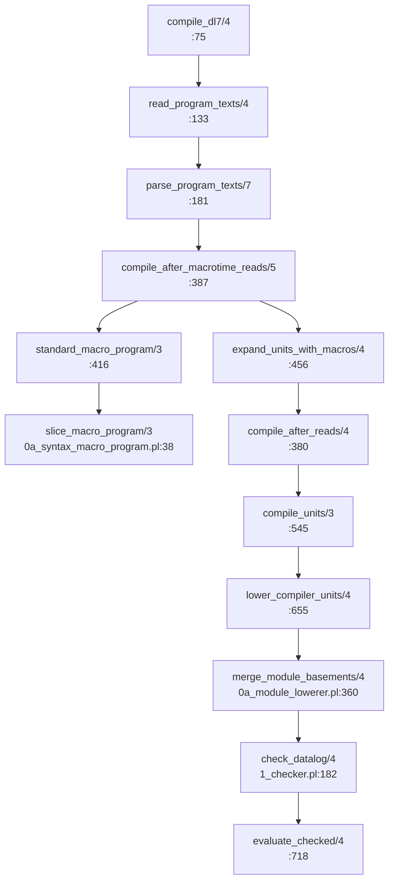

# v8 driver: `compile()` and `dl8 compile`

Every `path:line` below is read at sprefa main `f5018ad23`, extracted by
`v8/oracle/compile/freeze.sh` into `/tmp/dl8-compile-oracle/v7`. The branch's
own `v7/` is stale and the main tree's `v7/` is dirty; neither is read.

## TOC

| § | subject |
|---|---|
| 1 | What the driver is |
| 2 | The call chain, v7 predicate by Rust file |
| 3 | Files this lane adds |
| 4 | The prelude and macrotime decision |
| 5 | The `Sources` seam, closed |
| 6 | `CompiledUnit` merged into `Compiled` |
| 7 | Oracle |
| 8 | Forks |
| 9 | Not done |

## 1. What the driver is

`compile_dl7/4` (`2_compiler.pl:75`) is the whole language: read one `.dl7`,
join the type prelude ahead of it, bootstrap the macro library, expand the
program's syntax, lower every unit under its own module owner, merge the
basements, check, and run the comptime fixpoint. Everything under `v8/src/`
already ports one leg of it. Nothing calls them in order. This lane is the
call in order.

`compile_dl7_project/5` (`:195`) and `compile_dl7_project_rows/6` (`:227`) are
the same chain with a filesystem root, several source units and a TSI stream
in front of it.

The output is three lists:

```
compile_dl7(Path, CompilerRows, RuntimeProgram, Diagnostics)
compiled_outputs(compiled_unit(_, RuntimeProgram, CompilerRows),
                 CompilerRows, RuntimeProgram).           % :466
compiled_outputs([], [], []).                             % :467
```

The second clause is the whole error protocol: any phase that produces a
diagnostic binds `Compiled = []`, and `compiled_outputs/3` then yields
`CompilerRows = []`, `RuntimeProgram = []`. Rust returns
`Compile { compiler_rows: Vec<TermId>, runtime_program: TermId, diagnostics }`
with `runtime_program` set to the empty list term on that path.

## 2. The call chain, v7 predicate by Rust file



| v7 predicate | v7 line | Rust |
|---|---|---|
| `compile_dl7/4` | `2_compiler.pl:75` | `v8/src/lib.rs::compile` |
| `read_program_texts/4` | `:133` | `_8_driver/_0_read.rs::program_texts` |
| `type_prelude_paths/1` | `:313` | `_8_driver/_0_read.rs::PRELUDE` (`include_str!`) |
| `standard_macrotime_paths/1` | `:331` | `_8_driver/_0_read.rs::MACROTIME` (`include_str!`) |
| `join_prelude_texts/2` | `:371` | `_8_driver/_0_read.rs::join` |
| `dl7_text_unit/5` | `0_reader/2_embedder.pl:20` | `_8_driver/_1_unit.rs::text_unit` |
| `expand_dl7/6` | `0_reader/1_expander.pl:22` | `_0_read/_4_expand.rs::expand_dl7` |
| `dl7_syntax_rewrite/3` | `0_reader/1_expander.pl:12-18` | `_0_read/_4_expand.rs::rewrite` |
| `parse_program_texts/7` | `2_compiler.pl:181` | `lib.rs::compile`, the two `_1_unit.rs` calls |
| `standard_macro_program/3` | `:416` | `_8_driver/_2_macro.rs::standard_macro_program` |
| `compile_sliced_macrotime_program/3` | `:425` | `_8_driver/_2_macro.rs` |
| `slice_macro_program/3` | `0a_syntax_macro_program.pl:38` | `_1_macrotime/_7_slice.rs::slice_macro_program` |
| `expand_units_with_macros/4` | `:456` | `_8_driver/_2_macro.rs::expand_units_with_macros` |
| `expand_unit_with_macros/4` | `:491` | `_8_driver/_2_macro.rs::expand_unit_with_macros` |
| `compile_after_reads/4` | `:380` | `lib.rs::compile`'s guard before `compile_units` |
| `compile_units/3` | `:545` | `_8_driver/_3_units.rs::compile_units` |
| `compile_project_units/5` | `:559` | `_8_driver/_3_units.rs::compile_project_units` |
| `install_project_after_lower/8` | `:591` | `_8_driver/_3_units.rs::compile_project_units` |
| `install_graphs/7` | `:601` | `_8_driver/_4_project.rs::install_graphs` |
| `expose_tsi_relations/8` | `:615` | `_8_driver/_4_project.rs::install_graphs` tail |
| `lower_compiler_units/4,5` | `:655`, `:665` | `_2_lower/_12_units.rs::lower_compiler_units*` |
| `compile_after_unit_lower/6` | `:686` | `_8_driver/_3_units.rs::compile_after_unit_lower` |
| `compile_after_lower/6` | `:698` | `_8_driver/_3_units.rs::compile_after_unit_lower` |
| `compile_after_check/5` | `:710` | `_8_driver/_3_units.rs::compile_after_unit_lower` tail |
| `load_dl7_project/4` | `0_reader/4_module_loader.pl:29` | `_8_driver/_4_project.rs::load_dl7_project` |
| `load_tsi_streams/3` | `2_compiler.pl:277` | `_8_driver/_4_project.rs::load_tsi_streams` |
| `project_stream_paths/3` | `:253` | not ported; `--tsi` names streams out of band |
| `lower_units*`, `merge_module_basements/4`, `install_module_aliases/6` | `0a_module_lowerer.pl` whole | `_2_lower/_12_units.rs` |

`1b_compiler_tracer.pl` (`run_compile_phase/3`, `run_compile_step/4`,
`with_compile_trace/2`, `debug_event/2`) wraps every step above. It is timing
and histogram output, never a value: `run_compile_phase(Phase, Goal, _)` calls
`Goal`. It is not ported; `--trace` prints the `Trace`, `Wave` and `Round`
events the ported phases already emit.

`1c_compiler_cacher.pl` (`with_prelude_cache/5`, `with_compilation_cache/5`)
and `cached_prelude_text_unit/4` (`:300`) are process-local `assertz` caches.
Fork F1 of the comptime plan already recorded the decision: a cache that
cannot change an answer is not behavior, and the v8 laws ban statics. Not
ported. `compile()` parses the prelude once per call.

## 3. Files this lane adds

| file | lines | carries |
|---|---|---|
| `v8/src/_0_read/_4_expand.rs` | 283 | `expand_dl7/6`, the reader-level infix-colon rewrite fixpoint |
| `v8/src/_0_read/_5_digest.rs` | 67 | SHA-256, for `content_sha256(Digest)` at `2_embedder.pl:28` |
| `v8/src/_1_macrotime/_7_slice.rs` | 101 | `slice_macro_program/3` and its five helpers |
| `v8/src/_2_lower/_12_units.rs` | 501 | `0a_module_lowerer.pl` whole, plus `lower_compiler_units/4,5` |
| `v8/src/_4_comptime/_7_sources.rs` | 242 | the live `Sources` impl: `final_checked_program/5` `:929`, `deferred_checked_program/5` `:949`, `lower_final_units/5` `:970`, `freeze_module_basements/3` `:1006`, `add_generated_relations/3` `:1046`, `final_expression_environment/6` `:1090` |
| `v8/src/_8_driver/_0_read.rs` | 42 | the driver's own `std::fs`, the embedded prelude and macrotime |
| `v8/src/_8_driver/_1_unit.rs` | 72 | `dl7_text_unit/5`, the three origins the compiler reads under |
| `v8/src/_8_driver/_2_macro.rs` | 97 | the macro-library bootstrap and per-unit expansion |
| `v8/src/_8_driver/_3_units.rs` | 82 | `compile_units/3` through `compile_after_check/5`, both project arms |
| `v8/src/_8_driver/_4_project.rs` | 146 | `load_dl7_project/4`, `load_tsi_streams/3`, `install_graphs/7` |
| `v8/src/_8_driver/mod.rs` | 51 | the `Stop` and `Event` sums |
| `v8/src/lib.rs` | 130 | `Compile`, `compile`, `compile_project`, the chain |
| `v8/src/bin/dl8.rs` | 176 (+82) | `Compile { file.., --project <root>, --tsi <stream>.., --trace }` |
| `v8/tests/_8_compile_oracle.rs` | 126 | three tests over the committed cases |

## 4. The prelude and macrotime decision

`type_prelude_paths/1` (`:313`) resolves `v7/src/2_comptime/../../prelude`
from `source_file/2` of `compile_dl7/4` itself, keeps entries matching
`numbered_dl7_file/1` (`:352`: a `<digits>_` prefix and a `.dl7` extension),
`sort/2`s them and reads each. `standard_macrotime_paths/1` (`:331`) does the
same over `../../macrotime`. Both join with `join_prelude_texts/2` (`:371`),
which puts one `\n` between texts.

| option | runtime dependency on `v7/` | path leaks into output | verdict |
|---|---|---|---|
| `--v7-dir` / `DL8_PRELUDE_DIR` at runtime | yes, every invocation | no | rejected: a crate that must not depend on `v7/` at runtime |
| copy under `v8/prelude/`, read from disk at runtime | no, but a path relative to the binary | no | rejected: needs a "where am I installed" rule the crate has none of |
| copy under `v8/prelude/`, `include_str!` | none | no | TAKEN |

`include_str!` is sound here precisely because no prelude or macrotime path
reaches the output. `parse_program_texts/7` (`:181`) calls
`dl7_text_unit(prelude, prelude, PreludeText, ...)` and
`compile_sliced_macrotime_program/3` (`:425`) calls
`dl7_text_unit(macrotime, macrotime, MacrotimeText, ...)`: the origin and the
reader path are the atoms `prelude` and `macrotime`, never a filename. Only
the program's own path becomes `file(AbsolutePath)`.

Copied byte-identical, `git show f5018ad23:<path>`:

| v8 path | v7 path |
|---|---|
| `v8/prelude/0_constructors.dl7` | `v7/prelude/0_constructors.dl7` |
| `v8/prelude/1_declarations.dl7` | `v7/prelude/1_declarations.dl7` |
| `v8/prelude/2_constructor_rules.dl7` | `v7/prelude/2_constructor_rules.dl7` |
| `v8/prelude/3_derived_rules.dl7` | `v7/prelude/3_derived_rules.dl7` |
| `v8/prelude/4_type_algebra.dl7` | `v7/prelude/4_type_algebra.dl7` |
| `v8/prelude/5_tsi_primitives.dl7` | `v7/prelude/5_tsi_primitives.dl7` |
| `v8/macrotime/0_standard.dl7` | `v7/macrotime/0_standard.dl7` |

The `include_str!` list in `_8_driver/_0_read.rs` is written in the same
sorted order `sort/2` gives, and a test case would catch a reorder because the
joined text changes every downstream node id.

## 5. The `Sources` seam, closed

`_4_comptime/_1_api.rs:35` declares

```rust
pub trait Sources {
    fn refreeze(&mut self, u: &mut Universe, mode: Refreeze,
                compiler_facts: &[TermId], generated_relations: &[TermId])
        -> Result<(Option<Checked>, Vec<TermId>), Stop>;
}
```

`Replay` (comptime oracle) was the only impl. `_7_sources.rs::Live` is the
second, and it is what the trait was earned for.

| `Refreeze` | v7 | what it does |
|---|---|---|
| `Final` | `final_checked_program/5` `:929` | `generated_expression_environment/4` `:1062` from the compiler facts, then `lower_final_units/5` `:970` with `CallPolicy::Strict`, then `merge_module_basements/4`, then `check_datalog/4` |
| `Deferred` | `deferred_checked_program/5` `:949` | the same with `CallPolicy::DeferUnknownCalls` |

`lower_final_units/5` (`:970`) dispatches on whether the unit list holds a
unit whose origin is `prelude`:

```
lower_final_units(Units, Environment, Basements, Origins, Diagnostics) :-
    (   select(PreludeUnit, Units, ImporterUnits),
        unit_has_origin(PreludeUnit, prelude)
    ->  lower_units_with_exporter_and_environment(...)      % strict
    ;   lower_units_with_environment(...) ).
```

`Live` therefore holds the unit terms and the project context the driver
lowered from, which is exactly `compile_context(Units, ProjectContext)`
(`:551`, `:566`) that the comptime oracle dropped from its committed input.

## 6. `CompiledUnit` merged into `Compiled`

`_5_reify/_0_api.rs:20` declares `CompiledUnit { type_graph_facts,
runtime_program: TermId, compiler_facts }`. `_4_comptime/_1_api.rs:11`
declares `Compiled { type_graph_facts, runtime: Checked, compiler_facts }`.
Both are `compiled_unit/3` at `1_artifact_emitter.pl:23` and
`2_compiler.pl:910`. Two structs for one term.

| change | file |
|---|---|
| `CompiledUnit` deleted | `_5_reify/_0_api.rs` |
| `compiler_view/2` takes `&Compiled` | `_5_reify/_4_emit.rs` |
| `emit_compiled/4` takes `&Compiled` | `_5_reify/_4_emit.rs` |
| `CompilerView.runtime_program: TermId` stays a term; `Compiled::runtime` becomes one with `Checked::to_term` (`_3_check/_0_api.rs:36`) | `_5_reify/_4_emit.rs` |
| the reify oracle reader builds a `Checked` where it built a `TermId` | `_5_reify/_6_json.rs` |

`Checked::to_term` rebuilds exactly `checked_datalog(root_graph(Nodes,
Edges), datalog_program(Relations, Seeds, Rules), Depends, Strata)`, which is
the term `compiler_view/4` puts in its fourth slot, so the reify oracle stays
byte identical.

## 7. Oracle

`v8/oracle/compile/freeze.sh` pins `REV=f5018ad23`, `git archive`s v7 into
`/tmp/dl8-compile-oracle`, and runs `dump_compile.pl`, which calls
`compile_dl7/4` on every `.dl7` under `v7/test/fixtures/` and
`v7/applications/` (42 files) and `compile_dl7_project_rows/6` on the dl6
application with the TSI stream under
`v6/sprefa-extract/tests/fixtures/tsi/`.

Case shape, one file per fixture:

```json
{"input": {"path": "test/fixtures/0_minimal.dl7"},
 "expected": {"compiler_rows": [...], "runtime_program": ..., "diagnostics": [...]}}
```

Term encoding is `v8/oracle/eval/json_terms.pl`'s `term_json/2`, the same
encoding `_6_eval/_6_json.rs::term_to_json` writes.

Paths are relative to the case root. The one absolute path in the output is
the program's own, inside `module(file(P))`, `reader_node(P, I)` and
`source(...)`; the dump rewrites the frozen root prefix to the literal
`<root>` and the Rust test does the same substitution on dl8's output before
comparing.

Sources are committed under `v8/oracle/compile/sources/` so the test needs
neither `v7/` nor swipl.

46 cases: the 42 single files, plus four project calls
(`project-modules-consumer`, `project-modules-plus`, `project-tsi-contract`
through `compile_dl7_project_rows/6` with
`v7/test/fixtures/tsi/1_semantic_user.jsonl`, and `project-dl6-catalog` over
`v7/emitters/2_interned_storage.dl7` and `v7/applications/dl6/0_catalog.dl7`,
which is how `test/17_dl6_interned.test.pl:14-20` drives it).

Size is the constraint: the 46 expected values are 27 076 873 bytes of JSON.
`commit.py` orders by coverage, never by size: every case with a non-empty
diagnostic list, then every project case, then a named spread, then the rest
smallest first, greedily filling 6 MB. 16 cases committed, 6 275 917 bytes.
`v8/oracle/compile/status.json` carries every case's arguments, row count,
byte length, v7 wall clock and committed flag. `verify.sh` runs dl8 over all
46 and prints `46/46`.

Test: `v8/tests/_8_compile_oracle.rs`, real binary
(`env!("CARGO_BIN_EXE_dl8")`, `dl8 compile <file.dl7>`), byte equality of the
whole stdout plus exit code.

### The red fixture is a case

`5_curry.dl7` ends in
`diagnostic(comptime, none, source_refreeze_limit_exhausted(16))`
(`2_compiler.pl:833`) with `CompilerRows = []` and `RuntimeProgram = []`. It
is committed like every other fixture and dl8 reproduces it byte for byte.
Five other fixtures end in a non-empty diagnostic list at `f5018ad23`:
`0_minimal`, `binding_symmetry/11_mixed_deferrable_and_real_error`,
`lexical_binding/2_missing_name`, `lexical_binding/3_self_cycle`,
`lexical_binding/4_two_cycle`, `modules/1_consumer`,
`modules/2_plus_consumer`. Each is a case, none is a skip.

## 8. Forks

| # | v7 | what v7 does | what a redesign would do | kept |
|---|---|---|---|---|
| D1 | `2_compiler.pl:300`, `1c_compiler_cacher.pl` | prelude text, macro program and whole compiles are memoized in module-level `:- dynamic` facts | no cache | v7 behavior kept; the cache is observationally transparent |
| D2 | `2_compiler.pl:313`, `:331` | the prelude and macrotime directories are found through `source_file/2` of the running predicate | embed the texts | v7 behavior kept in output, the lookup replaced; §4 |
| D3 | `2_compiler.pl:404` | `compile_after_macrotime_reads/5` calls `garbage_collect/0` between the macro program and unit expansion | drop it | dropped; SWI's GC is not a Rust behavior |
| D4 | `2_compiler.pl:466-467` | `compiled_outputs/3` maps `Compiled = []` to `RuntimeProgram = []`, so a failed compile reports an empty LIST where a good one reports a `checked_datalog/4` term | a `Result` | v7 kept; `Compile::runtime_program` is the empty-list term |
| D5 | `0_reader/1_expander.pl:143-149` | `ensure_rewrite/2` `throw`s `domain_error(dl7_rewrite_tree, _)` on a malformed replacement | a diagnostic | v7 kept as `Stop::Fail`; the two shipped rewrites cannot reach it |
| D6 | `0_reader/1_expander.pl:206` | `source_for_node/3` `throw`s `existence_error(source_row, NodeId)` when a node has no source row | a diagnostic | v7 kept as `Stop::Fail` |
| D7 | `2_compiler.pl:655-675` | `lower_compiler_units/4` and `/5` are two predicates of different arity, distinguished only by whether an expression environment is passed | one predicate, an empty environment | v7 kept as two functions; `/4` uses an empty environment and the DEFERRED lowering, `/5` the same with the TSI environment |
| D8 | `2_compiler.pl:601-612` | `install_graphs/7` runs the TSI loader only when the filesystem loader reported no diagnostic, and `expose_tsi_relations/8` then aliases every newly added module owner into every source unit | per-loader recovery | v7 kept |
| D9 | `0a_module_lowerer.pl:439-456` | `alias_edges/8` skips a target that is `deferred_expression/1` or `deferred_compound_edge/2`, and skips any name the importer already binds, yet the alias ordinal advances only on a kept edge | always advance | v7 kept |
| D10 | `2_compiler.pl:76`, `1b_compiler_tracer.pl` | every phase and step is wrapped in a tracer that prints `COMPILE-TRACE` to stderr and keeps a histogram | keep | not ported; `--trace` prints the phase events the ported folders already emit |
| D11 | `_4_comptime/_1_api.rs:35` | `Sources::refreeze` returns `_3_check::Stop`, so a `_2_lower::Stop::Unported(String)` raised inside a live refreeze arrives as `Stop::Fail("lowering reached an unported construct")` and loses its detail string | widen the trait's error type | kept: `_1_api.rs`, `_5_finish.rs` and `_6_json.rs` are pinned by the comptime oracle, and no corpus program reaches the arm |
| D12 | `0_lowerer.pl:292` | `Lowered::program` is `None` where v7 leaves `Program` unbound; `_12_units.rs::lower_one` substitutes `[]` | propagate the unbound slot | kept: every reader of a basement is gated on an empty diagnostic list, and that path always carries one |

### Mutations the corpus does not price

Applied, observed green, reverted. Both are named in the test header.

| mutation | why it is invisible |
|---|---|
| `_8_driver/_0_read.rs::join` uses `""` for `"\n"` (`2_compiler.pl:371`) | every prelude file already ends in a newline, and no prelude source offset reaches `CompilerRows` or `RuntimeProgram` |
| `_12_units.rs::install_importer_aliases` drops the `bound.contains(&name)` shadow guard (`0a_module_lowerer.pl:443`) | no fixture rebinds a prelude name locally |

The receipt that does bite: starting the alias ordinal at 0 instead of
`next_owner_index/3 + 1` (`0a_module_lowerer.pl:428`) reddens
`applications-dl6-0_catalog`.

### Numbers

| metric | value |
|---|---|
| cases | 46 |
| cases dl8 matches v7, byte for byte | 46 |
| committed | 16 |
| committed bytes | 6 275 917 |
| all-case bytes | 27 076 873 |
| fixtures ending in a diagnostic at `f5018ad23` | 7 |
| Rust lines this lane added | 2 116 |
| `cargo test` | 9 suites, 17 tests, 4.6 s |
| `cargo clippy --all-targets` | 0 warnings |
| dl8 against v7, median of the 46 | 6.3x faster (min 1.9x, max 9.5x) |
| whole corpus wall clock | dl8 3 474 ms, v7 23 170 ms |

## 9. Not done

- `compile_dl7_macro_program/3` (`:82`) as a `dl8` subcommand. The predicate is
  ported as `_8_driver/_2_macro.rs::standard_macro_program`'s inner call, but
  no CLI verb exposes it; nothing in the corpus needs one.
- `project_stream_paths/3` (`:253`), which splits a `tsi_streams(Paths)` entry
  out of the project path list. The CLI takes `--tsi` separately, so the
  in-band spelling has no reader.
- `emit_compiled(prolog(Callable))` (`1_artifact_emitter.pl:49-59`) still exits
  3. Unchanged by this lane.
- `1b_compiler_tracer.pl`'s histograms and per-phase timing.
- The dbsp, sqlite and rust emitters (`3_emit/1a 1b 1c 2 2a 3`), and `4_tool/*`.
