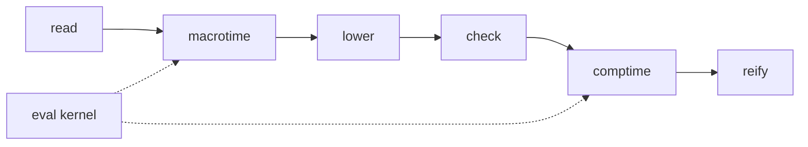
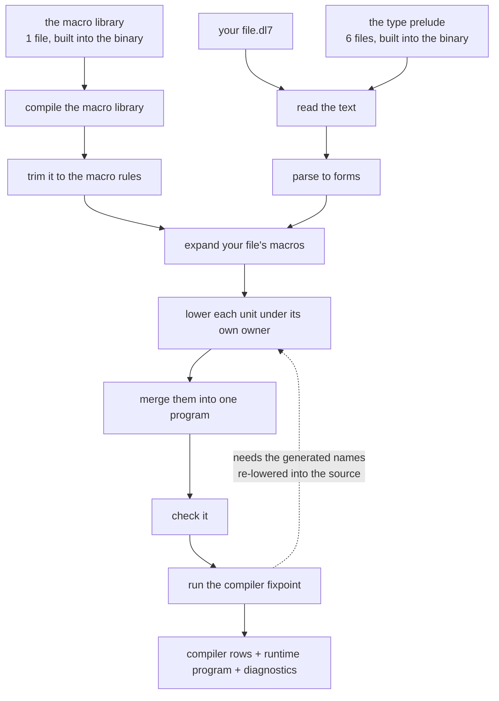
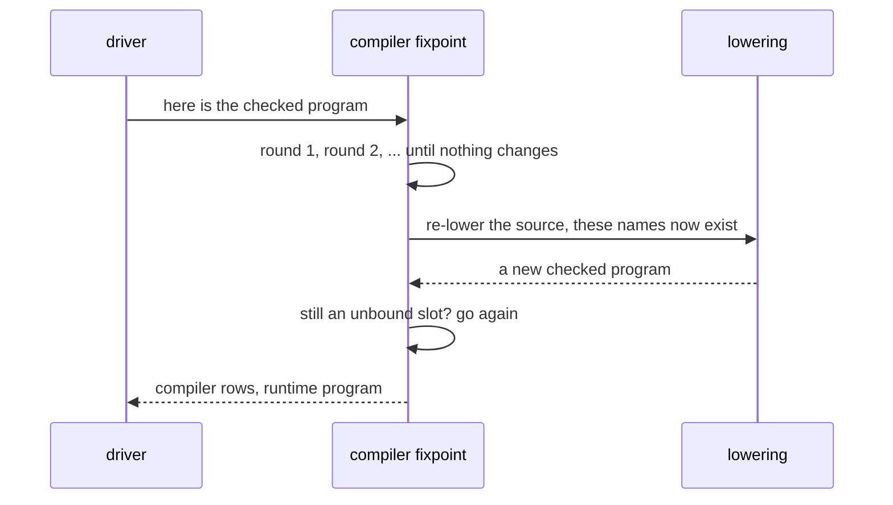
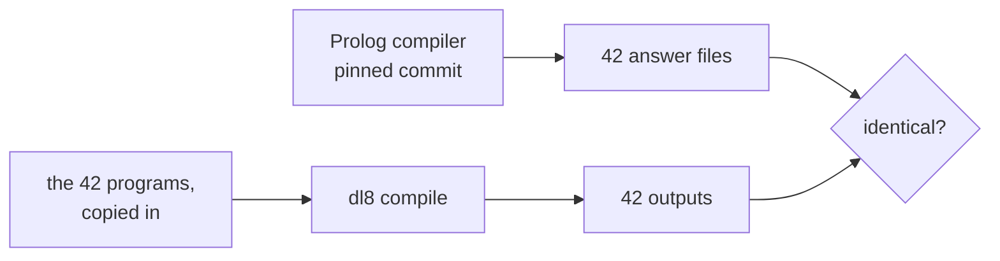

# The driver, in plain words

## Contents

1. The one sentence
2. What was already there
3. What the driver adds
4. The chain, drawn
5. Where the standard library lives now
6. The loop that had a hole in it
7. Two structs became one
8. How we know it is right
9. What is still missing

## 1. The one sentence

Every phase of the language was ported and tested on its own; nobody had
written the line that calls them in order, so `dl8` could not compile a file.
Now it can: `dl8 compile foo.dl7`.

## 2. What was already there

Seven folders, each a faithful copy of one Prolog module, each with its own
frozen answer sheet taken from the Prolog compiler, each green.

Each box could be driven by hand with a JSON file. None of them knew about
the box beside it.

## 3. What the driver adds

Six small pieces of glue and one big one.

| piece | plain words |
|---|---|
| reader expander | a form written `Name: x y` is the same as `(: Name x y)`; this rewrites one into the other and keeps a note of where each new piece came from |
| digest | each source file gets a fingerprint, part of the unit it becomes |
| macro slicer | the macro library is compiled once, then trimmed to only the rules a macro expansion can reach |
| module lowerer | the big one: lower each file under its own name, let the standard library's names show through into every file that did not define its own, then stack the results |
| the live refreeze | the compiler loop needs to re-lower the source with the declarations it just generated; that call used to hit a stub |
| the driver | the call in order, and the `compile` verb |

## 4. The chain, drawn

The dotted arrow is the hole that got filled. The compiler fixpoint generates
new declarations, then has to go back and lower your source again with those
declarations in scope, possibly several times. Until now that arrow pointed at
a recording of what the Prolog compiler did; now it points at the real
lowering.

## 5. Where the standard library lives now

The type prelude and the macro library are DL7 source files, the language's
own standard library. The Prolog compiler found them by asking the operating
system where its own source file lived and walking up two directories.

A Rust binary cannot do that and should not try. The files are copied into the
`v8` crate and baked into the binary at build time. Nothing is read from disk
except the file you asked for.

This is safe because those files' names never show up in the answer: the
prelude is read under the name `prelude`, the macro library under the name
`macrotime`. Only your own file's path appears in the output.

## 6. The loop that had a hole in it

The loop runs at most sixteen times each way. One fixture, `5_curry`, runs out
and says so. That is not a bug to fix in this lane; it is an answer to
reproduce exactly, and it is reproduced exactly.

## 7. Two structs became one

Two lanes independently wrote a Rust struct for the same Prolog term, because
they landed on parallel branches. One held the runtime program as a raw term,
the other as the checked-program struct. The raw one is gone; everything reads
the checked one, and turns it back into a term only at the boundary that
needs a term.

## 8. How we know it is right

The Prolog compiler was run over all 42 test programs at a pinned commit and
its exact answer written down. `dl8` runs over the same 42 and its output is
compared character for character. Six of the 42 end in an error message; those
six are cases too, error message and all.

The programs are copied into the test folder, so the test needs neither the
Prolog toolchain nor the old tree.

## 9. What is still missing

| missing | what it means |
|---|---|
| the code generators | dl8 can compile a program; it cannot yet emit SQLite, Rust or dbsp from one |
| the Prolog-callable emitter arm | one output shape has no Rust equivalent and exits with an error |
| tracing and timing | the Prolog compiler printed a per-phase timing line; dl8 prints per-round events instead |
| type inference, the clock checker, editor diagnostics | never built in either compiler; they need a design session |
