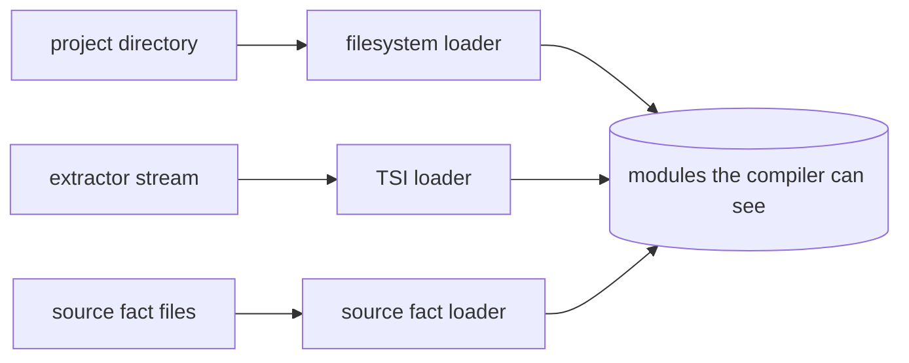
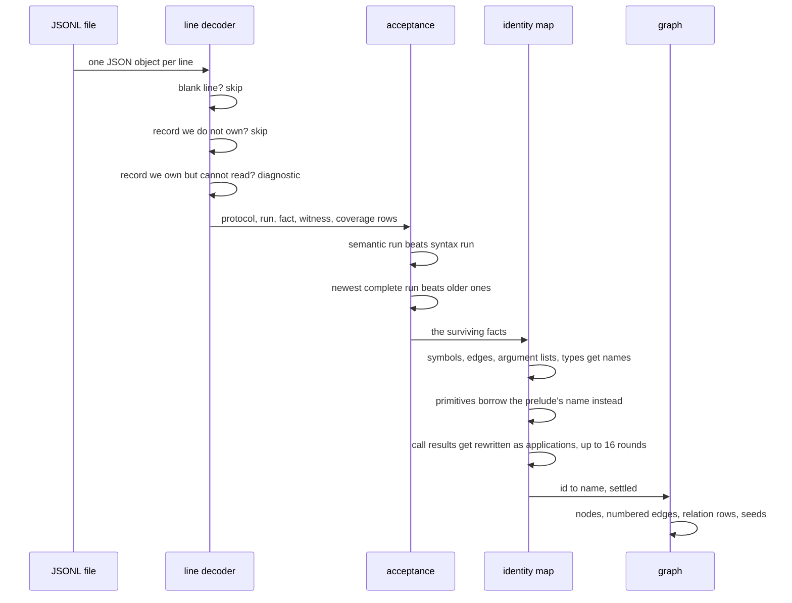
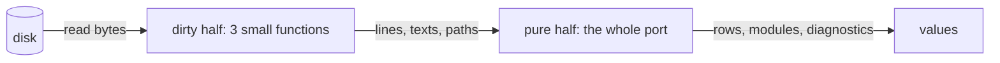
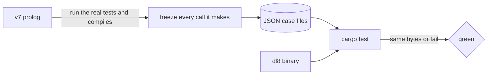

# v8 loaders, in plain words

## TOC

1. [What this is](#1-what-this-is)
2. [The three loaders](#2-the-three-loaders)
3. [How a TSI stream becomes a module](#3-how-a-tsi-stream-becomes-a-module)
4. [Pure half, dirty half](#4-pure-half-dirty-half)
5. [Where the TSI row types come from](#5-where-the-tsi-row-types-come-from)
6. [How we know it is right](#6-how-we-know-it-is-right)
7. [Six things I would change and did not](#7-six-things-i-would-change-and-did-not)

---

## 1. What this is

Three Prolog files in v7 turn things that are not DL7 source into DL7 modules:
a directory tree, a stream of facts about foreign code, and a bag of source
observations. This lane rewrites all three in Rust and proves the Rust gives
the same answer as the Prolog, byte for byte.

## 2. The three loaders

```mermaid
flowchart TD
  subgraph A[filesystem loader]
    A1[walk the .dl7 files] --> A2[every folder becomes a module]
    A2 --> A3["0_src names src, 1_models names models"]
    A3 --> A4[each folder gets a numbered edge to its children]
  end
  subgraph B[TSI loader]
    B1[read the JSONL lines] --> B2[keep the newest run that claims to be complete]
    B2 --> B3[give every wire id a name]
    B3 --> B4[names become nodes, edges and relation rows]
  end
  subgraph C[source fact loader]
    C1[read the JSON arrays] --> C2[expand each match into shared spans]
    C2 --> C3[one module named source_intelligence holds them all]
  end
```

One difference in temperament worth knowing: the filesystem loader is
all-or-nothing. One bad path and it installs nothing. The TSI loader is the
opposite. One bad row is reported and the other ten thousand still load.

## 3. How a TSI stream becomes a module

The 16 is a real number in the code. It stops early when a round changes
nothing, so in practice it runs twice.

## 4. Pure half, dirty half

Each loader is split in two. The dirty half touches the disk and does nothing
else. The pure half is a function from values to values, no paths, no files.

That split is what makes the tests real. The oracle files hold the already
read lines, so the test is a test of the logic and not of somebody's home
directory.

## 5. Where the TSI row types come from

The stream is written by a Rust crate that already has Rust types for every
row. Tempting to just depend on it. Measured what that costs:

| option | crates pulled in | build from scratch | rebuild after one edit |
|---|---|---|---|
| dl8 as it is today | 35 | 9 seconds | 0.4 seconds |
| depend on sprefa-extract | 253 | 59 seconds, and 2.1 GB on disk | 2.8 seconds |
| re-declare the six row shapes here | 35 | 9 seconds | 0.4 seconds |

The 125 lines of type definitions are not what costs 59 seconds. The crate
drags four language parsers with it, and the loader calls none of them. So the
row shapes are re-declared here, which is 70 lines, and dl8 keeps its
half-second edit loop.

The day a second Rust reader of the stream exists, a tiny shared crate is the
right answer. Today there is one.

## 6. How we know it is right

Nothing is hand-written as an expectation. Every case file is a recording of
something v7 actually did while running its own tests and compiling its own
programs. The Rust has to reproduce it exactly, including the diagnostics and
the exit code.

Anything v7 does that cannot be recorded portably, because the answer contains
a memory address or an unbound variable, gets written down in a status file
with a pointer to the line that produces it, so the gap is a number and not a
surprise.

## 7. Six things I would change and did not

| # | what v7 does | what I would do | why I did not |
|---|---|---|---|
| 1 | A source file outside the project root can slip in and invent a folder under the root | Ask the path helper for a folder answer instead of a file answer | It changes which projects compile; that is your call |
| 2 | Deeply nested call types silently stop resolving after 16 rounds | Say so in a diagnostic | Same silence is what the oracle recorded |
| 3 | The source fact loader has no caller in the compiler at all | Wire it or delete it | Deleting an export is not a port |
| 4 | A file it cannot read produces an error term with a raw memory address in it | Name the two real cases with codes of their own | Same reason |
| 5 | A repeated key in a JSON object is a hard error in Prolog and a shrug in Rust | Match the Prolog | Needs a custom JSON reader; no file in the corpus has one |
| 6 | A decimal number inside a source fact becomes a float term Rust has no box for | Add a float to the term arena | That arena belongs to the evaluator lane; no number in the corpus is a decimal |

Nothing in that list is implemented. The Rust behaves exactly like the Prolog.
