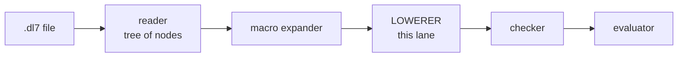
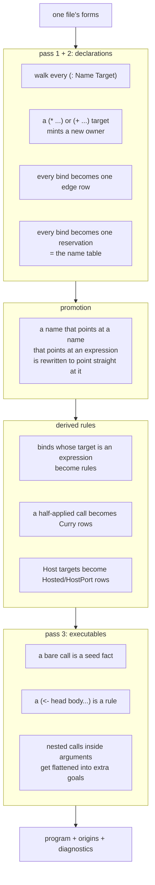
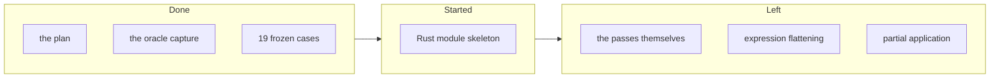

# The lowerer, in plain words

## Contents

1. What the lowerer is
2. The three passes
3. The shapes that go in and come out
4. What `(: name thing)` turns into
5. What we freeze to check ourselves
6. What is done, what is left
7. Things only you can decide

---

## 1. What the lowerer is

It takes one file's parse tree and turns it into flat Datalog: a pile of rows
and a pile of rules. Nothing clever happens after it; the checker and the
evaluator only work on what it produced.

## 2. The three passes

Passes 1 and 2 are one walk, because you cannot reserve a name until you know
which owner it belongs to. Pass 3 runs last because a rule may name anything
declared anywhere in the file, including below it.

## 3. The shapes that go in and come out

| name | what it holds |
|---|---|
| Unit | the file's origin, its hash, its forms, its source spans |
| Environment | what the prelude and other modules already declared: names, relations, edges |
| Program | node rows, edge rows, relation declarations, seed facts, rules |
| Origins | one row per emitted thing saying which source node made it |
| Diagnostics | empty, or one error |

Nothing is ever half-emitted. The first real error stops the file and the
program comes back empty.

## 4. What `(: name thing)` turns into

| you write | you get |
|---|---|
| `(: User (* (: id int) (: name text)))` | a new owner, a `product` row, a `relation` of arity 2, two edge rows |
| `(: Tag (+ ...))` | a new owner and a `sum` row, no relation |
| `(: Alias Other` | one edge row pointing at the name `Other` |
| `(: Size 7)` | one edge row holding the constant 7 |
| `(: UserPatch (Partial User))` | one edge row AND a rule, because the target is a call that must be evaluated |
| `(: (Key "account" Options) int)` | the label itself is computed, so the rule's head has a hole where the label goes |
| `(: Sink (Host impl (* ...) (* ...)))` | a product plus `Hosted` and `HostPort` rows |

Every edge row is the same four columns: who owns it, what it is called, what
it points at, and which position it sits in. That four-column row is the whole
graph. Everything else in the language reads it.

## 5. What we freeze to check ourselves

We run the real v7 compiler over every test fixture and record every lowering
it performs, input and output, as JSON. The Rust version has to print the same
bytes.

| | |
|---|---|
| lowerings v7 performs across all fixtures | 62 |
| size of all of them | 52 MB |
| what we commit | 19 of them, 5.2 MB |
| what we left out | the prelude's own lowering, repeated nearly identically 22 times |

The left-out ones are regenerated by one command; they are listed in a status
file so nobody has to guess what is missing.

## 6. What is done, what is left

## 7. Things only you can decide

Six questions came out of reading the code. None of them is a bug; each is a
place where the language made a choice and the choice is not written down
anywhere.

| # | the question |
|---|---|
| 1 | `Host` is a reserved word in a bind target. A relation of yours named `Host` cannot be used there. Is that on purpose? |
| 2 | `(: Name ?Var)` is rejected outright. Is a variable target meaningless, or just unbuilt? |
| 3 | Three kernel relations, `def`, `head` and `body`, have no column names and no keys, which makes them unusable inside an expression. Goal position only, or unfinished? |
| 4 | A rule head may carry at most one `count`. Design, or current limit? |
| 5 | For a computed edge label, a nearer plain binding beats a further deferred one. Is that the lexical rule you want? |
| 6 | Partial application looks up `Curry` and `Literal` by name in the prelude. Without the prelude it fails, and it reports the failure as "not enough arguments". Should the kernel own those two instead? |

And one plain defect, not a question: on the error path of one predicate, v7
forgets to set the program to empty and hands back an unset value instead. Every
neighbouring error path sets it. One line, in a file this lane does not own.
