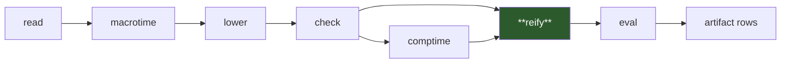
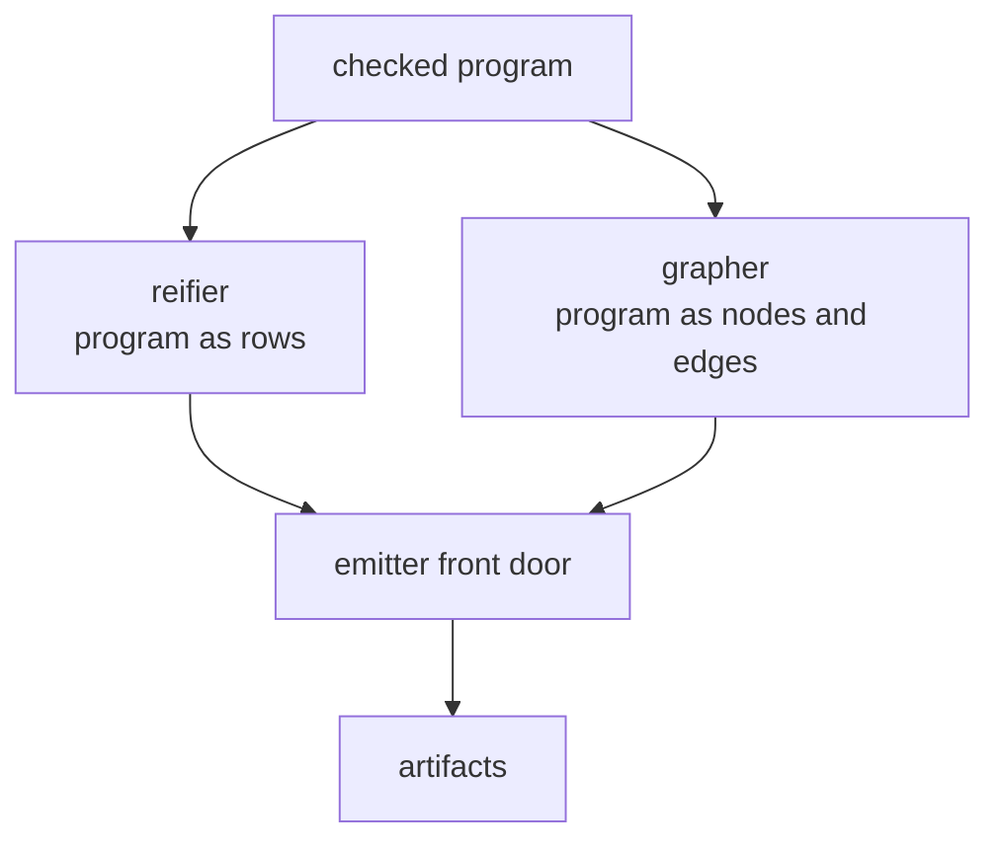
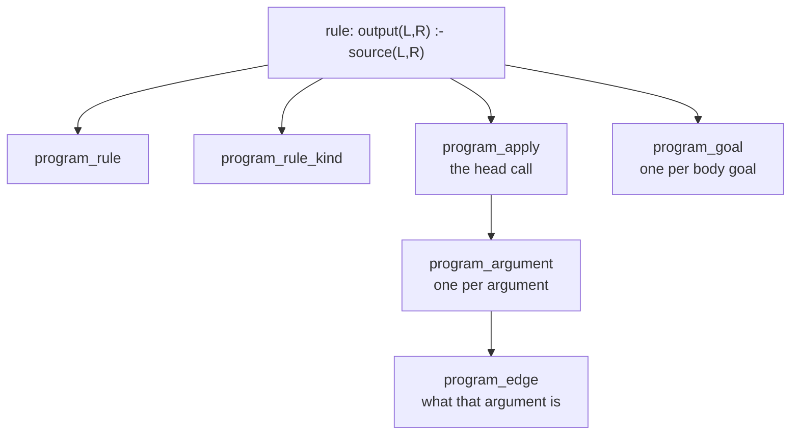
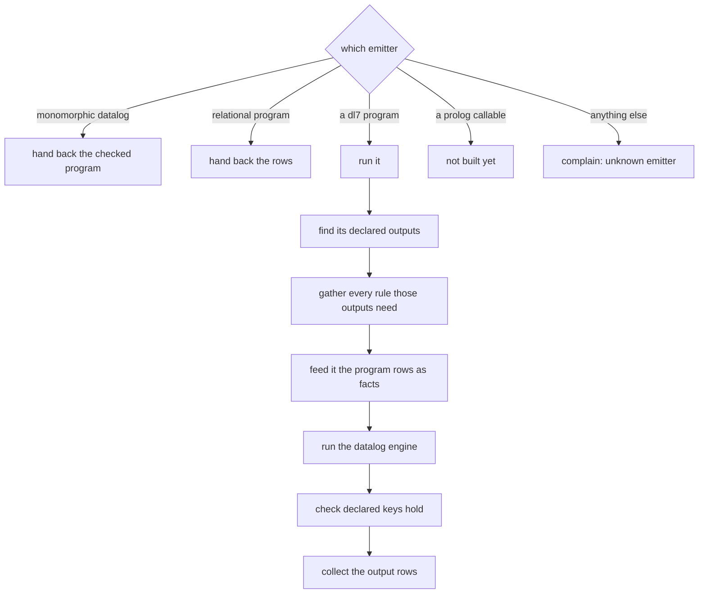
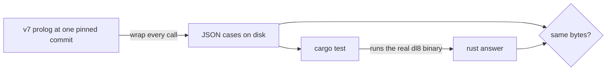

# v8 reify, in plain words

## Contents

1. [What this box does](#what-this-box-does)
2. [Where it sits](#where-it-sits)
3. [The three jobs](#the-three-jobs)
4. [Turning a program into rows](#turning-a-program-into-rows)
5. [The emitter front door](#the-emitter-front-door)
6. [How we know it is right](#how-we-know-it-is-right)
7. [What is not done](#what-is-not-done)

## What this box does

A dl7 program, after checking, is a pile of rules and relations. Some programs
want to read their own shape: a program that writes SQL needs to see which
relations exist and which rules feed which. This box turns the checked program
into ordinary rows, so a dl7 program can query its own body with plain dl7
rules.

## Where it sits

## The three jobs

| job | plain words |
|---|---|
| reifier | every relation, seed, rule, goal and argument becomes one row |
| grapher | the same thing again as a node-and-edge drawing, so later work can hang labels on each occurrence |
| front door | picks which emitter runs, runs it, collects what came out |

## Turning a program into rows

One rule in, many rows out.

Each row names its owner with a made-up-but-stable name, like
`call_id(rule(0), head)` or `argument_id(that call, 0)`. Nothing is a counter
that could drift between runs; the name is built out of where the thing sits in
the program, so the same program always gives the same names.

## The emitter front door

Every step that can go wrong has one named complaint, and every one of those
names has a frozen test case.

| goes wrong | complaint |
|---|---|
| the prelude never published a row name | protocol missing |
| it published the same name twice | protocol ambiguous |
| the emitter declares no outputs | emitter has no outputs |
| two outputs claim one artifact name | duplicate artifact name |
| two rows share a key that promised to be unique | functional key conflict |

## How we know it is right

We do not trust a reading of the Prolog. We ran the real v7 compiler, recorded
every single call into these three files, and froze what came back.

| number | meaning |
|---|---|
| 42 fixtures compiled | none of them reaches this box during compilation, which is why the test suites had to drive it |
| 131 calls recorded | every call the five v7 test suites and the authored cases made |
| 91 distinct | the rest were byte-identical repeats |
| 57 committed | the ones that live in git, 3.7 MB |
| 88 of 88 pass | every distinct case the port covers, run through the real binary |
| 5 deliberate breakages | each one broke the right cases, then was undone |

## What is not done

| thing | why |
|---|---|
| the prolog-callable emitter arm | it calls a Prolog predicate by name. Rust has no Prolog to call. The shape and the complaints are ported, the call is not. |
| the seven code generators after this box | they are the next lanes. This box is the door they come through. |
| one v7 fixture, `5_curry` | it already fails to compile in v7 at the commit we froze, before we touched anything. Three v7 tests fail because of it. Not ours. |
