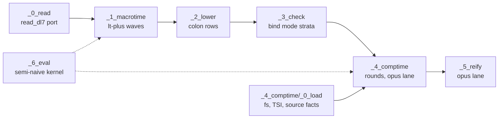
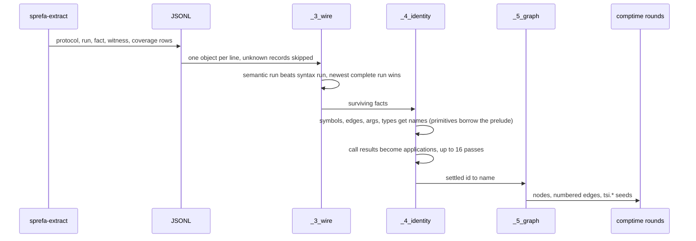

# v8 tour: dl8 in Rust, one sitting

Read with `plans/v8/2026-09-12-v8-history.d2` open beside it (the night as a
sequence diagram) and `plans/v8/2026-09-11-v8-port-board.d2` (the chess board).
Every claim below is either a `path:line`, a command, or a table a command
printed. Numbers in tables are from the commit named in section 1.

## Contents

1. What is on the branch
2. Commands you can run right now
3. Reading order, file by file
4. The kernel: a fixpoint as a step trace
5. `:` is the whole graph
6. Type theory, as built and as planned
7. TSI, and the sprefa-extract fork
8. Pure and impure, pause points
9. Forks that need you
10. Not built yet

## 1. What is on the branch

Branch `feature/v8-eval-kernel-20260912`, PR #725, with lane PRs #726 #727
#728 #729 #730 merged into it. Each lane PR is still open against it, so you
can read a phase as one diff.



| folder | Rust lines | files | oracle cases | v7 source | PR |
|---|---|---|---|---|---|
| `_0_read` | 514 | 5 | 89 | `0_reader/0_parser.pl` | #726 |
| `_1_macrotime` | 1716 | 8 | 30 | `1_libtime/0a 0b 1_syntax_expander.pl` | #728 |
| `_2_lower` | 3582 | 15 | 20 of 62 checked | `2_comptime/0_lowerer.pl`, `0_graph_lookup.pl` | #727 |
| `_3_check` | 1848 | 10 | 20 of 75 checked | `2_comptime/1_checker.pl` | #730 |
| `_4_comptime/_0_load` | 2612 | 10 | 52 of 57 checked | `2_comptime/0b 0c 0d` | #729 |
| `_4_comptime` rounds | lane running | | | `2_comptime/2_compiler.pl:700-1591`, `1a 1c 1d` | |
| `_5_reify` | lane running | | | `3_emit/0 0a 1` | |
| `_6_eval` | 1553 | 8 | 32 | `1_libtime/0_evaluator.pl` | #725 |
| `tests/` | 688 | 6 | | | |

Every test runs the real `dl8` binary over a frozen v7 JSON case and asserts
byte equality plus exit code. `cargo test` is the whole gate.

## 2. Commands you can run right now

```bash
cd v8
cargo test                                             # every phase, real binary
cargo run -q -- --help                                 # read expand lower check load comptime reify eval
cargo run -q -- eval oracle/eval/0_transitive.json --trace
cargo run -q -- expand oracle/macrotime/expansion_cases_1.json --trace
cargo run -q -- read ../v7/test/fixtures/2_partial.dl7 | head -c 400
cargo run -q -- lower oracle/lower/$(ls oracle/lower | grep json | head -1)
cargo run -q -- check oracle/check/$(ls oracle/check | grep json | head -1)
```

Refreeze any oracle from v7 (needs swipl): the block in `v8/README.md`.

## 3. Reading order, file by file

Start at the kernel, because every other folder is a caller of it.

| order | file | lines | read for |
|---|---|---|---|
| 1 | `v8/src/_6_eval/_0_term.rs` | 230 | `Term`, `Universe`: hash-consed arena, `TermId` is a `u32`, `cmp` is SWI standard order |
| 2 | `v8/src/_6_eval/_1_program.rs` | 80 | `Arg`, `Goal`, `Rule`, `Row`, `Diagnostic`, `Program`: the v7 `rule/2` term as Rust |
| 3 | `v8/src/_6_eval/_3_table.rs` | 100 | `Table`: append-only rows, frontier, per-column index, `Range::{Old,Delta,All}` |
| 4 | `v8/src/_6_eval/_4_kernel.rs` | 200 | the six kernel relations `nil cons edge_ref intern int_*` |
| 5 | `v8/src/_6_eval/_5_evaluate.rs` | 560 | `evaluate`: stratify, per level rounds, `demand`, `fire`, `Trace` sink |
| 6 | `v8/src/_2_lower/_0_api.rs` | 100 | `Unit`, `Environment`, `Lowered`, `lower_datalog` signature |
| 7 | `v8/src/_2_lower/_8_express.rs` | 629 | `(: owner name target index)` becomes rows and rules |
| 8 | `v8/src/_3_check/_0_api.rs` | 201 | `Checked`, `Stop`, `check_datalog` |
| 9 | `v8/src/_3_check/_4_mode.rs` | 357 | the mode check, two bags of variables |
| 10 | `v8/src/_1_macrotime/_4_expand.rs` | | one `<+` wave, `Wave` enum, the pause point comment |
| 11 | `v8/src/_4_comptime/_0_load/_7_read.rs` | 48 | the only `std::fs` in the loaders |
| 12 | `v8/src/_0_read/_2_reader.rs` | 392 | v7's character state machine over `Vec<char>` |
| 13 | `v8/src/bin/dl8.rs` | | the one boundary: file in, JSON out, exit code |

Each lane wrote a plain-words plan first; read it before its folder:

- `plans/v8/2026-09-12-v8-lower.PLAN.visual.human.unga.md`
- `plans/v8/2026-09-12-v8-check.PLAN.visual.human.unga.md`
- `plans/v8/2026-09-12-v8-load.PLAN.visual.human.unga.md`
- `plans/v8/2026-09-12-v8-comptime.PLAN.visual.human.unga.md` (when the lane lands)
- `plans/v8/2026-09-12-v8-reify.PLAN.visual.human.unga.md` (when the lane lands)

The `.PLAN.md` twin of each carries the `path:line` citations at v7 `f5018ad23`.

## 4. The kernel: a fixpoint as a step trace

`oracle/eval/0_transitive.pl`: `path` over four `edge` seeds in a cycle.

```
$ dl8 eval oracle/eval/0_transitive.json --trace
Stratum   { level: 0, rules: 2, seeds: 4 }
Aggregate { level: 0, rules: 0, rows: 0 }
Round { level: 0, round: 0, new: 4 }    all goals Range::All, path <- edge
Round { level: 0, round: 1, new: 4 }    path <- path(Delta) edge(All), length 2
Round { level: 0, round: 2, new: 4 }    length 3
Round { level: 0, round: 3, new: 4 }    length 4, the cycle closes
Round { level: 0, round: 4, new: 0 }    steady state, break
Closure { rows: 21 }                    4 edge + 16 path + 1 nil
```

The loop is `_5_evaluate.rs:474`. One state struct (`Store`), one event per
round, effects out through `fx: &mut dyn FnMut(Trace)`. That is the redux
`Slice` shape with the trait left out because one impl exists.

```rust
// round r > 0: one plan per current-level positive goal j
// goals before j read Old, goal j reads Delta, goals after j read All
store.mark_all();                                   // frontier -> old
for (rel, row) in sink { if store.insert(rel, row) { new += 1 } }
fx(Trace::Round { level, round, new });
if new == 0 { break }
```

Two things the trace does not show and the oracle forced:

| v7 behavior | Rust | where |
|---|---|---|
| tabled top-down: a rule with a bound head yields rows on demand, never stored | `demand()` memoized per (rel, pattern) | `_5_evaluate.rs` `Eval::demand` |
| aggregates count stored rows only, never kernel solutions | `tables_only` mode | `Eval::aggregate_rows` |

## 5. `:` is the whole graph

`(: owner name)` and `(: owner name target index)` lower to one four-column
row. Everything else reads that row (`0_lowerer.pl:1124-1280`,
`kernel_slot_label(':', 0..3)` = owner, name, target, index).

| you write | rows you get |
|---|---|
| `(: User (* (: id int) (: name text)))` | owner, `product`, `relation` arity 2, two edge rows |
| `(: Tag (+ ...))` | owner, `sum`, no relation |
| `(: Alias Other)` | one edge row to the name `Other` |
| `(: Size 7)` | one edge row holding 7 |
| `(: UserPatch (Partial User))` | one edge row AND a rule, the target is a call |
| `(: (Key "account" Options) int)` | rule head with a hole where the label goes |

In the evaluator that row is `call(ref(kernel(':')), [ref(Owner), const(Name), var(Target), const(Index)])` and `edge_ref` is the kernel relation that walks it (`_4_kernel.rs`, `Kernel::EdgeRef`). `int_lt .. int_gt` replaced the Peano `before/3` closure you rejected in v7.

## 6. Type theory, as built and as planned

Built, in `_3_check`, mirrored from `1_checker.pl` line for line. Five jobs,
any complaint kills the result:

| job | complaint | Rust file |
|---|---|---|
| bind check: unique names, dense zero-based positions | duplicate name, non-dense index | `_3_bind.rs` |
| edge resolution: every declared type points somewhere | `unresolved_name` (names the label, fork F2) | `_2_resolve.rs` |
| seed resolution: facts fully concrete | `non_ground_seed` | `_2_resolve.rs` |
| rule resolution: relations exist, arity matches, answerable | `unsafe_head_var`, arity, kernel mode | `_4_mode.rs`, `_5_kernel.rs` |
| layering: negation and count sit above what they read | `strict_dependency_cycle`, `aggregate_dependency_cycle` | `_6_strata.rs`, `_6_eval/_2_stratify.rs` |

The mode check, the part you asked about most, as a trace. Two bags:
`available` (head vars, then whatever a goal binds; positives read it) and
`produced` (empty at start, grows when a goal is clean; negatives read it).

```
rule:   (<- (reader ?Value) (point ?Value) (int_lt ?Value 3))
goal 1  available {Value}  produced {}        point binds Value         ok
goal 2  available {Value}  produced {Value}   both int_lt sides bound   ok

rule:   (<- (reader 1) (int_lt ?Left 3))
goal 1  available {}       produced {}        Left unbound              COMPLAINT
```

| kernel goal | needs bound | else |
|---|---|---|
| `int_lt int_le int_eq int_ne int_ge int_gt` | both sides | underconstrained |
| `cons` | the list, or head and tail | underconstrained |
| `edge_ref` | owner and label | underconstrained |
| `intern` | constructor and args | underconstrained |

Negating any constructive kernel goal is always a complaint.

Planned, nothing in Rust yet, listed so the tour does not blur them:

| planned | where it would sit | what exists today |
|---|---|---|
| Hindley-Milner inference for comptime | after `_3_check`, before rounds | none; types are declared, `Partial`/`Key` are comptime rules |
| clock checker (when does a rel change) | a stratum over `origin_rows` | `origin_rows` exist in macrotime and lower |
| LSP diagnostics | `_0_read` positions, character based | tree-sitter linked, unused (fork R1) |

## 7. TSI, and the sprefa-extract fork

TSI is the typed symbol index protocol: `sprefa-extract` walks a checkout and
emits signed JSONL rows; v7 reads them into 23 `tsi.*` relations
(`0c_extract_loader.pl`, `grep -oE "tsi\.[a-z_]+"`). The Rust half is
`_4_comptime/_0_load/_3_wire.rs` (the 36 row kinds), `_4_identity.rs` (ids to
names), `_5_graph.rs` (`install_tsi_graph`, `tsi_expression_environment`).



The fork you named, measured by the load lane:

| how separate | crates | clean build | incremental | what moves |
|---|---|---|---|---|
| dl8 today, row shapes redeclared | 35 | 9.4 s | 0.41 s | nothing |
| dl8 path-depends on sprefa-extract | 253 | 58.9 s | 2.84 s | oxc, ast-grep, syn, tree-sitter-dl6 come along |
| a third tiny crate for the 36 row types | 36 | 9.4 s | 0.41 s | `v6/sprefa-extract/src/tsi/types.rs`, 125 lines |
| extract becomes a DL7 host, rows are a program's seeds | | | | the dl6-in-dl7 app declares `tsi.*` |

Tonight's code is row one. The choice stays yours.

## 8. Pure and impure, pause points

| phase | impure edge | pure body | sink |
|---|---|---|---|
| read | `dl8.rs` reads the file | `_2_reader.rs` over `Vec<char>` | none |
| macrotime | none | waves | `fx(Wave)`; pause point at `_4_expand.rs` after `Rewritten`, state = rows, origin, seen, wave counter, plus the `Universe` |
| lower | none | passes | none |
| check | none | five jobs | none |
| load | `_7_read.rs`, 48 lines | everything else takes slices | none |
| eval | none | rounds | `fx(Trace)`; pause point at `Round` |
| comptime | none | rounds | `fx(Round)` (lane running) |

Your redux crate (`~/projects/hafley-games/crates/redux`, 9 commits unpushed)
is mirrored, never depended on: `Slice { State, Event, Context, Output,
Effect; reduce(st, ev, cx, fx) }`, `Effect = Never` proves purity,
`reduce_then_apply` settles effects after the reducer returns. Once the crate
is pushed, the two sinks above become `Effect` enums and `reduce_then_apply`
is the runner. The lanes declared no trait because each shape has one impl.

## 9. Forks that need you

Each lane kept v7's behavior and wrote the alternative down. The decision is
yours; nothing here is implemented.

| id | phase | v7 line | one line |
|---|---|---|---|
| R1 | read | `v8/build.rs` | tree-sitter is compiled and linked, nothing reads its CST; keep for LSP or drop |
| R2 | read | `_0_term.rs:18` | ints wider than i64 are `integer_out_of_range`; v7 makes a bignum |
| L1 | lower | `0_lowerer.pl:292` | v7 defect: `Program` left unbound on one error path, port reproduces `null` |
| L2..L7 | lower | `:713 :778 :1971 :1152 :581 :414` | section 7 of the lower plan |
| C1 | check | `1_checker.pl:978` vs `:1048` | head vars via `sub_term`, body vars top-level only |
| C2 | check | `:585` | `unresolved_name` names the label, not the missing target |
| C3 | check | `:823` | negatives read `produced`, positives read `available` |
| C5 | check | `kernel_relation_keys/2` | disagrees with the lowerer's `kernel_keys/1` on `nil` and seven names |
| D1..D6 | load | `0b:72 0c:490 0d:51 0d:263` | section 7 of the load plan; `0d` has no caller in `v7/src` |
| N1 | lower | `_0_api.rs` and `_0_cx.rs` | two files share a number prefix, same for `_1_forms.rs` and `_1_slots.rs` |

## 10. Not built yet

| thing | v7 source | who |
|---|---|---|
| comptime rounds | `2_compiler.pl:700-1591`, `1a 1c 1d` | opus lane running |
| reifier and emitter front door | `3_emit/0 0a 1` | opus lane running |
| the driver: `lib.rs compile()`, `dl8 compile f.dl7` | `2_compiler.pl:75-700`, `0a_module_lowerer.pl` | next lane, after the two above |
| dbsp, sqlite, rust emitters, `4_tool/*` | `3_emit/1a 1b 1c 2 2a 3`, `4_tool` | the codegen tools, later |
| HM inference, clock checker, LSP | none | design with you in the room |
| `Compiled` (comptime) and `CompiledUnit` (reify) are two structs for one v7 term | | coordinator merges after both land |
