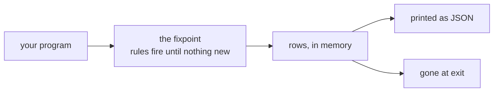
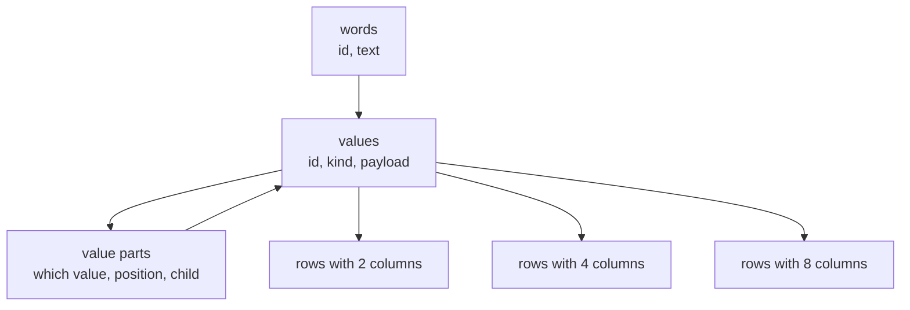
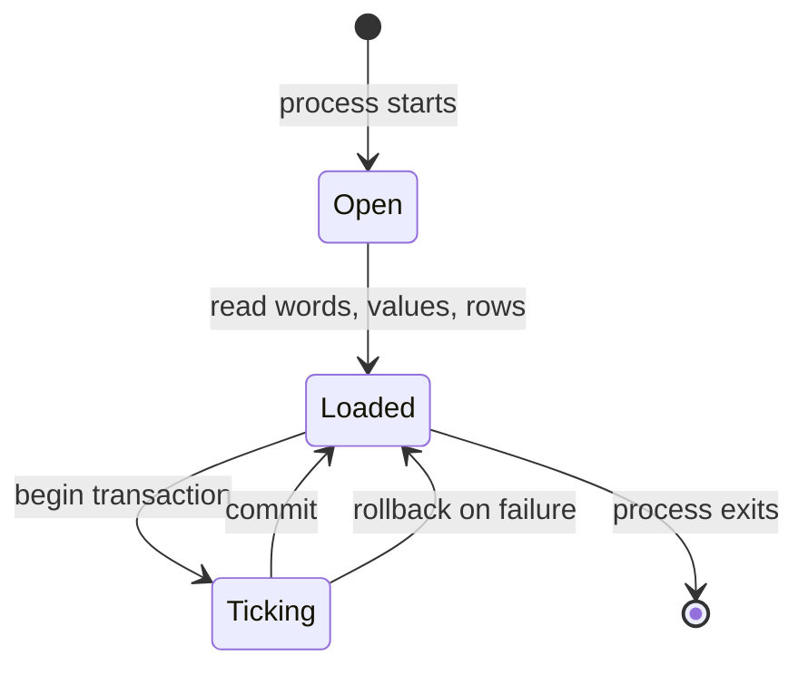
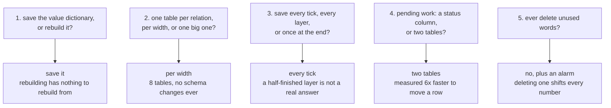

# Saving dl8's rows to disk, in plain words

## Contents

1. The one sentence
2. What dl8 does today
3. The three things that have to survive
4. What a row actually is
5. The shape of the file
6. One tick, step by step
7. The cursor bug that was waiting to happen
8. What the numbers said
9. Five questions for you
10. Which library
11. What this does not answer

---

## 1. The one sentence

dl8 works out every fact your program implies, prints them, and forgets all of
them when the process exits. This plan gives it a file to remember them in.

---

## 2. What dl8 does today



Everything lives in RAM. Run the same program twice and it does the same work
twice.

---

## 3. The three things that have to survive

| thing | plain words | how big, on the real test corpus |
|---|---|---|
| the rows | the facts your rules worked out | 14,367 across 32 test programs |
| the arena | the dictionary of every value any row mentions | 1,587 distinct values |
| the words | the actual text, like `edge` or `node` | a few hundred |

The rows are the point. The other two exist because a row does not store values
directly.

---

## 4. What a row actually is

A row does not hold `edge` or `7`. It holds numbers that point into a shared
dictionary.

```
the dictionary (the arena)          a row in the relation "edge"
  0  []                               rel = 812      -> ref(kernel(edge))
  1  [|]                              c0  = 41       -> const(node_a)
  ...                                 c1  = 57       -> const(node_b)
  41 const(node_a)
  57 const(node_b)
  812 ref(kernel(edge))
```

This is why the arena has to be saved too. Save the rows without the dictionary
and you have a page of numbers that point at nothing.

The good news: those dictionary numbers are already just positions, counted from
zero, never reused. Writing them down is writing a list in order, and reading
them back rebuilds the same numbers by construction.

One more measured fact, and it decides the file layout: across 174,081 values
used, only 1,587 are distinct. The dictionary is doing about 30x of work.

---

## 5. The shape of the file



One table for words, one for values, one for the pieces a compound value is made
of, and then one table per row width.

Why per row width and not one table per relation: one of the test programs has a
relation that carries both two columns and three columns at once. A table with a
fixed number of columns cannot hold that relation, so the split by width is
forced before any speed argument.

| table | holds | key |
|---|---|---|
| words | every distinct piece of text, once | a counting number |
| values | every distinct value, once | a counting number |
| value parts | the arguments of compound values | value plus position |
| rows, 1 column | every one-column fact | relation plus the column |
| rows, 2 columns | every two-column fact | relation plus both columns |
| ... up to 8 | the widest the test corpus uses | same |

Every key in that table is a whole number. No table anywhere uses text as its
key. Text lives in exactly one place, the words table.

---

## 6. One tick, step by step

A tick is one round of work the outside world asked for. Numbers below are an
example run where 43 new facts appear.

```
step  what happens                          rows on disk   rows in RAM
0     open a transaction                    120            120
1     write any new words                   120            120
2     write any new values                  120            120
3     write the parts of those values        120            120
4     write facts 120 through 162            163            163
5     close the transaction                 163            163
```

Either the whole tick lands or none of it does. Pull the power cord at step 3
and the file still reads as it did at step 0.



The number of write commands per tick depends on how many relations changed,
never on how many rows changed. Ten rows and ten million rows both take the same
handful of commands.

---

## 7. The cursor bug that was waiting to happen

The fixpoint already keeps a marker called the frontier, and the obvious move is
to reuse it as "everything before here is saved". That is wrong, and here is the
trace that shows why.

```
round  facts total  frontier  saved-up-to   comment
0      120          120       120           starting point
1      154          120       120           34 new facts arrived
2      154          154       120           frontier jumps forward
3      163          154       120           9 more facts arrived
4      163          163       120           frontier jumps again
5      163          163       163           now we save, once, 43 facts
```

The frontier moves every round because that is its job: it tells the rules which
facts are new enough to bother with. It is not a record of what reached disk.
The store keeps its own separate marker, and the plan says so in one line so
nobody wires the two together later.

Good news attached: nothing is ever lost by saving late. Every unsaved fact can
be worked out again from the facts below it, because that is what a fixpoint
means. Saving early only skips future work.

---

## 8. What the numbers said

All measured on this machine, 200,000 facts, three runs each.

| layout | time to write | file size |
|---|---|---|
| one table per relation | 0.13 s | 6.8 MB |
| one table per row width | 0.15 s | 7.3 MB |
| one row table plus one cell table | 1.09 s | 22.6 MB |

The third shape is the tidy-looking one, and it is 8x slower and 3x fatter.

| question | answer |
|---|---|
| write 100,000 dictionary values | 0.05 s |
| read them all back | 0.04 s |
| write 50,000 words with a uniqueness check | 0.04 s |
| read 200,000 facts back | 0.07 s |
| add one lookup index to a table | file grows 44% |

That last row is the reason the plan saves no lookup indexes at all. dl8 already
rebuilds them in memory while it reads the file, for free, so paying 44% of the
file to store them buys nothing.

---

## 9. Five questions for you



| # | the question, in one line | what I would pick | what it costs |
|---|---|---|---|
| 1 | does the value dictionary go in the file | yes | 0.05 s per 100,000 values |
| 2 | how are facts laid out in tables | one table per row width | 16% slower writes than the fastest option |
| 3 | how often do we save | once per tick | nothing measurable |
| 4 | how is pending work stored | two tables, pending and done | a "is this pending or done" check reads both |
| 5 | do unused words ever get removed | never, but alarm when the file swells | the file grows with words ever seen |

Question 5 deserves a sentence of warning. The older engine has this exact
problem today and its test suite flags it: its word table grows and never
shrinks. The reason nobody fixed it is the reason I recommend not fixing it
here either: the numbers are positions in a list, so deleting one shifts every
number after it, in memory and on disk at once.

---

## 10. Which library

SQLite is already decided. The only open question was which Rust library drives
it, and I priced seven.

| library | what it is | verdict |
|---|---|---|
| rusqlite | the standard SQLite wrapper, already used elsewhere here | take it |
| sqlx | excellent, checks your SQL at build time | needs an async runtime this tool does not have |
| turso | SQLite rewritten in Rust, no C at all | promising, still version 0.7; check again at 1.0 |
| libsql | SQLite plus remote replication | 30 optional pieces we would never use |
| redb | clean pure-Rust store, one dependency | not SQL, so nothing can open the file but us |
| sled | popular, well known | last released five years ago |
| fjall | modern, actively built | wrong internal shape for rewriting a table every tick |

rusqlite wins on a boring reason worth stating: it compiles SQLite into the
binary, so the store behaves the same on every machine. This laptop has two
different SQLite versions installed right now, and a store that picks whichever
one it finds is a store that reproduces differently somewhere else.

---

## 11. What this does not answer

| open thing | why |
|---|---|
| the five questions above | each has a real cost on both sides; your call |
| how a fact gets retracted | two designs exist here, both priced, neither picked |
| what a "pending work" row looks like | that part of the system has no code yet |
| whether the value dictionary ever needs a free list | that is a change to the engine core, not to storage |

Last thing worth knowing: none of this touches the engine. The place it attaches
already hands out exactly what a store needs, so this is a new folder beside the
fixpoint, not surgery inside it.
