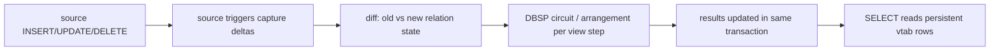

# Pipe syntax, evaluation order, rxjs-shaped state, and who already ships this

Auditor study for `issues/pipe-sql-harness/item.md`. Companion human doc:
`2026-09-15-pipe-sql-eval-order.study.visual.human.unga.md`. All external claims carry
URLs. All internal claims carry `path:line`. Where sources disagree both lines are kept.

## TOC

1. SQL pipe syntax
2. Evaluation order: Prolog vs Datalog vs SQL vs tabling
3. dl8 today and sqlite_ivm deltas
4. RxJS operators in relational terms
5. Point-free and monadic scope rules
6. Retraction
7. The boop db example (run against the real db)
8. Existing projects, candidate by candidate
9. Forks for Chris

## 1. SQL pipe syntax

The BigQuery paper: "SQL Has Problems. We Can Fix Them: Pipe Syntax In SQL",
Shute et al., PVLDB 17(12):4051-4063, 2024. PDF
https://www.vldb.org/pvldb/vol17/p4051-shute.pdf, DOI
https://dl.acm.org/doi/10.14778/3685800.3685826, landing page
https://research.google/pubs/sql-has-problems-we-can-fix-them-pipe-syntax-in-sql/.
Core move: a query becomes `FROM <source> |> op1 |> op2 |> ...`, every operator takes a
table in and produces a table out, operators compose in any order (paper abstract and
section 3.2). Inside Google since February 2024, 1600 seven-day-active users by August
2024 (paper section 1 and https://feeds.simonwillison.net/2024/Aug/24/pipe-syntax-in-sql/).

### 1.1 Pipe operator shapes (BigQuery paper + reference docs)

BigQuery reference: https://cloud.google.com/bigquery/docs/reference/standard-sql/pipe-syntax.
ZetaSQL implements the grammar: https://github.com/zetasql/zetasql (pipe syntax ships in
the grammar and analyzer; see `zetasql/parser/` for the pipe operator productions).

| Operator | Input shape | Output shape | Notes |
|---|---|---|---|
| `FROM` | none (starts pipe) | rows of named tables | the only input operator |
| `SELECT` | table | table, projected columns | aliasing allowed |
| `EXTEND` | table | table, columns added | keeps existing columns |
| `SET` | table | table, columns replaced | update in flight |
| `DROP` | table | table, columns removed | |
| `RENAME` | table | table | |
| `AS` | table | table | names the relation mid-pipe |
| `WHERE` | table | table, subset rows | pure selection |
| `ORDER BY` | table | table, total order imposed | order-sensitive downstream |
| `LIMIT`/`OFFSET` | table | table, subset rows | depends on ORDER BY state |
| `AGGREGATE` | table | table, one row per group | `AGG agg.expr GROUP AND ORDER BY` |
| `JOIN` | table | table, joined rows | `JOIN other ON ...` takes left from pipe |
| `UNION`/`INTERSECT`/`EXCEPT` | table | table | set or bag by ALL |
| `CALL` | table | table | invokes a TVF inline |
| `TABLE` | none | rows of one table | shorthand source |
| `PIVOT`/`UNPIVOT` | table | table | shape change |
| `WINDOW` | table | table | window expressions become columns |
| `DISTINCT` | table | table | dedup |
| `EXPLAIN`/`ASSERT` | table | passthrough or error | meta operators |

### 1.2 Order sensitivity vs commutation (BigQuery paper section 3.2)

| Pair | Commutes | Reason |
|---|---|---|
| `WHERE` x `SELECT`/`EXTEND` | yes, mostly | unless the projection defines a column the filter uses |
| `SELECT` x `EXTEND` | no | both write columns, order is semantics |
| `WHERE` x `JOIN` | mostly yes | filter pushes through inner joins, not outer |
| `ORDER BY` x anything after | no | subsequent ops may destroy or rely on order |
| `LIMIT` x anything after | no | an operator between ORDER BY and LIMIT changes what is kept |
| `AGGREGATE` x upstream ops | no | upstream ops define the group keys |
| `DISTINCT` x `ORDER BY` | no | dedup collapses duplicates the order would expose |
| `UNION ALL` x `WHERE` upstream | yes | per-branch filtering distributes |

### 1.3 Who else ships it

| System | Operator set | Window functions | Recursion | Source |
|---|---|---|---|---|
| ZetaSQL / BigQuery | full set above | `WINDOW` pipe op exposes them mid-pipe | none in pipe ops, standalone SQL | https://github.com/zetasql/zetasql |
| Databricks SQL | `FROM SELECT EXTEND SET DROP RENAME WHERE ORDER BY LIMIT OFFSET AGGREGATE JOIN UNION INTERSECT EXCEPT TABLESAMPLE PIVOT UNPIVOT` as pipe suffix | inside `SELECT`/`AGGREGATE` clauses | no recursive pipe op | https://docs.databricks.com/aws/en/sql/language-manual/sql-ref-syntax-qry-pipeline |
| DuckDB FROM-first | not a pipe: optional FROM-first and `SELECT *` omission | normal SQL | normal SQL | https://duckdb.org/2023/08/23/even-friendlier-sql and https://duckdb.org/docs/current/sql/query_syntax/from |
| PRQL | pipeline of `from filter derive select group aggregate sort take join` | `window` transform | none | https://prql-lang.org/book/ |
| Malloy | query + nest model, `where project limit` | `window` field in views | none | https://docs.malloydata.dev/documentation/language_info |
| KQL (Kusto) | `where project extend summarize join sort take top mv-expand make-series` | `summarize` + row/window functions | `facts` with pagination, no datalog-style fixpoint | https://learn.microsoft.com/en-us/azure/data-explorer/kusto/query/ |
| Materialize adapters | upstream for Adama/Kosher; pipe-ish trail syntax was in scope | yes | recursive views | https://materialize.com/docs/ |

## 2. Evaluation order: Prolog vs Datalog vs SQL vs tabling

### 2.1 Prolog

SLD resolution: top-down from the goal, goals tried left to right, clause order picks
branches, `!` (cut) prunes alternatives. Termination depends on goal and clause order.
References: Lloyd, "Foundations of Logic Programming", Springer 1987,
https://link.springer.com/book/10.1007/978-3-642-83189-8; SWI-Prolog manual
https://www.swi-prolog.org/pldoc/man?section=clp-dis (control) and
https://www.swi-prolog.org/pldoc/man?section=table (tabling).

Worked query, same domain as the boop db. Rules:

```prolog
path(X, X).
path(X, Y) :- edge(X, Z), path(Z, Y).
edge(a, b). edge(b, c). edge(c, d). edge(d, a).  % a cycle, on purpose
```

Trace of `?- path(a, d)` step by step:

| Step | Goal stack | Action |
|---|---|---|
| 1 | `path(a,d)` | try clause 1: `d==a` fails |
| 2 | `path(a,d)` | clause 2: new goals `edge(a,Z)`, `path(Z,d)` |
| 3 | `edge(a,Z)` | Z=b, succeeds (edge a->b) |
| 4 | `path(b,d)` | clause 1 fails; clause 2: `edge(b,Z')`, `path(Z',d)` |
| 5 | `edge(b,Z')` | Z'=c |
| 6 | `path(c,d)` | clause 1 fails; `edge(c,Z'')`, `path(Z'',d)` |
| 7 | `edge(c,Z'')` | Z''=d |
| 8 | `path(d,d)` | clause 1 succeeds. Answer: yes |
| 9 | backtrack at 8 | clause 2: `edge(d,Z''')` -> a, `path(a,d)` re-derives forever |

Same data, goal `?- path(d, a)`: succeeds, and `?- path(d, X)` enumerates a, b, c, then
loops, because Prolog has no memory of which goals it already tried. Order of goals
matters: swapping the body to `path(Z, Y), edge(X, Z)` changes which of termination,
answers, or divergence you get.

### 2.2 Datalog

Bottom-up. Rules fire on known rows until no rule adds anything: the fixpoint. Naive
evaluation repeats every rule on every round. Semi-naive restricts each round to rules
with at least one goal in the round's delta, the rows added last round, which preserves
the fixpoint with less work. Rule order in the program is irrelevant. With Datalog (no
function symbols) and finite base relations, evaluation always terminates. Stratified
negation: predicates are grouped into strata by dependency edges where negated goals
create a stratum boundary; a stratum is only evaluated after the strata feeding it.
References: Abiteboul, Hull, Vianu, "Foundations of Databases" chapter 13,
https://webdam.inria.fr/Alice/; Ceri, Gottlob, Tanca, "Logic Programming and Databases",
https://link.springer.com/book/10.1007/978-3-642-83952-8.

Same query, Datalog:

```prolog
path(X, Y) :- edge(X, Y).
path(X, Y) :- edge(X, Z), path(Z, Y).
```

Trace, semi-naive, bottom-up:

| Round | Delta (new rows) | Total path rows |
|---|---|---|
| seed | none from rules | empty |
| 1 | `(a,b) (b,c) (c,d) (d,a)` from rule 1 | 4 |
| 2 | `(a,c) (b,d) (c,a) (d,b)` from rule 2 x delta | 8 |
| 3 | `(a,a) (a,d) (b,a) (b,b) (c,b) (c,c) (d,c) (d,d)` | 16 |
| 4 | empty, all recombinations known | 16. Stop |

Divergence is impossible: the fixpoint of a finite domain is finite. `path(a,d)` is then
a lookup, not a search. Negation: `unreachable(X) :- node(X), not path(X, _)` must sit in
a stratum above `path`.

### 2.3 SQL

SQL queries are sets or bags; the optimizer may reorder joins freely (inner joins and
key-preserved outer joins). `WITH RECURSIVE` is a fixpoint loop, but the standard leaves
the iteration order and termination detection to the engine and rejects some cycle
shapes. Reference: PostgreSQL WITH RECURSIVE docs
https://www.postgresql.org/docs/current/queries-with.html (notes UNION vs UNION ALL
duplicate handling and cycle suppression).

Same query in SQL:

```sql
WITH RECURSIVE path(x, y) AS (
  SELECT x, y FROM edge
  UNION
  SELECT p.x, e.y FROM path p JOIN edge e ON p.y = e.x
)
SELECT * FROM path WHERE x = 'a' AND y = 'd';
```

`UNION` dedups each round, so the 16-row fixpoint above comes out row by row and the
plan shows a "Recursive Union" node. The optimizer reorders the join inside the
recursive term however it likes. Every engine orders iteration differently; results are
the same because the fixpoint is order-independent.

### 2.4 Tabling as the bridge

Tabling (SLG resolution, XSB) keeps the answer for each subgoal: top-down search, but
each distinct subgoal computes once and suspends the consumer until the table has
answers. This is Prolog's evaluation order with Datalog's termination and
order-independence. References: XSB manual https://xsb.sourceforge.net/ and the SLG
paper, Chen and Warren, "Efficient top-down computation of queries under the well-founded
semantics", J. Logic Programming 24(3), https://doi.org/10.1016/0743-1066(94)00036-S.
SWI-Prolog: `:- table path/2.` at https://www.swi-prolog.org/pldoc/man?section=table.
With tabling, the Prolog program in 2.1 terminates and gives the same 16 rows.

### 2.5 Where dl8 sits today

- Strata come first: `stratify` builds dependency levels, `v8/src/_6_eval/_2_stratify.rs:61`
  and the check-side bridge at `v8/src/_3_check/_6_strata.rs:94` which is a port of
  `stratify_rules/3` at `v7/src/1_libtime/0_evaluator.pl:654`.
- Evaluation is bottom-up semi-naive: `v8/src/_6_eval/_5_evaluate.rs:664` (`evaluate`),
  loop over levels at `v8/src/_6_eval/_5_evaluate.rs:727`, per-level partition into
  aggregate and plain rules at `v8/src/_6_eval/_5_evaluate.rs:735`, rounds at
  `v8/src/_6_eval/_5_evaluate.rs:773` with delta-position plans (`Range::Old` / `Range::Delta`
  / `Range::All`) at `v8/src/_6_eval/_5_evaluate.rs:790-802`, stop when a round adds
  nothing at `v8/src/_6_eval/_5_evaluate.rs:836`.
- The row store is append-only: `v8/src/_6_eval/_3_table.rs:1-3`, "One append-only table
  per relation. Row id is insertion position, so the semi-naive delta is the slice
  `rows[frontier..]` and costs no copy. One hash index per column, appended only for rows
  that were new."
- Negation and stratification diagnostics surface through `diagnostic(stratify, none, ...)`:
  `v8/src/_3_check/_6_strata.rs:87-93`.

So dl8 is Datalog-shaped: stratified, semi-naive, terminating. It has none of Prolog's
top-down enumeration and none of SQL's cost-based reorder.

## 3. sqlite_ivm deltas

`sqlite_ivm/README.md`: ordinary source INSERT/UPDATE/DELETE maintain persistent results
inside the source transaction; the README table lists recursion support with
"delete-and-rederive with semi-naive rowid-range rounds; cyclic insertion/deletion".
Main sources: `sqlite_ivm/src/1_maintenance.rs` (delta computation) and
`sqlite_ivm/src/0b_relational.rs` (arrangements). The contract covers windows
(ROW_NUMBER RANK DENSE_RANK LAG LEAD FIRST/LAST/NTH_VALUE), aggregates with
COUNT/SUM/AVG/MIN/MAX, set compounds, top-k, and joins.

Delta propagation, per README and `plan.md`:



## 4. RxJS operators in relational terms

References: https://rxjs.dev/guide/operators,
https://rxjs.dev/api/operators. Checked `v8/fixtures`, `v8/oracle`: no fixture spells
these in dl7 today. The dl8 column is a sketch, not a shipped fact.

| RxJS operator | Relational meaning | dl8-ish spelling | Shipped in dl8? |
|---|---|---|---|
| `map` | projection | rule head with fewer vars | yes, any rule |
| `filter` | selection | body `where`-style ground comparison | yes |
| `mergeMap` | join + flatten | two goals sharing a variable | yes |
| `scan` | fold with running state | `fold` builtin, `AggregateKind` accumulators | yes, see `_5_evaluate.rs:548` |
| `reduce` | full aggregate to one value | aggregate rule with no group key | yes |
| `groupBy` | GROUP BY partition | group key in aggregate rule | yes |
| `window`/`buffer` | frame windows | no operator, only `fold` over ordered input | no |
| `switchMap` | retraction of previous inner stream | nothing, store is append-only | no |
| `debounceTime`/`throttleTime` | time-keyed filters | nothing | no |
| `distinct` | DISTINCT | set semantics on insert (`store.insert` dedup) | yes |
| `merge` | UNION ALL | two rules with same head | yes |
| `skip`/`take` | OFFSET/LIMIT | nothing | no |
| `combineLatest` | join keyed on latest value | nothing, no notion of latest | no |

## 5. Point-free and monadic scope rules

"Point-free" means the stage names no variable for the data flowing through it: `|> WHERE
n > 10` reads the row implicitly. The question is what state a stage may see.

Worked trace with real values. Pipe over the boop shape
`(session_id, turn, role_id, tokens)`:

```
FROM agent_usage
|> WHERE tok > 1000
|> AGGREGATE SUM(tok) AS spent GROUP BY session_id
|> WHERE spent > 10000
```

| Stage | Rows in | Sees | Rows out |
|---|---|---|---|
| `FROM` | table | columns | 871k usage rows |
| `WHERE tok > 1000` | rows | one row at a time: `(5422, 3, 7795214)` | filtered rows |
| `AGGREGATE GROUP BY session_id` | rows | whole partition, plus accumulator state per group | one row per session |
| `WHERE spent > 10000` | grouped rows | one row | sessions over budget |

Key distinction: row stages (WHERE SELECT EXTEND) see one row and no neighbors. Group
stages (AGGREGATE WINDOW) see the partition. Order stages (ORDER BY LIMIT) see the whole
table plus order state. Every answer to "what state may a stage see" fixes this table.

How three languages answer it:

| Language | State a stage may see | Reference |
|---|---|---|
| Haskell point-free composition | only the function's own argument; the pipeline carries no ambient state, State monad threads an `s` through each stage if wanted | https://wiki.haskell.org/Pointfree |
| OCaml pipes `|>` | only its argument; modules/refs are the ambient escape hatch, no implicit state | OCaml manual, operators https://v2.ocaml.org/manual/ |
| RxJS | operator closes over its internal accumulator (scan, buffer); outer state must be piped in as values, or the pipe breaks the contract | https://rxjs.dev/guide/operators |

BigQuery pipe rule (paper section 3.2): each operator takes a table and returns a table,
so the scope is the current table only; mid-pipe aliases via `AS` add names to that
table. That is exactly the point-free contract with tables as the point.

Monadic spelling of the same contract: a pipe stage is

```haskell
stage :: Table a -> Table b
compose stage1 stage2 = stage2 . stage1
```

and `State s (Table b)` is only needed when a stage declares it. dl8's aggregate rules
already split the two cases: plain rules are `Table -> Table`, aggregate rules are
`Table -> (State accumulator) -> Table`, and `aggregate_rows` at
`v8/src/_6_eval/_5_evaluate.rs:394` rejects non-ground heads so the accumulator never
leaks.

## 6. Retraction

What happens when an input row is deleted:

| System | Model | On delete |
|---|---|---|
| RxJS | streams are events, no history | no retraction; `switchMap` kills the previous inner subscription by hand |
| DBSP / Feldera | z-sets: rows with integer (negative allowed) weights | a delete is a negative-weight input, circuit recomputes increments | https://arxiv.org/abs/2203.16684, https://docs.feldera.com/ |
| differential dataflow | collections of `(data, time, diff)` | diff of -1 removes, timely keeps frontier logic | https://github.com/TimelyDataflow/differential-dataflow |
| Materialize | timed collections, comparisons of multiway join plans | view rows retract automatically | https://materialize.com/docs/ |
| sqlite_ivm | trigger-captured old/new tuples, delete-and-rederive | result rows removed in the same transaction | `sqlite_ivm/README.md` |
| dl8 today | append-only table, `store.insert` only | cannot express any delete; `v8/src/_6_eval/_3_table.rs:1-3` | path:line |

dl8 cannot express today, because of the append-only store: `switchMap`-style inner
retraction, `debounceTime`/`throttleTime` on live tables, OFFSET/LIMIT over a changing
table, and any "agent usage older than X is gone" rule. See fork F3.

## 7. The boop db example (run against the real db, read-only)

Schema facts: `agent_turn(session_id, turn, ts, role_id, said)` PK `(session_id, turn)`
WITHOUT ROWID; `agent_usage(session_id, turn, ts, input_tokens, output_tokens, ...)`
PK `(session_id, turn)` WITHOUT ROWID; `dict_role(id, value)` with 1=user 2=assistant
3=tool 4=system 5=developer. Counts by role (from `SELECT role_id, COUNT(*) ...`):

| role_id | rows |
|---|---|
| 1 user | 73621 |
| 2 assistant | 290049 |
| 3 tool | 577813 |
| 4 system | 5636 |
| 5 developer | 8002 |

### 7.1 Time since last user message per session (window function)

```sql
WITH u AS (
  SELECT session_id, turn, role_id, ts,
    MAX(CASE WHEN role_id = 1 THEN ts END)
      OVER (PARTITION BY session_id ORDER BY turn) AS last_user_ts
  FROM agent_turn)
SELECT session_id, turn, ts AS row_ts, last_user_ts AS user_ts,
       ts - last_user_ts AS since_ms
FROM u
WHERE role_id <> 1 AND last_user_ts IS NOT NULL;
```

Real output shape (first 5 of the rows):

| session_id | turn | row_ts | user_ts | since_ms |
|---|---|---|---|---|
| 1 | 2 | 1783132765373 | 1783132763834 | 1539 |
| 1 | 3 | 1783132768384 | 1783132763834 | 4550 |
| 1 | 4 | 1783132769247 | 1783132763834 | 5413 |
| 1 | 5 | 1783132770830 | 1783132763834 | 6996 |
| 1 | 6 | 1783132774117 | 1783132763834 | 10283 |

Total matching rows 871571, max `since_ms` 170449511, and the mean comes out negative
(-595655 ms), which means some `ts` values in the db are not ordered consistently with
`turn` order; a real harness rule would need a cleanup pass first.

### 7.2 Token budget rule: 10k tokens before the next user message

```sql
WITH u AS (
  SELECT session_id, turn,
    MAX(CASE WHEN role_id = 1 THEN turn END)
      OVER (PARTITION BY session_id ORDER BY turn) AS last_user_turn
  FROM agent_turn),
spend AS (
  SELECT u.session_id, u.last_user_turn,
         SUM(a.input_tokens + a.output_tokens) AS tok
  FROM u JOIN agent_usage a
       ON a.session_id = u.session_id AND a.turn = u.turn
  WHERE u.last_user_turn IS NOT NULL
  GROUP BY u.session_id, u.last_user_turn)
SELECT session_id, last_user_turn, tok,
       CASE WHEN tok > 10000 THEN 'cancel' ELSE 'ok' END AS verdict
FROM spend ORDER BY tok DESC LIMIT 8;
```

Real output (top spenders):

| session_id | last_user_turn | tok | verdict |
|---|---|---|---|
| 5422 | 3 | 7795214 | cancel |
| 6951 | 75 | 7508194 | cancel |
| 7165 | 3 | 5178745 | cancel |
| 7054 | 888 | 5161803 | cancel |
| 6929 | 3 | 4621851 | cancel |
| 1711 | 500 | 4529008 | cancel |
| 1710 | 500 | 3575859 | cancel |
| 6997 | 496 | 3292685 | cancel |

### 7.3 Same queries as pipes (syntax from part 1)

```sql
FROM agent_turn
|> WINDOW MAX(CASE WHEN role_id = 1 THEN ts END)
      OVER (PARTITION BY session_id ORDER BY turn) AS last_user_ts
|> WHERE role_id <> 1
|> SELECT session_id, turn, ts - last_user_ts AS since_ms;
```

```sql
FROM agent_turn
|> WINDOW MAX(CASE WHEN role_id = 1 THEN turn END)
      OVER (PARTITION BY session_id ORDER BY turn) AS last_user_turn
|> JOIN agent_usage USING (session_id, turn)
|> AGGREGATE SUM(input_tokens + output_tokens) AS tok
      GROUP BY session_id, last_user_turn
|> WHERE tok > 10000
|> AS budget_violations;
```

The pipe version makes the data flow left to right and lets each stage read only the
table the previous stage handed it. A live version of this pipe over the agent_usage
insert stream is the harness Chris described.

## 8. Existing projects, candidate by candidate

| Project | What it is | Eval model | Retraction | Embeddable in a Rust binary | Emits a program / server story | License | Fit for "sqlite_ivm monomorphized into another rust app" |
|---|---|---|---|---|---|---|---|
| Apache Flink SQL | streaming SQL on a JVM cluster | streaming, event time, watermarks | retract streams | no, JVM | runs a server | Apache-2.0 https://nightlies.apache.org/flink/flink-docs-stable/docs/dev/table/sql/overview/ | no, wrong runtime |
| Apache Beam | portable batch/streaming model | batch and streaming, watermarks | yes, event-time side effects | no, JVM/Go/Python SDKs | runner executes the graph | Apache-2.0 https://beam.apache.org/documentation/ | no, runtime is external |
| Apache Calcite | relational algebra + SQL planner library | compiles queries, no data | n/a itself | JVM, not Rust | library inside another system | Apache-2.0 https://calcite.apache.org/ | reference for planning, not embeddable |
| Spark Structured Streaming | micro-batch/continuous SQL | micro-batch | update modes with retracts | no, JVM | server/job | Apache-2.0 https://spark.apache.org/docs/latest/structured-streaming-programming-guide.html | no |
| Kafka Streams / ksqlDB | stream processing on Kafka | streaming, in JVM | ktables carry deletes | no, JVM | server or library in JVM | Apache-2.0 https://docs.ksqldb.io/ | no |
| Apache Wayang | cross-platform data processing planner | batch | weak | JVM | library | Apache-2.0 https://wayang.apache.org/ | no |
| Materialize | streaming database over sources | streaming IVM via timely | full | no, server + components | server | BSL-like, self-managed https://materialize.com/docs/ | no, but design reference |
| Feldera (DBSP) | streaming SQL engine compiled from SQL to DBSP circuits | streaming IVM, z-sets | full | no server-side runtime; the DBSP crate is Rust | emits Rust programs (DBSP pipeline) | Apache-2.0 / MIT components https://github.com/feldera/feldera, theory https://arxiv.org/abs/2203.16684 | closest existing answer; compiler-to-Rust-rules shape matches |
| RisingWave | cloud streaming database | streaming, Rust | full | runs as server | server | Apache-2.0 https://docs.risingwave.com/ | no, server |
| Timely dataflow | distributed dataflow runtime, Rust | streaming | via operators | yes, Rust crate | library | MIT https://github.com/TimelyDataflow/timely-dataflow | possible base layer, low-level |
| differential dataflow | incremental collections on timely, Rust | streaming IVM | diff-based | yes, Rust crate | library | MIT https://github.com/TimelyDataflow/differential-dataflow | possible base layer |
| Noria | partial-state cache with incremental maintenance | dataflow graph, Rust | full | research code, pre-1.0 | library/server | MIT https://noria-db.org/ | reference only |
| DuckDB | embedded OLAP SQL | batch | SQL deletes in transactions | yes, C++ not Rust | library | MIT https://duckdb.org/ | wrong language, could be a harness store |
| DataFusion / Ballista | Rust SQL query engine / distributed | batch | n/a batch | yes, Rust crates | library / scheduler | Apache-2.0 https://datafusion.apache.org/ | planning reference, no IVM |
| SQLite + sqlite_ivm | embedded OLTP + our IVM extension | transactional IVM | full (README contract) | yes, C core + Rust extension | library | MIT OR Apache-2.0 https://sqlite.org/ and `sqlite_ivm/README.md` | this is the baseline being monomorphized |

Disagreements recorded: the DBSP paper positions DBSP as a language and algorithm;
Feldera the company runs it as a server today; embedding just the circuit crate in a
Rust app is possible but the SQL frontend is a large component
(https://github.com/feldera/feldera). Materialize and Feldera both claim full retraction;
their join/window implementations differ (Materialize: timely; Feldera: DBSP circuits).

## 9. Forks for Chris

| Fork | Options | Cost of each | Existing project that answers it |
|---|---|---|---|
| F1 pipe syntax source | A adopt BigQuery/Databricks operator set verbatim B PRQL-shaped transforms C own set | A free spec, big surface B smaller, known semantics C freedom, all cost on us | ZetaSQL grammar https://github.com/zetasql/zetasql |
| F2 evaluation order | A keep bottom-up Datalog only B add top-down/goal-directed mode C add tabling (SLG) | A done B fastest for point queries C full generality, big lift | SWI `:- table` https://www.swi-prolog.org/pldoc/man?section=table |
| F3 retraction | A keep append-only, model time as data B z-set weights on rows C delete-and-rederive like sqlite_ivm | A simplest, misses switchMap/debounce B real retraction, touches every index C proven in-tree, needs delete pipeline | DBSP https://arxiv.org/abs/2203.16684 |
| F4 window operators | A none B WINDOW pipe op over ordered input C full time-keyed debounce/throttle | A fold only B covers the boop queries C needs F3 plus a clock | sqlite_ivm windows README table |
| F5 embed vs extend | A monomorphize dl8 rules to a Rust app B drive SQLite with sqlite_ivm C both, shared rule IR | A control, all maintenance ours B reuse proven IVM C two runtimes to keep in step | Feldera emits Rust; sqlite_ivm is the in-tree path |
| F6 recursion contract | A match SQLite WITH RECURSIVE restrictions B go stricter Datalog C add outer joins in recursion | A compatibility B simple checks C engine-level work | `sqlite_ivm/README.md` recursion row |
| F7 license posture | A pure Apache-2.0/MIT only B allow BSL-style references C anything | A no Materialize code reuse B careful borrowing C repo law decides | repo policy, no project needed |
