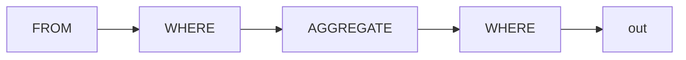
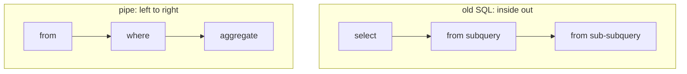
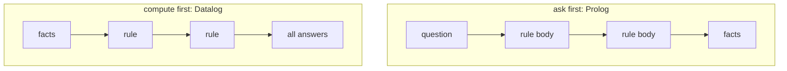
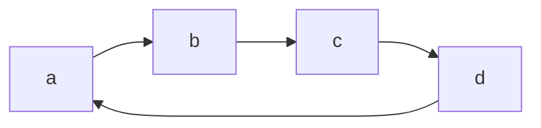
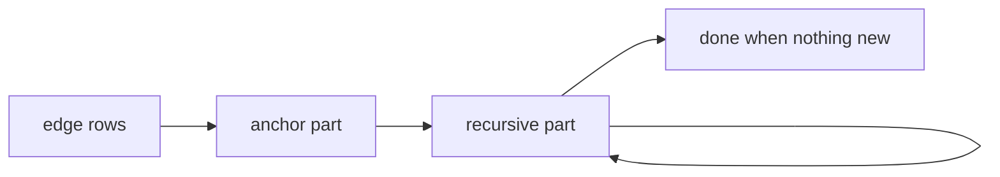
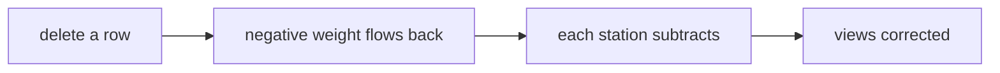
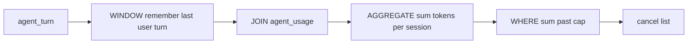

# Pipes and time for people who never read a datalog paper

## TOC

- What a pipe is
- Pipe operators one by one
- Order of thinking: ask first or compute first
- Prolog trace: the question path
- Datalog trace: the same path bottom up
- SQL trace: the engine version
- Tabling: the bridge
- RxJS words in table words
- What a stage may see
- Deleting a row
- The agent budget rule on real data
- Who already ships this

## What a pipe is

A query is a line of stations. Each station gets one table and hands one table to the next
station. Nothing else exists.

Old SQL runs inside out. Subqueries nest and the innermost box starts the work. The pipe
runs left to right and the eye follows the data.

- every station sees one table and returns one table
- any station can go after any station unless one station depends on another station's effect
- adding a station is adding a word to the line

Old SQL versus pipe:

## Pipe operators one by one

| Operator | Reads | Writes | Think |
|---|---|---|---|
| FROM | nothing | table | where the line starts |
| SELECT | table | table with fewer columns | cut columns |
| EXTEND | table | table with more columns | add a column |
| SET | table | table | replace a column |
| DROP | table | table | remove a column |
| RENAME | table | table | new names |
| WHERE | table | table | keep rows that pass |
| ORDER BY | table | table with an order | sort |
| LIMIT | table | table | cut rows |
| AGGREGATE | table | grouped table | squeeze a group into one row |
| JOIN | table | bigger table | glue two tables side by side |
| UNION | table | table | stack tables |
| DISTINCT | table | table | drop copies |
| WINDOW | table | table | compute over a neighborhood of rows |
| PIVOT | table | table | rows become columns |

Some stations swap places freely. Some never do.

| Pair | Swap ok | Why |
|---|---|---|
| WHERE and SELECT | mostly | a filter ignores columns it never reads |
| WHERE and AGGREGATE | no | the filter decides what is in each group |
| ORDER BY and anything after | no | later stations can destroy or use the order |
| LIMIT and anything between ORDER BY and LIMIT | no | an extra station changes which rows get cut |

## Order of thinking: ask first or compute first

Two families of brains live in logic languages.

- ask first brains take the question and walk down the rules toward facts
- compute first brains start from facts and push them up the rules until nothing new appears

Ask first computes only what the question needs. Compute first computes everything once
and then answers any question by lookup. Same rules. Different work.

## Prolog trace: the question path

Take a graph of edges and a question about reachability.

| Step | Trying | Result |
|---|---|---|
| one | direct edge a to d | missing |
| two | go via b | edge found |
| three | reach d from b | via c |
| four | reach d from c | direct hit |

Answer found. Keep walking and the same goal returns because the graph is a loop and
nothing remembers the steps already taken. Goal order and rule order decide whether the
walk finds anything or spins.

## Datalog trace: the same path bottom up

| Round | New rows this round | All rows |
|---|---|---|
| one | the four raw edges | four |
| two | paths of length two | eight |
| three | paths of length three | sixteen |
| four | nothing new | stop at sixteen |

Nothing new means done. The question is then a lookup. The loop in the graph caused no
spin because every pair was found once and recorded once. Rule order changes nothing.
When a rule says not something the engine splits the rules into layers and finishes a
lower layer before a layer that depends on it.

## SQL trace: the engine version

SQL wraps the same loop in a name.

- the anchor part seeds rows
- the recursive part joins the growing rows with the edge rows
- the loop ends when a round adds nothing
- which rows run in which round is up to the engine and results stay the same

## Tabling: the bridge

Tabling gives ask first brains a memory. When a goal is seen the first time its answers
go in a table. The next time the same goal appears it reads the table instead of walking
again. Loops stop. Answers match the compute first brain. SWI-Prolog spells the memory
one word at a time with a table directive.

## RxJS words in table words

RxJS is a library of stations for streams. Its stations map onto table words almost one
to one.

| RxJS word | Table word | In dl8 today |
|---|---|---|
| map | cut columns | yes |
| filter | keep rows | yes |
| mergeMap | join | yes |
| scan | running fold with state | yes |
| reduce | whole table to one row | yes |
| groupBy | group rows | yes |
| window and buffer | frame over a neighborhood | no |
| switchMap | cancel the last branch when the next arrives | no |
| debounceTime and throttleTime | rate limiting by time | no |
| distinct | drop copies | yes |
| merge | stack tables | yes |
| combineLatest | join on the newest row of each side | no |

No dl8 fixture spells any of these yet. The table above is the target shape.

## What a stage may see

The whole game is deciding what state one station may see.

| Station kind | Sees | Example |
|---|---|---|
| row station | one row and nothing else | WHERE |
| group station | one group plus its running state | AGGREGATE |
| order station | the whole table plus its order | ORDER BY then LIMIT |

Point free style means a station never names the table it receives. It just declares its
shape. A pipe is point free by construction. Languages disagree on ambient state:

- Haskell: a station gets its argument and nothing else. State must be passed in as a
  value or threaded by hand with the state monad.
- OCaml: same rule. Modules and mutable cells are the escape hatch.
- RxJS: a station may close over its own accumulator and that is the whole budget. Outside
  state has to flow in as values.

Worked trace with real values from the budget example further down:

| Stage | Sees | Emits |
|---|---|---|
| WHERE over usage rows | one row with its token count | rows over the small threshold |
| AGGREGATE per session | one session plus running sum | one row per session |
| WHERE on the sum | one row | sessions past the cap |

The small stations stay dumb. The one group station holds the only state. This split is
the whole contract.

## Deleting a row

Streams have no past. Tables do. When a row is deleted every station that ever saw it
owes a correction.

| System | Correction method |
|---|---|
| DBSP and Feldera | a delete is a row with weight minus one flowing through the circuit |
| differential dataflow | rows carry a difference count that can go negative |
| Materialize | views update automatically on any source change |
| sqlite_ivm | triggers capture old and new rows and fix results in the same transaction |
| dl8 | store only grows. Deletion has no spelling yet |

## The agent budget rule on real data

The agent database stores turns and token usage. Roles sit in a dictionary. The
dictionary says role one is the user.

Turn counts by role:

| Role | Rows |
|---|---|
| user | 73621 |
| assistant | 290049 |
| tool | 577813 |
| system | 5636 |
| developer | 8002 |

Question one: time since the last user message in each session. A window station walks
the turns in order and remembers the latest user timestamp.

| session | turn | row_ts | user_ts | since in ms |
|---|---|---|---|---|
| 1 | 2 | 1783132765373 | 1783132763834 | 1539 |
| 1 | 3 | 1783132768384 | 1783132763834 | 4550 |
| 1 | 4 | 1783132769247 | 1783132763834 | 5413 |
| 1 | 5 | 1783132770830 | 1783132763834 | 6996 |
| 1 | 6 | 1783132774117 | 1783132763834 | 10283 |

The run matched 871571 rows and its mean came out negative. Some timestamps disagree with
turn order. A real rule needs that cleaned first.

Question two: a session that spends past the cap before the next user message is
cancelled. Biggest spenders found:

| session | last user turn | tokens | verdict |
|---|---|---|---|
| 5422 | 3 | 7795214 | cancel |
| 6951 | 75 | 7508194 | cancel |
| 7165 | 3 | 5178745 | cancel |
| 7054 | 888 | 5161803 | cancel |
| 6929 | 3 | 4621851 | cancel |

The same logic as a pipe:

As a live stream the left end receives inserts as they happen and the right end emits a
cancel event. The pipe stays the same. Only the push changes.

## Who already ships this

| Project | Shape | Correction on delete | Rust friendly | Runs where |
|---|---|---|---|---|
| Flink SQL | streaming SQL | yes | no | JVM cluster |
| Beam | streaming model | yes | no | runners |
| Calcite | planner library | n/a | no | inside other systems |
| Spark Streaming | micro batches | yes | no | JVM |
| Kafka Streams and ksqlDB | stream processing | yes | no | JVM |
| Wayang | cross platform planning | weak | no | JVM |
| Materialize | streaming database | yes | no | server |
| Feldera | SQL compiled to circuits | yes | the circuit layer is Rust | server today library possible |
| RisingWave | streaming database | yes | yes | server |
| Timely dataflow | runtime library | by operator | yes | library |
| differential dataflow | incremental collections | yes by differences | yes | library |
| Noria | research cache dataflow | yes | yes | research code |
| DuckDB | embedded analytics | via SQL | C plus bindings | library |
| DataFusion and Ballista | Rust query engine | n/a batch | yes | library and scheduler |
| SQLite plus sqlite_ivm | transactional incremental views | yes | C core Rust extension | library |

Feldera compiles SQL to Rust shaped circuits. sqlite_ivm keeps results correct inside one
SQLite transaction. Those two carry the closest family resemblance to the goal.
