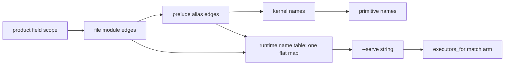

# v8 namespacing inspection

1. [Name spaces that exist today](#1-name-spaces-that-exist-today)
2. [Collision probes](#2-collision-probes)
3. [Candidate spellings for a qualified name](#3-candidate-spellings-for-a-qualified-name)
4. [What other systems do](#4-what-other-systems-do)
5. [Open decisions](#5-open-decisions)

Paths are from `v8/` unless they start with `plans/` or `hafley-rs/`. Probe programs live at `v8/book/src/probes/`, each compiled by `cargo test --test _22_book probes_compile_as_their_page_says`. Outputs come from `bash book/show.sh` with `DL8` at the release binary, base `256a140ed`.

## 1. Name spaces that exist today

Compile-time lookup walks left to right; the runtime table and the executor match see one flat string per relation.

| space | members | written at | read at | scope |
|---|---|---|---|---|
| product field scope | edges owned by a product, nested products | the declaration graph | `src/_2_lower/_10_index.rs:170-193` (`scoped`, owner then parent); `src/_3_check/_2_resolve.rs:70-77` | innermost product first |
| file module | top-level declarations of one file, owner `module(file(Path))` | `src/_4_comptime/_0_load/_2_project.rs:270-273` | same two resolvers | one file |
| directory module | one edge per file or subdirectory, labeled by module name, owner `module(directory(Path))` | `_2_project.rs:195-247`, name rule `:162-193` | `_2_resolve.rs:73-77` through parents | one project root |
| prelude | `prelude/*.dl7`, owner `module(prelude)` | `src/_8_driver/_0_read.rs:7-27` | aliased into each unit that does not bind the name, `src/_2_lower/_12_units.rs:310-342`, exporter `:475-492` | every unit |
| kernel names | `node` .. `int_ne`, plus `def`, `head`, `body` | `src/_2_lower/_9_kernel.rs:15-28`; `src/_3_check/_5_kernel.rs:16-37`, `:83` | `src/_2_lower/_8_express.rs:181-184` after scoped lookup; `_2_resolve.rs:78-83` at a module owner | global, after every edge |
| primitive names | `int`, `float`, `bool`, `text`, `any`, `type` | `src/_3_check/_5_kernel.rs:40-42` | `_2_resolve.rs:84-87` | global, last |
| runtime name table | every `(: module(_) Name ref(_) _)` edge of the root graph, prelude yields to non-prelude, two non-prelude refs stop | `src/_6_eval/_6_json.rs:178-221` | `serve_relations` `_6_json.rs:346-369`; `executors_for` `src/_9_runtime/_3_executors/mod.rs:46-100`; `store.name_relations` `src/bin/dl8.rs:316`, `:391`; `emit_sqlite` `src/bin/dl8.rs:231` | one program, flat |
| served executor names | string constants: `timer`, `fetch_json`, `fetch_json_error`, `soopy_refs`, `soopy_refs_error`, `soopy_history`, `soopy_history_error`, `repo_at`, `repo_at_error`, `extract`, `extract_error` | `_3_executors/timer.rs:12`, `fetch_json.rs:9-10`, `soopy_refs.rs:12-13`, `soopy_history.rs:10-11`, `repo_at.rs:10-11`, `extract.rs:14-15` | `_3_executors/mod.rs:61-100` | the binary |
| store table names | runtime table names passing `nameable` (letters, digits, `_`, `.`) | `src/_9_runtime/_0_store.rs:122-129` | `src/_9_runtime/_1_sqlite.rs:497-504` | one db file |
| prelude host declarations | `Hosted(relation, implementation)`, `HostPort(relation, label, direction)` | `prelude/1_declarations.dl7:292-305` | no reader in `src/` (`grep -rn Hosted src` prints nothing) | every unit |
| reader atoms | identifier chars include `-` and `.`; `/` and `::` are not atoms | `src/_0_read/_1_tokens.rs:16-38` | `src/_0_read/_2_reader.rs:397-402` | every file |

## 2. Collision probes

| probe | command | rc | output |
|---|---|---|---|
| user product named `intern` | `bash book/show.sh eval book/src/probes/3_user_intern.dl7` | 0 | `(intern "mine")` |
| user `intern` beside a rule calling the kernel `intern` | `bash book/show.sh compile book/src/probes/4_user_intern_kernel_goal.dl7` | 1 | `diagnostic diagnostic(lower, reader_node(book/src/probes/4_user_intern_kernel_goal.dl7, 36), arity_mismatch(intern, 1, 3))` |
| user `Option` without a return column | `bash book/show.sh compile book/src/probes/5_user_option_shadows.dl7` | 1 | `expression_without_return(target(owner(file(book/src/probes/5_user_option_shadows.dl7), reader_node(book/src/probes/5_user_option_shadows.dl7, 3))))` |
| field typed `bool` | `$DL8 compile book/src/probes/17_bool_field.dl7` then the edge renderer in `book/src/modules/1_names.md` | 0 | `(: Holder flag bool)` (prelude product, `prelude/5_tsi_primitives.dl7:55`); `(: Holder count primitive(int))` |
| user product named `timer`, read by a rule, no `--serve` | `bash book/show.sh run book/src/probes/9_user_timer_rule.dl7 --max-ticks 2` | 0 | `(Want "mine")`, `ticks 0` |
| same, `--serve timer` | `bash book/show.sh run book/src/probes/9_user_timer_rule.dl7 --serve timer --max-ticks 2` | 0 | `(effect timer ref(application(timer, ["mine"])))`, `(Want "mine")`, `ticks 0`: the Rust timer binds to the user's one-column `timer` and skips the text value (`_3_executors/timer.rs:140-148`) |
| two modules declaring `User` | `bash book/show.sh compile book/src/probes/6_user_a.dl7 --project book/src/probes book/src/probes/7_user_b.dl7` | 1 | `diagnostic duplicate_relation_name(User, ref(owner(file(book/src/probes/6_user_a.dl7), reader_node(book/src/probes/6_user_a.dl7, 3))), ref(owner(file(book/src/probes/7_user_b.dl7), reader_node(book/src/probes/7_user_b.dl7, 3))))` |
| a third module reading `(: user_a User ?T ?I)` | `bash book/show.sh compile book/src/probes/8_pick_user_a.dl7 --project book/src/probes book/src/probes/6_user_a.dl7 book/src/probes/7_user_b.dl7` | 1 | the goal resolves to `6_user_a.dl7`'s `User`: `(ref(owner(file(book/src/probes/8_pick_user_a.dl7), reader_node(book/src/probes/8_pick_user_a.dl7, 3))) ref(owner(file(book/src/probes/6_user_a.dl7), reader_node(book/src/probes/6_user_a.dl7, 3))))`; then the same `duplicate_relation_name(User, ...)` |
| a relation named like a module | `bash book/show.sh compile book/src/probes/12_relation_named_accounts.dl7 --project book/src/probes book/src/probes/10_accounts.dl7` | 1 | `diagnostic duplicate_relation_name(accounts, ref(module(file(book/src/probes/10_accounts.dl7))), ref(owner(file(book/src/probes/12_relation_named_accounts.dl7), reader_node(book/src/probes/12_relation_named_accounts.dl7, 3))))` |
| bare `User` from another user module | `bash book/show.sh compile book/src/probes/18_bare_consumer.dl7 --project book/src/probes book/src/probes/10_accounts.dl7` | 1 | `diagnostic diagnostic(lower, reader_node(book/src/probes/18_bare_consumer.dl7, 14), undeclared_relation(User))` |
| dotted relation name | `bash book/show.sh eval book/src/probes/19_dotted_name.dl7` | 0 | `(boop.lane "sprefa-coordinator")` |
| dotted name served | `bash book/show.sh run book/src/probes/19_dotted_name.dl7 --serve boop.lane` | 1 | `diagnostic served_relation_no_executor(boop.lane)` |
| `/`, `:` and `::` inside a name | `printf '(: accounts/User\n   (* (: id int)))\n' > /tmp/ns.dl7 && bash book/show.sh compile /tmp/ns.dl7` (and `accounts:User`, `accounts::User`) | 1 | `invalid_atom(accounts/User)`, `invalid_atom(accounts:User)`, `invalid_atom(accounts::User)` |

## 3. Candidate spellings for a qualified name

Files a spelling touches: reader `src/_0_read/_1_tokens.rs`, `_2_reader.rs`; lowerer `src/_2_lower/_8_express.rs:155-186`, `_10_index.rs:170-193`, `_12_units.rs:310-342`; checker `src/_3_check/_2_resolve.rs:47-90`; name table `src/_6_eval/_6_json.rs:178-221`; executors `src/_9_runtime/_3_executors/mod.rs:46-100`; prelude `prelude/*.dl7`. "Pinning fixture" names a file that does not exist yet.

| spelling | example | reader | lowerer | checker | name table | executors_for | prelude | pinning fixture |
|---|---|---|---|---|---|---|---|---|
| A. prefix by convention (today) | `boop_lane`, `soopy_refs_error` | none | none | none | none | one arm per name | none | exists: `fixtures/hosts/0_refs.dl7` |
| B. dotted atom, flat | `boop.lane` | none, already an atom (`_1_tokens.rs:17`) | none | none | none, key is the whole text | one arm per dotted name | none | `book/src/probes/19_dotted_name.dl7` compiles today; a served one needs `fixtures/hosts/5_dotted_serve.dl7` |
| C. dotted atom, split to module plus name | `accounts.User` resolves the edge `User` of module `accounts` | none | split before `scoped` | split before `resolve_name` | key by owner module and name | match on the last segment, or the whole text | a dotted prelude name such as `prelude.Option` needs the prelude to be a named module | `oracle/compile/sources/test/fixtures/modules/3_dotted_consumer.dl7` |
| D. graph goal only, table keyed by owner | `(: accounts User ?T ?I)` in source (exists, `modules/1_consumer.dl7:5`); `--serve accounts/User` on the CLI | none | none | none | key by `(module, name)`, stop on duplicate only inside one module | read `module/name` | none | `book/src/probes/8_pick_user_a.dl7` flips from `duplicate_relation_name` to rc=0 |
| E. Prolog-style colon | `accounts:User` | new token; conflicts with the label suffix `name:` (`_1_tokens.rs:32-36`) and infix `(label: T)` (`src/_0_read/_4_expand.rs:163-185`) | new goal form | new name term | key by module | read `module:name` | none | `oracle/compile/sources/test/fixtures/modules/3_colon_consumer.dl7` |
| F. import form | `(use accounts User)` or `(use boop)` | none, an ordinary form | `_12_units.rs:310-342` generalized: a user module becomes an exporter for the named importer | none | still flat unless combined with D | none | none | `oracle/compile/sources/test/fixtures/modules/3_use_consumer.dl7` |
| G. binding through `Hosted` rows | `(Hosted boop_lane BoopLaneExecutor)` | none | none | none | none | read `Hosted` rows instead of string arms | `prelude/1_declarations.dl7:298-300` already declares it | `fixtures/hosts/5_hosted_binding.dl7` |
| H. kernel names reserved | a user `(: intern ...)` becomes a diagnostic | none | a reserved-name check in declaration lowering | none | none | none | the prelude writes rules with kernel heads (`prelude/3_derived_rules.dl7` heads `:`, `node`, `product`, `def`, `head`, `body`), so the check would exempt `module(prelude)` | `book/src/probes/3_user_intern.dl7` flips to a diagnostic |

## 4. What other systems do

| system | qualified name | source |
|---|---|---|
| SWI-Prolog modules | `Module:Goal` calls a predicate in that module whether or not it is exported; `use_module/2` imports exported predicates | `https://www.swi-prolog.org/pldoc/man?section=overrule` ("?- world:done. % calls done/0 in module world") |
| SQL | `schema.table`; SQLite names an attached database the same way, `aux.users` | `https://www.sqlite.org/lang_attach.html` |
| rxjs | no names of its own; ES module `import { x } from` scopes identifiers | the language, not the library |
| Soufflé components | `.init myInstance1 = MyComponent`, then `myInstance1.TheAnswer(x)`: "The qualified names of component elements are prepended using the name of the instantiation" | `https://souffle-lang.github.io/components` |
| CozoDB | stored relations are one flat space per database read as `*name`; `_name` marks an ephemeral relation, `r:idx` names an index of `r`, `::` prefixes system operations | `https://docs.cozodb.org/en/latest/stored.html` |
| Logica | `import examples.scripts.queen_victoria.Parent as RoyalParent;` imports one predicate by dotted file path, with an optional alias | `github.com/EvgSkv/logica` at `8ca7a3e`, `examples/scripts/closure_use.l:14` |

## 5. Open decisions

| decision | rows it selects among |
|---|---|
| does a user declaration take a kernel name, or is that a diagnostic | section 3, A versus H |
| does a user declaration shadow a prelude name silently (today: yes, `5_user_option_shadows.dl7`, `17_bool_field.dl7`) | section 2 |
| is the runtime name table flat or keyed by module | section 3, B versus C and D |
| which text qualifies a name in source: dot, colon, graph goal, or an import form | section 3, B to F |
| how a served name reaches an executor: a string arm or a `Hosted` row | section 3, A versus G |
| does a served relation's declared shape get checked against its executor's columns (today: no, `9_user_timer_rule.dl7`) | section 2 |
| does one module see another user module's names without a qualifier (today: no, `18_bare_consumer.dl7`) | section 3, F |

decision: Chris
