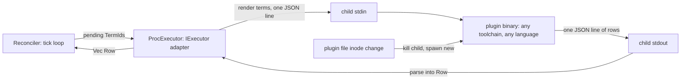

# v8: measured cost of four ways to host an executor outside the dl8 crate

1. [Decision table](#1-decision-table)
2. [How rows move for the winner](#2-how-rows-move-for-the-winner)
3. [Unmeasured](#3-unmeasured)

Trait under test: `IExecutor` (`v8/src/_9_runtime/_2_reconcile.rs:21-32`), reduced to `answer(["a","b"]) -> [["a","v1:a"],["b","v1:b"]]`.
Scratch crates: `/private/tmp/claude-501/plugin-abi/{P,L,S,Y,W}`, harness `common/bench.rs`, battery `measure.sh`, raw log `m_all.log`. Nothing lands in `v8/`.

## Commands

| key | command |
|---|---|
| c-cold | `cargo clean && date +%s.%N && cargo build --release && date +%s.%N` |
| c-incr | `touch src/main.rs && date +%s.%N && cargo build --release && date +%s.%N` |
| c-crates | `cargo tree --prefix none --no-dedupe \| grep -oE '^[a-z0-9_-]+ v[0-9.]+' \| sort -u \| wc -l` |
| c-bytes | `/usr/bin/stat -f %z <artifact>` |
| c-bench | `host <v1 artifact> <v2 artifact> <workdir>`: 1000 warm calls asserting v1 rows, 10000 timed `answer` calls (`Instant` per call, sorted, index 5000 and 9900), then atomic `rename` of v2 over `current`, loop polls inode, reloads, stops at first `v2:` row |
| c-fresh | c-bench fallback when same-path reload still returns v1 rows after 5 s: `copy v2 -> fresh.<ext>`, drop v1, load `fresh` |
| c-cross | `cargo +nightly build --release --target-dir target-nightly` (rustc 1.100.0-nightly 17fd5b8a3) host, loading the stable (rustc 1.98.0 88d9e12ae) plugin, c-bench |
| c-exec | `cp v1_plugin p$i` then `subprocess.run` it twice, `time.perf_counter` around each |

Env for every build: clean `env -i` wrapper (`cg`), stable toolchain, per-crate target dir, `jobs = 4` from `~/.cargo/config.toml`, 12 cores, load average 4.1 to 4.6 during the battery.

## 1. Decision table

Cells: median of 3 runs, range in parentheses. Y is the `stabby` second row of S.

| id | mechanism | crates | host cold s (c-cold) | host incr s (c-incr) | host crates (c-crates) | host bytes (c-bytes) |
|---|---|---|---|---|---|---|
| P | child process, JSONL on stdio | std | 0.36 (0.35-0.36) | 0.31 (0.31-0.31) | 1 | 542752 |
| L | cdylib, C ABI | `libloading` 0.9 | 0.44 (0.43-0.44) | 0.31 (0.30-0.32) | 3 | 500560 |
| S | cdylib, `#[sabi_trait]` + `RBox` | `abi_stable` 0.11.3 | 9.51 (9.41-9.61) | 0.35 (0.35-0.36) | 40 | 986208 |
| Y | cdylib, `#[stabby::stabby]` trait + `dynptr!(Box<dyn _>)` | `stabby` 72.1.16, `libloading` 0.9 | 16.93 (16.76-17.16) | 0.30 (0.30-0.37) | 23 | 521888 |
| W | wasm component, WIT `list<tuple<string,string>>` | `wasmtime` 47 (`runtime,cranelift,component-model,std`), `wit-bindgen` 0.57 | 61.81 (61.32-63.00) | 0.70 (0.70-0.84) | 96 | 13857424 |

Build cost, host side.

| id | plugin cold s (c-cold) | plugin crates (c-crates) | plugin artifact bytes (c-bytes) | extra build step |
|---|---|---|---|---|
| P | 0.25 (0.24-0.26) | 1 | 453920 | none |
| L | 0.19 (0.18-0.20) | 1 | 387760 | none |
| S | 9.50 (9.30-9.68) | 40 | 511328 | none |
| Y | 17.44 (16.84-18.11) | 23 | 407920 | none |
| W | 7.90 (7.81-7.97), `--target wasm32-unknown-unknown` | 36 | 24744 core, 25167 component | `componentize` (`wit-component` 0.259): tool cold 17.28 (17.21-17.33) s once, 27 crates, 0.20 s per run |

Build cost, plugin side.

| id | p50 ns (c-bench) | p99 ns (c-bench) | reload ms, swap to first v2 row | same path reloads | v1 dropped first |
|---|---|---|---|---|---|
| P | 4833 (4792-6958) | 13041 (11125-14250) | 142.0 (141.8-142.1) | yes | yes, child killed before spawn |
| L | 750 (292-1375) | 917 (375-2042) | 152.5 (149.3-154.5), c-fresh | no, v1 image still mapped after `dlclose` (`dlopen RTLD_NOLOAD` non-null) | yes, symbols borrow the `Library` |
| S | 208 (208-208) | 250 (250-250) | 146.1 (146.0-146.5), c-fresh | no, `lib_header_from_path` leaks the library | no, v1 never unmapped |
| Y | 292 (292-292) | 375 (334-375) | 141.7 (141.4-146.4), c-fresh | no, v1 rows after 5 s | yes, trait object before `Library` |
| W | 625 (625-1083) | 750 (750-1292) | 12.6 (12.5-19.1), includes cranelift compile | yes | no, v1 and v2 instances coexist |

Runtime cost. L runs 2 and 3 of p50 differ by 4.7x under lane load; S and Y did not move.

| id | what crosses | ABI risk, c-cross result | verdict |
|---|---|---|---|
| P | strings (JSON lines on a pipe) | rustc-independent; c-cross rows correct, p50 4708 p99 11208 | take |
| L | `#[repr(C)]` structs of C strings | no load-time check; a struct edit on one side is silent UB; c-cross rows correct | drop |
| S | trait objects (`Executor_TO<'static, RBox<()>>`, `RVec<Tuple2<RString,RString>>`) | layout checked at `init_root_module`; c-cross passed the check, rows correct | drop |
| Y | trait objects (`dynptr!(Box<dyn Executor>)`, stabby `Vec`/`String`) | type report checked at `get_stabbied`; c-cross passed, rows correct | drop |
| W | wasm linear memory, lifted by the canonical ABI | rustc-independent; c-cross rows correct, p50 958 p99 1125 | runner-up |

Boundary and verdict. Reload near 142 ms for P, L, S, Y is macOS first exec or first map of a never-seen file: c-exec gave first/second 161.2/2.0, 148.3/2.2, 171.7/2.2 ms.

## 2. How rows move for the winner

Rows for one `answer` call; reload is the bottom edge.

## 3. Unmeasured

| item | why |
|---|---|
| `poll(timeout)` path (reader thread plus `recv_timeout` for P, host-side clock for W) | harness times `answer` only |
| `Universe` term rendering and `Row` building inside a real adapter | scratch crates carry `&str`, no `dl8` link |
| payload scaling past 2 rows | one payload shape per brief |
| plugin panic or crash while the host loops | not injected; P isolates by process, L/S/Y share the address space, W traps |
| W with IO (`wasmtime-wasi`) | plugin imports nothing; soopy, extract and scip executors do IO, so crate count and host bytes rise by an unmeasured amount |
| L, S, Y same-path reload on Linux | macOS only; the 142 ms first-exec check is macOS-specific (c-exec) |
| wasmtime default features | host built with the four features listed; defaults not built |
| host and plugin with mismatched interface crate versions | only rustc versions crossed, interface source identical on both sides |
