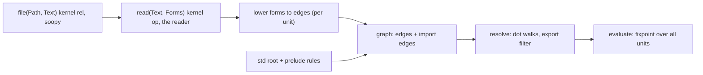
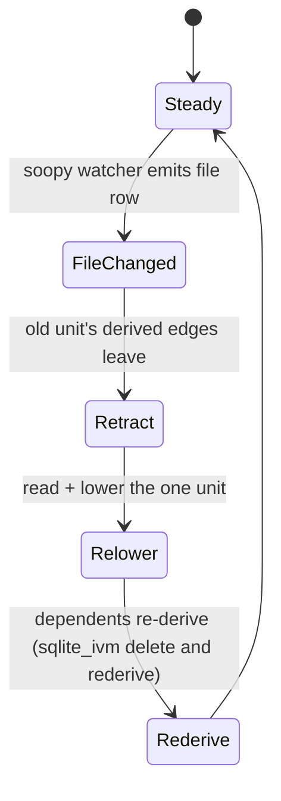

# Modules, future sight

Status: design sketch, user in the room (2026-09-16). Nothing here is built.
Decisions marked `user:` are Chris's words from this session or the ledger;
everything else is a candidate.

## Contents

1. Vocabulary
2. One project, drawn
3. Constructs, each with its rows and its rx lowering
4. Load pipeline
5. Reload loop
6. What exists, what is missing
7. Open, needing Chris

## 1. Vocabulary

| word | meaning | today |
|---|---|---|
| node | an interned term the graph hangs edges off | `Universe` term |
| edge | `(: Owner Label Target Index)` row | `pending_edge/4`, `_12_units.rs:379-395` |
| file node | a node the project grapher mints per file | `dl7_unit(file(Path))`, port of `0b_filesystem_grapher.pl` |
| module node | a file node whose top-level edges are the file's declarations | `unit_module_owner`, `_12_units.rs:21` |
| std root | a directory node the prelude environment binds under the name `std` | missing |
| annotation | an edge that returns its args and stays in the graph (`:\2`) | user 2026-09-16 |
| kernel rel | a relation the runtime serves from Rust, never declared in dl7 | `soopy_refs`, `soopy_history` executors |

user: `module(name)` is an ordinary node; members are `:` edges; no module row kind.
user: `pub` is an annotation.
user (2026-09-17, supersedes the 09-16 `(import <name> "<path>")` spelling): the
import form is the edge form, `(<local-name>: (import "<path>"))`, infix, e.g.
`(api: (import "@std/oai"))`. `import` is a comptime call returning a module
node; the `:` edge is the only binding. A form never declares a name inside its
own argument list. `@std/` is the one magic alias; every other path is ordinary,
resolved from the compiler cwd (which may be `~/`).
user: a soopy-served kernel rel for files is acceptable as the base.

## 2. One project, drawn

```
proj/
  0_app.dl7
  modules/0_accounts.dl7
std/
  openapi.dl7
```

```mermaid
flowchart LR
  proj["proj (dir node)"] -->|app| app["0_app.dl7 (module node)"]
  proj -->|modules| mods["modules (dir node)"]
  mods -->|accounts| acc["0_accounts.dl7 (module node)"]
  std["std (root, prelude-bound)"] -->|openapi| oa["openapi.dl7 (module node)"]
  app -->|api, (api: (import "@std/oai"))| oa
  app -->|accounts, import edge| acc
  oa -->|route| route["route (relation)"]
  acc -->|User| user["User (shape)"]
```

Every arrow is one `:` row. The two labelled "import edge" are written by the
program; the rest come from the grapher and from lowering each file.

## 3. Constructs

| written in `0_app.dl7` | rows it becomes | resolves by | rx lowering |
|---|---|---|---|
| `(api: (import "@std/oai"))` | `(: app api <oa-node> 0)`, the module node the comptime call returned | `import` is a comptime call (hosted rel, `return` = module node); `@std/` is the one alias, any other path is relative to the compiler cwd or absolute; alias rules live in the prelude so userland can add its own | `of(oaNode)` bound under `api` in the unit's scope |
| `(api.route ?M ?P)` | goals `(: app api ?X ?I0)` `(: ?X route ?R ?I1)` then call `?R` | dot walk, `_8_express.rs` `lower_path_walk` (r4) | `scope.api.pipe(map(n => n.route), switchMap(rel => rel(M, P)))` |
| `(pub route)` in `openapi.dl7` | `(pub oa route)` annotation row | nothing, it is data | `of(['pub', oa, 'route'])` |
| `(<- (export ?Mod ?Name ?T) (: ?Mod ?Name ?T ?I) (pub ?Mod ?Name))` in the prelude | derived rows | ordinary rule | `combineLatest([edges, pubs]).pipe(map(join))` |
| `(<- (imports ?A ?B) (: ?A ?_ ?B ?_) (module ?B))` in the prelude | derived rows | ordinary rule | `edges.pipe(filter(e => isModule(e.target)))` |
| `(<- (reaches ?A ?C) (imports ?A ?B) (reaches ?B ?C))` | closure | fixpoint | `expand(imports)` |
| `(<- (import_cycle ?A) (reaches ?A ?A))` | diagnostic rows | rule | `reaches.pipe(filter(r => r.a === r.c))` |

user 2026-08-09: alias is additive; inner alias private; `pub` for outward.
Rule 4 in the table is where "private" lives: resolve through an import edge
consults `export`, never the raw edge set.

## 4. Load pipeline



No load order: evaluation is a fixpoint, so units join in any order. Only
macro expansion is per unit and runs inside `lo`.

## 5. Reload loop



Executors keep their served ids across the swap when the name survives
(inspection section 5, fork "executor state on reload").

## 6. What exists, what is missing

| piece | exists | missing |
|---|---|---|
| file and directory nodes with edges | grapher port, `_12_units.rs` | a `std` root bound in the prelude environment |
| module node per unit, top-level edges under it | `_12_units.rs:21-60` | an import edge whose target is a module node resolving as a scope |
| dot walk | r4 `_8_express.rs` `lower_path_walk` (PR #783) | nothing |
| implicit all-units alias | `_12_units.rs:310-342` | user 2026-09-16: retire it for program units; prelude only |
| annotation edges | `:\2` form, user-decided | resolve reading `pub` rows |
| file rows | soopy `_8_watch.rs:28, :357` (watchers), `soopy_refs`/`soopy_history` executors | a `file(Path, Text)` kernel rel and executor |
| reader as a kernel op | `_0_read`, `syntax_atom` at macrotime (`_1_reify.rs:93`) | `read/2` served to programs |
| rounds re-entering rows | `_2_rounds.rs:281-295` | a round triggered by a file row at runtime |
| retraction | sqlite_ivm delete-and-rederive (`1a_relational.rs:725`) | evaluator tables are append-only (`_6_eval/_3_table.rs:1-3`) |
| openapi, tsi relations | loaders mint dotted names (`_9_openapi.rs:13`) | `std/openapi.dl7`, `std/tsi.dl7` as dl7 files seeded by executors |
| module graph rows | v6 shipped `module_edge_decl` etc, unused | the prelude rules in section 3 |

## 7. Open, needing Chris

| question | candidates |
|---|---|
| path resolution | user 2026-09-17: `@std/` alias, else ordinary path from the compiler cwd (may be `~/`). Closed. |
| does an import edge alias bare names | user 2026-09-16: no. The local name is the only binding; bare splice is gone for program units |
| where `std` lives | user 2026-09-17: behind the `@std/` alias; the alias rule is prelude, so the on-disk root is one rule. Closed. |
| executor seeds for std modules | user 2026-09-17: `(oai.document "path")` inside `@std/oai.dl7`, executor fills rows; no CLI flag. Closed. |
| cycles | user 2026-09-17: diagnostic row `import_cycle`. Closed. |
| reload unit | user 2026-09-17: one file; dev server = comptime loop kept running, reuses runtime retraction. Closed. |

## 8. Candidate, 2026-09-17: multi-return via ordinal `^`

`^` marks the subterm a form evaluates to (AGENTS.md, 09-17 rows). Chris:
"we could do multi ^ but its named by the id or like a group by 1,2".

`(User: (* (^1 id: int) (a: text) (^2 b: str)))` gives return positions
`[0, 2]`; the key set is every other position (`_2_declare.rs:293-298`,
`except` becomes a set). Goal form needs nothing else. Value position holds
one term, so a multi-return call needs one of:

| call site | reads as | cost |
|---|---|---|
| `^1` is the default, `(User "x").b` for the rest | SQL `GROUP BY 1` | call value as a node for the dot walk, `edge_ref`-shaped, not built |
| `(User "x" ^2)` | jq select | `^` in a second reader position |
| goal form only, value position is `ambiguous_return` | strict | none |

Bare `^a` `^b` order by edge index. Ordinals only change the return order.
Same question as the 09-16 footnote "call-site output selection".
user 2026-09-17: fork A now (one `^` per level, second is `ambiguous_return`);
fork B (call-site select) is the intended end state, not dropped. `^` today is a
DRY aid for relational forms, not the return design.
