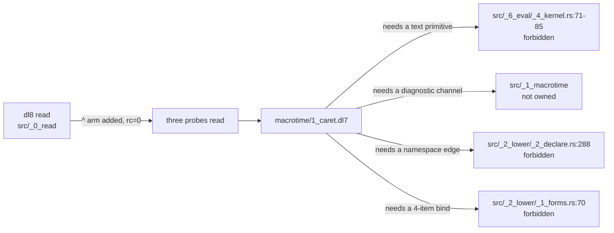

# Caret macro: stop and report

The `^` arc cannot be built as `macrotime/1_caret.dl7`. Four capabilities the
brief assumes are absent from dl8, and each one sits in a file the brief's
section 6 forbids this lane from touching.

## Contents

1. Where it stands
2. The four missing capabilities
3. What each probe does today
4. Why the reader arm cannot ship alone
5. The forks, for Chris

## 1. Where it stands

Landed on the branch: the reader arm, the three probes, this doc. Not landed:
`macrotime/1_caret.dl7`, the oracle cases, the book section. None of them can be
written without a decision from Chris.

## 2. The four missing capabilities

| # | capability the brief assumes | where it would live | what is there now |
|---|---|---|---|
| 1 | `str.cons` splits `"^result"` into `"^"` and `"result"` | `src/_6_eval/_4_kernel.rs:71-85` | the kernel op table is `nil cons edge_ref intern int_lt int_le int_eq int_ne int_ge int_gt int_add term_lt count_step min_step max_step`. No text op at all. `str.cons` is decision AGENTS.md:84, unbuilt. |
| 2 | a macro rule authors `ambiguous_return(<form>)` | `src/_1_macrotime/` | macrotime diagnostics come from a fixed Rust set: `_3_rewrite.rs:122` `conflicting_macro_claims`, `:133` `non_dense_expansion_ordinals`, `:138` `unknown_expansion_output`, `_4_expand.rs:162` `expansion_cycle`, `:177` `expansion_round_limit`. A dl7 macro has no channel. |
| 3 | a member edge owned by a product that is not a column | `src/_2_lower/_2_declare.rs:288` | `constructor_relations` does `arity += 1` for every edge whose owner is the product. An open namespace edge beside the closed tuple (AGENTS.md:107) changes arity. |
| 4 | `(: User greet (<- ...))` lowers | `src/_2_lower/_1_forms.rs:70` | `bind_form` takes forms of exactly 3 items. A 4-item `:` form is not a bind and reaches no owner. |

Capability 1 blocks every probe: with no way to read the `^` back off
`(syntax_atom ?Node ?Text)`, no claim rule can fire.

## 3. What each probe does today

Measured against `plans/v8/probes/2026-09-17-caret-*.dl7` with the reader arm in
place.

| probe | `dl8 read` | `dl8 compile` | what actually happens |
|---|---|---|---|
| reparent | rc=0, 3 top-level terms | rc=1, `expected_call` at reader_node 8 | `(edge): (body)` is not one form. The infix colon at `src/_0_read/_4_expand.rs:169-174` fires only inside a form, so the bare top-level `:` reaches lower as a call. The AGENTS.md:105 spelling `((Name: T): (body))` is the one that groups. |
| return collect | rc=0 | rc=0, 834 rows, no diagnostic | a column is minted under the literal name `^result`. |
| ambiguous return | rc=0 | rc=0, 834 rows, no diagnostic | two columns named `^a` and `^b`. |

Two further shapes, measured:

| shape | result |
|---|---|
| `(: greet (<- ...))`, a labelled rule | `undeclared_relation(<-)`, matching AGENTS.md:92 |
| a bare `(<- ...)` nested inside `(* ...)` | `expected_bind`, `src/_2_lower/_2_declare.rs:339` |
| the brief's after-form `(: User greet (<- ...))` | `undeclared_relation(<-)`; a 4-item `:` is not a bind |
| the brief's probe-2 after-form `(: Pick (* (: source type) (: names any) (: result type) (: return result)))` | rc=0, 835 rows. The target shape is sound; only the rewrite that reaches it is missing. |

## 4. Why the reader arm cannot ship alone

Before the arm, `^result` is a reader diagnostic, `invalid_atom(^result)`.
After the arm and with no macro to consume the caret, the same source compiles
rc=0 and mints a column named `^result`. A clear error becomes a silently wrong
program. The arm is correct and every fork below needs it, and it is safe only
once something downstream consumes the caret.

It is the last commit on the branch so it drops with one `git revert`.

## 5. The forks, for Chris

Each fork settles language design, so none is a lane's call.

| fork | change | cost | what it buys |
|---|---|---|---|
| A. text kernel op | add `str.cons` to `src/_6_eval/_4_kernel.rs`, two-way, per AGENTS.md:84 | one kernel op plus its eval arm; refreezes the eval oracle | the brief's mechanism verbatim; also pays off the `str.cons` decision, which probe 1 already writes and nothing implements |
| B. `^` as a delimiter | add `^` to `term_delimiter` in `src/_0_read/_1_tokens.rs`, so `(: ^result type)` lexes as the 4-item `(: ^ result type)` | reader only, the file this lane owns | the macro matches `(syntax_atom ?Caret "^")` with no text op, and the claim stays nameable so `macro_dispatch` keeps its fast path. Changes what `^` is: a token, not a prefix |
| C. `^x` reads as a form | `read_bare` emits `(^ x)`, the way `a.b` emits `(. a b)` at `src/_0_read/_2_reader.rs:372` | reader only | same win as B, and `^` composes with the dot path. Changes `dl8 read` output shape |

Forks B and C leave capabilities 2, 3 and 4 open. They are enough for the return
collect alone, and not for `ambiguous_return` or for the reparent.

Ordering that follows from the measurements:

1. pick a fork for reading `^` back (A, B or C)
2. decide the diagnostic channel, so a dl7 macro can author `ambiguous_return`
3. decide the namespace edge, which is the reparent and the larger of the two

Steps 1 and 2 finish the return collect and `ambiguous_return`. Step 3 is the
open-namespace-edge design AGENTS.md:107 names, and it is a lower arc, not a
macro one.
