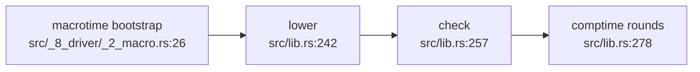

# Keys in userland: two stop-and-reports

Branch `feat/keys-defaults-userland`, base `8d5b51851`. The defaults half of the
brief landed. Two rows did not, and both need Chris.

## Contents

1. [Stop one: `relation/3` cannot leave Rust yet](#stop-one)
2. [Stop two: `column_type_mismatch` has no primitive-class goal](#stop-two)
3. [What landed instead](#what-landed)

## Stop one

`relation/3` is read at lower and at check. Neither phase has a comptime round
before it, so a prelude rule that derives `relation/3` cannot answer either one.

### The phase order



The macrotime bootstrap is itself `compile_units`, so it runs the same three
phases before the user program is read. No round precedes a check anywhere.

### The two consumers

| consumer | site | what it reads | phase |
|---|---|---|---|
| value-position call | `src/_2_lower/_8_express.rs:236` | `cx.relations`, filled from the `relation/3` rows `constructor_relations` mints | lower |
| value-position mode gate | `src/_2_lower/_8_express.rs:534` | the `Keys` field of the same row | lower |
| call arity resolution | `src/_3_check/_0_api.rs:151-161` | `basement.relations` as `Cx { relations }` | check |

### Measured

Each row is a build of this tree with the named edit, then the named command.

| edit to `_2_declare.rs` | probe | result |
|---|---|---|
| `constructor_relations` returns no rows | `dl8 compile plans/v8/probes/2026-09-17-keys.dl7` | `diagnostic(lower, reader_node(macrotime, 160), undeclared_relation(owner(macrotime, reader_node(macrotime, 105))))` |
| the same | `cargo test --test _3_lower_oracle` | `FAILED. 0 passed; 1 failed` |
| `key_sets` emptied, arity kept | `dl8 compile plans/v8/probes/2026-09-17-keys.dl7` | rc=0, no diagnostic; the probe has no value-position call |
| the same | a product plus `(Alias: (User "x"))` | `diagnostic(lower, .., ambiguous_expression_projection(User, supplied([0]), keys([]), return(1)))` |
| the same | `cargo test --test _8_compile_oracle` | `FAILED`, `applications-dl6-0_catalog: compiler_rows differs` |

The tree is back at its committed state; none of these edits is in the branch.

### The fork

`relation/3` is needed to check the rules that would derive `relation/3`. The
bootstrap needs a first answer from somewhere. The shapes, none decided:

| shape | what changes |
|---|---|
| check stops reading `relation/3` | arity comes from the `def` rows and the edge count instead; the `Keys` field stays for the mode gate |
| lower emits a seed relation row | the Rust loop stays for the prelude's own products only, and userland derives every other |
| the phase order gains a round | a prelude-only round runs before check, and `evaluate_checked` takes something weaker than a `Checked` |

The repo law reserves this for Chris: "Lang design happens with Chris in the
room" (`CLAUDE.md`), and the brief's own row says to stop and report when the
check sites run before any round.

## Stop two

`column_type_mismatch` needs the primitive class of a literal. Userland cannot
name it.

### The case

`(: n (text 3))` declares a column whose type is `text` and whose default is the
integer `3`. Both facts derive:

| relation | row |
|---|---|
| `column_value` | `(User, n, application(primitive(text), [3]))` |
| `column_type` | `(User, n, primitive(text))` |
| `default` | `(User, n, 3)` |

The compile is clean. Nothing in the prelude can say that `3` is an `int`.

### Why the brief's rule does not fire

```dl7
(<- (column_type_mismatch ?Product ?Name ?Expected ?Found)
    (column_type ?Product ?Name ?Expected)
    (column_value ?Product ?Name ?Found) (not (Conforms ?Found ?Expected ?_)))
```

`column_type` is derived from the value node's own constructor, so `?Expected`
and `?Found`'s constructor are the same term and the goal never fails.
`Conforms` takes two type nodes (`prelude/4_type_algebra.dl7:3`), so a literal
cannot stand in either slot. `column_value` is used but never defined.

### What is missing

| candidate | site | cost |
|---|---|---|
| a `Literal` row for each construction argument | `prelude/1_declarations.dl7:141` declares `Literal(node, primitive, raw)`; `src/_2_lower/_6_partial.rs:228` already emits one for a partial call | `lower_construction` returns goals, not rules, so the Curry-style rule block has to reach it |
| a kernel goal naming a term's class | the op table is `src/_6_eval/_4_kernel.rs:71-85` and has no type test | a new kernel relation |

Both are new mechanism. The brief's laws close language design for this lane.

## What landed

| step | state |
|---|---|
| probes | `plans/v8/probes/2026-09-17-keys.dl7`, `2026-09-17-defaults.dl7` |
| `(text "untitled")` and `(: n 3)` lower to a value node | `src/_2_lower/_8_express.rs`, `_5_derived.rs`, `_1_forms.rs`, `_2_declare.rs` |
| `column_value`, `column_type`, `default` | `prelude/1_declarations.dl7`, `prelude/3_derived_rules.dl7` |
| `HistoryV1` reads its option through `default` | `prelude/2_constructor_rules.dl7` |
| regoldens | the oracle cases listed in commit `b51996506`, and `fixtures/openapi/expected_rows.json` |
| the book page | `book/src/2_declare.md` |

The Rust column type pass the brief asks to remove does not exist: `grep -rn
'column_type' src/` returns nothing on the base commit.
