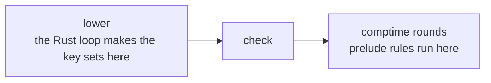

# Keys in userland: what stopped, in plain words

## Contents

1. [Defaults work now](#defaults-work-now)
2. [Keys did not move](#keys-did-not-move)
3. [The wrong-type check needs one more thing](#the-wrong-type-check)
4. [Your two calls](#your-two-calls)

## Defaults work now

You can write this and it compiles:

```
(User: (* (: name text)
          (: title (text "untitled"))
          (: n 3)
          (: return type)))
```

| you wrote | the type is | the default is |
|---|---|---|
| `(: name text)` | text | none |
| `(: title (text "untitled"))` | text | "untitled" |
| `(: n 3)` | int | 3 |
| `(: return type)` | type | none |

Both the type and the default are prelude rules. No Rust pass reads column
types. The same rules also answer the type of every column of every kernel
relation, for free.

## Keys did not move

The plan was to delete the Rust loop that computes key sets and let prelude
rules do it. That cannot happen yet, and here is why.



The key sets are used in the first box and the second box. Prelude rules only
run in the third box. A rule cannot answer a question that was already asked
two boxes earlier.

It is worse than a plain ordering problem. The compiler bootstraps itself
through the same three boxes, so the prelude would need its own key sets to
check the rules that compute key sets.

I tried both halves separately:

| what I removed | what broke |
|---|---|
| the whole loop | the compiler fails to start, at its own macrotime bootstrap |
| just the key sets, keeping arity | every call written in value position stops working |

Both were measured, then reverted. The branch does not carry them.

## The wrong-type check

You asked for this to be caught:

```
(: n (text 3))
```

The type says text. The value is the number three.

Everything needed to see the mistake is there: the column's type is text, the
default is 3. The one missing piece is a way for a rule to say "3 is a number".
The kernel has no such question, and nothing writes it down as a fact.

Two ways to give it one:

| way | what it means |
|---|---|
| write down each literal's kind as a fact when the column lowers | a small change in the same place I already touched |
| add a kernel question that answers a term's kind | a new kernel op |

Both are new language, so I stopped.

## Your two calls

| call | the question |
|---|---|
| keys | which of these three: check stops reading key sets and counts edges instead, or the Rust loop stays for the prelude only, or a round runs before check |
| wrong-type check | literal kinds as facts, or a new kernel question |

Everything else in the brief is on the branch and green.
