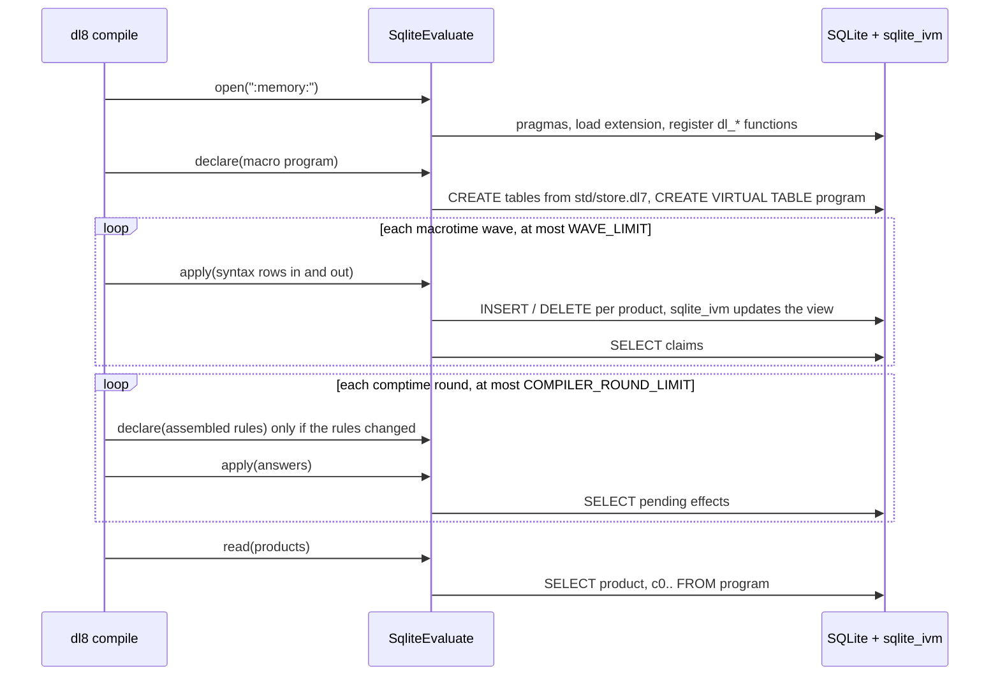

# eval on sqlite_ivm, in plain words

The receipts live in `2026-09-18-eval-on-sqlite-ivm.design.md`. This page
covers the same design, one page at a time.

## The move

Today Rust does the joins. After the move, SQLite does them, and sqlite_ivm
keeps the answers current as rows come in and go out.

| today | after |
|---|---|
| Rust loops over rows, joins by hand, proves goals top-down | one SQL view per program; SQLite joins, sqlite_ivm updates it |
| a wave or round recomputes everything | a wave or round inserts and deletes rows; the view updates only what changed |
| kernel goals are Rust match arms | kernel goals are `dl_*` SQL functions over the same term arena |

## One compile, top to bottom

## What a row cell holds

A cell holds a term id from the same arena dl8 uses today. The db keeps a copy
of the arena, so a reopened db gives the same ids.

| cell | means |
|---|---|
| `17` | whatever term 17 is in the arena, e.g. `const(3)` |
| `dl_cons(17, 40)` | the id of the list with head 17 and tail 40, created on first use |
| `dl_head(52)` | the head of list 52, or NULL if 52 is not a list |

## Five choices for Chris

| # | question | pick |
|---|---|---|
| F1 | emit Rust structs only, or structs plus insert and select functions? | structs plus functions, so no column name is typed twice |
| F2 | cell holds an arena id, a hash, or the whole term as bytes? | arena id, the same ids as today |
| F3 | one view per product, or one view per program? | one per program, so each product is computed once |
| F4 | a rule that uses its own recursive product twice (SQLite refuses it) | diagnostic first; add a Rust-driven loop only if the prelude or macrotime has such a rule |
| F5 | products that need their head arguments bound first | rewrite as a demand table with a depth cap, in SQL |

## Loops and their caps

| loop | cap | at the cap |
|---|---|---|
| macrotime waves | `WAVE_LIMIT` (`src/_1_macrotime/_4_expand.rs:16`) | today's wave-limit diagnostic |
| comptime rounds | `COMPILER_ROUND_LIMIT` (`src/_4_comptime/_2_rounds.rs:99`) | today's limit diagnostic |
| demand recursion (F5) | `DEMAND_DEPTH_LIMIT` | a `demand_depth_exceeded` row |
| ordered fold | the group's row count | ends by construction |
