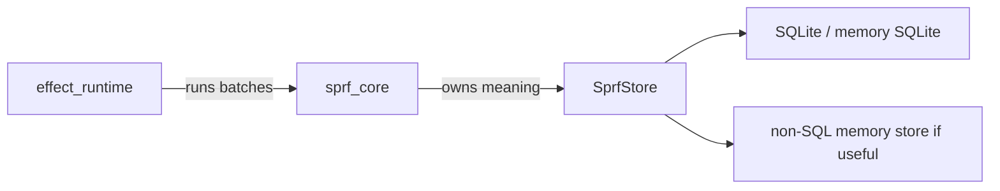

# V4 Core And Store

## Boundary

`SprfStore` is core. It specializes the generic store idea into sprf semantics:

```text
strings
norm
refs
repo/rev/fs coords
rule rows
fact rows
provenance
indexes
memory/sqlite implementations
```

The effect runtime can define generic scheduling and batch machinery. It should not know what a cursor, term, ref, repo, rev, file, or LSP diagnostic means.



## Cursor

A cursor is the flowing row-shaped value:

```text
cursor.value
cursor terms
cursor source ref / coord
```

Terms carry language bindings. Refs carry physical source location.

## Ref

Refs are physical coordinates descended from V0 refs and V2 scan pointers:

```text
repo
rev
file / fs
byte range
optional node/path metadata later
```

Refs are the bridge between rule rows and LSP/UI surfaces.

## Strings And Norm

Strings are stored once. `norm` is store-owned derived data on the strings table.

Default `norm` intent:

```text
lowercase
remove punctuation
remove numbers
compress hard enough for rough cross-repo matching
```

Other normalization schemes can be userland rules later. The core raw/norm path should not require users to call a `normalize(...)` op.

## Rule Rows

Rules produce relations. A rule row should contain user columns plus enough core metadata to support:

```text
source refs
generation
row identity
derived-from links
invalidating refs
diagnostic/hover/link projections
```

SQL framing:

```text
rule = materialized view over source relations and pattern ops
rule output = relation rows
rule call = select/project/join over rule relation
```

## Row Identity

Use content-derived identity where possible:

```text
row_id = hash(table name + canonical user columns + source identity policy)
```

Exact identity policy may differ by table, but the store needs stable dedupe and invalidation keys.

## Generations

Current-state behavior should be cheap:

```text
current rows
current indexes
current source refs
dirty keys
```

History is optional storage policy. Avoid requiring a full in-memory historical trace for basic LSP behavior.

## Durable Backends

Current app constructors support these combinations:

```text
memory facts + memory queue
memory facts + SqliteQueue
SqliteFactStore + memory queue
SqliteFactStore + SqliteQueue
```

CLI/daemon flags:

```bash
sprefa-run file.sprf --queue-db queue.db
sprefa-run file.sprf --fact-db facts.db
sprefa-daemon --queue-db queue.db --fact-db facts.db
```

These paths can also come from `~/.config/sprefa/config.toml`; see
[V4 Config And CLI](./v4-config-and-cli.md).

`SqliteQueue` stores parked continuations:

```text
serialized cursor payload
cursor content hash
pipe_hash
instance_id
depth
wake domain/key
```

`SqliteFactStore` stores rule rows, core rows, and mounted query bookkeeping with interned string cells. Current store validation permits core/internal names such as:

```text
_strings
_refs
generation
__support_cursor_id
```

SQLite fact-row identity is based on declared persisted columns. Extra cursor fields can flow through the runtime without changing the visible row identity of a declared SQLite table.

The effect runtime owns the generic traits and queue mechanics. `SprfStore` owns the sprf-specific core tables and declares them before inserting sentinels so memory and SQLite fact stores share the same app path.
