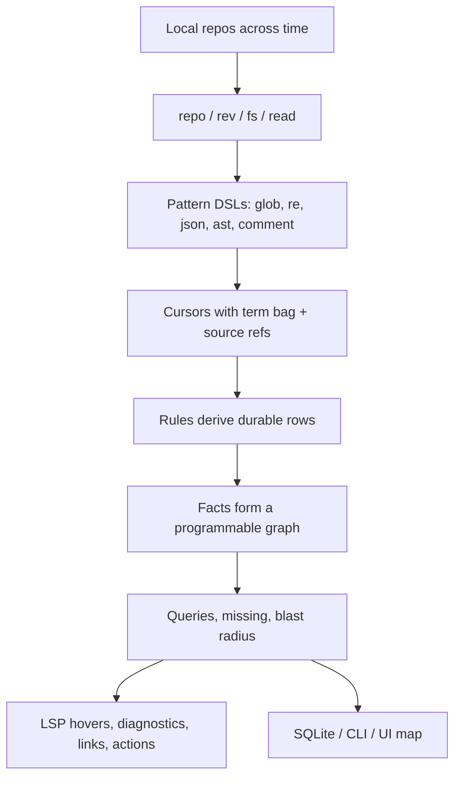
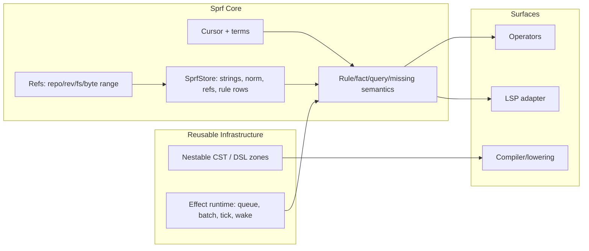
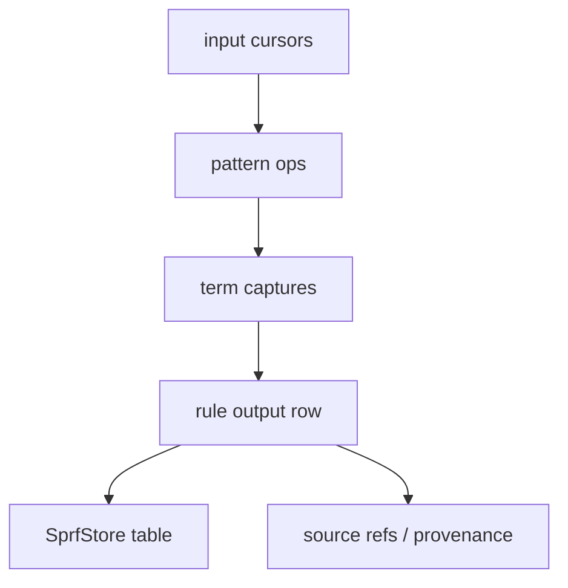
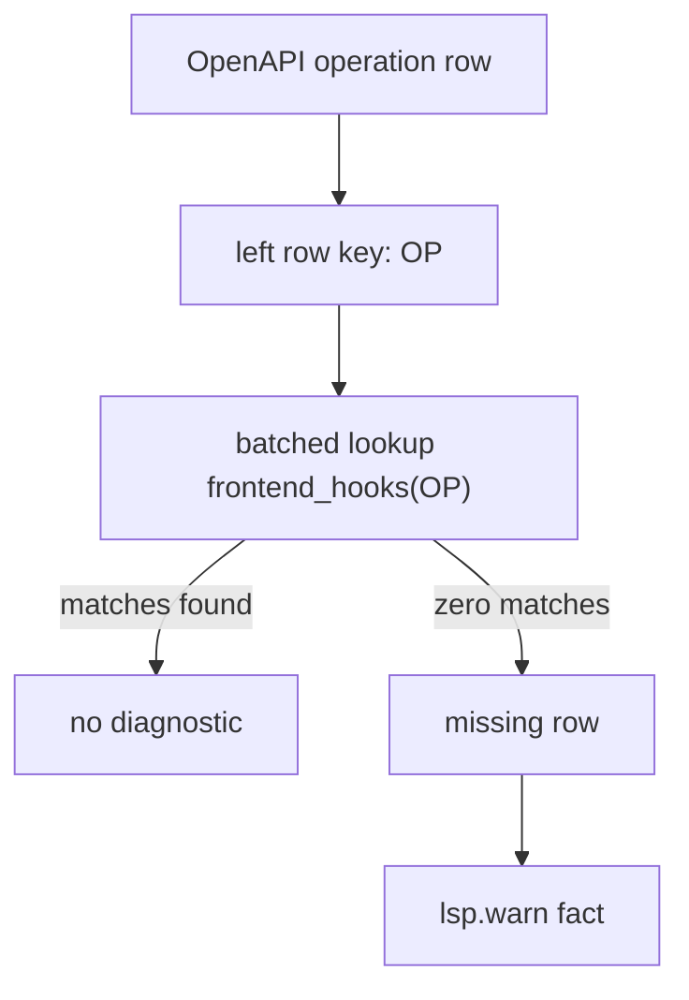
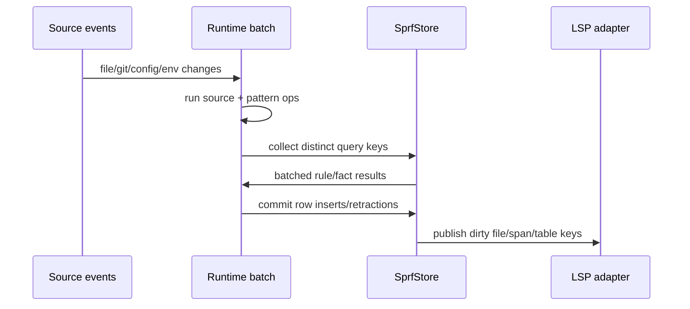
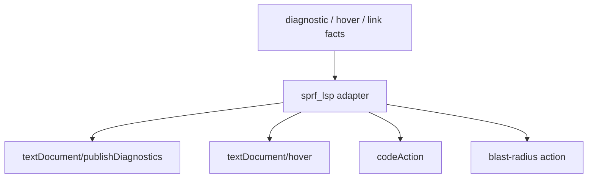

# V4 Language Vector

Source posture:

- `human-goals.md` is current human intent.
- Current `v4/src`, `v4/tests`, and `v4/examples` are current implementation reality.
- Archive docs and old `.sprf` files are historical behavior references, not spec law.

## Direction

Sprf is a shell-like programmable fact graph language for local codebases across repos and revisions.



The language should stay small at the host level. Most expressive power comes from operators and nested DSLs.

## Core Semantic Model

```text
1. What exists
   repo, rev, file, byte ref, string, norm, cursor, term, rule row

2. What flows
   cursor.value + term bag + source coord

3. What rules mean
   named pipe, emitted rows, columns from terms, row provenance

4. What failure means
   zero output fails by default
   missing/anti turns absence into output

5. What time means
   generations, dirty inputs, batched effects, commit boundary

6. What LSP sees
   facts projected as hover, diag, link, code action, blast radius
```

## Module Shape



Current split target:

- `effect_runtime`: queue, component, pipe, node, generation, event bus, timers, next/wake, batch mechanics.
- `sprf_core`: cursor, terms, refs, rule/fact/query/missing semantics, keyed zero-output failure, provenance, store.
- `sprf_ops`: repo/rev/fs/read, ast/json/re/glob/comment, sh/env/config, LSP fact emitters.
- `sprf_compile`: CST walk to op calls, operator signatures, binding graph, lowering.
- `sprf_lsp`: adapter from facts to LSP protocol objects.

Core and store are one conceptual unit for now. `SprfStore` is part of the language reality because strings, `norm`, refs, rule rows, provenance, and query performance are semantic load-bearing.

## Rule Rows

Rules derive durable rows.



Rows should know enough to answer:

```text
what asserted this?
from which repo/rev/file/span?
during which generation/session?
derived from which upstream facts?
what invalidates it?
what LSP/UI consumer reads it?
```

## Missing And Failure

Zero output is failure by default. For useful diagnostics, failure is usually keyed by the left row / source row, not by whole pipeline.



`missing(...)` or equivalent anti form turns absence into an output row. In SQL terms, it is anti-join / `NOT EXISTS`: keep the left row when the right relation has zero matches. This should lower to batched keyed lookup, not per-cursor store queries.

## Time And Batching

Relational work should happen at generation or barrier boundaries.



The syntax may look cursor-by-cursor, but the runtime should collect distinct keys and perform batch reads/joins.

## LSP Projection

LSP is a projection of facts. Core can emit rows like diagnostics, hover notes, links, and code actions. The LSP adapter maps those rows into protocol types.



Core should not depend on LSP protocol types.

## Primitive Example Ladder

Use a documented reading order to restore orientation. Avoid numeric filename prefixes unless a later rewrite/path macro makes renames cheap. If order needs to appear in a filename, use a suffix, not a prefix.

```text
v4/examples/str-rule.sprf
v4/examples/fs-glob-read-re.sprf
v4/examples/repo-rev-fs-read.sprf
v4/examples/json-extract.sprf
v4/examples/rule-sink-fact.sprf
v4/examples/keyword-rule-call.target.sprf
v4/examples/missing-antijoin.target.sprf
v4/examples/lsp-warn-missing-hook.target.sprf
```

First five should only use implemented behavior. Last three can be target examples until implemented, but must be marked as such if checked in.

## First Real Composition Target

OpenAPI operation coverage:

```sprf
rule(:openapi_ops, SPEC?, OP?) {
  repo(:api) > rev(:main) > fs > glob`**/openapi.json` > read
  > json`{ paths: { $$$: { $$$: { operationId: ${OP?} } } } }`
}

rule(:frontend_hooks, OP?, REF?) {
  repo(:web) > rev(:main) > fs > glob`**/*.{ts,tsx}` > read
  > ast(:ts)`use${OP}($$$)`
}

rule(:missing_frontend_hooks, OP?) {
  openapi_ops(OP: OP?)
  > missing(frontend_hooks(OP: OP))
  > lsp.warn`missing frontend hook for ${OP}`
}
```

The syntax is provisional. The semantic target is explicit keyword projection, batched rule-table lookup, keyed anti-join, and diagnostic row output.
