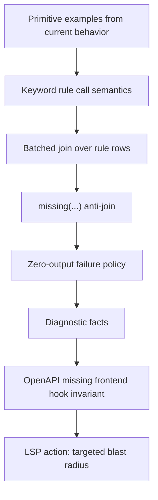

# V4 Next Slices

## Slice Order



## Slice 1: Primitive Examples

Create examples from current behavior only:

```text
str-rule.sprf
fs-glob-read-re.sprf
repo-rev-fs-read.sprf
json-extract.sprf
rule-sink-fact.sprf
```

Purpose: get back to primitive examples without relying on old v1/v2/v3 syntax.

## Slice 2: Keyword Rule Calls

Target syntax:

```sprf
openapi_ops(OP: OP?)
frontend_hooks(OP: OP, REF: REF?)
```

Decisions:

- call args are column names
- `TERM` constrains by current term
- `TERM?` projects/binds output
- omitted column means no predicate/projection
- LSP can expose columns and binding modes

## Slice 3: Batched Join

Runtime:

```text
collect distinct key tuples from input batch
query relation once per key set
join result rows back to left rows
```

This is the performance foundation for rule calls.

## Slice 4: Missing / Anti-Join

Target syntax:

```sprf
missing(frontend_hooks(OP: OP))
```

SQL meaning:

```text
NOT EXISTS matching right row
```

Output:

```text
left row passes through only when right relation has zero matches
```

## Slice 5: Zero-Output Failure

Default: zero output is failure.

For user-facing checks, model failure as missing rows:

```text
source row -> anti-join -> missing row -> lsp diagnostic fact
```

Do not overbuild a global failure mechanism before missing rows exist.

## Slice 6: Diagnostic Facts

Core emits diagnostic rows. LSP adapter maps rows to protocol diagnostics.

Minimum fields:

```text
file/ref
lo
hi
severity
message
source
code
related refs later
```

## Slice 7: OpenAPI Missing Hook

First real invariant:

```text
OpenAPI operation exists
frontend generated hook should exist
missing hook emits lsp.warn
edit adds hook -> diagnostic clears
edit adds OpenAPI op -> diagnostic appears
```

This proves:

- pattern extraction
- rule rows
- keyword calls
- batched join
- anti-join
- diagnostic facts
- LSP projection

## Slice 8: Blast Radius

After rows/refs/diagnostic facts are stable:

```text
LSP action from symbol/span/cursor
query precomputed rule rows and refs
return targeted graph slice
```

Avoid V0 giant dump behavior. Use indexed facts and bounded graph expansion.

