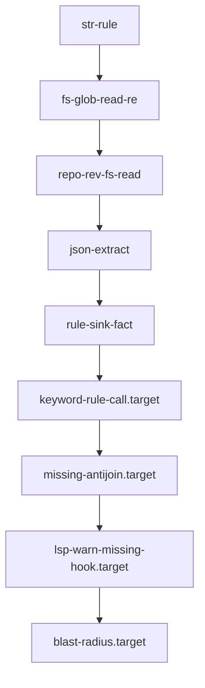

# V4 Primitive Examples Plan

Goal: rebuild orientation from current v4 truth without over-indexing on older `.sprf` files.

Use ordinary filenames. Reading order belongs here. Do not put numbers at the front of filenames. If an order marker is unavoidable, use a suffix like `str-rule_1.sprf`.

## Implemented Examples

These should only use behavior that current v4 supports.

| Example file | Purpose |
| --- | --- |
| `str-rule.sprf` | bare backtick / `str`, simple `rule(:name) { ... }` writes one row |
| `fs-glob-read-re.sprf` | filesystem walk, glob filter, read gate, regex capture |
| `repo-rev-fs-read.sprf` | configured repo, rev resolution, file walk, read |
| `json-extract.sprf` | JSON/YAML/TOML structural extraction |
| `rule-sink-fact.sprf` | empty rule declaration, sink-position write, fact table rows |

Smoke test:

```bash
RUSTC_WRAPPER= cargo test --manifest-path v4/Cargo.toml --test sprefa_run_cli_smoke -- --nocapture
```

`repo-rev-fs-read.sprf` uses `repo()`, so it needs a config with at least one
repo. The shipped example config is memory-backed by default and is used by the
smoke test through `SPREFA_CONFIG`.

## Target Examples

Target examples should use `.target.sprf` suffix until implemented.

| Example file | Purpose |
| --- | --- |
| `keyword-rule-call.target.sprf` | explicit rule call projection, grounded relation queries, and dotted apply |
| `missing-antijoin.target.sprf` | `missing(...)` as anti-join / `NOT EXISTS` |
| `lsp-warn-missing-hook.target.sprf` | OpenAPI op without frontend hook emits diagnostic fact |
| `blast-radius.target.sprf` | symbol/span action reads precomputed facts |

## Ladder



## Rule

When adding examples:

- include one comment at top stating whether it is implemented or target syntax
- keep each example focused on one primitive combination
- avoid importing old syntax from archive files unless the current parser supports it
- add a smoke test only for implemented examples
