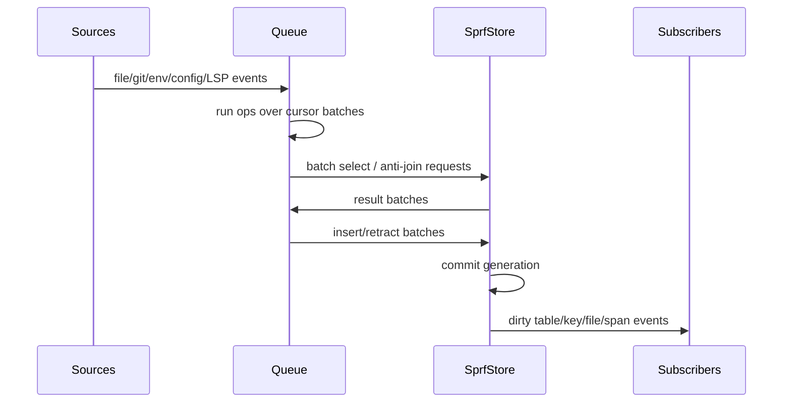
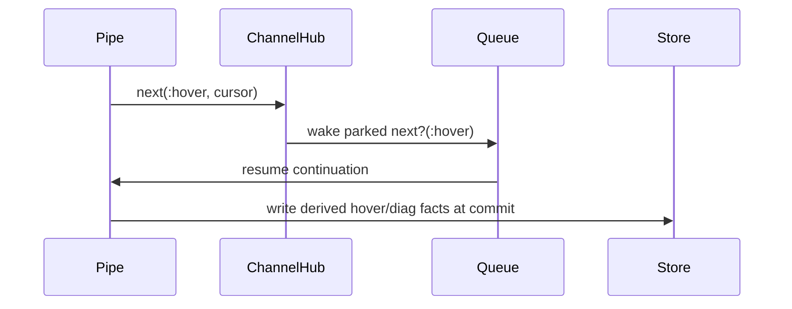

# V4 Runtime Batching

## Goal

The language can look cursor-oriented. Store work should be batched by generation.

Avoid:

```text
for each cursor:
  run SQL query
  write side effect
  notify subscriber
```

Prefer:

```text
for each generation:
  collect cursor batches
  collect distinct query keys
  query store in batches
  write rows in batches
  commit once
  notify dirty keys once
```

## Generation

Generation/tick semantics:



## Batched Rule Call

For:

```sprf
frontend_hooks(OP: OP, REF: REF?)
```

Runtime:

```text
input cursors -> collect OP values
distinct OP values -> one batched select
result map OP -> matching rows
emit one output cursor per joined row
```

## Batched Missing

For:

```sprf
missing(frontend_hooks(OP: OP))
```

Runtime:

```text
input cursors -> collect OP values
distinct OP values -> one batched existence query
for each input cursor:
  if no matching right rows: emit left cursor
  else: emit nothing
```

SQL framing:

```text
anti-join / NOT EXISTS over a batch relation
```

## Subscriptions

Subscribe by SQL-like key spaces, not by every row object.

Useful keys:

```text
relation name
relation + indexed column values
file ref
file + byte span
diagnostic file
```

Dirty publish should happen after commit, not during per-row writes.

## Next / Next?

`next` and `next?` are event/yield primitives, separate from SQL relations.

| Primitive | Role |
| --- | --- |
| `next` | publish/yield event cursor to a channel |
| `next?` | wait/read/park until a matching event cursor arrives |

`next?` is time/control absence. `missing` is relational absence. Keep them separate.



Events may be logged for debugging, but their semantic job is pause/resume and imperative workflow control.

