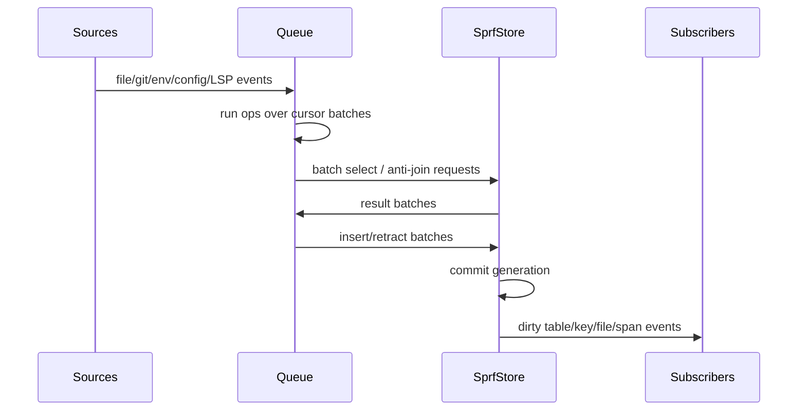
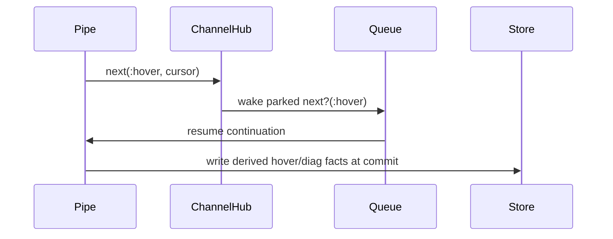

# V4 Runtime Batching

## Goal

The language can look cursor-oriented. Store work should be batched by generation.

Avoid:

```text
for each cursor:
  run SQL query
  write side effect
  notify subscriber
```

Prefer:

```text
for each generation:
  collect cursor batches
  collect distinct query keys
  query store in batches
  write rows in batches
  commit once
  notify dirty keys once
```

## Generation

Generation/tick semantics:



## Batched Rule Call

For:

```sprf
frontend_hooks(OP: OP, REF: REF?)
```

Runtime:

```text
input cursors -> collect OP values
distinct OP values -> one batched select
result map OP -> matching rows
emit one output cursor per joined row
```

## Batched Missing

For:

```sprf
missing(frontend_hooks(OP: OP))
```

Runtime:

```text
input cursors -> collect OP values
distinct OP values -> one batched existence query
for each input cursor:
  if no matching right rows: emit left cursor
  else: emit nothing
```

SQL framing:

```text
anti-join / NOT EXISTS over a batch relation
```

## Subscriptions

Subscribe by SQL-like key spaces, not by every row object.

Useful keys:

```text
relation name
relation + indexed column values
file ref
file + byte span
diagnostic file
```

Dirty publish should happen after commit, not during per-row writes.

## Next / Next?

`next` and `next?` are event/yield primitives, separate from SQL relations.

| Primitive | Role |
| --- | --- |
| `next` | publish/yield event cursor to a channel |
| `next?` | wait/read/park until a matching event cursor arrives |

`next?` is time/control absence. `missing` is relational absence. Keep them separate.



Events may be logged for debugging, but their semantic job is pause/resume and imperative workflow control.

## Static Program vs Static Result

`static` is a dependency word, not a scheduling guarantee.

Keep two meanings separate:

| Concept | Meaning | Example |
| --- | --- | --- |
| static program | body/config can be compiled once | `re\`(?P<X>\\w+)\`` |
| static result | emitted value/cursor can be produced once and replayed | `` `literal` `` |

Most useful ops have a static program and a dynamic result.

| Form | Program | Result |
| --- | --- | --- |
| `` `literal` `` | static | static, once |
| `` `hello ${NAME}` `` | static | cursor-dependent, one per input |
| `re\`...\`` | static | cursor-dependent, zero to many per input |
| `json\`...\`` | static | cursor-dependent, zero to many per input |
| `ast\`...\`` | static | cursor-dependent, zero to many per input |
| `sql\`...\`` | static | cursor/store-dependent, zero to many per input |

Suggested metadata axes:

```text
program dependency:
  static_body
  dynamic_body

result dependency:
  static
  cursor
  store
  external
  event

cardinality:
  once
  one_each
  maybe_each
  many_each
  many_once
  later

effect:
  pure
  store_read
  store_write
  external_read
  external_write
  event_read
  event_write
  diagnostic
```

Gotchas:

| Gotcha | Failure mode |
| --- | --- |
| treating static body as static result | regex/template/sql outputs get cached too aggressively |
| interpolation hidden in strings | `${TERM}` makes output cursor-dependent |
| store reads treated as pure | rule/sql cache misses table invalidation |
| env/config treated as static | config reload leaves stale rows |
| revspecs treated as stable | `HEAD` changes; resolved commit OID is stable |
| pattern ops treated as scalar | queue identity breaks when captures fan out |
| diagnostics treated as pure | `lsp_warn` can be reordered incorrectly |
| `next` treated as relation read/write | event time leaks into SQL-style semantics |

Comparative mechanics:

| Sprf | RxJS | React | Redux |
| --- | --- | --- | --- |
| static result | `of(value).pipe(shareReplay(1))` | module constant | precomputed initial value |
| cursor-dependent scalar | `map` | render from props | selector over row |
| filter/predicate | `filter` | conditional render | selector returning empty |
| fanout pattern | `mergeMap` | list render | selector returning array |
| rule table | replayed subject/table | state store | normalized slice |
| `sql`/rule read | derived observable | `useMemo` with deps | memoized selector |
| `next` | `Subject.next()` | event handler | dispatched action |

Optimization rule:

```text
static body enables compile caching.
static result enables replay caching.
result dependency defines invalidation.
cardinality defines queue/retraction mechanics.
effect defines scheduling/reordering boundaries.
```

Disabling a lift/cache optimization must not change emitted rows, term bindings, diagnostics, writes, or generation visibility.
