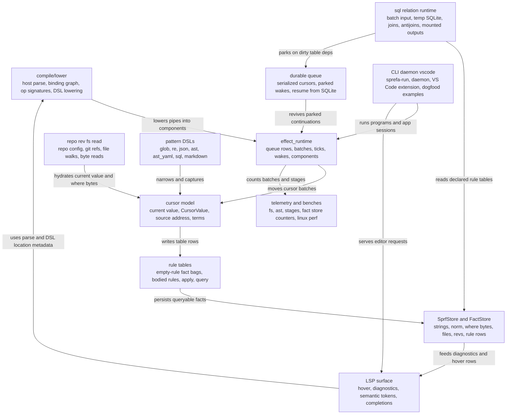

# V4 System Architecture Audit

Generated by <code>v4/examples/system-architecture-mermaid.sprf</code>.

## Diagram

## Audit Findings

| Area | Finding | Refs |
| --- | --- | --- |
| Fact identity | FactStore row identity only sees Row::fields, while Cursor identity also has value, CursorValue, at, and compact terms | v4/src/lib.rs:385; v4/src/lib.rs:585; v3/crates/effect_runtime/src/v2/fact_store.rs:181 |
| Store parity | MemFactStore and SqliteFactStore use different visible identity when undeclared raw terms are present | v3/crates/effect_runtime/src/v2/fact_store.rs:86; v3/crates/effect_runtime/src/v2/fact_store.rs:575 |
| SQL n plus one | sql runtime copies every referenced relation into fresh temp SQLite and prepares one insert per row | v4/src/sql.rs:164; v4/src/sql.rs:322; v4/src/sql.rs:381 |
| SQL deps | referenced fact table extraction is lexical and feeds cache keys plus dirty subscriptions | v4/src/sql.rs:40; v4/src/sql.rs:401 |
| Mounted output | mounted_query removes visible output rows but retains historical cursor blobs | v4/src/mounted_query.rs:84; v4/src/mounted_query.rs:453 |
| Queue hash | SqliteQueue persists encoded cursor bytes and separately recomputes content_hash | v3/crates/effect_runtime/src/v2/sqlite_queue.rs:252; v4/src/runtime_bridge.rs:19 |
| Batch hint | Component batch_hint exists but expand uses ExpandOpts batch_cap directly | v3/crates/effect_runtime/src/v2/component.rs:89; v3/crates/effect_runtime/src/v2/expand.rs:175 |
| CAPS bang | NAME bang is bind in binding graph but read in runtime slot classification | v4/src/compile/binding_graph.rs:284; v4/src/compile/walk.rs:559 |
| Rule decls | binding graph collect_rule_decls can treat later rule sink calls as declarations | v4/src/compile/binding_graph.rs:49; v4/src/compile/walk.rs:250 |
| Slots | multiple bracket flow slots parse but only the first is lowered | v4/crates/tree-sitter-sprefa/grammar.js:88; v4/src/compile/parse.rs:104 |
| Block parse | brace block reparsing drops inner parse diagnostics | v4/src/compile/parse.rs:31; v4/src/compile/parse.rs:137 |
| LSP DSL coverage | hover completion and semantic token provider maps diverge for sql json ast markdown aliases | v4/src/app.rs:1093; v4/crates/sprefa-lsp/src/dsl_lookup.rs:13; v4/crates/sprefa-lsp/src/semantic.rs:105 |
| LSP op names | docs use lsp.warn while registered warning op is lsp_warn | v4/src/lsp.rs:365; v4/docs/v4-rule-query-semantics.md:335 |
| Rev reads | rev-backed fs can do git ls-tree per rev and git show per file | v4/src/v2_ops.rs:270; v4/src/source.rs:124 |
| Source reads | source-aware ast and json can reread bytes in each matcher stage | v4/src/source.rs:83; v4/src/v2_ops.rs:666; v4/src/v2_ops.rs:3250 |
| Perf docs | linux bench fixture path differs between justfile and v4 bench sprf comments | justfile:55; v4/bench/linux.sprf:10 |
| Generated churn | tests and render recipes write tracked generated outputs | v4/tests/sprefa_run_cli_smoke.rs:180; v4/examples/runtime-map-html.sprf:103 |

## Next Tasks

| Task | Why |
| --- | --- |
| Hydrate rev query cursors | rev? should restore repo plus rev cursor.at so stored rev rows can feed fs/json/ast |
| Unify fact identity | memory and sqlite stores need one declared-column identity contract |
| Batch SQL materialization | prepare once per temp table and insert in transaction or reuse SQLite physical tables |
| Centralize DSL registry | one op-to-DSL provider table should drive hover completion semantic tokens and docs |
| Fix CAPS bang semantics | binding graph and runtime classification must agree or reject the suffix |
| Add rev-source perf case | bench repo rev fs read and source-aware ast/json across historical revisions |
| Stabilize generated outputs | examples that write tracked files need deterministic output or temp targets in tests |

