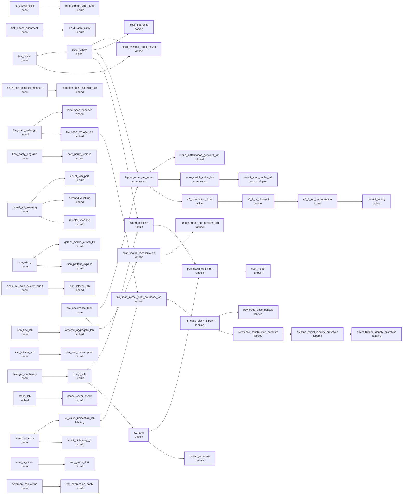
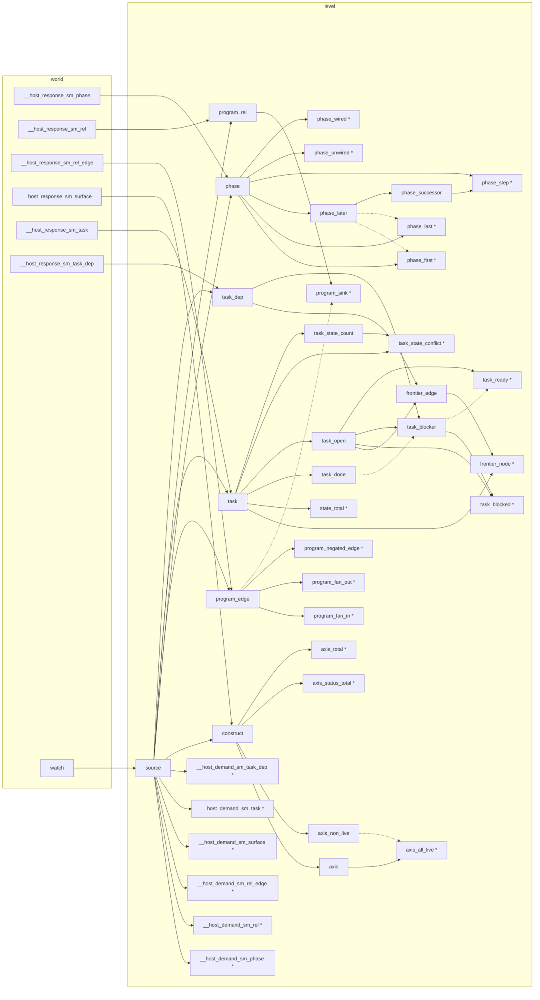

# v6 architecture map

GENERATED by `just self-map` (`v6/tsv2/scripts/self-map.sh`). Do not edit: the next run overwrites it, byte for byte.

Every fact below travelled through the served tsv2 engine. `v6/dl/fixtures/self-map.dl6` declares the sources as `bind watch` globs and one `sh` host with six projections; the derivations -- ready vs blocked, wired vs unwired, all-live axis, sink rel, every count -- are ordinary dl6 rules in that file. This renderer only escapes, joins and lays out, because dl6 has no string aggregate and the mermaid document is a fold over rows.

| watched source | authority | what it says |
|---|---|---|
| `v6/prolog/compile/registry.pl` | `surface/5` | the construct inventory |
| `v6/prolog/1_expansion.pl` | `expansion_phase/3` | the declared sugar order |
| `v6/prolog/ARCH.pl` | `task/3` | the build DAG |
| `v6/dl/fixtures/self-map.dl6` | `analyze.pl` | this program's own rel graph |

## 1. Surface sugar expands in a declared order

`expansion_phase/3` in `v6/prolog/1_expansion.pl`, read by the compiler and the oracle both. Arrows are the computed successor (the smallest order strictly greater), not the literal numbers, so a phase landing between two existing ones redraws correctly. Dashed = declared slot with no expander.

```mermaid
flowchart LR
  ph_enum["10 enum<br/>expand_enum_in_context"]
  ph_decl_spread["20 decl_spread"]
  ph_row_spread["30 row_spread"]
  ph_match["40 match<br/>expand_match_program_in_context"]
  ph_coalesce["45 coalesce<br/>expand_coalesce_in_context"]
  ph_relation_edge["50 relation_edge<br/>expand_relation_edges_in_context"]
  ph_coalesce --> ph_relation_edge
  ph_decl_spread --> ph_row_spread
  ph_enum --> ph_decl_spread
  ph_match --> ph_coalesce
  ph_row_spread --> ph_match
  classDef slot stroke-dasharray: 4 3
  class ph_decl_spread slot
  class ph_row_spread slot
```

First phase: `enum`. Last phase: `relation_edge`. Unwired slots: `decl_spread`, `row_spread`.

## 2. The writable surface, by axis

`surface/5` in `v6/prolog/compile/registry.pl` is the single inventory the parser, printer, analyzer and supported-subset gate all project from, so this is the whole writable language and not a selection from it. An axis whose every row is `live` is drawn solid; an axis still carrying a reserved or refused row is dashed.

```mermaid
flowchart TD
  subgraph ax_aggregate["aggregate"]
    direction TB
    c_avgx2f1["avg/1"]
    c_countx2f1["count/1"]
    c_group_concatx2f1["group_concat/1<br/>refused"]
    c_group_concatx2f2["group_concat/2"]
    c_group_concatx2f3["group_concat/3"]
    c_json_arrayx2f1["json_array/1<br/>refused"]
    c_json_group_arrayx2f1["json_group_array/1"]
    c_json_group_arrayx2f2["json_group_array/2"]
    c_json_objectx2f2["json_object/2<br/>refused"]
    c_maxx2f1["max/1"]
    c_minx2f1["min/1"]
    c_sumx2f1["sum/1"]
  end
  subgraph ax_bind["bind"]
    direction TB
    c_x3ax3dx2f2[":=/2"]
    c_isx2f2["is/2"]
  end
  subgraph ax_decl["decl"]
    direction TB
    c_x3bx2f2[";/2"]
    c_col_typex2f3["col_type/3"]
    c_enum_declx2f2["enum_decl/2"]
    c_setx2f0["set/0<br/>refused"]
    c_type_declx2f2["type_decl/2"]
  end
  subgraph ax_guard["guard"]
    direction TB
    c_x3cx2f2["#lt;/2"]
    c_x3dx3cx2f2["=#lt;/2"]
    c_x3dx3dx2f2["==/2"]
    c_x3ex2f2["#gt;/2"]
    c_x3ex3dx2f2["#gt;=/2"]
    c_x5cx3dx3dx2f2["\==/2"]
    c_decodex2f2["decode/2"]
    c_json_eachx2f2["json_each/2<br/>refused"]
    c_truex2f0["true/0"]
  end
  subgraph ax_join["join"]
    direction TB
    c_combinex2fvariadic["combine/variadic"]
    c_zipx2f2["zip/2<br/>reserved"]
  end
  subgraph ax_json["json"]
    direction TB
    c_x24x2f1["$/1"]
    c_x2ax2ax2f0["**/0"]
    c_spreadx2f1["spread/1"]
    c_tagged_bracex2f1["tagged_brace/1<br/>reserved"]
    c_x7bx7dx2f0["#123;#125;/0"]
    c_x7bx7dx2f1["#123;#125;/1"]
  end
  subgraph ax_read["read"]
    direction TB
    c_queryx2f1["query/1"]
  end
  subgraph ax_sample["sample"]
    direction TB
    c_latestx2f1["latest/1"]
    c_prex2f1["pre/1<br/>refused"]
  end
  subgraph ax_sign["sign"]
    direction TB
    c_notx2f1["not/1"]
  end
  subgraph ax_sugar["sugar"]
    direction TB
    c_coalescex2f2["coalesce/2"]
    c_matchx2f2["match/2"]
  end
  subgraph ax_time["time"]
    direction TB
    c_completex2f1["complete/1<br/>reserved"]
    c_errorx2f1["error/1<br/>reserved"]
    c_finalizex2f1["finalize/1"]
    c_nextx2f1["next/1"]
    c_nowx2f1["now/1"]
    c_subscribex2f1["subscribe/1<br/>reserved"]
    c_unsubscribex2f1["unsubscribe/1<br/>reserved"]
  end
  subgraph ax_world["world"]
    direction TB
    c_bind_declx2f2["bind_decl/2"]
    c_probex2f4["probe/4"]
    c_sg_patternx2f3["sg_pattern/3<br/>refused"]
    c_sh_declx2f4["sh_decl/4"]
    c_ts_queryx2f1["ts_query/1"]
  end
  classDef moving stroke-dasharray: 4 3
  class ax_aggregate moving
  class ax_decl moving
  class ax_guard moving
  class ax_join moving
  class ax_json moving
  class ax_sample moving
  class ax_time moving
  class ax_world moving
```

| axis | constructs | live | refused | reserved | all live |
|---|---|---|---|---|---|
| `aggregate` | 12 | 9 | 3 | 0 |  |
| `bind` | 2 | 2 | 0 | 0 | yes |
| `decl` | 5 | 4 | 1 | 0 |  |
| `guard` | 9 | 8 | 1 | 0 |  |
| `join` | 2 | 1 | 0 | 1 |  |
| `json` | 6 | 5 | 0 | 1 |  |
| `read` | 1 | 1 | 0 | 0 | yes |
| `sample` | 2 | 1 | 1 | 0 |  |
| `sign` | 1 | 1 | 0 | 0 | yes |
| `sugar` | 2 | 2 | 0 | 0 | yes |
| `time` | 7 | 3 | 0 | 4 |  |
| `world` | 5 | 4 | 1 | 0 |  |

## 3. The build DAG's open frontier

`task/3` in `v6/prolog/ARCH.pl`: 174 tasks, 102 dependency edges. Drawing all of them is noise, so the rel `frontier_edge` keeps only the edges touching a task that is not `done` -- a done task appears exactly when something open still waits behind it. `task_blocked` and `task_ready` are the two antijoins that split the open set.

| state | tasks |
|---|---|
| `active` | 6 |
| `canonical_plan` | 2 |
| `closed` | 4 |
| `done` | 100 |
| `labbed` | 16 |
| `labbing` | 4 |
| `parked` | 1 |
| `superseded` | 2 |
| `unbuilt` | 39 |

**Ready** (open, every dependency done): 49 tasks. **Blocked**: 25 tasks.

the ready set

`amplification_sensors`, `analysis_oracle_exam`, `bind_submit_error_arm`, `c7_durable_carry`, `causality_check`, `clock_check`, `count_ivm_port`, `decode_arc`, `demand_clocking`, `dep_ver_minmax_reversed`, `doc_format_extraction`, `effect_abort`, `envelope_types`, `equals_refusal_by_name`, `extract_spelunk`, `extraction_host_batching_lab`, `file_span_redesign`, `flow_parity_residue`, `flow_residue_partial`, `fork_join_malformed_json`, `ghost_forest_view`, `golden_flex_residue`, `golden_oracle_arrival_fix`, `group_concat_silent_miscompile`, `host_column_shadows_runtime`, `init_retention`, `json_edge_body_unblock`, `json_interop_lab`, `json_pattern_expand`, `mode_lab`, `norm_oracle_emitter_divergence`, `null_coherence_lab`, `ordered_aggregate_lab`, `per_row_consumption`, `purity_split`, `reactor_buffertime_flake`, `register_lowering`, `rel_definition_hash_lab`, `rel_value_unification_lab`, `scan_match_reconciliation`, `schema_import_epic`, `simplify_wave`, `struct_dictionary_gc`, `sub_forest`, `sub_graph_disk`, `swipl_gc_abort`, `text_expression_parity`, `ts_grammar_import`, `v5_lsp_exit_hang`

## 4. A compiled program's rel dataflow: this program's own

Read out of `analyze.pl` by `v6/prolog/tools/self_map_facts.pl`, through the same two-step `program_plan/2` runs: the host pre-pass first (which is why `__host_demand_*` and `__host_response_*` appear -- the demand/answer round trip the `sh` surface hides), then the declared sugar phases. `origin` is the analyzer's own partition: `world` = headed by no rule, `level` = headed by a `<-` rule, `edge` = headed by a `<+` rule. Dashed edges are negated bodies, which are the reason this program has strata.

A `*` marks a rel no RULE reads. Two different things wear that mark: a real answer rel meant to be read from outside, and a `__host_demand_*` rel, which the host RUNTIME consumes rather than any rule. The map draws the set and does not guess which is which.

`self-map`: 46 rels, 57 edges. Sinks (`*`, nothing reads them): `__host_demand_sm_phase`, `__host_demand_sm_rel`, `__host_demand_sm_rel_edge`, `__host_demand_sm_surface`, `__host_demand_sm_task`, `__host_demand_sm_task_dep`, `axis_all_live`, `axis_status_total`, `axis_total`, `frontier_node`, `phase_first`, `phase_last`, `phase_step`, `phase_unwired`, `phase_wired`, `program_fan_in`, `program_fan_out`, `program_negated_edge`, `program_sink`, `state_total`, `task_blocked`, `task_ready`, `task_state_conflict`.

| widest fan-in | writers | widest fan-out | readers |
|---|---|---|---|
| `task_blocker` | 3 | `source` | 12 |
| `axis_all_live` | 2 | `phase` | 6 |
| `construct` | 2 | `task` | 6 |
| `frontier_edge` | 2 | `construct` | 4 |
| `frontier_node` | 2 | `program_edge` | 4 |
