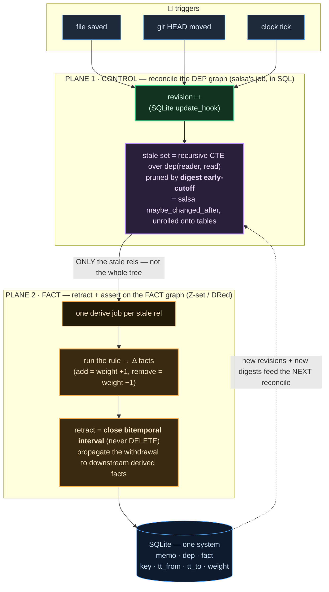
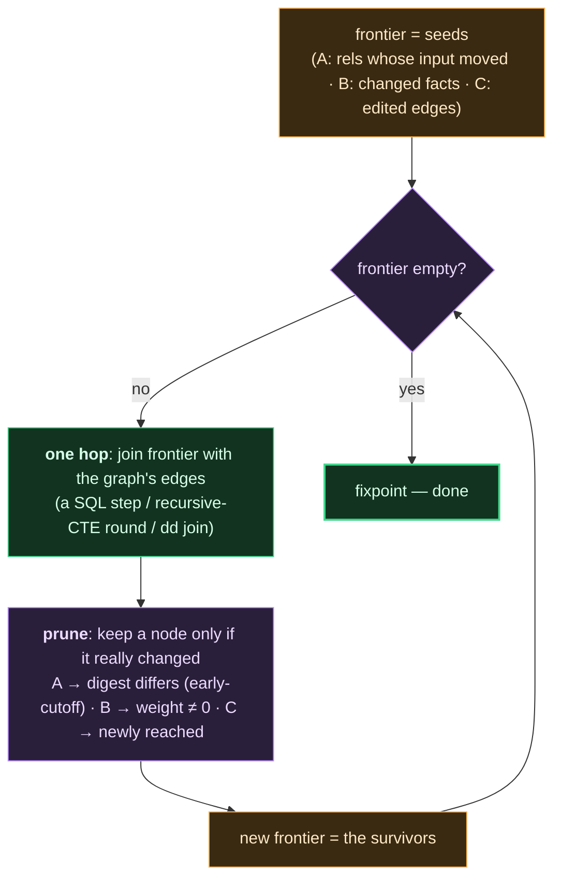
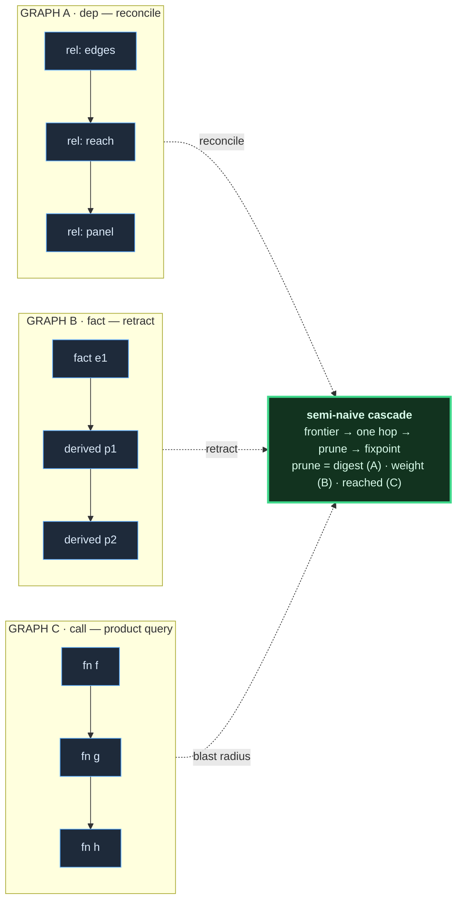

# v6 architecture — every graph algorithm, and why

You kept feeling these were related but couldn't separate them. Here is why: there are
**three different graphs**, but **one cascade engine** runs on all three, and it plays
**two different roles** (control vs fact) depending on which graph it's pointed at.

The confusion to kill first:

> **salsa is NOT a subcomponent of retraction.** They are two *stages of one tick*.
> Salsa runs **first** and decides *which rules to re-run*. Retraction runs **second**
> and propagates *what each rule's fact changes do*. Neither contains the other; they
> chain.

---

## The three graphs

| graph | nodes | edges | the question | our name for the pass | plane |
|---|---|---|---|---|---|
| **A · dep graph** | reactive rels | "rel A *reads* rel B" | which rels went stale? | **reconciliation** (salsa's red-green) | CONTROL |
| **B · fact graph** | facts (rows) | rule head ← body | which derived facts withdraw when an input fact dies? | **retraction** (Z-set / DRed) | FACT |
| **C · call graph** | functions | "f *calls* g" | what is reachable / blast radius | **the product query** (transitive closure) | FACT |

Graph C is the thing the product actually computes. Graphs A and B are the machinery that
keeps C's answer correct *incrementally*.

---

## One tick, two planes (this is the part you were missing)

**Read it:** a change bumps the revision. **Plane 1** reconciles the dep graph and hands
back a short list of stale rels (salsa). **Plane 2** runs each stale rel and lets its fact
deltas retract/assert through the fact graph (differential). Salsa is the *scheduler* that
fires before retraction; retraction is the *executor*. Two stages, one tick.

---

## The one algorithm under all three graphs

Every pass above is the **same semi-naive fixpoint cascade** — the loop we already built in
the store's `cascade.rs`. Only the graph and the prune-test differ:

That prune step is why the **digest** you asked for matters: on the dep graph it is salsa's
early-cutoff (recompute a rel, if its digest is unchanged the cascade stops — downstream
never re-runs); on the fact graph the same slot holds the Z-set weight test (a fact whose
net weight returns to what it was does not propagate). Same machine, different prune.

---

## Why each algorithm, tied to the goal

| algorithm | graph | why we need it | efficient form | measured |
|---|---|---|---|---|
| **reconciliation** (salsa red-green) | A | so a file edit re-runs *only the stale rels*, not every rule | recursive CTE + digest cutoff, O(affected subgraph) | reconciliation IS a TC over the dep DAG → measured by the reach table |
| **retraction** (Z-set / DRed) | B | so removing an input fact *withdraws* the derived facts it supported — without a full rebuild | weighted-delta close-interval, O(Δ·log n) | `sqlite-temporal` slope **0.18**, writes flat ~1300 (N+1 safe) |
| **transitive closure** (product) | C | the blast-radius answer the engine exists to serve | incremental (dd / cascade), target O(Δ) | recompute super-linear: ram **1.81**, sqlite **2.10** (~23×) — the motivation |

The through-line: **reconciliation and the product query are the same transitive-closure
shape** (a sparse DAG with localized edits). So the dep-graph reconciliation and the call-graph
blast radius run on the *identical* incremental engine. That is the whole reason we do not
need salsa-the-crate resident — the dep graph reconciles on the same cascade the facts use.

---

## How the oracles map to this (the running proof)

Production cascade = `sprefa-store/src/engine.rs`. Correctness oracles (dd differential,
salsa red-green, hand-rolled Rust) = `sprefa-store/src/oracle.rs`. Every variant is
cross-checked against them for byte-identical digests under the memory gun. Run
`just cover` / `just agree`.

| variant | graph | proves |
|---|---|---|
| ram recompute (oracle) | C | the baseline incrementality must beat (slope 1.81) |
| sqlite recursive-CTE | C | on-disk recompute cost per tick (slope 2.10, 23×) |
| dd differential (oracle) | C | O(Δ) flat slope — and the resident gun wall |
| sqlite cascade | C, dep | salsa-in-SQL on disk, incremental, survives past the gun wall |

---

## What ships vs what is a teacher

| role | ships | not shipped (why it's here) |
|---|---|---|
| triggers → revision | SQLite `update_hook` + revision | — |
| reconcile dep graph (salsa's job) | **SQL: recursive CTE + digest cutoff** | **salsa the crate** = blueprint; the salsa oracle (`oracle.rs`) proved the red-green mechanism so we know the SQL to write |
| retract facts | **SQLite cascade** (Z-set, close-interval) | — |
| product TC | **SQLite cascade** (same engine) | **dd / dbsp** = yardstick; proves O(Δ) and marks where a resident engine dies (the gun wall the on-disk cascade completes past) |

One durable system: **SQLite**. Salsa and dd are the two teachers standing off to the side.

Receipts for every number: `plans/2026-07-21-v6-lab-arc-oracles-and-measured-perf.md` (dated
archive) and `just results`. The lab crates are deleted; `git log --follow` recovers a rerun.
