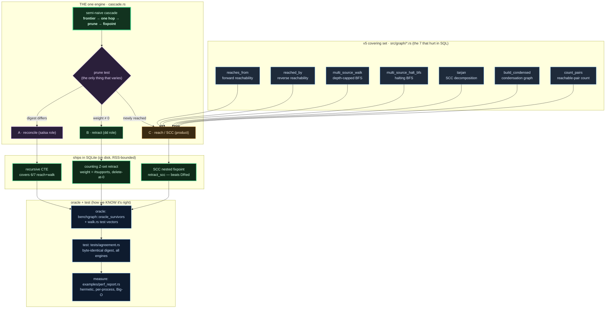
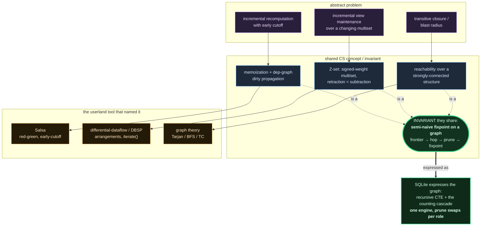

# v6 — the living map (algorithms · unification · exploration · DONE)

> **This is the governing map.** It answers three questions and is meant to be
> read top to bottom (it is tall on purpose): (1) what is the *covering set* we
> must ship, (2) *why* all of it is one algorithm, and (3) what we *explored* to
> get here and what won. The "Definition of DONE" table at the bottom is the
> contract we abide by. Living doc — edit it when a cell changes.

## How to read the graphs

- **Vertical, subgraphed by category.** Colour = category (legend at the end).
- **A node is defined once.** When the same thing must appear in another
  subgraph, it appears as a **reference node** — same colour, `↪` prefix,
  dashed border — joined to its source by a **thick dashed purple "see" edge**.
  Follow that special edge to the real definition. This keeps edge-count down.
- Wins are green-bordered, rejections red-bordered, in-flight amber-bordered.

---

## 0 · The reconciliation — are we right about "done"?

Mostly, with one correction that matters:

- ✅ **The algorithm covering set is identified and unified.** Everything v5 did
  in `src/graph/*.rs` (7 functions) is one semi-naive cascade with a swappable
  prune test. That is settled and not re-litigated.
- ⚠️ **We do NOT ship DD or Salsa.** They are the **yardstick** (dd: proves the
  O(Δ) floor and marks where a *resident* engine dies) and the **blueprint**
  (salsa: the red-green mechanism we re-express in SQL). Shipping either means
  shipping their resident-RAM model — the exact v5 36 GB-swap death v6 exists to
  kill. So "we have dd and salsa ready" really means: **we have SQLite engines
  that fill dd's and salsa's ROLES, cross-checked against dd/salsa as oracles.**
- ⚠️ **"Stretched and GUI-ready" is not done yet.** Engine matrix is 7/11 wired,
  the SCC DAG early-out has not landed, GUI/flow-panel wiring of the new engines
  is open, and `node2vec`/`similar` are not yet folded into the one-cascade model.

**DONE** = every one of the 7 covering functions runs on the on-disk SQLite
cascade, each with an independent oracle, a green byte-identical agreement test,
resident Rust RAM flat (~0.1 MB), and a measured Big-O driven toward the resident
yardstick. The table at the bottom tracks that, cell by cell.

---

## 1 · The covering set → one cascade (WHAT ships, and its oracle+test)

---

## 2 · The intersection — abstract problem ↔ CS concept ↔ why it's ONE thing

The through-line the whole arc rests on: salsa's problem, dd's problem, and the
graph-reachability problem are the **same fixpoint** because they are all graph
algorithms, and **SQLite can express graphs** (recursive CTE / the cascade).

Note the reference discipline: `Salsa` and `differential-dataflow` are **defined
here** (amber `lib` nodes). In the exploration map below they appear as
**reference nodes** (`↪`) so we do not redraw their edges.

---

## 3 · The exploration journey — what we tried, what won, what lost

Everything we put userland code against, in three lanes: **SQLite-native**,
**Rust libraries**, **raw / embedded engines**. Green border = win kept, red =
rejected with receipts, amber = in flight.

```mermaid
flowchart TB
    subgraph SQLM["lane 1 · SQLite mechanics explored"]
        sm1["recursive CTE reachability<br/><b>WIN</b> — 6/7 functions, 0 deps"]:::win
        sm2["counting Z-set (weight=support)<br/><b>WIN</b> — retract w/o DRed"]:::win
        sm3["SCC nested fixpoint in SQL<br/><b>WIN</b> — retract_scc beats DRed 6%"]:::win
        sm4["INSERT OR IGNORE into PK frontier<br/><b>WIN</b> — kills SELECT DISTINCT temp b-tree"]:::win
        sm5["WITHOUT ROWID + dense i64 key<br/><b>WIN</b> — zero-PK-storage clustering"]:::win
        sm6["update_hook + revision<br/><b>WIN</b> — trigger seam"]:::win
        sm7["DRed as recursive CTE<br/><b>LOSS</b> — 20% slower than the loop"]:::loss
        sm8["boolean-bit weight<br/><b>LOSS</b> — rejected, integer count wins"]:::loss
        sm9["broad low-selectivity autoindex<br/><b>LOSS</b> — loses to value skew"]:::loss
        sm10["SCC DAG early-out<br/><b>OPEN</b> — 4.4x counting on acyclic cuts"]:::wip
    end

    subgraph RLIB["lane 2 · Rust libraries"]
        salsa_ref(["↪ Salsa"]):::libref
        dd_ref(["↪ differential-dataflow"]):::libref
        pg["petgraph<br/><b>TEACHER</b> — Csr good, algos need own-storage; 112 B/node resident"]:::teach
        ug["ultragraph<br/><b>REJECT</b> — freeze() peaks 1.85x final size"]:::loss
    end

    subgraph RAW["lane 3 · raw / embedded / C"]
        gb["SuiteSparse:GraphBLAS<br/><b>REJECT</b> — 4/7 ops, C toolchain, NC license, 158s@depth4k"]:::loss
        lb["LadybugDB (Kuzu fork)<br/><b>REJECT</b> — buffer-pool claim fails on real data"]:::loss
        cc["ext/misc/closure.c<br/><b>REJECT</b> — dead code, gated behind SQLITE_TEST"]:::loss
        kv["mmap KV: redb / heed(LMDB) / sanakirja<br/><b>IN FLIGHT</b> — memory-first spike (G8)"]:::wip
    end

    salsa_ref -.->|see §2| SALSA_SRC["Salsa (defined §2)"]:::libghost
    dd_ref  -.->|see §2| DD_SRC["differential-dataflow (defined §2)"]:::libghost

    sm1 & sm2 & sm3 --> SHIPNODE["→ ships (see §1)"]:::win
    dd_ref --> YARD["yardstick: O(Δ) floor + resident death point"]:::teach
    salsa_ref --> BLUE["blueprint: red-green → SQL digest cutoff"]:::teach
    pg & ug & gb & lb & cc --> NOTSHIP["not shipped (resident or unavailable)"]:::loss
    kv --> QKV{"holds LESS resident RAM<br/>than sqlite/dd? (measuring)"}:::wip

    classDef win fill:#0f2a19,stroke:#3fd88b,color:#d7ffe9,stroke-width:2px;
    classDef loss fill:#2e0f0f,stroke:#ff6b6b,color:#ffd7d7;
    classDef wip fill:#241a08,stroke:#ffb454,color:#ffe9c7,stroke-width:2px;
    classDef teach fill:#1e2a3a,stroke:#5aa9ff,color:#dbeafe;
    classDef libref fill:#241a08,stroke:#ffb454,color:#ffe9c7,stroke-dasharray:5 4;
    classDef libghost fill:#241a08,stroke:#ffb454,color:#ffe9c7,stroke-dasharray:2 3;
    linkStyle 0,1 stroke:#b98cff,stroke-width:3px,stroke-dasharray:6 4;
```

---

## Legend (styling key — keep consistent across every graph here)

| colour | category |
|---|---|
| 🔵 blue border | v5 function / teacher-library / oracle+test |
| 🟢 green border | the one engine, and every SQLite WIN that ships |
| 🟣 purple border | control / salsa role / the shared invariant |
| 🟠 amber border | reach role · in-flight (WIP) · userland tool node |
| 🔴 red border | rejected with receipts (LOSS) |
| dashed border + `↪` | **reference node** — real definition lives elsewhere |
| thick dashed purple edge | the **"see" edge** from a reference to its source |

---

## Definition of DONE — the contract (living checklist)

> **2026-07-22 correction:** rows 1–7 were previously marked ✅ but NO reach/walk/
> count SQL existed in the store — the ✅ was aspirational. As of `03579e9d` all 7
> ship for real in `src/reach.rs` over `cx_dep`, each bound byte-identical to v5's
> `src/graph/{scc,walk}.rs` (vendored verbatim) by `tests/covering.rs` (5 asserts ×
> 8+ shapes incl. no-cap cycles). SCC agreement is partition-canonical (min-member).

| # | covering function | ships as | oracle | test | status |
|---|---|---|---|---|---|
| 1 | reaches_from | recursive CTE (fwd) | scc.rs (vendored) | covering.rs | ✅ earned |
| 2 | reached_by | recursive CTE (rev, ix_cx_dep_child) | scc.rs | covering.rs | ✅ earned |
| 3 | multi_source_walk | Rust-driven level BFS (halt+cap, min-depth) | walk.rs | covering.rs | ✅ earned |
| 4 | multi_source_halt_bfs | walk special-case | walk.rs | covering.rs | ✅ earned |
| 5 | tarjan (SCC) | scc_labels = fwd∩rev closure, min-member repr | scc.rs | covering.rs (partition) | ✅ correct, ⚠️ Θ(V²) lab method |
| 6 | build_condensed | derived from scc_labels + cx_dep group-by | scc.rs | covering.rs (size+cyclic+cadj) | ✅ earned |
| 7 | count_pairs | COUNT over strict closure (=v5 total) | scc.rs | covering.rs (byte-exact i128) | ✅ earned |
| — | retraction (Z-set) | counting upsert, delete-at-0 | oracle_survivors | agreement | ✅ |
| — | reconciliation (salsa role) | recursive CTE + digest cutoff | reach table | reconcile tests | ✅ mechanism, ⚠️ wired |
| — | uniform measurement | measure::run_cell → perf-runs.csv/.sqlite | out_hash vs oracle | reach_perf (turnkey) | ✅ landed `cc6cf885` |
| — | memory-optimal engine | mmap KV (candidate) | oracle_survivors | agreement | 🔄 G8 (suspect, unmerged) |
| — | full engine matrix | 0_unified | oracle | 0_unified | ⚠️ 7/11 wired |
| — | GUI / flow-panel | panel layers | — | — | ⚠️ open |
| — | node2vec / similar | (not yet unified) | — | — | ⚠️ out of the cascade model |

**Read the DONE bar off this table.** The 7 covering functions are now ✅ earned
(oracle-verified on-disk). What remains is NOT correctness: the SCC/count_pairs lab
methods are Θ(V²) closure (row 5) and must get a production Big-O (H4 DAG early-out),
G8's memory-optimal engine is unproven, and the engine matrix / GUI are unwired.
