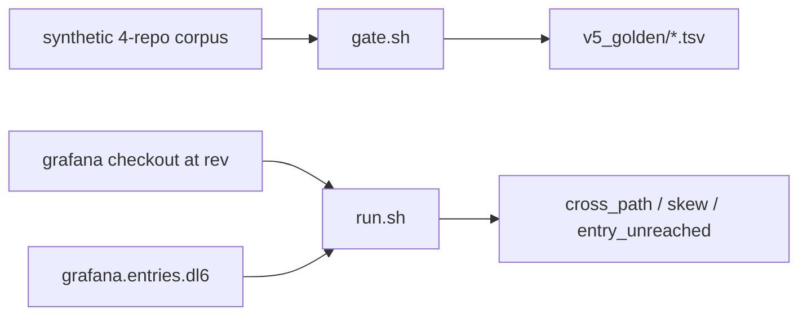

# crosswalk

Cross-repository logic, flows and paths at a pinned revision, on the Rust door.

| section | |
| --- | --- |
| [What is here](#what-is-here) | the file roster |
| [The two questions](#the-two-questions) | the gate and the program |
| [Commands](#commands) | what to type |
| [What it cannot see](#what-it-cannot-see) | stated, not hidden |

## What is here

| file | what it is |
| --- | --- |
| `gate.sh` | the four `multirepo_crawl` golden programs on the Rust door, graded |
| `crosswalk.dl6` | the cross-repository program: dep edges, reach, the crossing |
| `run.sh` | compile `crosswalk.dl6` against one fixture and fold it |
| `watch.sh` | hold it resident and sample RSS |
| `adapters/*.adapters.json` | which linked executor answers each host |
| `fixtures/grafana.tsv` | three public grafana repositories, each at one rev |
| `fixtures/grafana.sh` | materialise them, one network call per repository ever |
| `fixtures/grafana.entries.dl6` | the facts a human writes: scopes and entry points |

## The two questions



`gate.sh` answers "does the Rust door reproduce v5 byte for byte". `run.sh`
answers "what does this app reach, and where does it leave the repository".

## Commands

```bash
just crosswalk-gate                              # the graded legs
bash v6/dl/crosswalk/fixtures/grafana.sh         # the checkouts, once
bash v6/dl/crosswalk/run.sh grafana              # the reads
bash v6/dl/crosswalk/watch.sh grafana 300 30     # resident, RSS sampled
```

`SPREFA_CACHE` moves the checkout cache. `CROSSWALK_RELS` picks which rels
`run.sh` prints; `dep_gap` is off the default because a real `go.mod` puts four
figures of rows in it.

## What it cannot see

- **Across a dep edge, the match is the callee NAME**, gated by the depending
  repository's own `go.mod`. A SCIP index is per repository, so a site in A
  naming a symbol defined in B resolves to nothing at all. The match over-links
  on a name several repositories define and never says which import a site
  resolved through.
- **Reach stops at three hops** in `cross_path`, unrolled. `reached` is the
  unbounded closure and carries no hop column, because a hop-counted recursive
  rel does not terminate on a call cycle.
- **A file touch drives no tick.** `registry.pl` declares a `watch` bind whose
  executor is `live_watch`; nothing in `sprefa-engine-rs` implements one, so the
  resident door re-ticks on a posted arrival and on nothing else.
