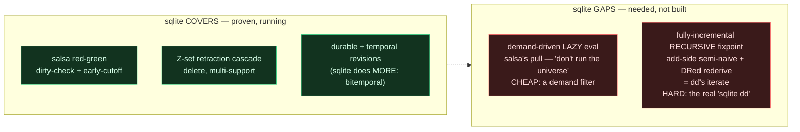
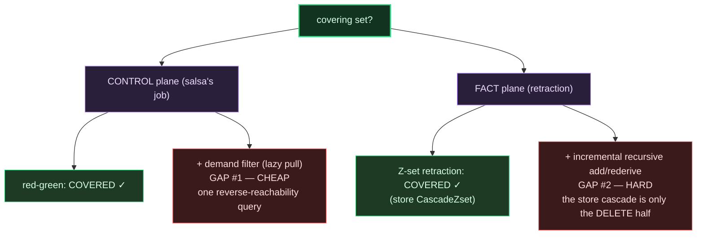

# sqlite vs dd/salsa — where it breaks, and what it can't do

The question: when does sqlite break, and which dd/salsa algorithms can sqlite NOT do
that v6 will need — or is what we have the covering set? Answer: **not quite — two
algorithms missing, one cheap, one hard.**

---

## 1 · When sqlite breaks (three walls, measured)

| wall | trigger | number | escape |
|---|---|---|---|
| **RAM** | in-memory db | 3 GB @ ~100M rows (2 GB @ 80M) | file-back it → RSS bounded (temporal-lab: 31 MB @ 3M) |
| **time (recompute)** | recompute a closure from scratch each edit | slope 2.1 · 6.5 s @ 800 nodes | don't recompute — cascade the delta |
| **wavefront** | cascade where Δ is NOT small: dense/highly-connected derived rel, one input blasts O(V) output | cascade-reach hit this: slope 2.1, no better than recompute | none in sqlite — this is the only place dd's resident arrangements win (and they pay the RAM wall) |
| single-writer | concurrent writes | serialized | infra, not an algo (daemon serializes anyway; WAL = concurrent readers) |

The one that matters: **the cascade is delta-proportional only when the delta is actually
small.** On a dense closure it degenerates to recompute. Not a bug — the shape.

---

## 2 · What dd / salsa do vs what sqlite covers

| algorithm | from | covered? | evidence / gap |
|---|---|---|---|
| red-green dirty-check + early-cutoff | salsa | **yes** | `SqlReconciler`: identical recompute counts, faster than the crate |
| demand-driven lazy (pull) eval | salsa | **no** | reconciler is EAGER (sweeps all stale); salsa computes only queried outputs + their cone |
| durable revisions / temporal as-of | (salsa is ephemeral) | **yes, more** | bitemporal on disk (temporal-lab) |
| Z-set retraction, multi-support | dd algebra | **yes** | `CascadeZset`: delta-proportional, oracle ✓ |
| semi-naive forward derivation (add, incremental) | dd / datalog | **partial** | v5 *recomputes* it; delta-add not wired incrementally |
| fully-incremental recursive fixpoint, both directions (DRed) | dd `iterate` | **no** | cascade is the DELETE half only; add-side + delete-then-rederive-alternate-paths missing |
| shared resident arrangements | dd | **n/a by design** | sqlite trades resident index reuse for on-disk indexes: bounded RAM, higher wall time |

---

## 3 · Is it the covering set?

**No — two algorithms still missing:**

**Gap #1 — demand-driven laziness (cheap).** Salsa computes only what you ask for.
`SqlReconciler` recomputes *every* stale rel. To get "don't run the universe," intersect
the dirty set with the ancestors of the queried outputs and recompute only that — one
reverse-reachability query added to the reconciler we already have.

**Gap #2 — fully-incremental recursive fixpoint (hard).** The real dd-`iterate` capability.
`CascadeZset` is only its **retraction half**: it cascades deletes over a *given* support
graph. It does NOT (a) incrementally maintain that support graph as edges are ADDED
(semi-naive forward delta), nor (b) do proper DRed for a recursive relation — over-delete,
then re-derive the pairs still reachable by an alternate path. v5 sidestepped this by
recomputing the whole fixpoint (the sqlite-reach baseline). This is the one genuine dd
capability sqlite doesn't yet have, and it is exactly "the sqlite dd" done in full.

---

## Verdict

| plane | covered | missing | difficulty |
|---|---|---|---|
| control (reconcile) | salsa red-green ✓ | demand filter (lazy) | cheap |
| fact (retract) | Z-set retraction ✓ | incremental recursive add + DRed rederive | hard |

Two engines already prove the covered half runs and matches. The uncovered half is one
small filter and one hard engine (`cascade_reach` v2 = the store cascade + add-side
semi-naive + DRed), which is the next build if we want the full covering set.
