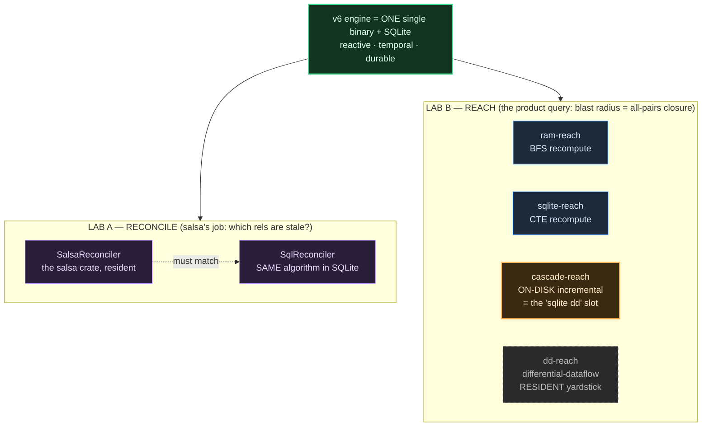
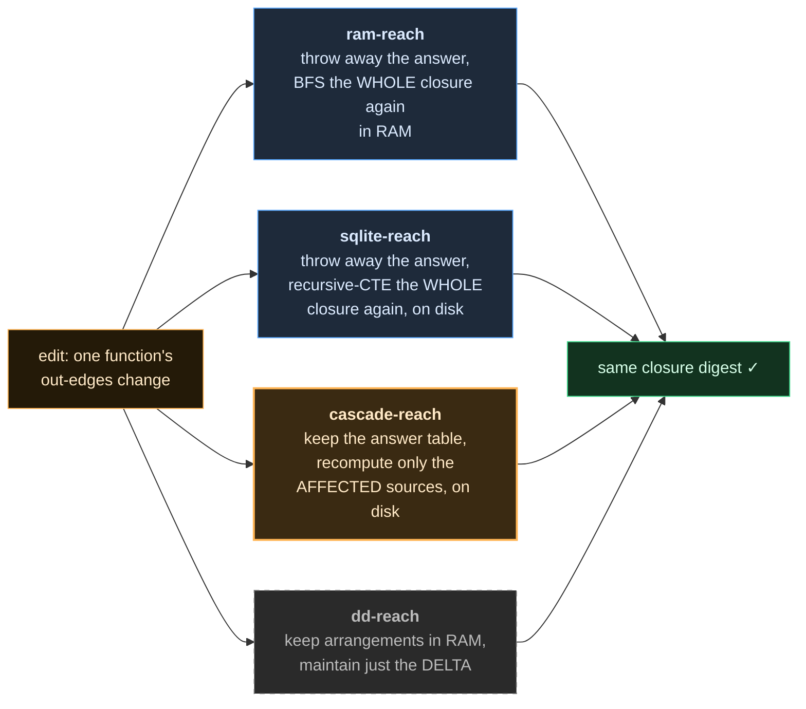
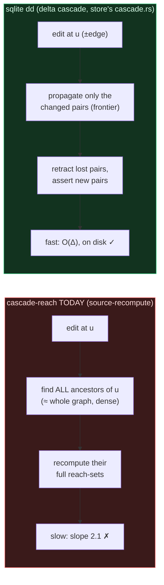
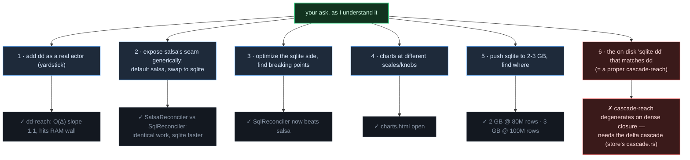

# labkit — every engine, painfully clear (and where "sqlite dd" is)

There are **two separate labs**. They do not share engines. The names collided
(`sqlite-reach` vs `SqlReconciler`) and that caused the fog.

---

## LAB A — RECONCILE (salsa's job)

Two engines. Both maintain the digest of a dep DAG under edits. Same work, swappable.

| engine | where | what it is |
|---|---|---|
| **`SalsaReconciler`** | resident (RAM) | the real salsa crate does the red-green dirty-check |
| **`SqlReconciler`** | SQLite | the SAME dirty-check as a SQL sweep (revisions + digests in tables) |

**Proven:** identical recompute counts + identical answers at every scale; `SqlReconciler`
is 1.1–1.5× faster than the salsa crate. This is "salsa = reconciliation you can do in SQL."

This lab is NOT about reach. Ignore it when you're thinking about blast radius.

---

## LAB B — REACH (the product query: blast radius)

**All four compute the exact same thing** — the all-pairs transitive closure of the call
graph — and must produce byte-identical digests (they do, ✓). They differ only in *how*.

| # | engine | where | strategy | incremental? | measured (800 nodes) |
|---|---|---|---|---|---|
| 1 | **ram-reach** | RAM | BFS recompute from scratch each tick | no | 428 ms · slope ~1.7 |
| 2 | **sqlite-reach** | SQLite disk | recursive-CTE recompute from scratch | no | 6643 ms · slope 2.1 |
| 3 | **cascade-reach** | SQLite disk | keep `reach` table, recompute affected sources | *tries to be* | 8408 ms · slope 2.1 |
| 4 | **dd-reach** | RAM (resident) | differential arrangements, delta only | **yes, O(Δ)** | 102 ms · slope 1.1 |

- **1 & 2 are the naive baselines** (recompute everything) — the cost incrementality must beat.
- **4 (dd) is the yardstick** — it flattens the slope (102 ms vs 6643 ms) but is RESIDENT:
  memory slope 1.86 (1.7→75.7 MB), the path into the 5 GB gun. Benchmark only, does not ship.
- **3 (cascade-reach) is your "sqlite dd" slot** — the on-disk engine that should match dd's
  O(Δ) *and* survive the gun. **It does not yet.** See below.

---

## Where is "sqlite dd"? → `cascade-reach`, and it is NOT working yet

"sqlite dd" = an on-disk engine that maintains the closure **differentially** like dd, so it
gets dd's O(Δ) speed but keeps facts on disk (bounded RAM, survives the gun). The store crate
already proved this exists ("feldera in sqlite" = the semi-naive DRed cascade in `cascade.rs`).

`cascade-reach` is my first attempt at it, and the measurement says it **failed to be O(Δ)**:

- It is **correct** (digest ✓ every scale) and **bounded on disk** (mem slope 0.16). Good.
- But it is **as slow as full recompute** (8408 ms vs sqlite-reach 6643 ms, both slope 2.1). Bad.

**Why:** my version recomputes every *affected source* = every node that can reach the edited
node. On this graph the closure is dense (each node reaches ~375 others at 800 nodes), so the
"affected sources" set is almost the whole graph → it degenerates to full recompute.

The real "sqlite dd" must propagate the **delta** itself (the store's semi-naive
frontier→hits→next with retraction), not recompute sources. That is the next pass, and it is
the one you warned took several iterations.

---

## So, what I think you asked us to do

If that last box (**6 · the real sqlite dd = delta cascade with retraction**) is the thing you
most wanted and I've been circling it — say so, and I port the store's `cascade.rs`
semi-naive DRed as `cascade-reach` v2, which is the one that should actually match dd on speed
while staying on disk.
