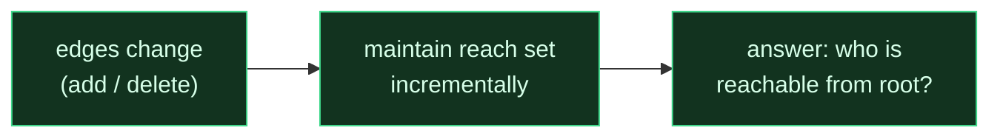
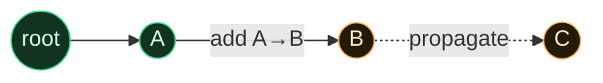
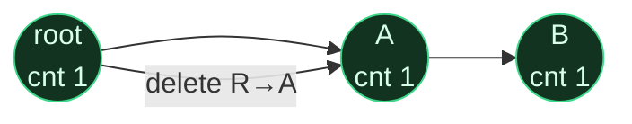
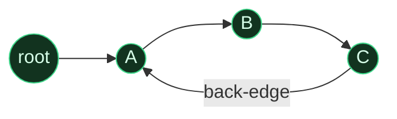
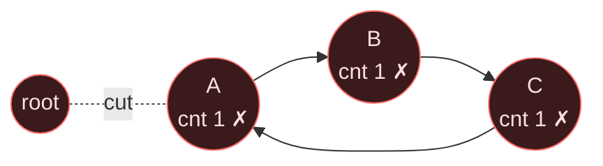
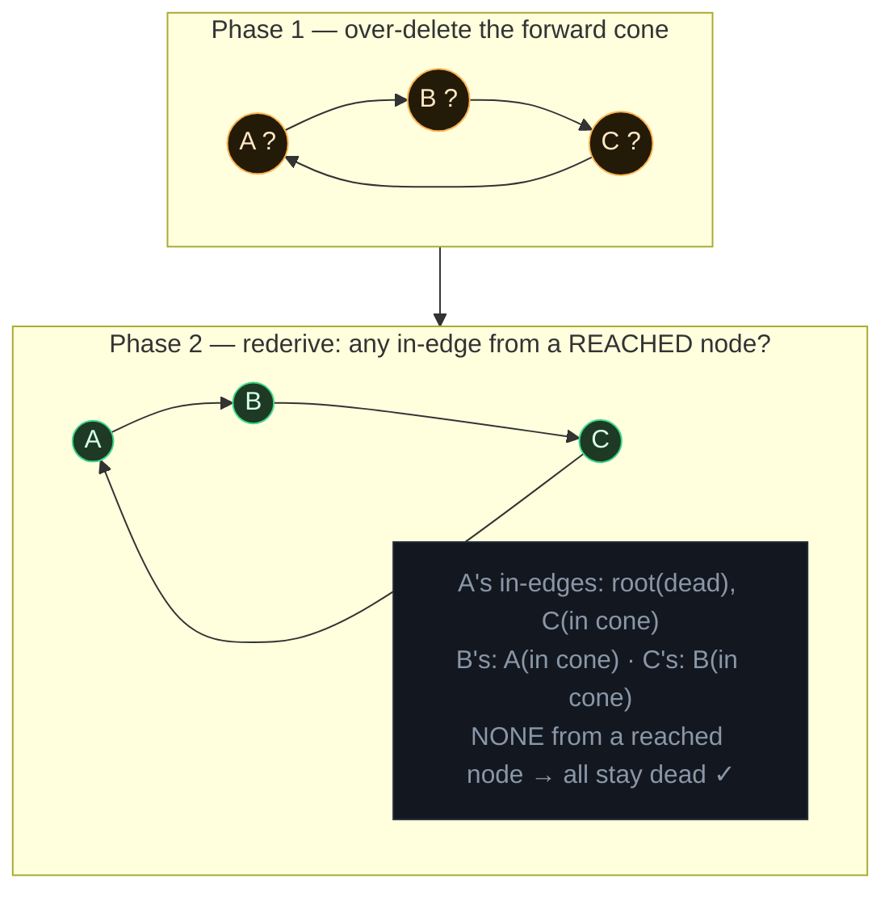
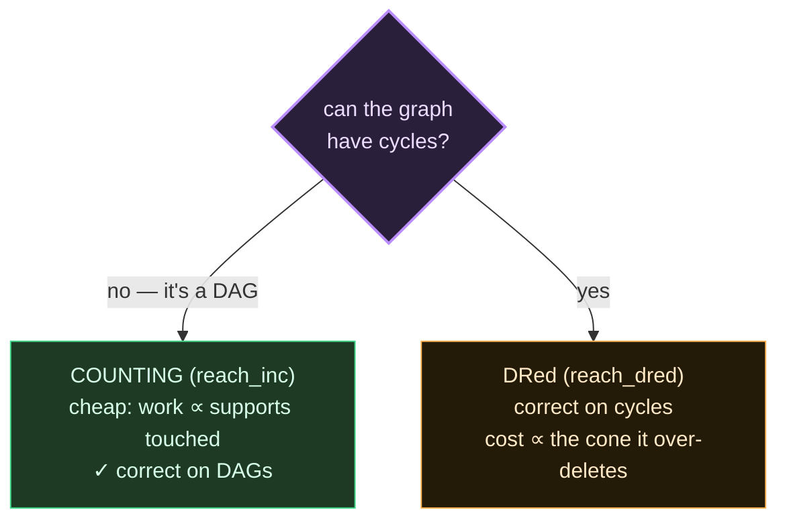
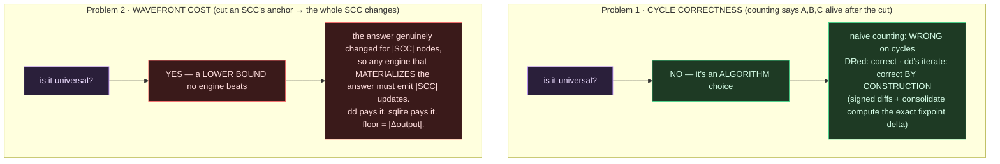
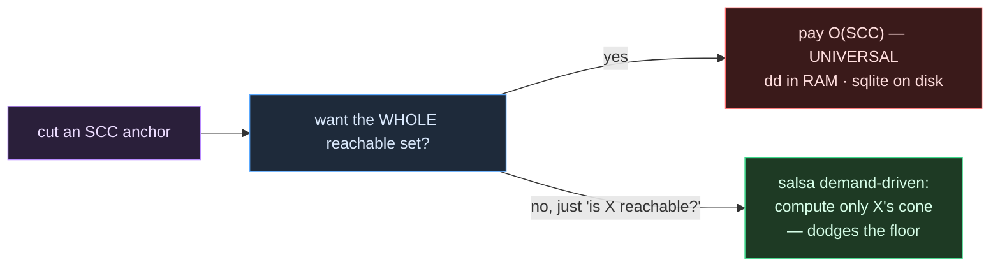

# Why DRed — from scratch

## 0 · The job

Keep "which nodes are reachable from the root" **up to date as edges are added and
deleted**, without recomputing from scratch every time. That's it. `reach` is a derived
set; edges change; we maintain `reach` incrementally.

---

## 1 · Adds are easy

Add an edge into a node that's already reachable → its target becomes reachable → keep
going forward. It only ever ADDS to the set. Nothing can become unreachable by adding an
edge. One forward sweep, done. (This never needed DRed.)

---

## 2 · Deletes are the hard problem

Delete an edge and some nodes **might** become unreachable — but only if they had no OTHER
path. The whole difficulty is: *how do you know if another path still exists?*

There are two ways to answer that. This is the entire fork in the road.

---

## 3 · Way A — Counting (weights). Cheap. **Wrong on cycles.**

Each node remembers **how many reachable parents support it**. Reachable ⇔ count > 0.
Delete an edge → decrement the target. Hits 0 → it dies → cascade the decrement forward.

On a tree/DAG this is perfect and fast (`reach_inc` in the lab):

Delete R→A: A's count 1→0, dies; cascade → B 1→0, dies. Correct. 

### The catch: a cycle feeds itself

Now put a cycle in. Root reaches A; A→B→C→**A** is a loop.

Counts (how many reachable parents):

| node | supported by | count |
|---|---|---|
| A | root, **C** | 2 |
| B | A | 1 |
| C | B | 1 |

**Delete the only real edge, root→A.** A loses root, so A: 2 → 1. Still positive (C still
"supports" it). Cascade stops. Counting says **A=1, B=1, C=1 → all still reachable.**

But look at the picture: root is gone. A, B, C are a little island with no way in. **They
are unreachable — and counting says the opposite.** The cycle keeps its own counts alive
forever. This is not a tuning bug; counting is fundamentally blind to "the support is a
loop with no anchor."

---

## 4 · Way B — DRed (Delete and Rederive). Correct on cycles.

Don't trust counts. On delete, do two phases:

**Phase 1 — over-delete.** From the deleted edge's target, walk FORWARD and tentatively
mark the whole reachable cone as un-reached — cycle and all. Pessimistic: assume it might
all be dead.

**Phase 2 — rederive.** Bring back any node that STILL has an edge from a node that is
*genuinely* reached (a node OUTSIDE the cone, or the root). Propagate that forward. A dead
cycle has no such incoming edge, so it stays dead.

Same example, delete root→A:

DRed gets it right: A, B, C correctly unreachable. Counting got it wrong. **That is the
only reason DRed exists** — it is the price of a correct answer when the graph has cycles.

If instead A also had a second real edge (say root→C), phase 2 would find C's in-edge from
root (reached) → C comes back → B and A come back through the cycle. DRed restores exactly
the nodes with a genuine anchored path. Correct either way.

---

## 5 · The decision — which one to use

**Why we care:** real code graphs are NOT DAGs. Call graphs have recursion; module graphs
have mutual imports; type graphs have mutually-recursive types. Cycles are normal. So for
those relations, counting would silently give wrong answers, and **DRed is the correct
engine.** For relations that are guaranteed acyclic, counting is cheaper and we'd use that.

That's the whole point of labbing both: not to ship two things, but to know **counting is
the fast path for DAGs, DRed is the correct path when cycles are possible** — and to
measure what DRed costs.

---

## 6 · What DRed costs (measured)

DRed over-deletes a whole cone, then rederives it. So its cost ∝ **the size of that cone**,
not the corpus:

| graph | root reaches | ms/round | note |
|---|---|---|---|
| sparse, small cone | ~0% | 9.5 ms | cheap — cone is tiny |
| dense SCC | 94% | 105 → 2044 ms as corpus grows | breaks — cone ≈ the whole reachable set |

- **Small cone → delta-proportional and cheap.**
- **One giant strongly-connected component → the cone is everything → O(reachable).** This
  is the "wavefront wall": deleting one edge in an SCC tentatively unreaches the whole SCC
  before rederiving it. No on-disk engine escapes this; only dd's resident arrangements do,
  and they pay in RAM.
- SQLite's own heap stayed **2.8 MB** at every scale — the on-disk win holds regardless.

---

## 7 · Does dd+salsa fix it, or is it universal? (both — different "its")

There are TWO problems in this doc. They have OPPOSITE answers.

### Problem 1 (cycles) — dd fixes it by its algorithm, NOT because it's magic

dd's `iterate` doesn't naive-count. It maintains the fixpoint with **signed weights +
consolidation**, so when the anchor is cut it correctly drives the whole SCC to weight 0.
That's dd being a *correct* incremental algorithm, and **sqlite gets the identical
correctness by using DRed** (we measured: equiv ✓ on cyclic graphs). So this is not a
dd-only superpower — it's "use a correct algorithm." Counting is the wrong one; DRed and dd
are both right.

### Problem 2 (wavefront) — universal, hits dd and sqlite equally

If deleting one edge genuinely makes |SCC| nodes unreachable, the **output really changed
by |SCC|**. Any engine that keeps the full materialized answer must emit |SCC| changes.
That's a lower bound from the *question*, not a weakness of any engine:

| engine | work on the cut | where |
|---|---|---|
| dd | ≈ |Δoutput| = O(SCC) | **resident RAM** (arrangements) → grows → gun wall |
| sqlite DRed | O(cone) ≥ |Δoutput| (over-delete + rederive = pays the cone ~twice) | **on disk** → RAM bounded (2.8 MB) |

dd has the better constant (arrangements compute the exact delta; DRed over-approximates
with the cone). But **neither goes below |Δoutput|.** dd does not "fix" the wavefront cost —
it pays it in RAM instead of on disk.

### The only real escape — and it's salsa's property, not dd's

You dodge the wavefront cost only by **not materializing the whole answer**: demand-driven /
lazy evaluation. If you ask "is node X reachable?" instead of "give me the whole reachable
set," salsa computes just X and its dependency cone — the SCC's full delta is never paid
because you never asked for all of it. That's the one lever that beats the lower bound, and
it works by **changing the question** (pull one answer) rather than by a faster algorithm.

### So, precisely

| the "it" | universal? | who fixes / pays |
|---|---|---|
| cycle correctness | **no** — algorithm choice | dd correct by construction; sqlite correct via DRed; counting is the wrong algo |
| wavefront cost when Δoutput is large | **yes** — lower bound = |Δoutput| | dd pays in RAM, sqlite on disk; neither beats it |
| escaping the wavefront cost | — | only by NOT materializing all of it → salsa's demand-driven pull |

---

## TL;DR

- Maintaining reach under **adds** = easy (propagate forward).
- Under **deletes** = the hard part.
- **Counting** the supports is cheap but a **cycle keeps itself alive after being cut** → wrong.
- **DRed** (over-delete the cone, then rederive the genuinely-anchored nodes) fixes exactly
  that → correct on any graph, at the cost of touching the whole cone.
- Code graphs have cycles, so **DRed is the correct engine**; counting is the fast path only
  when a relation is provably acyclic.
