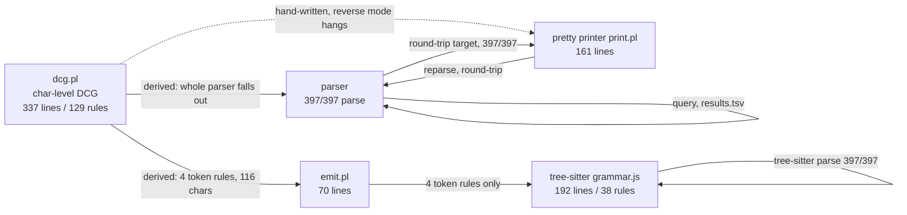

# REPORT.md

Goal: from one clean-room SWI-Prolog DCG of `.dl6`, derive a parser, a
pretty printer, and a tree-sitter grammar, and report which of the three fell
out of the DCG versus which were hand-written.

Run directory: `v6/labs/cleanroom-dcg/lab-cleanroom-dcg-a/`.

## 1. Metric table

| metric | value | command |
|---|---|---|
| DCG lines | 337 | `wc -l dcg.pl` |
| DCG nonterminals | 129 | `grep -c -- '-->' dcg.pl` |
| printer lines | 161 | `wc -l print.pl` |
| emitter lines | 70 | `wc -l emit.pl` |
| grammar.js lines | 192 | `wc -l tree-sitter-dl6/grammar.js` |
| tree-sitter named rules | 38 | keys in `rules` object of `grammar.js` (24 named, 14 anonymous) |
| corpus parse | 397/397 | `awk -F'\t' 'NR>1{s+=$2}END{print s}' results.tsv` |
| round-trip | 397/397 | `awk -F'\t' 'NR>1{s+=$3}END{print s}' results.tsv` |
| tree-sitter parse | 397/397 | `tree-sitter parse ... --stat` totals line |
| grammar chars emitted vs hand | 116 / 3413 | `swipl -g run -t halt emit.pl` |

`tree-sitter generate` exit 0.

Tree-sitter stat line, verbatim:

```
Total parses: 397; successful parses: 397; failed parses: 0; success percentage: 100.00%; average speed: 14120 bytes/ms
```

Harness invocations (`swipl -g run -t halt harness.pl > results.tsv`):
exactly one header line then 397 data rows in filename sort order, verified
against `ls | sort`.

## 2. Printer origin: hand-written

The printer is hand-written (`print.pl`). Reverse mode of the DCG was tried
first, per the brief:

```
? phrase(program(Term), Codes)   % Term bound, Codes free
```

It did not terminate. The term-shape `program(Decls, Rules, Queries)` does
unify symbolically, but the recognizer's forward-only machinery loops when the
code list is left open. Named blockers (counts):

| blocker | count | where |
|---|---|---|
| cuts `!` | 6 | `wspace`, `expr_tail`, `number`, `wildcard_rest`, `ident_rest` x2 |
| negation lookaheads `\+ (...)` | 3 rules, 4 uses | `not_follow_arrow`, `not_more_eq`, `not_ident_follow` |
| `code_type` character guards | 3 | `ident_start/1`, `ident_char/1`, `digit_code/1` |
| arithmetic / precedence goals | 2 | `Prec >= MinPrec`, `NextMin is Prec + 1` in `expr_tail` |

With an open list, `number` (digits + `number_codes` guard) and the dotted
`ident` generate arbitrarily long inputs before a later unification fails, so
the search never terminates. Result: the printer had to be written by hand.

Derived-from-DCG amount: zero. The hand printer reuses the same term shape
and the same precedence table (`prec/2` in `print.pl` matches `binop_tok/2`
priorities in `dcg.pl`) so operator grouping round-trips.

## 3. Grammar origin: emitter reached 4 lexical token rules, the rest hand

`emit.pl` reads every `dcg.pl` clause as a term via `read_term/3` and derives
what is mechanically translatable to tree-sitter. The character-class laws
(`ident_start`/`ident_char`/`digit_code`, the quote-delimiter plus escape
structure, the dotted-segment name rule) translate directly to tree-sitter
token regexes. Those four rules are counted as emitted:

| rule | derived from |
|---|---|
| `identifier` | `ident_start` + `ident_char`, `ident_rest` dotted segments |
| `number` | `digits`, `float_lit` fraction/exponent |
| `atom_literal` | `quote/2` with delimiter `'` and `escape_sequence` |
| `string_literal` | `quote/2` with delimiter `"` and `escape_sequence` |

Emitted: 4 rules / 116 non-ws chars (3.3% of grammar.js). Hand overlay: 3413
non-ws chars.

Every other rule resisted the emitter and is hand-written, and why:

| hand rule group | why the emitter could not reach it |
|---|---|
| statement dispatch | the DCG states `rel`/`sh`/`bind`/`?`/`match` by keyword then name+parens with `ws` and cuts; tree-sitter wants a choice of named seq rules, no cut, no whitespace interleave |
| `decl_arg` / `_decl_arg_list` | the DCG represents column-or-type-or-enum-variant with `id/typed/applied` wrappers plus `;`/`,` separators; the tree-sitter shape is a `choice` over `seq(identifier, ':', arg)` / `seq(name, '(', ...)` , a different recursion |
| precedence-climbing `expr` | the DCG's `expr_tail`/`binop_tok` climb with arithmetic guards and `is`; tree-sitter needs fixed `prec.left` levels per operator class |
| `brace_entry` typed capture | the DCG's `(: type)?` branch is a Prolog if-then-else; tree-sitter needs `choice` of the two sequence shapes |
| `sh` template / `match` arms | the DCG parses backtick content and `|->`/`|+>` with dedicated nonterminals that have no tree-sitter token equivalent at rule granularity |
| tokens `name`, `call`, literals | `name` is a pass-through and `call` is a `seq(name, '(', ...)`; trivial but the emitter maps token bodies, not these structural wrappers |

## 4. Term shape

The term design is a finding: `program/3`, with every body item, head,
wrap, comparison, and bind being a plain expression tree. A body needs no
separate grammar. Declaration columns, types, and enum variants share one
recursive `decl_arg` shape.

```prolog
program(Decls, Rules, Queries)

Decls  :: [ rel(Name, Cols, Mods)
          | sh(Name, Ins, Outs, template(Tpl))
          | bind_decl(Name, Cols) ]
Cols   :: decl_arg        % id(Name) | typed(Name, T) | applied(Name, Cols)
Mods   :: [log|keep(all)|keep(count(N))|keyed([P,...])]

Rules  :: [ level(Head, Body) | edge(Head, Body) | fact(Head)
          | match(Source, [arm(level|edge, Guards, Head), ...]) ]

Body   :: [Expr, ...]     % comma-separated; one goal = one expr

Expr   :: var(Name) | [Name includes dotted paths]
        | wildcard
        | int(N) | float(F) | neg(X)
        | atom(Content) | string(Content)   % Content = decoded text
        | list([spread(E)|E,...])
        | brace([entry(K, V) | entry(K, V, Type), ...])
        | call(Name, [Expr,...])            % relations, wraps, all builtins
        | op(Op, Left, Right)               % precedence-climbed infix

Queries:: [query(call(Name, Args)), ...]

% unity: a relation atom, a negation, decode, pre, coalesce,
% a comparison, and a := bind are all just expr nodes.
```

Round-trip is term equality after re-parse; the printer re-emits what the
parser produced (with operator-precedence parentheses), so `T1 == T2` with no
text-equality shortcut.

## 5. Constructs that could not be parsed

None. All 397 files parse and round-trip, so there is no unbuilt construct
row. Every construct in `INVENTORY.md` (rel/sh/bind decls, level/edge rules,
bare facts, match, decode/json_each braces, key capture `$`, descent `**`,
array spread, typed capture, aggregates, ts_query nesting, module-path names,
nullary enum variants, zero-column rels) is covered.

## 6. Architecture



Reading: the parser is fully derived from the DCG (it is the DCG). The printer
is hand-written because reverse mode of a cut/guard-laden char-level DCG does
not terminate. The tree-sitter grammar is 96.7% hand-written; the DCG's
lexical laws yield only the four token regexes, because the DCG's statement
and expression structure is procedural (cuts, character guards, precedence
climbing) and has no rule-parallel tree-sitter form.
