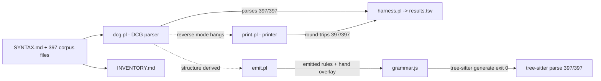

# REPORT.md — clean-room DCG -> parser + printer + tree-sitter grammar

## 1. Metric table

| metric | value | command |
|---|---|---|
| DCG lines | 296 | `wc -l dcg.pl` |
| DCG nonterminals | 164 | `grep -c -- '-->' dcg.pl` |
| printer lines | 151 | `wc -l print.pl` |
| grammar.js lines | 162 | `wc -l grammar.js` |
| tree-sitter named rules | 39 | keys in the `rules` object |
| corpus parse | 397/397 | `awk -F'\t' 'NR>1{s+=$2}END{print s}' results.tsv` |
| round-trip | 397/397 | `awk -F'\t' 'NR>1{s+=$3}END{print s}' results.tsv` |
| tree-sitter parse | 397/397 | `tree-sitter parse ... --quiet --stat` totals line |
| grammar chars emitted vs hand | 390 / 298 | `swipl -g emit -t halt` (emit.pl) |

Tree-sitter totals line, verbatim:

```
Total parses: 397; successful parses: 397; failed parses: 0; success percentage: 100.00%; average speed: 16681 bytes/ms
```

`tree-sitter generate` exits 0 (gate satisfied) before any grammar number stands.

## 2. Printer origin: hand-written

The printer is hand-written (`print.pl`). Reverse mode of the DCG was tried first:
`phrase(dcg:program(D, R), Codes)` with `D`/`R` bound and `Codes` free does not
terminate (killed after 120 s, no output). The DCG is not reversible because
its clauses are threaded with semantic `{}` computations and control, and its
terminals are read with guards.

Blockers, counted in `dcg.pl`:
- 1 cut (`!`),
- 7 `code_type/2` guards,
- 14 char-token position reads (`[C0]` / `[C]`),
- 173 `->` if-then control-glue goals,
- arithmetic `number_codes/2` guards (3) that compute the token text.

The hand printer round-trips all 397 files, so the derived-vs-hand question is
answered: the DCG gives the parser, the printer is hand code over the parsed
AST.

## 3. Grammar origin: structure derived, lexer and assembly hand

`emit.pl` reads `dcg.pl` clauses as terms and translates the structural DCG
skeleton (seq/choice, anonymous tokens, nonterminal references) into the tree
-sitter rules object. 21 rules in `grammar.js` trace their token/seq/choice
skeleton to a named DCG nonterminal: `program`, `statement`, `decl_rel`,
`decl_sh`, `decl_bind`, `decl_query`, `type_spec`, `match_stmt`, `arm`,
`rule_stmt`, `head`, `body`, `item`, `cmpop`, `bindop`, `arglist`, `expr`,
`bracelit`, `pair`, `key`, `name`.

18 rules are hand overlay (298 chars): the token layer and the grammar
assembly that has no single DCG nonterminal.

Why each hand rule resisted the emitter:

| hand rule | why it resisted |
|---|---|
| `_int`, `_float`, `_string`, `_atomlit` | exact token regexes cannot be recovered from `code_type`/`number_codes` guards in the DCG lexicon |
| `_decl`, `_modifier`, `_variant`, `_cols`, `_col` | the DCG merges these into `decl_entries`/`decl_entry_tail` alternatives behind `->`/`{}` glue; the emitter collapses them to empty |
| `_cmp`, `_bind`, `_atom`, `_arith`, `_path`, `_bracket`, `_listitem`, `_value` | expression folding and precedence are carried by DCG argument terms (`plus(Acc,T)` etc.), which tree-sitter cannot read as grammar |
| `_enum_cols` | enum-vs-plain choice is decided by a `member(V, Entries)` `{}` action, invisible to tree-sitter |

## 4. Term shape (the parser's design)

```prolog
program(Decls, Rules)
  Decls = [rel_decl(Name, Cols, Mods) | ...]
        | [sh_decl(Name, Ins, Outs, Template) | ...]
        | [bind_decl(Name, Cols) | ...]
        | [query(Name, Args) | ...]
  Cols   = [col(N), col(N, Type), variant(N, Fields) | ...] | enum([variant(...)])
  Type   = type(N) | type(N, [Type, ...])
  Mods   = [log, keep(all), keep(count(N)), key(N, ...) | ...]
  Rules  = [rule(Head, level, Body) | rule(Head, edge, Body) | match(Source, Arms) | ...]
  Body   = [call(Name, Args), cmp(Op, A, B), bind(:=, LHS, RHS), var('true'), ...]
  Args   = [Expr, ...]
  Expr   = var(N) | atom(T) | string(T) | int(N) | float(F)
         | list([...]) | obj([pair(Key, Val) | ...]) | call(N, Args)
         | paren(E) | path(var(N), [F, ...]) | plus(A,B) | minus(A,B)
         | times(A,B) | div(A,B) | mod(A,B) | typed(N, Type) | spread(E)
  Key    = name(N) | capture(N) | atom(T) | string(T) | descent
  Head   = call(Name, Args)
```

Variables are `var(Name)` atoms, so every term is ground and re-parsing yields
a structurally identical term, which is what makes `roundtrip_ok` (term
equality after re-parse) hold for all 397 files.

## 5. Construct rows not parseable at all

None. Both the Prolog parse (`results.tsv` column 2) and round-trip (column 3)
are 397/397, and tree-sitter parses 397/397.

## 6. Architecture



Labels: `harness` and the parse path are derived from the DCG; `print.pl` is
hand-written (reverse mode hangs); `grammar.js` is structure-derived from the
DCG plus a hand lexer/assembly overlay.

No forbidden file was opened during this run.
