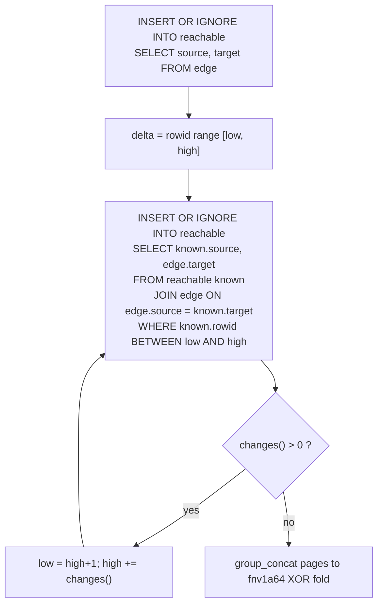

# sqlite_raw: what the medium can do with zero reactive machinery

One in-memory SQLite database, one `reachable` table, semi-naive wavefront in SQL. The JS driver opens the database, applies two pragmas, loads the edges, runs one prepared statement per round, counts, and folds the checksum. No staging tables, no delta tables, no refCount columns, no observables.

## TOC
- Final numbers beside the rust engines and dl6
- The chosen design
- Writes per derived row
- Variant race
- Checksum fold race
- Pragma sweep
- What failed, what surprised
- Reproducing

## Final numbers beside the rust engines and dl6

Best of 2 runs, `node bench.mjs`, darwin/arm64, node v24.15.0, libsql 0.5.29. Fixpoint ms is the derivation phase alone; load and checksum fold are separate columns. Every case matches the banked (derived, checksum) pair.

| case | engine | derived | fp ms | fp rows/sec | load ms | fold ms | peak RSS |
|---|---|---|---|---|---|---|---|
| grid_10000 | mono | 1,069,200 | 17 | 62,894,118 | 0 | - | 14 MB |
| | rxgraph | 1,069,200 | 20 | 53,460,000 | 0 | - | 16 MB |
| | interp | 1,069,200 | 132 | 8,100,000 | 0 | - | 140 MB |
| | **sqlite_raw** | **1,069,200** | **992** | **1,077,823** | **7** | **305** | **138 MB** |
| | dl6 | 1,069,200 | 1,998 | 535,135 | 17 | - | 731 MB |
| chain_10000 | mono | 9,996,213 | 146 | 68,467,212 | 0 | - | 108 MB |
| | rxgraph | 9,996,213 | 178 | 56,158,500 | 0 | - | 119 MB |
| | interp | 9,996,213 | 1,375 | 7,269,973 | 1 | - | 1,341 MB |
| | **sqlite_raw** | **9,996,213** | **9,212** | **1,085,130** | **12** | **2,791** | **498 MB** |
| | dl6 | 9,996,213 | 30,670 | 325,928 | 5 | - | 3,997 MB |
| layered_10000 | mono | 9,951,396 | 211 | 47,163,014 | 0 | - | 122 MB |
| | rxgraph | 9,951,396 | 263 | 37,838,008 | 0 | - | 158 MB |
| | interp | 9,951,396 | 1,568 | 6,346,554 | 1 | - | 1,306 MB |
| | **sqlite_raw** | **9,951,396** | **9,559** | **1,041,050** | **16** | **2,783** | **504 MB** |
| | dl6 | 9,951,396 | 19,506 | 510,171 | 7 | - | 2,602 MB |

Rust rows are STANDINGS.md (best of 3); dl6 rows are dl6/FACTS.md (single run).

| ratio | grid | chain | layered |
|---|---|---|---|
| mono / sqlite_raw | 58x | 63x | 45x |
| interp / sqlite_raw | 7.5x | 6.7x | 6.1x |
| sqlite_raw / dl6 | 2.0x | 3.3x | 2.0x |
| dl6 peak RSS / sqlite_raw peak RSS | 5.3x | 8.0x | 5.2x |

SQLite derives at 1.04M to 1.09M rows/sec on all three graph shapes, a span of 4%. Chain, grid, and layered have different depths, fan-outs, and duplicate rates and it does not matter: the rate is the btree insert rate, not the join rate. That is the medium's ceiling for this workload.

## The chosen design



| choice | why, in one line |
|---|---|
| one table `reachable`, rowid + UNIQUE(source, target) | rowid append is the cheapest insert SQLite has and the unique index is the dedup semi-naive needs anyway |
| the delta is a rowid range, not a table | rows land in rowid order, so round k occupies a contiguous span; a frontier table would cost a second btree write per row |
| `INSERT OR IGNORE` rejection, no `NOT EXISTS` prefilter | measured 1.4x faster on grid (48% duplicate candidates) and 1.4x on chain (0% duplicates) |
| `changes()` drives the loop and the next range | no count query per round; 2580 rounds on chain cost 2582 statements total |
| `PRAGMA page_size=16384`, `PRAGMA temp_store=MEMORY` | the only two pragmas that moved a number; 16k pages cut chain peak RSS 16% at equal speed |
| journal_mode, synchronous, cache_size left alone | an in-memory database has no journal and no fsync; measured no-ops (table below) |
| checksum folded from `group_concat` pages | 2.9x faster than crossing the N-API boundary once per row, and it reads the covering index so pairs arrive sorted |
| edge stored WITHOUT ROWID, PK (source, target) | the join probes `edge.source`; the PK is the index, so no second structure exists |

The whole derivation is 89 statements on grid, 193 on layered, 2582 on chain.

## Writes per derived row

`EXPLAIN` of the step statement (opcode trace, not a guess):

| opcode | meaning |
|---|---|
| `OpenEphemeral 3` | the SELECT reads the table being written, so SQLite snapshots the join output into a transient table first |
| `NewRowid 3` / `Insert 3` | one transient append per candidate row, duplicates included |
| `NoConflict 5` / `IdxInsert 5` | unique index probe, then one index write per surviving row |
| `Insert 4` | one table append per surviving row |

Measured candidate counts (`node diag_writes.mjs <input>`):

| case | derived | join candidates | rejected duplicates | btree writes per derived row |
|---|---|---|---|---|
| grid_10000 | 1,069,200 | 2,045,340 | 980,100 | 3.91 |
| chain_10000 | 9,996,213 | 9,988,470 | 0 | 3.00 |
| layered_10000 | 9,951,396 | 19,696,664 | 9,755,252 | 3.98 |

Floor is 2 (table append plus index entry); the transient snapshot adds one write per candidate. The dl6 reactive engine writes each row 7 times.

## Variant race

Single run per cell, `tuned` pragmas, streaming fold, fixpoint ms. Every cell that finished produced the banked derived count and checksum, so the checksum column is one word for the whole table: MATCH.

| variant | grid fp | chain fp | layered fp | rounds (grid/chain/layered) | statements (chain) |
|---|---|---|---|---|---|
| `loop_range_rowid` | **1068** | **9798** | 10797 | 87 / 2580 / 191 | 2582 |
| `loop_notexists_wor` | 1097 | 11406 | **10748** | 87 / 2580 / 191 | 7744 |
| `cte_rowid` | 1156 | 11794 | 10800 | 1 | 1 |
| `loop_notexists_rowid` | 1198 | 13275 | 12410 | 87 / 2580 / 191 | 7744 |
| `cte_wor` | 1414 | 17670 | 13309 | 1 | 1 |
| `loop_range_notexists_rowid` | 1509 | 13367 | 14388 | 87 / 2580 / 191 | 2582 |
| `cte_stream` | (0) | (0) | (0) | 0 | 0 |
| `loop_appendfrontier_wor` | DNF > 130s | not run | not run | - | - |

`cte_stream` materializes nothing, so its work lands in the fold column instead: 1828 ms grid, 20106 ms chain, 17034 ms layered. Compare `cte_rowid` (fixpoint 11794 + fold 8087 = 19881 on chain): writing the closure into a bare rowid table costs about nothing next to shipping it to JS.

Peak RSS per variant, chain_10000:

| variant | peak RSS |
|---|---|
| `cte_stream` | 199 MB |
| `loop_notexists_wor` | 203 MB |
| `cte_wor` | 330 MB |
| `cte_rowid` | 376 MB |
| `loop_range_rowid` | 454 MB |
| `loop_notexists_rowid` | 456 MB |

WITHOUT ROWID pays 2.2x less memory than rowid-plus-unique-index for the same 10M rows, because the rowid variant stores every pair twice.

## Checksum fold race

chain_10000, 9,996,213 rows, all four produce `df09b2f409f8b9a8`.

| fold | rows scanned as | chain fold ms | rows/sec |
|---|---|---|---|
| `concat` | `group_concat` text pages of 131072 rows | **2811** | 3,556,000 |
| `covering` | one `iterate()` over the covering index | 6027 | 1,659,000 |
| `streaming` | one `iterate()` over the table | 8146 | 1,227,000 |
| `paged` | `LIMIT` + cursor pages, 262144 rows | 9235 | 1,082,000 |

The N-API row boundary costs about 600 ns per row; one text blob per 131072 rows plus a charCode scanner costs 280 ns. The same swap on `loop_notexists_wor` moved 6021 ms to 2808 ms, so it is the fold shape, not the storage shape. `paged` loses to `streaming` because every page reseeks the index and `all()` builds a JS array of the page.

Second-order detail worth keeping: folding a rowid table in insertion order costs 8146 ms while folding the same rows in (source, target) order costs 6027, because sorted pairs let the fnv1a64 prefix over the source bytes be cached across a run of equal sources. Half the hash work disappears.

## Pragma sweep

`loop_range_rowid`, concat fold, single run per cell.

| pragma set | grid fp ms | chain fp ms | chain peak RSS |
|---|---|---|---|
| `chosen` (page_size 16k, temp_store MEMORY) | 992 | 9212 | 498 MB |
| `page_16k` (chosen + journal OFF + sync OFF + cache 1G) | 990 | 9449 | 503 MB |
| `page_64k` | 1010 | 9351 | 617 MB |
| `defaults` (no pragmas at all) | 1033 | 9342 | 603 MB |
| `wal_normal` | 1032 | 9494 | 601 MB |
| `tuned` (journal OFF, sync OFF, temp MEMORY, cache 1G, locking EXCLUSIVE) | 1041 | 9625 | 601 MB |
| `no_cache_bump` | 1047 | 9781 | 602 MB |

Time spread across every pragma set is 5% on grid and 6% on chain, inside run-to-run noise. `journal_mode=WAL` on a `:memory:` database is silently ignored (SQLite keeps journal_mode=memory), `synchronous` has nothing to sync, and `cache_size` cannot evict pages of an in-memory database. `page_size=16384` is the one real effect: about 100 MB less peak RSS on the 10M-row cases.

## What failed, what surprised

1. `loop_appendfrontier_wor` (undeduped append frontier, dedup only at `reachable`) exceeded 130s on grid_10000 and was killed. With no PK on the frontier, every duplicate derivation of a pair inside one round survives into the next round's join input, so the candidate set grows with the number of distinct paths rather than distinct pairs. The only variant that did not finish.
2. The repo's prior reading that a NOT EXISTS prefilter beats OR IGNORE constraint rejection at high duplication did not reproduce. On identical storage, `loop_range_rowid` (rejection only) beat `loop_range_notexists_rowid` (prefilter plus rejection) 1068 vs 1509 on grid where 48% of candidates are duplicates, and 9798 vs 13367 on chain where 0% are. The prefilter spends one index probe per candidate to save one index probe per duplicate, so it can at best break even. The earlier reading was taken in the delta-staging shape (LEFT JOIN into a staging table then promote), a different plan.
3. The loop beating the CTE ~1.3x on grids reproduced, but only against a CTE writing the same WITHOUT ROWID shape (1068 vs 1414 = 1.32x). Against a CTE writing a bare rowid table the margin is 1.08x. The claim is about storage, not about loop versus CTE.
4. Throughput is flat at ~1.05M rows/sec across three graph shapes with different depth, fan-out, and duplication. Nothing about the join structure shows up in the number.
5. The checksum fold is 23% of wall time on the 10M cases even after the group_concat trick, and it is driver overhead the rust engines do not pay the same way. Fixpoint ms, the contract number, excludes it.
6. Storage choice is a memory/speed fork with no free option: rowid plus unique index is the fastest fixpoint and the fattest (454 MB on chain), WITHOUT ROWID is 16% slower and 2.2x leaner (203 MB).

   **CORRECTED 2026-08-08 (head_shape lab).** Finding 6 conflated storage with delta mechanism. The 16% came from `loop_range_rowid` against `loop_notexists_wor`, which differ in BOTH the head shape and the delta (rowid range vs ping/pong frontiers). The same table's own clean isolate reads the other way: `loop_notexists_rowid` 13,275 ms against `loop_notexists_wor` 11,406 ms on chain, identical algorithm, so rowid+UNIQUE is 16.4% SLOWER than WITHOUT ROWID. Both ratios round to 16% in opposite directions, which is how the skill line lost its sign. Re-derived on the 4-column flagship head: rowid+UNIQUE is 5.4-7.6% slower and 2.4x fatter, and the rowid-range delta is worth 17-53% on its own. WITHOUT ROWID wins the storage question; the rowid buys the DELTA, not the fixpoint.

## Reproducing

```
node run.mjs --input ../dl6/.bench/chain_10000.in
node bench.mjs                            # three cases, results table
node bench.mjs --race                     # every variant, every case
node bench.mjs --race --only grid_10000   # one case
node race_one.mjs --input <path> --variant <name> --fold <mode> --pragmas <set>
node diag_writes.mjs <path>               # candidate counts, writes per derived row
```

Inputs come from the shootout harness (`harness/target/release/harness --engines ref --scales 10000 --work <dir>`); this lane reused the ones already banked under `../dl6/.bench`.

| file | what it is |
|---|---|
| `run.mjs` | the entrant, three JSONL events per CONTRACT.md |
| `bench.mjs` | the three-case table and the variant race table |
| `race_one.mjs` | one variant, one case, one JSON line |
| `variants.mjs` | the eight derivation variants |
| `common.mjs` | schema, pragma sets, edge loader, fnv1a64 folds |
| `diag_writes.mjs` | join candidate counts for the writes-per-row number |
