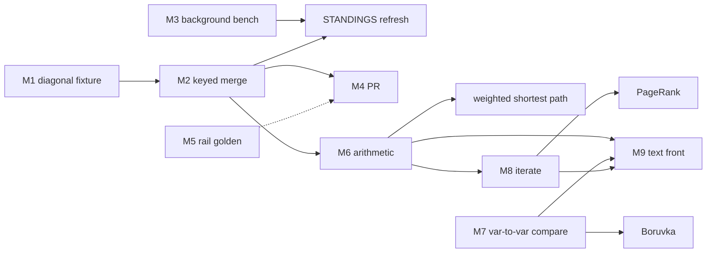

# graph_lowering NEXT: next-best-move review

Status: review, 2026-08-20. Sibling of CONTRACT.md (question), STANDINGS.md (numbers),
RESEARCH.md (prior art). Ranks the candidate next moves by what each unblocks per unit of
work, with the receipt that proves it done. Decision is the user's; the ranking is the
review's output.

## TOC
- Where the lab stands
- Candidate moves
- Ranking
- Dependency graph
- Move 1 in detail: diagonal fixture
- Move 2 in detail: keyed merge
- Moves parked and why
- Receipts per move

## Where the lab stands

| exit criterion (CONTRACT.md) | state | evidence |
| --- | --- | --- |
| 1. tiers, components, distance, triangles pass the oracle | met | 5 oracle tests pass, `node --test tests/labs/graph_lowering.test.ts` |
| 2. STANDINGS sizes the set-encoding blow-up | met for chain and grid only | components: chain-1000 1,000,000 rows 44,047 ms; grid-32x32 1,048,576 rows 5,001 ms |
| 3. written decision on merge-keeps-better | open | RESEARCH.md E, E2 hold the mechanism; user decision pending |
| 10-second law | violated by the bench | chain-1000 components 44 s in the foreground |
| PR | none | branch lab/graph-lowering, 3 commits ahead of its base, 3 behind origin/main |
| pre-commit hooks | disabled in this clone | comment-budget rail `ir_version_mismatch`, card issues/comment-rail-ir-version |

## Candidate moves

| id | move | files | size | unblocks |
| --- | --- | --- | --- | --- |
| M1 | diagonal fixture: grid with right, down, and diagonal edges so nodes have several path lengths | `tests/labs/graph_lowering.test.ts` fixtures | ~40 lines | shows tiers and distance blow up the same way components does; sizes M2 for all three programs instead of one |
| M2 | keyed merge in `RecursiveStratum.mergeStatement` + narrow `AggregateInRecursionError` (RESEARCH.md E2) | `src/lower/lowerSql.ts:146,:407,:441`; `src/lower/lower.ts:108,:158`; tests in `tests/lower/lowerSql.test.ts` | ~120 lines + COUNT tests | components, tiers, distance one row per key; weighted shortest path once arithmetic exists; closes exit criterion 3 |
| M3 | bench in background with per-test cap (`PERF_GRAPH_LOWERING_S`, justfile :477) | `v6/justfile`, test `{ skip }` arm | ~15 lines | 10-second law compliance; STANDINGS refresh after M2 |
| M4 | open the PR | none | 0 lines + rebase onto origin/main (3 commits behind) | review; restores the PR-per-arc rule |
| M5 | re-emit comment-budget rail golden, restore `core.hooksPath` | `.githooks`, `v6/tsv2/scripts/comment-budget-rail.sh` golden dl6 | unknown; card exists | every future commit in this clone |
| M6 | arithmetic in the body (`hop + 1`) | `ast.ts`, `lowerSql.ts` select builder, prolog emitter | ~200 lines | weighted paths, `->{m,n}` bounded hops, k-core |
| M7 | var-to-var `Compare` | `ast.ts:75`, lowering of WHERE | ~80 lines | PGQ `WHERE a.x < b.x`, Boruvka |
| M8 | `iterate(rounds)` primitive | `ast.ts`, `RecursiveStratum.round()` :445, prolog emitter | ~150 lines | PageRank, Logica fixed-depth mode, bounded hops |
| M9 | PGQ or dl6 text front for graph programs | parser | large | authoring convenience only; lowering unchanged |
| M10 | harness DDL to `"__id" INTEGER PRIMARY KEY, cols, UNIQUE(cols)` | evaluator `createLikeStatements` | ~30 lines | matches the user's naming decision; orthogonal to M2 (`ON CONFLICT(cols)` works on either shape) |

## Ranking

| rank | move | reason |
| --- | --- | --- |
| 1 | M1 diagonal fixture | 40 lines, no engine change, turns one data point into three; without it M2's test set only proves components |
| 2 | M2 keyed merge | the lab's whole point; mechanism already written; closes exit criterion 3 |
| 3 | M3 background bench | required by the 10-second law before the next STANDINGS run, which M2 needs |
| 4 | M4 PR | after M2 lands on the branch, one PR carries lab + engine change; needs M5 or `--no-verify` |
| 5 | M5 rail golden | independent of this arc; blocks clean commits for every chat in this clone |
| 6 | M6 arithmetic | next algorithm tier; nothing in the current oracles needs it |
| 7 | M8 iterate | PageRank only; Logica's termination story says fixed rounds is enough to start |
| 8 | M7 var-to-var compare | cheap but no current oracle uses it |
| 9 | M10 DDL shape | cosmetic until something reads `__id` |
| 10 | M9 text front | after the engine items settle |

## Dependency graph



Caption: M1 gates M2; M2 and M3 gate the STANDINGS refresh; M5 is a soft gate on M4
(`--no-verify` bypasses it).

## Move 1 in detail: diagonal fixture

Fixture `grid-diag-16x16`: 256 nodes, edges right, down, and down-right (3 x 15 x 15 + 2 x 15
= 705 edges). From node (0,0) a node (r,c) is reachable by paths of length max(r,c) through
r+c, so `tiers` and `distance` each materialise roughly sum over nodes of (min(r,c)+1) rows
instead of 256.

| program | rows on grid-16x16 today | expected rows on grid-diag-16x16 | expected after M2 |
| --- | --- | --- | --- |
| tiers | 256 | ~1,500 to 2,200 | 256 |
| distance | 256 | ~1,500 to 2,200 | 256 |
| components | 65,536 | 65,536 | 256 |

Oracle changes: none; BFS depth and longest-path oracles already handle multiple path
lengths. Receipt: STANDINGS rows for the new fixture with tiers and distance above 256.

## Move 2 in detail: keyed merge

Signatures first (planning protocol):

```ts
// lowerSql.ts
type MergeMode =
  | { kind: "set" }
  | { kind: "keyed"; keyColumns: readonly string[]; valueColumn: string; fn: "min" | "max" };

// mergeModeFor(rules for one head, relDecl) -> MergeMode
//   set     when every HeadTerm is HeadVar
//   keyed   when exactly one HeadTerm is HeadAgg(min|max) and the rest are HeadVar
//   throw AggregateInRecursionError otherwise (sum, count, two aggs, agg without key)

// mergeStatement(relName, delta, mode):
//   set   -> INSERT OR IGNORE INTO full SELECT cols FROM delta            (today, :146)
//   keyed -> INSERT INTO full(key..., v) SELECT key..., min(v) FROM delta GROUP BY key...
//            ON CONFLICT(key...) DO UPDATE SET v = excluded.v WHERE excluded.v < full.v
//            (max: > and max())
```

Instance lifetime: `MergeMode` is computed once per stratum at `RecursiveStratum`
construction (`:343`) from `rules` and `relDecls`, held for the life of the stratum.

Storage layout: keyed relations get `PRIMARY KEY (key...)` instead of `PRIMARY KEY (key..., v)`.
That is a DDL change in `createLikeStatements` for keyed heads only; set heads keep today's
shape.

Reads and writes per round: derive reads delta + body tables, writes next; merge reads
next, writes full (insert or update); promote reads full rows touched this round, writes
delta. Uniqueness: full has one row per key at every round boundary; delta has at most one
row per key per round (the GROUP BY in merge).

Tests, sprefa style (COUNT over the table, one assertion per property):

| test | assertion |
| --- | --- |
| keyed merge keeps one row per key | `SELECT count(*) FROM components` = node count on chain-200, grid-32x32, grid-diag-16x16 |
| keyed merge value equals oracle | rows equal union-find labels, BFS depth, longest path |
| fixpoint terminates | round count <= diameter + 1 on chain-200 (= 200) |
| sum in recursion still refused | `AggregateInRecursionError` thrown |
| min without key still refused | `AggregateInRecursionError` thrown |
| set heads unchanged | existing `lowerSql.test.ts` suite green |
| defer backend agrees | `lower.ts` `recursiveBackend` returns "fixpoint" for keyed heads; same counts through both evaluators |

## Moves parked and why

| move | parked because |
| --- | --- |
| adopt graphqlite, sqlitegraph, CozoDB, or DuckDB as the engine | each owns its storage (RESEARCH.md B, D); DuckDB loses the browser and small-write cases (RESEARCH.md I) |
| TRAIL / ACYCLIC path modes | needs list-valued columns or a path table; no oracle in the lab wants it |
| Louvain, matching, coloring, isomorphism | host escapes per CONTRACT.md; not Datalog-shaped |
| rowid-watermark delta (MiniLitelog) | v6 tables are WITHOUT ROWID; would need M10 first and buys one statement per rule, unmeasured |

## Receipts per move

| move | receipt |
| --- | --- |
| M1 | STANDINGS.md gains 5 rows for grid-diag-16x16; tiers and distance rows > 256 |
| M2 | 7 tests above green; STANDINGS components chain-1000 rows = 1000, ms under 1,000; `lowerSql.test.ts` green |
| M3 | `just perf-all` graph leg exits within `PERF_GRAPH_LOWERING_S`; no foreground run over 10 s |
| M4 | PR URL; CI green or the red leg named |
| M5 | `git config core.hooksPath` prints `.githooks`; a commit without `--no-verify` passes |
| M6 to M10 | each gets its own CONTRACT addendum before code |
