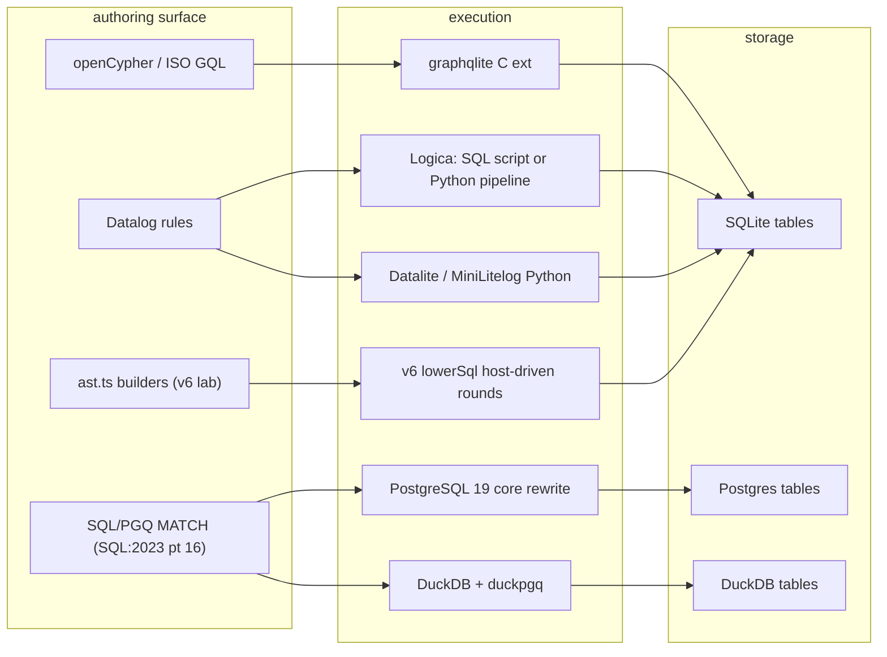

# graph_lowering RESEARCH: prior art for graph queries and Datalog over SQLite

Status: research survey, 2026-08-20. Companion to CONTRACT.md (the question) and
STANDINGS.md (the numbers). Three web passes on 2026-08-20; every row cites its source.
Facts about star counts, versions, and dates are as read on that day.

## TOC
- Why this survey exists
- The question in one sentence
- Landscape map
- A. SQL/PGQ: the standard and who ships it
- B. Graph query layers over SQLite
- C. Datalog compiled to SQL (SQLite as a target)
- D. Datalog engines that merely touch SQLite
- E. Recursive-aggregate semantics: the theory and the one engine that ships it
- E2. Mechanism: where the keyed merge slots into lowerSql.ts
- F. Per-language sweep (Zig, Go, TS, Rust, Python, C, C++, Clojure)
- G. Sugar or semantics: PGQ features against ast.ts
- H. Gaps (what nobody has)
- I. Consequences for v6
- J. Reading order for the monotone-aggregate decision
- K. Source index

## Why this survey exists

CONTRACT.md asked which graph algorithms lower to `src/lower/ast.ts` with no engine change.
STANDINGS.md answered: reach, tiers, components, distance, triangles all lower; components
materialises nodes x component-size rows because `lowerSql.ts:441 AggregateInRecursionError`
refuses min/max inside a recursive stratum. Before deciding whether to lift that refusal,
the build-vs-buy rule requires a written candidate-by-candidate look at who has already done
graph queries or Datalog over SQLite, and how they handle aggregates in recursion.

## The question in one sentence

Has anyone shipped (a) SQL/PGQ, (b) a Datalog-to-SQLite compiler with aggregates inside
recursion, or (c) a graph query layer over SQLite that the v6 TS engine should adopt instead
of extending `ast.ts` and `lowerSql.ts`?

Answer: (a) no, on any SQLite; (b) Logica is the only one, with its own semantics;
(c) graphqlite is the serious Cypher layer, but it is a C extension with its own storage
tables, which does not fit v6's "relations are the user's tables" model.

## Landscape map



Caption: three authoring surfaces, six executors, SQLite reachable only through Cypher
extensions or Datalog compilers; PGQ never reaches SQLite.

## A. SQL/PGQ: the standard and who ships it

| system | surface | how it runs | storage | status (2026-08-20) | source |
| --- | --- | --- | --- | --- | --- |
| PostgreSQL 19 | SQL:2023 `GRAPH_TABLE (g MATCH ... COLUMNS (...))`, in core | property graph is a view over existing tables; MATCH rewritten to joins and unions | existing Postgres tables | Beta 1 2026-06-04, final later 2026; patch ~14,800 lines, 118 files, Eisentraut + Bapat; v20260113 adds cyclic patterns, RLS, LABELS(), PROPERTY_NAMES(), multi-pattern, ECPG | [depesz](https://www.depesz.com/2026/07/31/waiting-for-postgresql-19-sql-property-graph-queries-sql-pgq/), [commitfest 4904](https://commitfest.postgresql.org/patch/4904/), [neon](https://neon.com/postgresql/postgresql-19/sql-pgq-graph-queries), [hackers thread](https://www.postgresql.org/message-id/5f56e720-7872-4095-99c9-992adb0519e2@eisentraut.org), [EDB](https://www.enterprisedb.com/blog/representing-graphs-postgresql-sqlpgq) |
| DuckDB duckpgq | SQL/PGQ extension | MATCH compiled into DuckDB plans; CSR built on the fly for path finding | DuckDB tables | community extension, shipped | [duckpgq docs](https://duckpgq.org/documentation/sql_pgq/), [DuckDB blog 2025-10](https://duckdb.org/2025/10/22/duckdb-graph-queries-duckpgq) |
| Oracle 23ai | SQL/PGQ | native | Oracle | shipped | [Oracle property graph docs](https://docs.oracle.com/en/database/oracle/property-graph/24.4/spgdg/changes-in-this-release.html) |
| SQLite | none | | | no extension, no fork, no patch found in three passes | |

Design fact worth keeping: PG19's approach (graph = view over tables, MATCH = rewrite to
joins and recursion, zero new storage) is the same thesis as the v6 lab. The difference is
the front end (PGQ text vs `ast.ts` builders) and the target (Postgres planner vs SQLite
statements driven from the host).

## B. Graph query layers over SQLite

| project | lang | surface | execution | storage | algorithms | status | license | source |
| --- | --- | --- | --- | --- | --- | --- | --- | --- |
| colliery-io/graphqlite | C loadable ext | openCypher; 97.7% of openCypher TCK, 3,876 scenarios; MATCH CREATE MERGE SET DELETE WITH UNWIND RETURN | Cypher translated to SQL over SQLite | own node/edge tables inside the user's db | PageRank, Louvain, Dijkstra, BFS/DFS, connected components | 254 commits, active; Python, Rust, raw SQL interfaces | MIT | [repo](https://github.com/colliery-io/graphqlite), [docs](https://colliery-io.github.io/graphqlite/latest/), [gdb-engines](https://gdb-engines.com/db/graphqlite/) |
| agentflare-ai/sqlite-graph | C99 virtual table | Cypher subset, JSON results | parsed, dispatched to vtab ops | `graph_nodes(id, properties, labels)`, `graph_edges(id, source, target, edge_type, properties)` | degree centrality, density, connectivity; variable-length paths "planned v0.2.0" | 0.1.0-alpha.0, 19 commits, 278 stars, "API may change" | MIT | [repo](https://github.com/agentflare-ai/sqlite-graph), [API ref](https://github.com/agentflare-ai/sqlite-graph/blob/main/docs/API_REFERENCE.md), [analysis post](https://akillness.github.io/posts/sqlite-graph-cypher-query-support-analysis/) |
| oldnordic/sqlitegraph | Rust crate | Cypher-inspired `pattern_match` API, streaming BFS/DFS/topo iterators | SQLite-authoritative; algorithms run in Rust memory | `.db` (SQLite) or `.graph` (Native V3 CSR) | "35+": SCC, Louvain, A*, dominance, topo sort, k-hop, HNSW vectors | 3.9.0 on 2026-07-11, 12 stars | GPL-3.0-only | [repo](https://github.com/oldnordic/sqlitegraph), [lib.rs](https://lib.rs/crates/sqlitegraph) |
| shwetarkadam/sqlite-graph (crate `sqlite-graph`) | Rust 2024 crate | builder API | `WITH RECURSIVE` depth-bounded bidirectional walks with cycle detection | 7 tables (episodes, entities, edges, aliases...), 3 FTS5 vtabs, 9 triggers; bi-temporal edges; vectors | traversal, Jaro-Winkler dedupe, RRF hybrid search, BM25 | March 2026, 5 stars, 4 commits | MIT | [repo](https://github.com/shwetarkadam/sqlite-graph), [crates.io](https://crates.io/crates/sqlite-graph), [dev.to writeup](https://dev.to/rohansx/sqlite-as-a-graph-database-recursive-ctes-semantic-search-and-why-we-ditched-neo4j-1ai) |
| hiyenwong/sqlite-knowledge-graph | Rust loadable ext (.so/.dylib) | SQL functions | BFS/DFS/shortest path in Rust | own tables | path finding, vector search, RAG helpers | small | | [repo](https://github.com/hiyenwong/sqlite-knowledge-graph), [crates.io](https://crates.io/crates/sqlite-knowledge-graph) |
| gqlite (gqlitedb) | Rust, C interface | ISO GQL subset; openCypher guaranteed through 1.x | own executor | redb default; SQLite backend "pre-planning"; Postgres WIP | few | 0.12.0 on 2026-08-18, 25 releases | MIT | [lib.rs](https://lib.rs/crates/gqlitedb), [gitlab](https://gitlab.com/gqlite/gqlite) |
| GraphLite-AI/GraphLite | Rust | ISO GQL 2024 | own executor | Sled; "SQLite" appears only in the slogan | 435+ tests | late 2025 | | [repo](https://github.com/GraphLite-AI/GraphLite), [HN](https://news.ycombinator.com/item?id=46121076), [dbdb](https://dbdb.io/db/graphlite) |
| dpapathanasiou/simple-graph | SQL templates + Python/Go/Julia ports | none; CRUD .sql files with qmark bindings | hand-written recursive CTEs | two tables: nodes (JSON body, id), edges (src, dst, JSON props); `json_tree()` for property queries | traversal only | stable since 2020; SQLiteGraph.jl port | | [repo](https://github.com/dpapathanasiou/simple-graph), [HYTRADBOI talk](https://www.hytradboi.com/2022/simple-graph-sqlite-as-probably-the-only-graph-database-youll-ever-need), [SQLiteGraph.jl](https://github.com/joshday/SQLiteGraph.jl), [Lobsters](https://lobste.rs/s/x0fk0a/simple_graph_graph_database_sqlite) |
| SQLite ext/misc/closure.c | C, official repo | `transitive_closure` virtual table | closure of a parent/child column pair | user's table | tree reachability | written 2013, obsolete since CTEs landed in 3.8.3 (2014-02) | public domain | [source](https://github.com/mackyle/sqlite/blob/master/ext/misc/closure.c), [peewee docs](https://github.com/coleifer/peewee/blob/master/docs/peewee/sqlite_ext.rst), [leifer post](https://charlesleifer.com/blog/querying-tree-structures-in-sqlite-using-python-and-the-transitive-closure-extension/) |
| sqlean | C ext bundle | | | | no graph module | | | [repo](https://github.com/nalgeon/sqlean) |

Fit against v6: every row above owns its storage schema. v6 relations are the user's
declared tables (`edbRel`, `derivedRel` in `ast.ts`), so none of these can be the engine.
graphqlite's Cypher-to-SQL translator is the only piece whose lowering could be read for
ideas on variable-length paths.

## C. Datalog compiled to SQL (SQLite as a target)

This is the shape of the v6 lab. Four prior systems.

| project | lang | rounds | set semantics | aggregates inside recursion | negation | notes | source |
| --- | --- | --- | --- | --- | --- | --- | --- |
| Logica (Google, Skvortsov) | Python compiler, SQL output | two modes: (1) self-contained SQL script with fixed recursion depth (unrolled), (2) Python-driven pipeline that runs the generated SQL stage by stage until fixpoint or a termination condition | SQL DISTINCT / GROUP BY | yes: "free combination of recursion and aggregation"; semantics in the 2026 paper "Diamonds Are Forever: Stabilization Semantics for Unrestricted Aggregation and Recursion" | yes | engines: DuckDB, SQLite, PostgreSQL, BigQuery; 2.1k stars, 1,303 commits; Apache-2; "not an officially supported Google product" | [repo](https://github.com/EvgSkv/logica), [system paper](https://ceur-ws.org/Vol-3801/short5.pdf), [stabilization paper](https://arxiv.org/pdf/2606.02926), [Logica-TGD](https://arxiv.org/pdf/2503.00568) |
| Datalite (Philip Zucker) | Python | host-driven semi-naive; three tables per relation (`old`, `delta`, `new`); N statements per N-atom rule, each swapping one atom for its delta | PRIMARY KEY + UPSERT (`INSERT ... ON CONFLICT DO NOTHING`) | none | `NOT EXISTS`, reported slow | stratification via NetworkX SCCs; ~5x slower than Soufflé; SQL string pasting, unsafe for untrusted input | [post](https://www.philipzucker.com/datalite/) |
| MiniLitelog (Zucker) | Python, ~50 lines | `rowid > last_seen_timestamp` in WHERE as the delta filter; one `Rule` class and a `fixpoint()` | `INSERT OR IGNORE` | none | | requires linear, record-centric rule form | [post](https://www.philipzucker.com/tiny-sqlite-datalog/) |
| Snakelog (Zucker) | Python DSL | litelog backend (SQLite, default) or Soufflé | as litelog | none | | "very beta"; Soufflé 5x faster on one benchmark | [post](https://www.philipzucker.com/snakelog-post/) |
| TyQL (Herlihy, Shaikhha, Ailamaki, Odersky) | Scala, language-integrated | native `WITH RECURSIVE` per DBMS; evaluated on MySQL, Oracle, PostgreSQL, SQL Server, SQLite, MariaDB, DuckDB | DBMS | type system forbids aggregation over recursive references; relaxable only where the backend allows (DuckDB) | typed | six checked properties: range-restriction, monotonicity, mutual recursion, linearity, set semantics, constructor-freedom | [arXiv 2504.02443](https://arxiv.org/html/2504.02443v2) |
| v6 lab (this repo) | TS | host-driven semi-naive through `evalProgramSql`; `RecursiveStratum` seed / derive / merge / promote / expand | `PRIMARY KEY (cols) WITHOUT ROWID` | refused (`lowerSql.ts:441`, `lower.ts:108/158 "defer"`) | stratified | STANDINGS.md | CONTRACT.md |

Comparison of delta strategies:

| strategy | who | cost per round | what it needs from SQLite |
| --- | --- | --- | --- |
| old/delta/new tables, N statements per rule | Datalite, v6 | N inserts + promote | UPSERT or PK ignore |
| rowid watermark | MiniLitelog | 1 insert per rule | rowid tables (v6 uses WITHOUT ROWID, so this is closed to v6 as-is) |
| unrolled SQL to fixed depth | Logica mode 1 | one script, no host loop | nothing; depth must be known |
| native `WITH RECURSIVE` | TyQL, simple-graph | one statement | append-only result set, no aggregates, one recursive reference |

## D. Datalog engines that merely touch SQLite

Listed so the search can be called exhaustive; none is a candidate.

| project | relationship to SQLite | why not a candidate | source |
| --- | --- | --- | --- |
| CozoDB (Rust) | SQLite is one of three KV byte-store backends; data is not SQL-queryable | own Datalog engine (CozoScript), own storage encoding; development stalled after 0.7 | [repo](https://github.com/cozodb/cozo), [docs 0.5](https://docs.cozodb.org/en/latest/releases/v0.5.html), [HN](https://news.ycombinator.com/item?id=33518320) |
| Soufflé (C++) | `.output A(IO=sqlite, dbname=...)` I/O directive only | compiles Datalog to C++; SQLite is a sink | [directives](https://souffle-lang.github.io/directives), [tutorial](https://souffle-lang.github.io/tutorial) |
| pyDatalog (Python) | reads relational DBs through SQLAlchemy | in-memory engine; maintenance restarted June 2026 | [PyPI](https://pypi.org/project/pyDatalog/) |
| philippkueng/datalite (Clojure) | Datomic-style schema and Datalog queries translated to SQL on SQLite, DuckDB, Postgres | query translation; rules and recursion thin; 8 stars, "highly experimental", MPL-2 | [repo](https://github.com/philippkueng/datalite) |
| DataScript / Datalevin / Datahike (Clojure) | none (memory / LMDB) | own engines | [DataScript](https://github.com/tonsky/datascript), [Datalevin](https://cljdoc.org/d/datalevin/datalevin/0.8.14/doc/readme) |
| Percival (Rust to wasm, browser notebook) | a fork at percival.jake.tl compiles "simpler queries" to SQLite | Datalog compiled to JS, naive fixpoint in web workers | [repo](https://github.com/ekzhang/percival), [fork](https://percival.jake.tl/), [HN](https://news.ycombinator.com/item?id=33809062) |
| minisqlite (Rust, Cursor) | reimplementation of SQLite itself, file-format compatible, ~200k lines; recursive CTEs evaluated semi-naive | an engine, not a layer; 270 stars; aggregates-in-recursion not documented | [repo](https://github.com/cursor/minisqlite) |
| Kuzu (C++) | none | own columnar storage, Cypher | [survey](https://arxiv.org/pdf/2505.24758) |

## E. Recursive-aggregate semantics: the theory and the one engine that ships it

The v6 defect (components at chain-1000: 1,000,000 rows, 44 s) is the classic
"set encoding of min" blowup. Three bodies of work address it.

| work | idea | what it would mean in `lowerSql.ts` | source |
| --- | --- | --- | --- |
| Zaniolo et al., pre-mappable / monotonic aggregates (`min*`, `max*`, `count*`, `sum*`) | an aggregate is allowed inside recursion when it is monotone in the lattice of its result; min over distances, max over tiers, count-with-bound | `RecursiveStratum.mergeStatement` becomes `INSERT ... ON CONFLICT(key) DO UPDATE SET v = min(v, excluded.v) WHERE excluded.v < v`; delta = rows whose value changed | [1910.08888](https://arxiv.org/abs/1910.08888), [1707.05681 fixpoint semantics](https://arxiv.org/pdf/1707.05681), [1909.08249 BigData by aggregates in recursion](https://arxiv.org/pdf/1909.08249), [1907.10278 stale synchronous](https://arxiv.org/pdf/1907.10278) |
| Logica stabilization semantics (2026) | unrestricted aggregation in recursion; iterate until the aggregate stabilises, termination by condition or round cap | a looser rule than monotone-only; needs `iterate(rounds)` or a user termination predicate | [2606.02926](https://arxiv.org/pdf/2606.02926) |
| DuckDB `WITH RECURSIVE ... USING KEY` (Bamberg, Grust; SIGMOD 2025 companion) | the recursive working table is a keyed dictionary; a new row for an existing key overwrites it; union table stays one row per key | the engine-side equivalent of the merge above; shipped in DuckDB 1.3; ClickHouse RFC copies it | [DuckDB blog](https://duckdb.org/2025/05/23/using-key), [paper](https://db.cs.uni-tuebingen.de/publications/2025/using-key/how-duckdb-is-using-key-to-unlock-recursive-query-performance.pdf), [ACM](https://dl.acm.org/doi/10.1145/3722212.3725107), [PR 12430](https://github.com/duckdb/duckdb/pull/12430), [ClickHouse RFC 107067](https://github.com/clickhouse/clickhouse/issues/107067) |

SQLite itself: the CTE result set is append-only, so Dijkstra and any keyed overwrite
need a host loop ([SQLite forum](https://sqlite.org/forum/forumpost/b2078937d02c561a),
[forum shortest path](https://sqlite.org/forum/info/a79ba01a941c29b3),
[lang_with](https://sqlite.org/lang_with.html)). v6 already has that loop.

Worked example, components on a 3-chain `1-2-3`, label = min node id reachable:

```
set encoding (today)            monotone merge (proposed)
round 0  lbl={(1,1),(2,2),(3,3)}  lbl={1:1, 2:2, 3:3}
round 1  +(2,1),(3,2)             2:min(2,1)=1  3:min(3,2)=2   delta={2,3}
round 2  +(3,1)                   3:min(2,1)=1                 delta={3}
round 3  no growth  (fixpoint)    no change    (fixpoint)
rows     6 = sum of tier sizes    3 = one per node
```

Fixpoint reached at round 3 in both; row count n^2/2 vs n.

## E2. Mechanism: where the keyed merge slots into lowerSql.ts

`RecursiveStratum` (`lowerSql.ts:343`) drives one round as seed, derive, merge, promote,
expand. Only merge changes. Line numbers as of lab/graph-lowering e0e020fc2.

| phase | code | today | with keyed merge |
| --- | --- | --- | --- |
| seed | `seedStatements()` :375 | copy base rules into full + delta | same |
| derive | `deriveStatements()` :389 | `next = body with one atom swapped for delta` | same |
| merge | `mergeStatement()` :146 `INSERT OR IGNORE INTO full SELECT * FROM next` | PK (node, label) so every new label is a new row | `INSERT ... SELECT key, min(v) ... GROUP BY key ON CONFLICT(key) DO UPDATE SET v = excluded.v WHERE excluded.v < full.v`; PK (key) |
| promote | `promoteStatements()` :407 | delta = rows merge inserted | delta = rows merge inserted or updated (same `RETURNING` or rowsAffected path) |
| expand | :445 `grew ? round() : EMPTY`, grew = `rowsAffected > 0` | unchanged | unchanged; SQLite counts a fired `DO UPDATE` in rowsAffected |
| guard | `AggregateInRecursionError` :441 | throws for any `HeadAgg` in a recursive stratum | throws only for sum/count, or min/max whose head has no key columns |

Trace, components on chain `1-2-3`, head `components(node, min(label))`:

```
today (PK node,label)                     keyed merge (PK node)
step 0 seed    full={(1,1),(2,2),(3,3)}     full={1:1,2:2,3:3}
step 1 derive  next={(2,1),(3,2)}           next={(2,1),(3,2)}
step 2 merge   +2 rows, full=5              2: 1<2 upd, 3: 2<3 upd, rowsAffected=2, full=3
step 3 promote delta={(2,1),(3,2)}          delta={(2,1),(3,2)}
step 4 derive  next={(3,1)}                 next={(3,1)}
step 5 merge   +1 row, full=6               3: 1<2 upd, rowsAffected=1, full=3
step 6 derive  next={}                      next={}
step 7 merge   rowsAffected=0 -> fixpoint   rowsAffected=0 -> fixpoint
rows           6 = n(n+1)/2                 3 = n
```

Both stop at the same fixpoint (no growth); the keyed form stops with one row per key.
DuckDB `USING KEY` performs the same overwrite inside the engine's working table; v6
performs it in the host loop it already has, so SQLite stays the target.

Soundness condition the guard must check: the aggregate is min or max, the comparison in
the `WHERE` matches it (`<` for min, `>` for max), and every other head column is part of
the key. sum and count stay refused (non-monotone under overwrite).

## F. Per-language sweep (Zig, Go, TS, Rust, Python, C, C++, Clojure)

| lang | SQLite + graph or Datalog work found | verdict |
| --- | --- | --- |
| Zig | zig-sqlite, zqlite.zig (bindings); sqlite-zig (toy reimplementation) | nothing graph or Datalog shaped ([zig-sqlite](https://github.com/vrischmann/zig-sqlite), [zqlite](https://github.com/karlseguin/zqlite.zig), [sqlite-zig](https://github.com/ozogxyz/sqlite-zig)) |
| Go | simple-graph Go port; goraphdb (Cypher on bbolt); gograph (Cypher string builder) | nothing on SQLite beyond simple-graph templates ([goraphdb](https://github.com/mstrYoda/goraphdb), [gograph](https://medium.com/@prahaladd/gograph-a-unified-graph-database-api-framework-in-go-fc1a00467377)) |
| TypeScript / JS | drivers only: better-sqlite3 13.x, node:sqlite, libsql, sql.js, official sqlite-wasm | no Datalog, PGQ, or Cypher layer over SQLite in TS; v6 is alone in this cell ([driver bench](https://sqg.dev/blog/sqlite-driver-benchmark/), [pkgpulse](https://www.pkgpulse.com/guides/better-sqlite3-vs-libsql-vs-sql-js-sqlite-nodejs-2026)) |
| Rust | sqlitegraph, sqlite-graph crate, sqlite-knowledge-graph, gqlite, GraphLite, CozoDB, minisqlite, Percival | all own-storage or own-engine; none is a lowering over user tables |
| Python | Logica, Datalite, MiniLitelog, Snakelog, simple-graph, pyDatalog | Logica is the one serious compiler |
| C | graphqlite, agentflare sqlite-graph, closure.c | Cypher extensions with their own tables |
| C++ | Soufflé (SQLite I/O), Kuzu (no SQLite), DuckDB (USING KEY, no SQLite) | semantics references, no SQLite layer |
| Clojure | philippkueng/datalite, DataScript, Datalevin, Datahike | query translation at best |
| Scala | TyQL | recursion safety type system; SQLite as one evaluated backend |

## G. Sugar or semantics: PGQ features against ast.ts

| PGQ feature | plain-Datalog rewrite | ast.ts today | cost |
| --- | --- | --- | --- |
| fixed-length pattern `(a)-[]->(b)-[]->(c)` | chain of `relRef` joins | yes | sugar |
| `->+`, `->*` | recursive rule pair | yes | sugar |
| `COLUMNS (...)`, GROUP BY in COLUMNS | `HeadVar`, post-recursion `HeadAgg` | yes | sugar |
| `->{m,n}` bounded hops | recursion with hop counter + compare | no arithmetic (`hop+1`) | engine: arithmetic in body, or `iterate(rounds)` |
| `WHERE a.x < b.x` | var-to-var compare | `Compare` is var vs literal only (`ast.ts:75`) | engine: var-to-var `Compare` |
| `ANY SHORTEST`, `ALL SHORTEST` | recursion + min per (a,b) | refused in recursion | engine: monotone min (section E) |
| `TRAIL` (no repeated edge), `ACYCLIC` (no repeated node) | path-so-far membership | no list columns | engine: path table or list-valued column; exponential worst case |
| `ONE ROW PER VERTEX` / `PER STEP` | unnest a path | no paths | depends on the row above |
| labels, property access | relation per label, column per property | yes (relations are tables) | sugar |

Three engine items (arithmetic, var-to-var compare, monotone min/max) are the same three
already listed in CONTRACT.md as blockers for weighted shortest path, PageRank, k-core,
Boruvka. TRAIL/ACYCLIC is the one new category this survey adds.

## H. Gaps (what nobody has)

| gap | closest thing | distance |
| --- | --- | --- |
| SQL/PGQ on SQLite | PG19 rewrite design; duckpgq | no code to reuse; design is reusable |
| Datalog with monotone aggregates lowered to SQLite | Logica (Python, its own semantics); DuckDB USING KEY (engine-side) | v6 would be first in TS and first monotone-only-by-construction on SQLite |
| any Datalog or graph query layer over SQLite in TypeScript | none | v6 alone |
| TRAIL / ACYCLIC path modes in a Datalog lowering | graphqlite (Cypher, C) | not on the v6 list |
| browser: Datalog over sqlite-wasm / OPFS | Percival fork (naive, JS) | open; CONTRACT.md open question on driver choice stands |

## I. Consequences for v6

| decision | evidence from this survey | recommendation is the user's; data only |
| --- | --- | --- |
| adopt an existing engine instead of extending `lowerSql.ts` | every SQLite graph layer owns its storage schema; v6 relations are user tables | no drop-in candidate exists |
| monotone min/max inside recursion | Zaniolo's monotone aggregates give the semantics; DuckDB USING KEY gives the shipped precedent; Logica gives a looser alternative | merge-keeps-better at `RecursiveStratum.mergeStatement`; delta = changed keys; lift `AggregateInRecursionError` only for heads whose `AggFn` is min or max over a key set |
| `iterate(rounds)` | Logica mode 1 (fixed depth) and PGQ `->{m,n}` both want it | one primitive serves both |
| arithmetic and var-to-var compare | PGQ `->{m,n}`, `WHERE a.x < b.x`; weighted paths | `Compare` gains a var-vs-var arm; body gains `+1` at minimum |
| PGQ as authoring front | PG19 proves PGQ lowers to joins + recursion + aggregates with no new storage | a parser-front question; nothing in the lowering changes |
| harness DDL shape | Datalite and MiniLitelog rely on rowid or UPSERT; v6 uses WITHOUT ROWID | keyed merge uses `ON CONFLICT(cols) DO UPDATE`, which works on WITHOUT ROWID tables; no DDL change forced |

## J. Reading order for the monotone-aggregate decision

1. DuckDB USING KEY blog post, 15 minutes: the keyed-working-table picture.
2. Zaniolo 1910.08888 sections 1 to 3: which aggregates are safe and why.
3. Logica 2606.02926 abstract and section 2: the looser alternative and its termination story.
4. `lowerSql.ts` `RecursiveStratum` (seed, derive, merge, promote, expand) with the worked example in section E beside it.
5. TyQL 2504.02443 section on monotonicity: how a type system would refuse the unsafe cases, a model for the `AggregateInRecursionError` narrowing.

## K. Source index

Standards and Postgres: [depesz PG19 PGQ](https://www.depesz.com/2026/07/31/waiting-for-postgresql-19-sql-property-graph-queries-sql-pgq/), [commitfest 4904](https://commitfest.postgresql.org/patch/4904/), [neon PG19 PGQ](https://neon.com/postgresql/postgresql-19/sql-pgq-graph-queries), [pgsql-hackers](https://www.postgresql.org/message-id/5f56e720-7872-4095-99c9-992adb0519e2@eisentraut.org), [hackers follow-up](https://www.postgresql.org/message-id/CAExHW5s3BL_qUwQ%3Dye8RX7GnVcGC%2BFeR7h6jFocBZC5JFXATEQ%40mail.gmail.com), [EDB](https://www.enterprisedb.com/blog/representing-graphs-postgresql-sqlpgq), [Postgres Weekly](https://pgweekly.github.io/en/2026/07/sql-property-graph-queries-pgq.html), [POSETTE 2026 talk](https://posetteconf.com/2026/talks/exploring-property-graphs-with-sql-pgq-in-postgresql/), [Snowflake PG19 beta](https://www.snowflake.com/en/blog/engineering/postgresql-19-features-beta/), [GQL and SQL/PGQ expressive power](https://arxiv.org/pdf/2409.01102), [property graphs in relational DBs](https://arxiv.org/pdf/2510.07062), [Apache AGE](https://age.apache.org/overview/), [AGE on Azure](https://learn.microsoft.com/en-us/azure/postgresql/azure-ai/generative-ai-age-overview), [AGE on Postgres Pro](https://postgrespro.com/docs/enterprise/current/apache-age), [AGE dev.to](https://dev.to/franckpachot/cypher-graph-queries-on-postgresql-with-apache-age-3l62).

DuckDB: [USING KEY blog](https://duckdb.org/2025/05/23/using-key), [USING KEY paper](https://db.cs.uni-tuebingen.de/publications/2025/using-key/how-duckdb-is-using-key-to-unlock-recursive-query-performance.pdf), [ACM](https://dl.acm.org/doi/10.1145/3722212.3725107), [PR 12430](https://github.com/duckdb/duckdb/pull/12430), [duckpgq](https://duckpgq.org/documentation/sql_pgq/), [DuckDB graph blog](https://duckdb.org/2025/10/22/duckdb-graph-queries-duckpgq), [ClickHouse RFC](https://github.com/clickhouse/clickhouse/issues/107067).

SQLite layers: [graphqlite](https://github.com/colliery-io/graphqlite), [graphqlite docs](https://colliery-io.github.io/graphqlite/latest/), [agentflare sqlite-graph](https://github.com/agentflare-ai/sqlite-graph), [sqlitegraph](https://github.com/oldnordic/sqlitegraph), [sqlite-graph crate](https://crates.io/crates/sqlite-graph), [shwetarkadam repo](https://github.com/shwetarkadam/sqlite-graph), [sqlite-knowledge-graph](https://github.com/hiyenwong/sqlite-knowledge-graph), [gqlitedb](https://lib.rs/crates/gqlitedb), [GraphLite](https://github.com/GraphLite-AI/GraphLite), [simple-graph](https://github.com/dpapathanasiou/simple-graph), [closure.c](https://github.com/mackyle/sqlite/blob/master/ext/misc/closure.c), [sqlean](https://github.com/nalgeon/sqlean), [awesome-sqlite](https://github.com/brandonhimpfen/awesome-sqlite), [SQLite forum BFS](https://sqlite.org/forum/info/456e0c07ac7c1642), [SQLite forum shortest path](https://sqlite.org/forum/forumpost/b2078937d02c561a), [SQLite lang_with](https://sqlite.org/lang_with.html), [HN multiple recursive selects](https://news.ycombinator.com/item?id=24843643).

Datalog compilers and engines: [Logica](https://github.com/EvgSkv/logica), [Logica system paper](https://ceur-ws.org/Vol-3801/short5.pdf), [Logica stabilization](https://arxiv.org/pdf/2606.02926), [Datalite post](https://www.philipzucker.com/datalite/), [MiniLitelog](https://www.philipzucker.com/tiny-sqlite-datalog/), [Snakelog](https://www.philipzucker.com/snakelog-post/), [TyQL](https://arxiv.org/html/2504.02443v2), [CozoDB](https://github.com/cozodb/cozo), [Soufflé directives](https://souffle-lang.github.io/directives), [pyDatalog](https://pypi.org/project/pyDatalog/), [philippkueng/datalite](https://github.com/philippkueng/datalite), [Percival](https://github.com/ekzhang/percival), [minisqlite](https://github.com/cursor/minisqlite), [HN no SQLite of Datalog](https://news.ycombinator.com/item?id=32458976).

Theory: [Zaniolo monotonic aggregates 1910.08888](https://arxiv.org/abs/1910.08888), [fixpoint semantics 1707.05681](https://arxiv.org/pdf/1707.05681), [BigData by aggregates in recursion 1909.08249](https://arxiv.org/pdf/1909.08249), [stale synchronous 1907.10278](https://arxiv.org/pdf/1907.10278), [graph DB landscape survey 2505.24758](https://arxiv.org/pdf/2505.24758).
