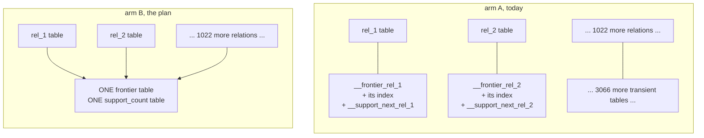
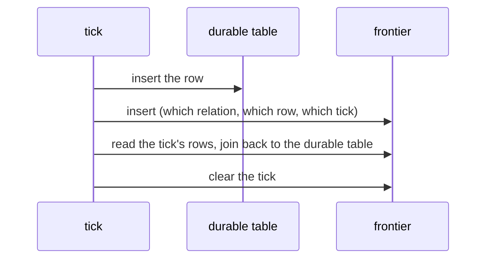

# shared sqlite frontier, in plain words

Every number here was re-measured after the compile speedup landed. Nothing in
the answer changed.

## What the two arms are

The durable tables are the same in both. Only the scratch space changes.

## The tick

Arm A has to clear one table per relation it touched. Arm B clears once.

## The speed, 200 ticks, middle of five

Arm B' is arm B with the shared key reordered so the tick sits second, which is
what the plan now says to build.

| relations | touched per tick | arm A | arm B | arm B' | who wins |
| --- | --- | ---: | ---: | ---: | --- |
| 16 | 1 | 0.062 | 0.063 | 0.062 | tie |
| 16 | 2 | 0.118 | 0.112 | 0.113 | B by 5% |
| 16 | 16 | 0.906 | 0.792 | 0.779 | B by 13% |
| 64 | 1 | 0.057 | 0.060 | 0.059 | A by 5% |
| 64 | 8 | 0.463 | 0.407 | 0.389 | B by 12% |
| 64 | 64 | 3.619 | 3.009 | 2.994 | B by 17% |
| 256 | 1 | 0.058 | 0.059 | 0.058 | tie |
| 256 | 32 | 1.848 | 1.560 | 1.495 | B by 16% |
| 256 | 256 | 14.862 | 12.240 | 12.109 | B by 18% |
| 1024 | 1 | 0.064 | 0.060 | 0.059 | B by 7% |
| 1024 | 128 | 7.619 | 6.252 | 6.313 | B by 18% |
| 1024 | 1024 | 61.922 | 50.989 | 50.754 | B by 18% |

Milliseconds per tick. Fewer tables is not slower. Once a tick touches more than
a handful of relations, fewer tables is faster.

## Where the win comes from

| part of the tick | arm A | arm B |
| --- | ---: | ---: |
| writing rows | 26.261 | 27.246 |
| reading them back | 23.083 | 23.387 |
| clearing the tick | 12.634 | 0.220 |

Milliseconds per tick at 1024 relations, all of them touched. Writing and
reading get very slightly worse. Clearing gets 57 times better, because one
table takes one DELETE and 1024 tables take 1024.

## Taking rows back out again

This is the thing the first pass never measured. Same rig, 256 relations, 32
touched per tick, and now every touched relation both gains a row and loses the
row it gained last time.

| arm | ms per tick | against arm A | statements per tick |
| --- | ---: | ---: | ---: |
| A, one scratch set per relation | 3.983 | 1.00 | 288 |
| B, one shared scratch set | 3.265 | 0.82 | 225 |
| B', shared, tick second in the key | 3.353 | 0.84 | 225 |

| part of the tick | arm A | arm B |
| --- | ---: | ---: |
| the arrival | 1.200 | 1.283 |
| the retraction | 1.251 | 1.279 |
| reading | 0.701 | 0.682 |
| clearing | 0.861 | 0.026 |

Taking a row back out costs the two arms the same. The whole 18% is the clear
again, 33 times cheaper. Retraction does not change the answer.

## Starting up

| relations | arm A start ms | arm B start ms | arm A scratch pages | arm B scratch pages |
| --- | ---: | ---: | ---: | ---: |
| 16 | 1.51 | 0.46 | 52 | 5 |
| 64 | 6.88 | 1.82 | 202 | 5 |
| 256 | 41.85 | 9.38 | 807 | 5 |
| 1024 | 391.05 | 70.49 | 3226 | 5 |

Arm B's scratch space is two tables no matter how big the program is.

## The codegen bill this was really about

| what | today | with one shared pair |
| --- | ---: | ---: |
| tables the pokeapi program creates | 3,129 | 783 |
| indexes it creates | 2,348 | 8 |
| bytes of table-creation SQL | 1,682,616 | 716,125 |

Well over half the table-creation text in the biggest program is scratch space
minted once per relation. Two hand-written tables replace all of it. These three
numbers came back byte for byte identical after the speedup, which is how we
know the speedup changed the compiler's speed and not its output.

## The compile, before and after

| leg | before | after |
| --- | ---: | ---: |
| planning | 8 min 38 s | 2.0 s |
| everything else | 8.5 s | 2.3 s |
| wall clock | 8 min 46 s | 4.5 s |

The plan document budgeted 4.14 seconds. It now costs 4.28. The old finding that
compiling pokeapi ran 127 times over budget is dead.

## Where this rig is not the real thing

Read these before quoting any speed number as a prediction.

| gap | which way it bends the result |
| --- | --- |
| the rig's per-relation frontier holds a pointer to the durable row; the real one holds the row's own columns and needs no join at all | both ways, not decidable here |
| the rig gives each relation 3 scratch statements at startup; the real compiler emits 6 or more | hides some of arm B's startup win |
| the real clear wipes two tables per relation, and the drain wipes three; the rig charges one | hides some of arm B's clear win |
| support counts and boundary deltas are never written in the speed test | hides some of arm B's win |
| every statement runs on its own, with no transaction around the tick, in both arms | flatters arm B's clear |

The first four all point the same way, so the 18% is a floor. The last one
points back, and it is the one to re-measure before building.

## Two things still to decide

1. Put the tick second in the shared key. It costs nothing when the frontier is
   cleared every tick, and it reads 20% faster when the frontier keeps 200 ticks
   of rows. Both orders let SQLite jump straight in rather than scan.
2. Writing one row at a time, the one shared table is 12% slower than 1024 small
   ones. Writing 100 rows per statement, which only the shared table can do, it
   is 7.4 times faster. Batch the frontier writes or the shared table gives back
   its win.

## One thing still too long

The biggest test cell took 12.6 seconds for arm A and 10.8 for arm B, both past
the ten-second line. The compile no longer is.
