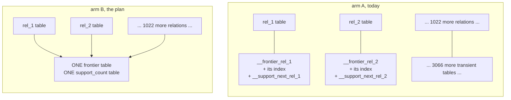
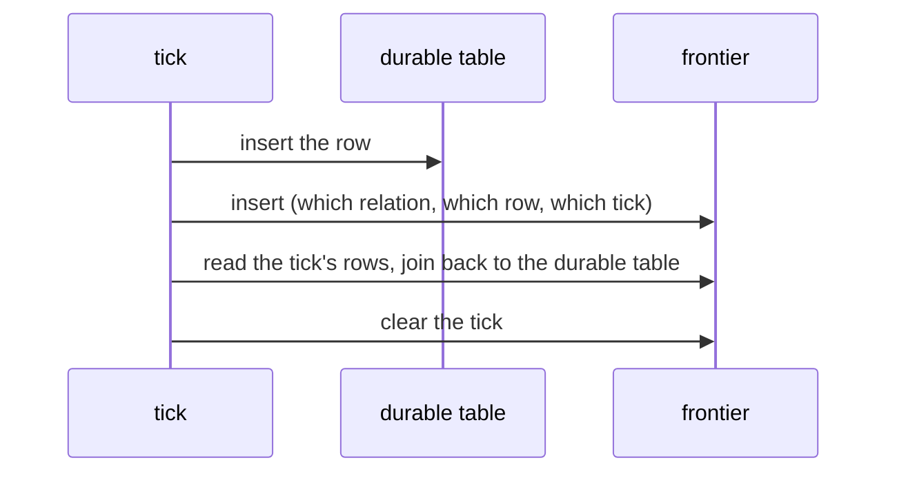

# shared sqlite frontier, in plain words

## What the two arms are

The durable tables are the same in both. Only the scratch space changes.

## The tick

Arm A has to clear one table per relation it touched. Arm B clears once.

## The speed, 200 ticks, best of five

| relations | relations touched per tick | arm A ms per tick | arm B ms per tick | who wins |
| --- | --- | --- | --- | --- |
| 16 | 1 | 0.062 | 0.063 | tie |
| 16 | 2 | 0.123 | 0.111 | B by 9% |
| 16 | 16 | 0.909 | 0.783 | B by 14% |
| 64 | 1 | 0.059 | 0.064 | A by 8% |
| 64 | 8 | 0.461 | 0.398 | B by 14% |
| 64 | 64 | 3.635 | 3.079 | B by 15% |
| 256 | 1 | 0.059 | 0.065 | A by 9% |
| 256 | 32 | 1.851 | 1.535 | B by 17% |
| 256 | 256 | 14.604 | 12.290 | B by 16% |
| 1024 | 1 | 0.063 | 0.061 | tie |
| 1024 | 128 | 7.710 | 6.274 | B by 19% |
| 1024 | 1024 | 61.818 | 51.603 | B by 17% |

Fewer tables is not slower. Once a tick touches more than a handful of
relations, fewer tables is faster.

## Where the win comes from

| part of the tick | arm A | arm B |
| --- | --- | --- |
| writing rows | 25.846 | 27.508 |
| reading them back | 22.976 | 23.723 |
| clearing the tick | 12.918 | 0.221 |

Milliseconds per tick at 1024 relations, all of them touched. Writing and
reading get very slightly worse. Clearing gets 58 times better, because one
table takes one DELETE and 1024 tables take 1024.

## Starting up

| relations | arm A start ms | arm B start ms | arm A scratch pages | arm B scratch pages |
| --- | --- | --- | --- | --- |
| 16 | 1.53 | 0.46 | 52 | 5 |
| 64 | 6.78 | 1.79 | 202 | 5 |
| 256 | 42.05 | 9.58 | 807 | 5 |
| 1024 | 388.87 | 70.05 | 3226 | 5 |

Arm B's scratch space is two tables no matter how big the program is.

## The codegen bill this was really about

| what | today | with one shared pair |
| --- | --- | --- |
| tables the pokeapi program creates | 3,129 | 783 |
| indexes it creates | 2,348 | 8 |
| bytes of table-creation SQL | 1,682,616 | 716,125 |

Well over half the table-creation text in the biggest program is scratch space
minted once per relation. Two hand-written tables replace all of it.

## Three things to fix before building it

1. The plan orders the shared key relation, row, tick, sign. Put tick second
   instead. The read asks for one relation at one tick, and with tick in third
   place SQLite cannot jump straight to it. Reordering made the read 22% faster.
2. A tick that touches one relation is slightly slower in arm B, up to 9%. That
   is small and it is real.
3. Writing one row at a time, the one shared table is 11% slower than 1024 small
   ones. Writing 100 rows per statement, which only the shared table can do, it
   is 7.4 times faster. Batch the frontier writes or the shared table gives back
   its win.

## Two things took too long

- Compiling the pokeapi program took 8 minutes 46 seconds, almost all of it in
  planning. The plan document says 4.14 seconds.
- The biggest test cell took 12.7 seconds for arm A and 10.8 for arm B, both
  past the ten-second line.
