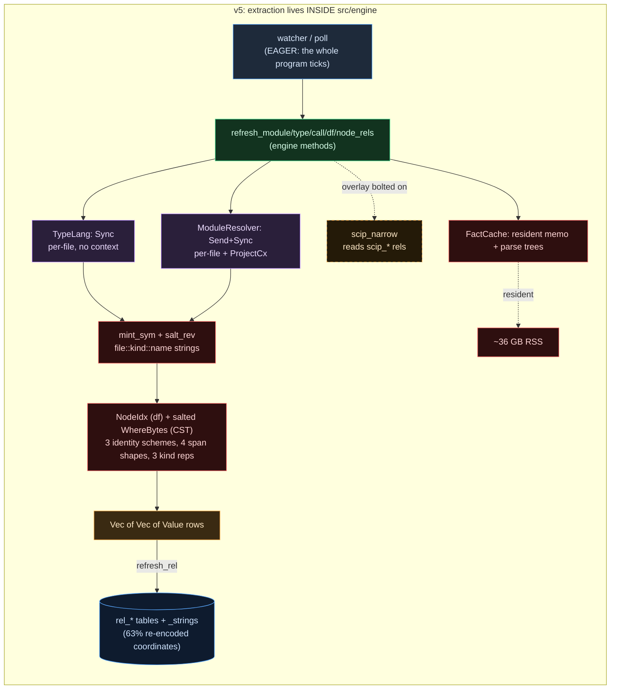
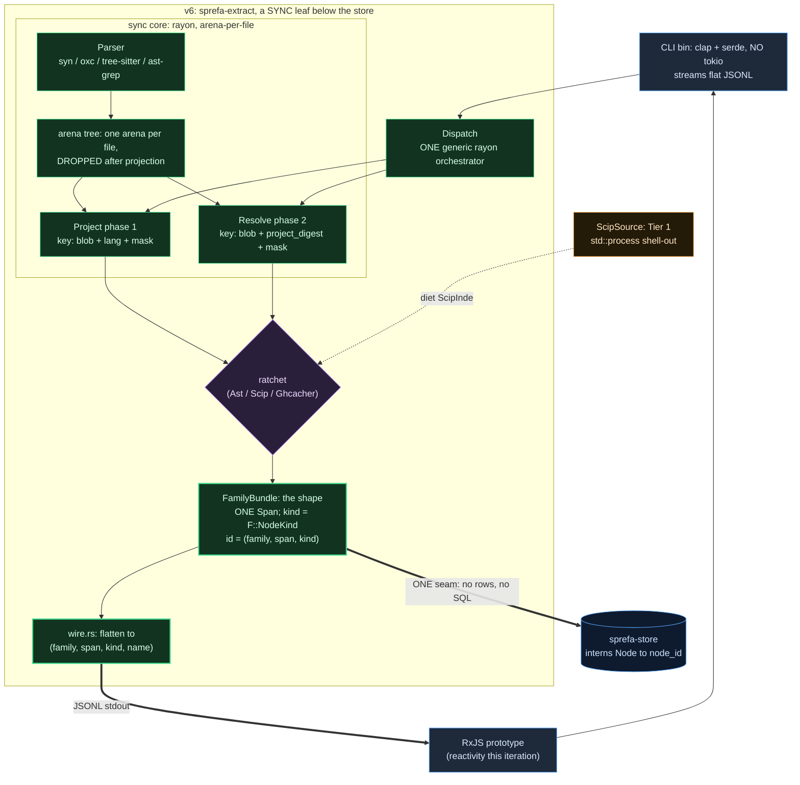

# sprefa-extract - the golden plan (distill v5, normalize for v6)

> **CURRENT MIND (canonical): `v6/sprefa-seed/src/_3_extract/_7_tasks.rs`** - the
> living ledger (scope, identity, decisions, partitioning recon, family dimension,
> turnkey test plan, future filesystem, CLI/streaming, `ExtractPlan` proof tokens).
> This file is the NARRATIVE (recon, prior art, the v5→v6 inversion) + the BUILD
> SEQUENCE. Reconciled 2026-07-23; where the two differ, `_7_tasks.rs` wins.
>
> The seed `_3_extract/` is the header-only type math (`cargo check` green); its
> code still holds the pre-refactor shape (the `NodeKind`/`EdgeKind` sums, the
> `_6_facade` async shell) with `REVISION` notes pointing at the per-family
> reshape. Catching the code up to the ledger is the first mechanical pass, not a
> design decision.

## Context

v5's static-analysis extraction is a working, multi-language subsystem that
became a maintenance nightmare: ~16.7K lines across `src/graph/typegraph` (syn
for Rust), `src/graph/modgraph`, `src/engine/extract/`, `src/scip_import.rs`,
`src/scip_setup.rs`. It also amplified the resident-heap disease that pushed v5
to 36 GB swap. Three independent recon passes (two over the v5 tree, one over the
representation prior art) landed the facts this plan rests on.

### Recon - observed facts (v5, at HEAD)

- Two extraction traits. `TypeLang: Sync` (`src/graph/typegraph/mod.rs:439`) -
  `name`/`matches`/`extract`/`extract_calls`/`extract_dataflow`/`extract_bundle`
  with an `AnalysisMask { types, calls, dataflow }`. `ModuleResolver: Send + Sync`
  (`src/graph/modgraph/mod.rs:171`) - `exts`/`edges(file, content, &ProjectCx)`.
  Asymmetric: one is per-file (`Sync`, no context), the other needs the file set
  (`&ProjectCx<'a>`). The asymmetry is real (the cache-key split) and is kept as
  the two-phase seam.
- v5 produces, per lang: type / call / dataflow (the three `TypeLang` methods) +
  module (`ModuleResolver`) + the CST enumeration (`src/cst.rs` `walk_cst`, the
  lossless named-node tree backing `node`/`child` query relations + the spine) +
  `flow_edge` (a stdlib `.dl`, `std/flow.dl:89`). Kinds are declared in RUST, not
  `.dl`: `src/engine/decls.rs` `module/type/call/dataflow_rel_decls()`, with CLOSED
  enum "brands" (`builtin_enum_brands`, decls.rs:73-134) the typechecker enforces.
  Variant sets (the authoritative kind vocabularies):
  - `df_node_kind` (23): param let_bind var_read var_write lit call_res new
    member ret borrow binop unop loop if match block closure try break expr
    (+TS: cond logic concat template).
  - `type_entity_kind` (9), `type_edge_kind` (7), `CallKind` (3),
    `module_binding` kind (5: named default namespace side_effect reexport),
    `const_value_kind` (v5 decls.rs:130: lit template; TS collector adds concat).
- THREE different `kind` representations in v5: typed enums (type+call),
  free-form `String` (df), `&'static str` (edges/modules). FOUR different span
  shapes: byte range `Option<(u32,u32)>` (modules), line-only (type/call),
  line+col with MIXED char-vs-byte col (df), kind-salted `WhereBytes` (CST/spine).
- SPLIT node identity: `mint_sym` coordinate strings `file::kind::name`
  (`typegraph/mod.rs:412`, ~26.6% of dict bytes) for type/call; dense `NodeIdx`
  → `_df_node_dict` coordinate surrogate for df; kind-salted `WhereBytes` id for
  CST. (`salt_rev`, the function older plans cite, does NOT exist in current v5;
  the live digest logic is `extract_input_digest`, engine/extract/mod.rs:861.)
- Per-language roster. TypeLang impls: rust (syn), ts (oxc), kotlin (tree-sitter),
  go+python (tree-sitter for comments/strings, SCIP for call/type). ModuleResolver
  impls: rust/ts/kotlin/go/python. EVERY lang has both. Parse sharing is opt-in:
  only `RustTypes` overrides `extract_bundle`; the other four parse once per
  family (3× waste the bundle seam was meant to kill).
- SCIP is a FORMAT / resolution overlay, not a family. `scip_import::load`
  (scip_import.rs:96) parses symbol/range/role/display_name/relationships into
  `scip_*` rels; the engine consumes them as resolution overrides
  (`scip_ref` overrides name resolution, std/flow.dl:96-114). v5 already tiered:
  Tier 1 SCIP (compiler-backed, "nearly free to add a lang"), Tier 2 native AST,
  tree-sitter floor.
- The FIFTH family v5 half-built lives in a stdlib `.dl`, not Rust: `flow_edge`
  (`std/flow.dl:89`) = `df_edge ∪ arg→param positional hop ∪ ret→call_res
  backward hop` over `call_edge`.
- v5 already got the content-addressing + demand-skip right at the engine seam:
  `FactCache<(repo,path,hash), (rid, Arc<T>)>` (engine/extract/mod.rs:51) caches
  per-file by content; `moved_extract_rels(family, files, with_scip)` (mod.rs:903)
  is the per-rev digest-skip gate. These are the seeds of the v6 two-phase keys.
- v5 stated gaps honestly: per-site callee cloning (k-CFA) out of scope; node-level
  types function-level only; no CFG / dominator / use-def family.

### Recon - prior art (representation only; lazy/IVM stripped)

Stack Graphs (index phase = per-file unresolved; query phase = merged resolved)
IS the two-phase split, verbatim. Kythe (anchor = content-addressed `(file, span)`
vs semantic node = name-resolved; `defines/binding`/`ref`/`childof`/`extends`).
SCIP (`Occurrence{symbol,range,role}` + `SymbolInformation.Kind` + the
`SymbolRole` bitfield Definition/Import/Write/Read/Generated/Test/ForwardDef;
relationships as bools). Joern CPG unifies AST+CFG+DDG+CDG+call with edge
properties (`REACHING_DEF.VARIABLE`, `ARGUMENT_INDEX`) - maps to v6's aux side
projections. CodeQL normalizes at the STORAGE level; local-vs-global dataflow is
a QUERY concern, not a storage kind (intra/inter derivable from
`enclosing_symbol` equality). SVF/WALA/Soot converge on: def/use sites + CFG +
DDG, with register def-use syntactic (emit it) and memory def-use points-to-
dependent (downstream). Arena AST (oxc/biome): one `Allocator` per rayon task,
parse one file, project to owned Vecs, drop the arena - the CST never crosses a
thread; peak RSS = biggest file. Parser landscape: tree-sitter (40+, the floor +
lossless CST), oxc (JS/TS, arena), syn (Rust proc-macro), ast-grep (pattern over
tree-sitter; also a usable CST Parser), rowan (lossless CST, you write the parser).

### Plan boundary

- **In:** `sprefa-extract` turns `(source bytes, language, FamilyMask)` + optional
  SCIP index into per-family `FamilyBundle<F>` + aux, in the `_0_shape` vocabulary.
  No DB, no reactor, no store-id type in any public signature. **SYNC only** - no
  async facade (the `_6_facade` `ReactiveExtract`/`ProjectView` is CUT). The CPU
  core (parse/project/merge on rayon) has nothing to await; reactivity lives in
  other crates. The async-eval flip + the sprefa-language are NOT this crate's.
- **Out (other layers own):** the SQLite store (`sprefa-store`, the spine + node/
  edge tables), the graph algorithms (`sprefa-graph`), the reactive/demand engine
  + async-eval flip, cross-file name RESOLUTION execution (extract emits phase-1
  specifiers + phase-2 resolutions; the store joins), full points-to / memory-SSA
  / reaching-definitions.
- **Seam (where extract meets store):** the `Node<F> → node_id` / `NameId → StrId`
  / `Span → file_bytes` adapter lives in ONE module in the main engine crate, not
  in extract or store. Extract's public API names no store type; the store knows
  nothing about families; the main crate is the only code that touches both.
- **CLI + streaming wire:** a thin `[[bin]]` (clap + serde, NO tokio) wraps the
  sync lib and streams the FLAT tagged form `(family, span, kind, name)` as JSONL
  to stdout. The flat form is the SAME shape as the store seam and the parity
  normalize - one flatten, three consumers. This bin is driven (this iteration) by
  an RxJS prototype that owns the reactivity; it is also the purity-proof oracle
  vs biome/oxc (promoted from frontier to near-term).
- **Lowering:** source → arena CST (Parser tier) → masked projection (`Project<F>`
  phase 1; `Resolve<F>` phase 2) → per-family `FamilyBundle<F>` → (seam) intern
  into store `node`/`edge`, or (CLI) flatten to JSONL.

## The inversion (v5 → v6)

One sentence: **v5 mints coordinate strings inside the engine and writes them to
rel tables; v6 emits span-addressed facts from a leaf and lets the store name
them.** Every row in the table below is a consequence of where identity lives and
which side of the DB seam the work happens on.

### v5 - extraction lives INSIDE the engine (the tangle)



### v6 - extraction is a SYNC LEAF below the store (per-family; CLI streams)



### What changed (one axis per row)

| axis | v5 | v6 |
|---|---|---|
| where it lives | engine methods (`engine/extract/*`) | own crate, a sync leaf below the store |
| output | `Vec<Vec<Value>>` rows → `rel_*` tables | per-family `FamilyBundle<F>`; the store interns |
| node identity | `mint_sym` + `NodeIdx` + salted `WhereBytes` (3 schemes) | `(family, span, kind)` - one |
| family axis | a `NodeKind`/`EdgeKind` sum + 3 kind reps | **type-level `Family` + `Node<F>`/`Edge<F>`; the sums DELETE** |
| planes | implicit | 3 explicit: RESOLUTION (Type\|Call\|Module) / VALUE-FLOW (Df\|Flow) / STRUCTURE (Cst) |
| spans | 4 shapes (byte-range / line / line+col-mixed / WhereBytes) | one `Span` |
| the two traits | asymmetric `TypeLang` vs `ModuleResolver` | per-family `Project<F>` (phase 1) + `Resolve<F>` (phase 2); family is a type param, not a sum |
| module family | a separate trait | collapses: resolution half → SCIP namespace edges; binding half → aux |
| SCIP | overlay bolted in the engine (`scip_narrow`) | bidirectional wire; Tier-1 source, ratchet-merged |
| parse sharing | opt-in (only Rust; others parse 3×) | default - one parse, masked projections, all langs |
| flow_edge | stranded in `std/flow.dl`, stringly-joined | typed `Flow<F>` on the value-flow plane |
| RAM | resident memo + parse trees → ~36 GB | arena-per-file, dropped → peak = biggest file |
| eagerness | eager; whole program ticks | on-demand (reactivity owned by engine / the RxJS prototype) |
| concurrency | engine-controlled, ~serial parse | rayon core; sync only |
| reactivity | (v5's eager poll) | NOT in this crate (RxJS prototype drives the CLI this iteration) |
| dictionary | 63% re-encoded coordinates | vocabulary only (coordinates are spans) |

## Decisions (the rulings; full detail in `_7_tasks.rs`)

1. **Families are TYPE-LEVEL.** A `Family` trait + marker structs (`DfF`/`CallF`/
   `TypeF`/`ModuleF`/`CstF`); `Node<F>`/`Edge<F>`; the `NodeKind`/`EdgeKind` sums
   DELETE. Orthogonal axes are not variants of one type; the store splits by family
   anyway, so flatten-then-resplit is wasted. *(Supersedes the seed's sum-based
   "one typed-kind ordinal per family"; the sums were the false unification.)*
2. **Three planes.** RESOLUTION (`Type|Call|Module`, SCIP-wire, ratchet-able) +
   VALUE-FLOW (`Df|Flow`, native AST-only, the differentiator) + STRUCTURE (`Cst`,
   the lossless tree-sitter named-node tree). **CstF is a 5th family** (v5 had it
   as `cst.rs` enumeration; closed the coverage gap).
3. **Module collapses.** Resolution half → SCIP namespace edges; binding half → aux.
4. **SCIP is a bidirectional wire.** `ScipOccurrence ↔ Node<F>` both ways; our AST
   facts project OUT (joinable, ratchet-eligible), foreign indexers project IN.
   Round-trippable for the 3 resolution families ONLY.
5. **The ratchet.** `merge` = per-fact best-producer-wins over N producers
   (`Ast`/`Scip(&indexer)`/`Ghcacher`). SCIP ground-truth for call/type/module is
   ONE rule, not the whole policy. `Producer` rides the bundle.
6. **Sync only.** The `_6_facade` async shell is CUT. Pure CPU + rayon; nothing
   awaits. The engine (or the RxJS prototype) wraps our sync `dispatch`. SCIP build
   = `std::process`. *(Supersedes the earlier "sync core + async shell" ruling.)*
7. **The extract→store adapter lives once, in the main crate.** `Node<F> → node_id`
   by `(family, span, kind)`, `NameId → StrId`, `Span → file_bytes` - one module.
8. **Port + clean, 3 langs.** rust (syn), ts+js (oxc), go. python+kotlin deferred.
   Go has NO native Rust parser: its `Parser` is tree-sitter, `Project<F>`/`Resolve<F>`
   walk the CST directly + scip-go for resolution. No buy-vs-buy gate.
9. **Concrete types until a second impl** (crate-map practicality ruling).
10. **Identity is content-addressed, git-unbound.** project = a corpus root (a git
    worktree OR a plain directory); file = path + `BlobHash`; version (rev / now) is
    how bytes are FOUND, never the cache key. `BlobSource` is source-agnostic.
11. **Turnkey tests.** Tier-1 snapshot (one file + one fixture per lang; the codegen
    loop) + Tier-2 parity golden (v5-vs-v6 normalized diff; where v5's disparate
    inline tests unify). The trait interface is the contract.
12. **CLI + streaming wire.** clap + serde, no tokio; flat tagged JSONL stdout; the
    same flatten feeds the store seam + parity diff.

## The build sequence (epics / commits; each ends green)

**Epic 0 - type math (DONE).** Seed `_3_extract/`, `cargo check` green. Every v5
kind brand is a typed enum; one `Span`; the `Extract` contract + `ExtractPlan`
proof-token ledger exist. *(Pending: catch the seed code up to the per-family
reshape - delete the sums, cut the facade, add `Family`/`Node<F>`. Mechanical.)*

**Commit 1 - piping proof (DONE 2026-07-23).** Stand up `v6/sprefa-extract/`
as a real crate: atoms + `Family`/`CstF` + `Node<F>` + flat `wire` + `Parser` +
`Project<F>` + a single-threaded `dispatch`; `AstGrepParser` + `Project<CstF>`
(one Parser covers rust/ts/go via ast-grep grammars); a clap `bin` streaming JSONL
with `--bench` (parse/walk/serialize split); a TS fixture + snapshot. Proves bin →
seams → flat wire → stdout end to end; ast-grep is the Parser, not a subprocess
shortcut (abides). `--bench` is the harness that will race oxc once oxc is the Parser.
Receipts (2026-07-23): `cargo check` + `cargo test` green (snapshot, 89 facts = 45
nodes + 44 child edges off the TS fixture); `cargo tree` clean of
tokio/sqlx/sea-orm/rusqlite/axum, and `clap` is bin-only-gated out of the lib tree;
the public API names no store-id type (greppable). The crate: `Cargo.toml`,
`src/{lib,shape,family,rows,seams,wire,dispatch}.rs`, `src/lang/{mod,astgrep}.rs`,
`src/bin/extract.rs`, `tests/snapshot.rs` + `tests/fixtures/ts/{sample.ts,sample.cstf.snap}`.

**Commits 2-4 - TS via oxc + scip-typescript.** (2) `OxcParser` + `Project<TypeF>`
(DONE 2026-07-23, two green commits: `f3ceb4fa` generalized the Parser/Project
seam to an arena-passing GAT because oxc's `Program<'a>` borrows its `Allocator`;
then the oxc parse + the `ts_entities_from` port emit TS type entities: class /
interface / alias / enum / function / method, constructor + non-function consts
correctly skipped). The oxc race prints both families' parse/walk/serial under
`--bench`. NOTE (D-arrow-type): Function/Method STAY in TypeF because a function
IS a type (`[A] => B`); v5 `ts/mod.rs:1275` test locks it. TypeF = the type facet,
CallF (commit 3) = the call facet — two projections, not duplication (an earlier
"trim TypeEntityKind" suggestion was retracted on this evidence). The arrow-type
PAYLOAD (`TypeExpr`) + Param/Returns/Uses EDGES are not yet emitted — they land at
resolution (commit 4); commit 2b's callable entities are kinded skeletons until
then. A scip-typescript oracle diff is not byte-identical by construction (see
`_7_tasks.rs` BUILD STATUS); the real gate is occurrence/resolution parity (commit 4).
(3) `Project<CallF>` then `Project<DfF>` - TS AST families complete. (4)
scip-typescript subprocess → `Resolve<*>` (TS resolution; the SCIP-wire IN
projection; ratchet).

**Commit 5 - Rust via syn.** `SynParser` + `Project<{Type,Call,Df,Module,Cst}>` +
`Resolve<*>`; port `typegraph/rust` (sym→span, kind-String→typed enum, one Span).

**Commit 6 - Go via tree-sitter + scip-go.** `TsParser` + `Project/Resolve` walking
the tree-sitter CST + scip-go for resolution.

**Standing labs (ride alongside, each ends with its golden):**
- *Arena-per-file RAM mastery* - prove RSS ≤ `biggest_file × workers + overhead`,
  flat across corpus size; memcap aborts a worker over `rss_bytes`. Golden: 10×
  duplicated corpus, RSS independent of path count + corpus bytes.
- *Parallel dispatch + contention* - rayon `dispatch` over the shared-read
  `ProjectCx`; prove no lock contention / livelock on a many-small-files workload.
- *flow_edge promotion* - lift v5's `std/flow.dl` `flow_edge` to typed `Flow<F>`;
  parity on `examples/flow-interproc.dl`.

Each commit: snapshot green; from commit 2, the parity golden vs v5 green.

## Epic U - the uniform surface (commit 3c; slots after 3b, before Resolve/Rust/Go)

> **DONE 2026-07-23 (commit 3c landed).** `source.rs` (`Source` + `FamilyMask` +
> `ExtractOutput`) + `TsSource` + `AstgrepSource` + first-match roster; one
> `dispatch`, one `flatten`/`flatten_jsonl`; `lang/oxc.rs` → `lang/ts.rs`. Done
> condition held: 4 TS snapshots byte-identical (no `UPDATE_SNAP`), one loop-driven
> `ts_uniform_surface` (+ roster test), `pub fn dispatch`=1, bin names no
> ast-grep/oxc type outside `Source` impls, `cargo tree` clean. The frontier below
> (two-parser reality; `Resolve<F>` extends `Source`) stays open.

**Why.** v5 had ONE uniform boundary (`TypeLang` + `type_langs()` roster + masked
`extract_bundle`); v6 has uniform *leaves* (`Parser`, `Project<F>`) but the
orchestration above them is hand-rolled per family: 4 `dispatch_*`, 8 `flatten_*`,
a hand-coded bin stream, 4 hand-written snapshot tests, and NO per-lang binding
or roster. Adding Rust (commit 5) or Go (commit 6) today duplicates that
quadruple. This epic stands up the v6 `Source` (the `TypeLang` analog the seed
planned, `_7_tasks.rs:127`) and collapses the four layers to one data-driven
path each, so a new lang is ONE `Source` impl + one roster line + one fixture
(the turnkey contract, `_7_tasks.rs:158`).

**Recon (observed, at HEAD after commit 3b `de5db74f`).**
- v5 `TypeLang` (`src/graph/typegraph/mod.rs:439`): `name` / `matches` / `extract`
  / `extract_calls` / `extract_dataflow` / `extract_bundle(file,content,mask)`;
  roster `type_langs() -> &[&dyn TypeLang]` first-match (`:491`);
  `AnalysisMask{types,calls,dataflow}` + `ALL`; `AnalysisBundle{Option<TypeFacts>,
  Option<CallFacts>, Option<DataflowFacts>}`.
- v6 current: `seams.rs` has `Parser` (GAT arena), `Project<F>`, `BlobSource`.
  Grep confirms ZERO `Source` / `FamilyMask` / `ExtractOutput` / roster.
  `dispatch.rs` = 4 free fns; `wire.rs` = 8 fns (4 flatten + 4 jsonl);
  `bin/extract.rs` hand-codes the ast-grep-vs-oxc stream; `tests/snapshot.rs` = 4
  hand `#[test]` fns; `lang/mod.rs` only re-exports projectors.
- Two-parser reality: CstF runs through ast-grep (one dep = rust/ts/tsx/js/go
  grammars; the floor); Type/Call/Df run through the native parser (oxc for TS).
  A TS file with all families masked = 2 parses (ast-grep for cst, oxc feeding
  type+call+df). The masked bundle's "one parse" is WITHIN a parser (one oxc
  parse feeds 3 projections). Go (commit 6) is the exception: tree-sitter feeds
  all families (1 parse).
- Output is byte-stable under interner sharing: each `flatten_*` resolves
  `NameId -> &str` at output, so a shared per-file `Strings` (one interner)
  yields the same JSONL as today's per-family interners. The golden holds.

**Plan boundary.**
- Authoring surface: one `Source` impl per lang under `lang/<name>.rs` (binds a
  `Parser` to its per-family `Project<F>`s; parse count is opaque to the trait).
- Canonical representation: `ExtractOutput` (concrete: `Option<FamilyBundle<F>>`
  per family + one shared `Strings`).
- Wire / runtime IR: `flatten(&ExtractOutput) -> Vec<FlatFact>` (FamilyTag
  dispatched; the existing flat envelope).
- Target runtimes: stdout JSONL (bin), the store seam adapter, the parity-golden
  normalize. All three read the one `flatten`.

**Contract.**
```rust
// source.rs (new) - or fold into seams.rs
pub trait Source: Sync + Send {
    fn name(&self) -> &'static str;
    fn matches(&self, path: &str) -> bool;
    /// One parse per backing engine, masked projections. Owns the arena(s)
    /// internally; returns owned output (no borrowed parse crosses the seam).
    fn extract(&self, path: &str, content: &[u8], mask: FamilyMask) -> ExtractOutput;
}

#[derive(Clone, Copy, Debug, Default, PartialEq, Eq)]
pub struct FamilyMask { pub cst: bool, pub types: bool, pub call: bool, pub df: bool }
impl FamilyMask {
    pub const ALL:  Self = Self { cst: true, types: true, call: true, df: true };
    pub const NONE: Self = Self { cst: false, types: false, call: false, df: false };
}

// v5 AnalysisBundle shape, family-generic + concrete (not dyn).
pub struct ExtractOutput {
    pub strings: Strings,                    // shared: one interner per file
    pub cst:   Option<FamilyBundle<CstF>>,
    pub types: Option<FamilyBundle<TypeF>>,
    pub call:  Option<FamilyBundle<CallF>>,
    pub df:    Option<FamilyBundle<DfF>>,
}

// lang/mod.rs - first-match roster (v5 type_langs analog). Order matters:
// the lang-specific Source precedes the ast-grep CST fallback.
pub fn sources() -> &'static [&'static dyn Source] { &[&TsSource, &AstgrepSource] }
pub fn source_for(path: &str) -> Option<&'static dyn Source> { /* first matches() */ }

// dispatch.rs - ONE entry, replaces the 4 dispatch_*.
pub fn dispatch(path: &str, content: &[u8], mask: FamilyMask) -> Option<ExtractOutput> {
    source_for(path).map(|src| src.extract(path, content, mask))
}

// wire.rs - ONE public flatten. The 4 bundle flatteners stay as internal helpers.
pub fn flatten(out: &ExtractOutput) -> Vec<FlatFact> { /* each Some bundle -> its facts */ }
pub fn flatten_jsonl(out: &ExtractOutput) -> Vec<String> { /* per-family flatten + sort */ }
```

**Pseudocode - `TsSource::extract` (the two-parser, masked shape).**
```rust
fn extract(&self, path, content, mask) -> ExtractOutput {
    let mut strings = Strings::new();
    let cst = if mask.cst {
        let arena = AstGrepParser.make_arena();          // ast-grep = the CST floor
        AstGrepParser.parse(&arena, path, content).ok().map(|parsed| {
            let mut b = FamilyBundle::<CstF>::default();
            CstProjector.project(&parsed, &mut strings, &mut b);
            b
        })
    } else { None };
    let (types, call, df) = if mask.types || mask.call || mask.df {
        let arena = OxcParser.make_arena();               // ONE oxc parse -> 3 projections
        match OxcParser.parse(&arena, path, content) {
            Ok(parsed) => (
                mask.types.then(|| project_type(&parsed, &mut strings)),
                mask.call.then(||  project_call(&parsed, &mut strings)),
                mask.df.then(||    project_df(&parsed, &mut strings)),
            ),
            Err(_) => (None, None, None),                 // partial: cst may still be Some
        }
    } else { (None, None, None) };
    ExtractOutput { strings, cst, types, call, df }
}
```

**Instance timeline.** `Source` impls are unit structs held `&'static` in the
roster; created once, no mutable state, live for program duration. The arena(s)
are created inside `extract`, lent to parse+project, dropped at `extract`
return. `ExtractOutput` is owned and returned; the caller (bin/engine) consumes
and drops it. `ParseError` lifetime: raised inside `extract`; a failed NATIVE
parse leaves those families `None` (partial output survives; cst may still be
present if only oxc failed). No panic on parse failure.

**Storage + identity.** `Source` holds no state (a vtable for its parser +
projectors). `ExtractOutput.strings` is the ONE interner for the file (shared
across families; kills today's per-family `Strings` duplication). Fact identity
unchanged: `(FamilyTag, Span, kind)`. Roster = static slice, first `matches()`
wins (v5 convention; lang-specific precedes the ast-grep fallback). The store
seam still interns nodes by `(family, span, kind)`; extract names no store id.

**Recursive tasks.**
1. **The contract types** (`source.rs`, new).
   1.1 `FamilyMask` (struct + `ALL`/`NONE` + per-family ctors `with_cst()` ...).
   1.2 `ExtractOutput` (concrete; `Default`; shared `Strings` + `Option<FamilyBundle<F>>` per family).
   1.3 `Source` trait (`name` / `matches` / `extract`).
   1.4 Re-export from `lib.rs`.
2. **`TsSource`** (`lang/ts.rs`, new; splits the oxc binding out of `lang/oxc.rs`).
   2.1 `TsSource` struct; `matches` = oxc `source_type_for(path).is_some()` (.ts/.tsx/.js/...).
   2.2 `TsSource::extract` = ast-grep for cst (masked) + one oxc parse for type/call/df (masked); shared `Strings`.
3. **`AstgrepSource`** (`lang/astgrep.rs`; the existing `AstGrepParser`+`CstProjector` repurposed as a cst-only `Source`).
   3.1 `matches` = `AstGrepParser.matches(path)` (rust/ts/go/...). Preserves commit 1's all-lang CST.
   3.2 `extract` = cst-only (other families `None`).
4. **Roster + lookup** (`lang/mod.rs`): `sources() = [&TsSource, &AstgrepSource]`; `source_for(path)` first-match. Rust/Go Sources prepend in commits 5/6.
5. **Uniform dispatch** (`dispatch.rs`): `dispatch(path, content, mask) -> Option<ExtractOutput>`. Delete `dispatch_{cst,type,call,df}`.
6. **Uniform wire** (`wire.rs`): `flatten(&ExtractOutput)` + `flatten_jsonl`. Keep per-bundle flatteners as internal helpers; remove the public `flatten_*`/`_*_jsonl` quadruple.
7. **Uniform CLI** (`bin/extract.rs`): `dispatch(path, content, FamilyMask::ALL)` -> `flatten` -> stdout. Add `--family cst,type,call,df` to set the mask. `--bench` iterates the present families.
8. **Uniform test harness** (`tests/snapshot.rs`): ONE loop-driven `#[test]` over `[(FamilyTag, mask, &snap_path)]`: `dispatch(path, bytes, mask)` -> flatten that family -> sort -> diff its snap. Replaces the 4 hand fns. PLUS a roster test: `source_for("x.rs") == AstgrepSource`, `source_for("x.ts") == TsSource`.

**Lowering / compatibility path.** Lang-specific parse (ast-grep / oxc / syn /
tree-sitter) -> uniform `ExtractOutput` (the `Source` trait IS the lowering
boundary) -> flat `FlatFact` wire -> {stdout, store seam, parity normalize}.
Diagnostics: `ParseError` (existing) raised in `extract`; a native-parse failure
leaves that family `None` (partial output, no panic). The `Node<F>` / `Parser` /
`Project<F>` leaves are UNCHANGED; this epic reorganizes only the layer above them.

**Done condition.** `grep -c 'pub fn dispatch_' dispatch.rs` == 1; the bin names
no ast-grep/oxc type outside the `Source` impls; `tests/snapshot.rs` has ONE
loop-driven test (+ roster test), not 4; the 4 existing TS snapshots are
byte-identical through the new path; `cargo check` lib+bin + `cargo test` green;
`cargo tree` still clean of tokio/sqlx/sea-orm/rusqlite/axum.

**Epic golden test.** `tests/snapshot.rs::ts_uniform_surface`: loop the 4
families, each via `dispatch("sample.ts", bytes, single_family_mask)` -> flatten
-> sort -> diff its committed `sample.<family>.snap`, byte-identical to today
(proves one `dispatch` + one `flatten` path reproduces the per-family output with
zero regression). PLUS `source_for` routing assertions (`.rs`->AstgrepSource,
`.ts`->TsSource). The 4 `.snap` files stay unchanged; the new wiring is what the
test proves.

**Frontier (this epic).**
- CstF-via-native-parser unification: drop the ast-grep cst parse when the native
  parser already has a tree (oxc does; syn does; tree-sitter IS one). The
  two-parse cost is the price of "ast-grep is the CST floor for every lang."
  Evidence to resolve: a measurement that the second parse is hot.
- `Resolve<F>` (commit 4) extends `Source` with a `resolve(&ExtractOutput,
  &ProjectCx)` phase-2 method; the masked-bundle shape carries forward unchanged.

## Frontier (deferred, evidence-gated)

- **k-CFA / per-site callee cloning.** v5 stated out of scope. Evidence: a real
  query needing per-site precision. Extract (call-site cloning) or engine?
- **Node-level types.** v5: function-level only. Evidence: a query needing a
  specific df node's type.
- **CFG / dominators / use-def.** No family today. SVF: register def-use syntactic
  (extract), memory def-use points-to (engine/downstream).
- **git-fu lab.** Re-establish the efficient rev→blob story (shellout vs libgit2 vs
  pack-index direct) on linux-kernel-history class input. v5: shellout usually won.
- **The async-eval boundary syntax.** "Mark when not async" is a `sprefa-lang`
  decision for the engine/server layer, NOT this crate.

## Verification (standing rails, every commit)

- `cargo check` green on the seed AND on the real crate; `cargo tree` for the lib
  contains no `rusqlite`/`sqlx`/`tokio`/`axum`/`sea-orm` (extract is a sync leaf).
  The bin adds only `clap` + `serde`; still no tokio.
- extract's public API names no store-id type and no storage type (greppable;
  crate-map boundary rail). The wire is the FLAT tagged form; the generic `Node<F>`
  never crosses the seam or the stdout stream.
- the RAM gun: RSS independent of corpus size + path count.
- parity vs v5: byte-identical normalized node/edge sets.
- each commit ends with its golden (snapshot, then +parity) green.

## Staffing

One agent per commit, worktree under `.claude/worktrees/`, base the real crate on
the seed on branch `plan/extract-golden-plan`. Single file per language under
`lang/`. This plan + the `_7_tasks.rs` ledger are the spec - an agent should not
re-derive types or decisions, only implement them. The trait interface is the
turnkey contract for codegenning a new lang.
