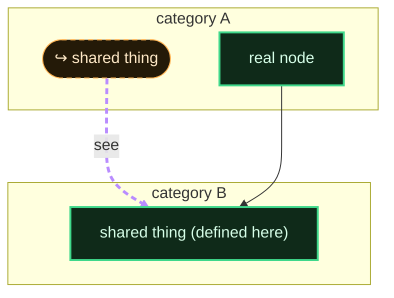

# Skill: the living-map technique (Mermaid graph as governing doc)

**When to use:** you need to see a whole plan or design space *as a graph* — not
tables, not charts — so the structure (what depends on what, what won, what is a
reference to what) is visible at a glance and can be reasoned about like graph
theory input. First worked example: `v6/MAP.md`.

**Why a graph and not a table:** a table lists; a graph shows *intersection and
flow*. When three things turn out to be the same thing (salsa / dd / reachability
→ one cascade), only a graph makes the shared node obvious. The map is *living*:
it is the source of truth, edited as cells change, and abided by.

---

## The rules that make it readable at scale

1. **Vertical.** `flowchart TB`. Tall maps scroll; wide maps do not fit a screen.
2. **Subgraph by category.** Each `subgraph` is one lane / category. Category is
   carried by **colour**, defined once in a `classDef` block and reused verbatim
   in every diagram so the palette is consistent across the whole doc.
3. **Define each node once.** A node id is global *within a diagram*. When the
   same concept must appear in another lane, use a **reference node**:
   - same colour family, `↪` prefix in the label, **dashed border**
     (`stroke-dasharray:5 4` in its `classDef`);
   - joined to its source by a **thick dashed "see" edge** styled distinctly
     (`linkStyle N stroke:#b98cff,stroke-width:3px,stroke-dasharray:6 4`).
   The special edge is what tells a reader "this is a portal, not a real
   dependency." This is how you unknot a hairball: replace 6 long edges with 1
   reference node + 1 see-edge.
4. **Status by border colour**, consistent everywhere: green = win/ships,
   red = rejected (with receipts), amber = in-flight/WIP, blue = external
   teacher / oracle / prior art, purple = control-plane / invariant.
5. **A legend table** at the end restating the colour key. Non-negotiable.

---

## Copy-paste skeleton



`linkStyle` indices count **every edge in the diagram in source order**, starting
at 0, and `a & b --> c` expands to multiple edges. Put the reference "see" edges
first (right after the subgraphs) so their indices are easy to target (0,1,…).

---

## Mermaid's real limits (when to reach for D2 instead)

Mermaid is enough for a doc split into several moderate diagrams. It breaks down
when you want ONE giant map, because:

- **No cross-diagram links.** A reference in diagram 3 cannot draw a real edge to
  a source in diagram 2 — the best you get is a labelled pointer node
  ("↪ X (see §2)"). Real portal edges only work *within one diagram*.
- **Layout is not controllable.** No port anchoring, no manual edge routing; a
  dense single graph becomes a hairball dagre won't untangle.
- **`linkStyle` is positional and brittle** — reorder edges and the styling
  points at the wrong link.

Reach for **D2** when: it must be one single map (not sections), you need
cross-container references with real routed edges, you want `near`/port anchoring
or manual layout, or the edge count is high enough that dagre tangles. D2 has
first-class containers, `a.b -> c.d` cross-container edges, styled edge classes,
and multiple layout engines (dagre/elk/tala). Cost: a `d2` binary in the
toolchain and it does not render inline in Markdown the way Mermaid does.

Rule of thumb: **≤ ~4 diagrams of ≤ ~15 nodes each → Mermaid. One map, many
cross-references, tight layout → D2.**

---

## Validate the render (don't trust the source)

Mermaid syntax errors are silent until rendered. To actually see it: publish the
markdown as an **Artifact** (renders ```mermaid fences natively), or paste into
the mermaid.live editor. A map that "looks right" in source is a hypothesis until
it renders — the same doubt-your-first-output discipline as everything else here.
