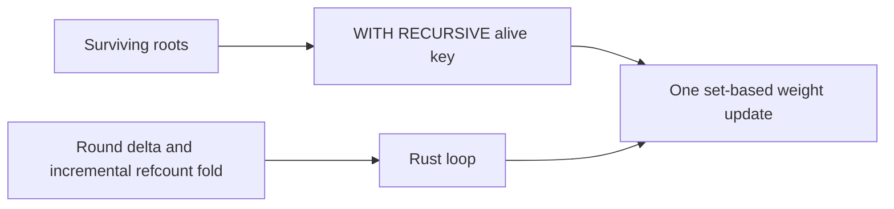

# Recursive SQLite Probe

| Contents |
|---|
| Result |
| CTE ownership boundary |
| 960k receipts |
| Folded consolidation |
| Reproduce |

## Result

| Question | Result |
|---|---|
| Can `WITH RECURSIVE` remove round dispatches? | Yes. Signed survivor reachability is one distinct recursive walk plus frontier clear and weight publish: 3 statements. |
| Can a CTE own the signed-delta round column? | No. `(round,key)` makes every cycle visit distinct under `UNION`; an accumulated-set guard requires a second recursive CTE reference, rejected by SQLite. |
| Does incremental folding remove work? | It avoids the whole-row-table refcount refill. The current single-tick implementation retains 27 dispatches because each round still stages and folds separately. |

## CTE Ownership Boundary

`UNION` deduplicates `alive(key)` and terminates cyclic traversals. SQLite permits one recursive-table reference in the recursive term. A `NOT IN (SELECT key FROM alive)` accumulator test adds another reference and fails with `multiple recursive references: alive`; adding `round` instead prevents duplicate suppression across a cycle. Refcount mutation therefore remains outside recursive evaluation.

## 960k Receipts

`gen_multi_cyclic(6, 160000, stride)`, setup excluded. `oracle-equal` compares sorted survivor keys byte-for-byte.

| DAG 960k variant | ms | stmts | survivors | oracle-equal |
|---|---:|---:|---:|:---:|
| dred-loop | 1781.9 | 53 | 800002 | yes |
| dred-cte | 2578.4 | 6 | 800002 | yes |
| signed-delta | 1693.4 | 27 | 800002 | yes |
| signed-delta-cte | 1131.8 | 3 | 800002 | yes |
| delta-fold | 1243.2 | 27 | 800002 | yes |
| dd, banked | 175.4 | 0 | 800002 | yes |

| Cyclic 960k, stride 7 variant | ms | stmts | survivors | oracle-equal |
|---|---:|---:|---:|:---:|
| dred-loop | 1963.1 | 53 | 815240 | yes |
| dred-cte | 2758.5 | 6 | 815240 | yes |
| signed-delta | 1904.3 | 27 | 815240 | yes |
| signed-delta-cte | 1188.8 | 3 | 815240 | yes |
| delta-fold | 1354.2 | 27 | 815240 | yes |

| Banked comparison, DAG 960k | Banked | This probe |
|---|---:|---:|
| dred-loop ms / stmts | 1753.4 / 53 | 1781.9 / 53 |
| signed-delta ms / stmts | 1669.7 / 27 | 1693.4 / 27 |

The signed CTE removes 24 signed-delta statements and is faster on both fixtures. The DRed CTE removes 47 statements while losing wall time on the wide frontier, consistent with recursive CTE work scaling with accumulated traversal state.

## Folded Consolidation

`retract_delta_fold` clears per-tick working state, appends each round to `cx_delta`, and uses `INSERT OR IGNORE` into `cx_refcount` as the monotone fold. It does not perform a periodic `GROUP BY/HAVING` sweep or refill `cx_refcount` from all `cx_row` keys. The signed CTE needs neither table for this one-shot survivor recomputation, so it remains the lower-cost result for the measured operation.

| B-tree receipt | Availability |
|---|---|
| Statement counts | `stmt_counter`, included above |
| `sqlite3_status` page-write count | Unavailable: bundled SQLite exposes memory/cache status, with no page-write counter |
| File-byte delta | Excluded: it measures only newly allocated pages and omits in-place writes |

## Reproduce

| Check | Command | Result |
|---|---|---|
| Oracle matrix | `cargo test --test agreement` | 4 passed |
| DAG receipt | `cargo run --release --example recursive_probe -- 6 160000 0` | all variants oracle-equal; max 2578.4 ms |
| Cyclic receipt | `cargo run --release --example recursive_probe -- 6 160000 7` | all variants oracle-equal; max 2758.5 ms |
