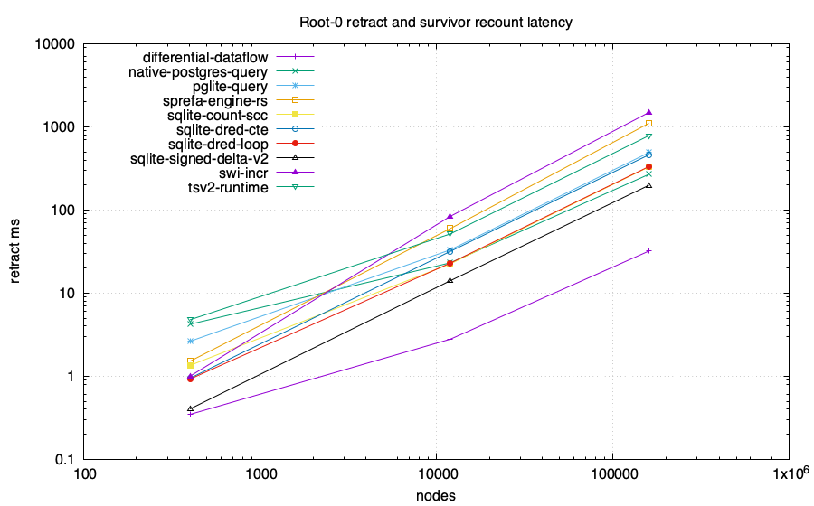
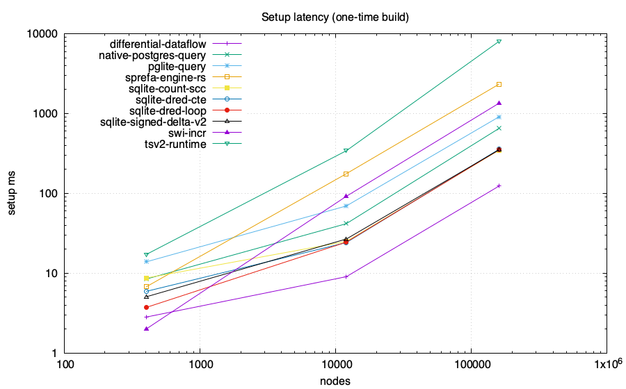
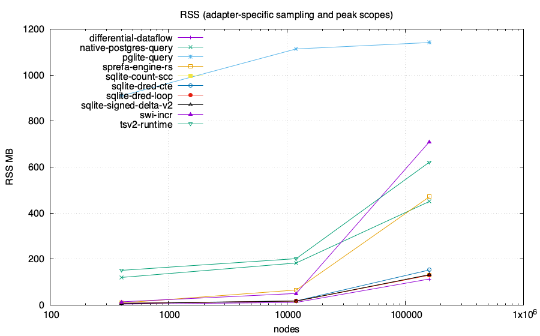

# Z-set / IVM head-to-head: feasibility lab

Same computation in every engine: reachability from roots {0,1} over a generated
layered graph, then **retract root 0** and recount the survivor set. The PostgreSQL-family
numeric arms compare complete ordered results with an independent BFS oracle
before emitting CSV. Only the root retraction and survivor recount are the
measured operation; setup is reported separately. Requested memory budget:
4096 MB/run. Enforcement and accounting scope are adapter-specific and
recorded below.

Graph back-edge stride: 7 (0 is the layered DAG;
positive values add the existing cyclic workload's child-to-parent edges).
Input-hash gating: 1. When enabled, every numeric
arm must match the shared canonical edge-list SHA-256 in `input-hashes.tsv`.
The tagged store keys are normalized to global node IDs for this comparison.

Ordinary PostgreSQL and PGlite arms execute the recursive query from scratch
after the root deletion. Their timed phase ends after query materialization and
`count(*)`. Ordered full-result transfer, checksum, and exact validation are
recorded in the status receipt and excluded from `setup_ms` and
`retract_ms`. Their rows are full recomputation measurements.

The `differential-dataflow` arm is the native Differential Dataflow 0.25
library over timely 0.31. Its setup and retract phases end after fixed-point
convergence and counting. Complete ordered
initial and survivor sets are checked against an independent BFS outside the
timed phases.

The `swi-incr` arm uses SWI incremental tabling and wall time. Its clock is
reset after initial validation and immediately before root deletion. Both
phases end after table materialization and counting; exact initial-range and
incremental-versus-cold survivor checks run outside the clocks.

The optional `swipl-pure` reference uses CPU time and does not perform an
exact-set oracle check. Keep it outside a wall-time comparison. RSS combines
adapter-specific samples and process peaks, including untimed validation;
the scope receipts describe which processes and limits are included.

Per-cell output and exit codes are retained in `logs/`. Failed processes and
error/timeout/OOM status rows do not contribute numeric measurements. A run
refuses to overwrite existing CSV/status receipts.

When selected, the `sqlite-*` arms call the native store's count, SCC, DRed,
or signed-delta implementation through `perf_report --shared`. The
`tsv2-runtime` and `sprefa-engine-rs` arms execute compiler-emitted programs
through their actual runtime tick methods. These adapters validate complete
initial and survivor sets outside the clocks, and include counting inside.
The older `tsv2_retract.sh` specialized SQL script is not a generated-runtime
arm and is not selected by `SQLITE_SHOOTOUT`.

## Charts

## Data

| engine | nodes | edges | killed | setup ms | retract ms | ops | RSS MB | host peak MB | SQLite high-water MB | db MB |
|---|---:|---:|---:|---:|---:|---:|---:|---:|---:|---:|
| swi-incr | 402 | 696 | 180 | 2 | 1 | 0 | 13.81 | N/A | N/A | N/A |
| swi-incr | 12002 | 24096 | 1715 | 92 | 84 | 0 | 50.12 | N/A | N/A | N/A |
| swi-incr | 160002 | 326667 | 18096 | 1348 | 1492 | 0 | 710.22 | N/A | N/A | N/A |
| differential-dataflow | 402 | 696 | 180 | 2.826 | 0.347 | 180 | 3.7 | N/A | N/A | N/A |
| differential-dataflow | 12002 | 24096 | 1715 | 9.058 | 2.791 | 1715 | 11.3 | N/A | N/A | N/A |
| differential-dataflow | 160002 | 326667 | 18096 | 123.593 | 32.073 | 18096 | 113.0 | N/A | N/A | N/A |
| sqlite-count-scc | 402 | 696 | 180 | 8.705 | 1.349 | 21 | 7.1 | 0.11 | 0.29 | 0.07 |
| sqlite-count-scc | 12002 | 24096 | 1715 | 25.035 | 22.492 | 39 | 17.2 | 0.17 | 1.34 | 0.80 |
| sqlite-count-scc | 160002 | 326667 | 18096 | 347.909 | 330.542 | 51 | 131.0 | 1.24 | 14.72 | 10.39 |
| sqlite-dred-loop | 402 | 696 | 180 | 3.728 | 0.924 | 31 | 7.3 | 0.11 | 0.29 | 0.07 |
| sqlite-dred-loop | 12002 | 24096 | 1715 | 24.542 | 23.009 | 53 | 17.0 | 0.17 | 1.34 | 0.80 |
| sqlite-dred-loop | 160002 | 326667 | 18096 | 350.475 | 333.594 | 67 | 129.7 | 1.24 | 14.72 | 10.39 |
| sqlite-dred-cte | 402 | 696 | 180 | 5.924 | 0.946 | 6 | 7.4 | 0.11 | 0.29 | 0.07 |
| sqlite-dred-cte | 12002 | 24096 | 1715 | 24.227 | 31.816 | 6 | 17.8 | 0.17 | 1.56 | 0.80 |
| sqlite-dred-cte | 160002 | 326667 | 18096 | 357.419 | 461.825 | 6 | 152.4 | 1.24 | 18.37 | 10.39 |
| sqlite-signed-delta-v2 | 402 | 696 | 180 | 5.067 | 0.404 | 3 | 6.5 | 0.11 | 0.29 | 0.07 |
| sqlite-signed-delta-v2 | 12002 | 24096 | 1715 | 26.843 | 14.113 | 3 | 17.0 | 0.17 | 1.38 | 0.80 |
| sqlite-signed-delta-v2 | 160002 | 326667 | 18096 | 351.214 | 198.564 | 3 | 132.0 | 1.24 | 15.32 | 10.39 |
| tsv2-runtime | 402 | 696 | 180 | 17.158 | 4.779 | 98 | 150.7 | N/A | N/A | 0 |
| tsv2-runtime | 12002 | 24096 | 1715 | 342.394 | 51.612 | 107 | 201.6 | N/A | N/A | 0 |
| tsv2-runtime | 160002 | 326667 | 18096 | 8017.677 | 785.388 | 113 | 621.3 | N/A | N/A | 0 |
| sprefa-engine-rs | 402 | 696 | 180 | 6.752 | 1.514 | 64 | 8.9 | N/A | N/A | 0 |
| sprefa-engine-rs | 12002 | 24096 | 1715 | 176.457 | 59.873 | 76 | 65.2 | N/A | N/A | 0 |
| sprefa-engine-rs | 160002 | 326667 | 18096 | 2333.540 | 1104.066 | 88 | 470.8 | N/A | N/A | 0 |
| pglite-query | 402 | 696 | 180 | 13.883 | 2.631 | N/A | 909.7 | N/A | N/A | 38.125 |
| pglite-query | 12002 | 24096 | 1715 | 69.636 | 33.194 | N/A | 1113.9 | N/A | N/A | 39.328 |
| pglite-query | 160002 | 326667 | 18096 | 910.488 | 490.918 | N/A | 1141.6 | N/A | N/A | 87.024 |
| native-postgres-query | 402 | 696 | 180 | 8.452 | 4.221 | N/A | 119.8 | N/A | N/A | 7.420 |
| native-postgres-query | 12002 | 24096 | 1715 | 41.776 | 23.151 | N/A | 182.7 | N/A | N/A | 8.623 |
| native-postgres-query | 160002 | 326667 | 18096 | 651.976 | 268.973 | N/A | 450.4 | N/A | N/A | 24.318 |

## Adapter status and measurement scope

| engine | scale | status | semantics or reason | memory scope | memory-limit scope |
|---|---|---|---|---|---|
| swi-incr | 2x200 | ok | SWI incremental tabling; setup and retract end after table materialization and count; exact ordered initial set matches the generated node range and exact incremental survivor set matches cold table recomputation | process RSS sampled with ps after both phases | DL_MEMCAP_MB is passed by the harness but unenforced by this adapter |
| swi-incr | 6x2000 | ok | SWI incremental tabling; setup and retract end after table materialization and count; exact ordered initial set matches the generated node range and exact incremental survivor set matches cold table recomputation | process RSS sampled with ps after both phases | DL_MEMCAP_MB is passed by the harness but unenforced by this adapter |
| swi-incr | 8x20000 | ok | SWI incremental tabling; setup and retract end after table materialization and count; exact ordered initial set matches the generated node range and exact incremental survivor set matches cold table recomputation | process RSS sampled with ps after both phases | DL_MEMCAP_MB is passed by the harness but unenforced by this adapter |
| differential-dataflow | 2x200 | ok | differential-dataflow 0.25 with timely 0.31; shared layered graph; setup and retract end after fixed-point materialization and count; exact ordered sets match BFS oracle | process peak RSS from getrusage including untimed oracle allocations | DL_MEMCAP_MB=4096 caps live Rust allocations through CappedAlloc (0 disables); RLIMIT_AS and RLIMIT_DATA are also requested best-effort; total process RSS is not capped |
| differential-dataflow | 6x2000 | ok | differential-dataflow 0.25 with timely 0.31; shared layered graph; setup and retract end after fixed-point materialization and count; exact ordered sets match BFS oracle | process peak RSS from getrusage including untimed oracle allocations | DL_MEMCAP_MB=4096 caps live Rust allocations through CappedAlloc (0 disables); RLIMIT_AS and RLIMIT_DATA are also requested best-effort; total process RSS is not capped |
| differential-dataflow | 8x20000 | ok | differential-dataflow 0.25 with timely 0.31; shared layered graph; setup and retract end after fixed-point materialization and count; exact ordered sets match BFS oracle | process peak RSS from getrusage including untimed oracle allocations | DL_MEMCAP_MB=4096 caps live Rust allocations through CappedAlloc (0 disables); RLIMIT_AS and RLIMIT_DATA are also requested best-effort; total process RSS is not capped |
| sqlite-count | 2x200 | unsupported | plain reference counting does not collect unsupported cycles; use SCC or DRed | no graph loaded | not applicable |
| sqlite-count | 6x2000 | unsupported | plain reference counting does not collect unsupported cycles; use SCC or DRed | no graph loaded | not applicable |
| sqlite-count | 8x20000 | unsupported | plain reference counting does not collect unsupported cycles; use SCC or DRed | no graph loaded | not applicable |
| sqlite-count-scc | 2x200 | ok | native RelStore specialized incremental cascade; materialize and count inside clocks; exact initial and survivor sets validated outside clocks; tagged-node input blake3=14955fe055a07105; survivor blake3=6e29820385bc6b56 | process peak RSS includes setup and oracle; separate Rust allocation and SQLite C-heap high-water columns | DL_MEMCAP_MB=4096 caps live Rust allocations; SQLite C heap and total RSS are unenforced |
| sqlite-count-scc | 6x2000 | ok | native RelStore specialized incremental cascade; materialize and count inside clocks; exact initial and survivor sets validated outside clocks; tagged-node input blake3=95e40b2476927975; survivor blake3=4965a69e9e8ee22d | process peak RSS includes setup and oracle; separate Rust allocation and SQLite C-heap high-water columns | DL_MEMCAP_MB=4096 caps live Rust allocations; SQLite C heap and total RSS are unenforced |
| sqlite-count-scc | 8x20000 | ok | native RelStore specialized incremental cascade; materialize and count inside clocks; exact initial and survivor sets validated outside clocks; tagged-node input blake3=968700d3a18355e1; survivor blake3=4513570c9a2459b4 | process peak RSS includes setup and oracle; separate Rust allocation and SQLite C-heap high-water columns | DL_MEMCAP_MB=4096 caps live Rust allocations; SQLite C heap and total RSS are unenforced |
| sqlite-dred-loop | 2x200 | ok | native RelStore specialized incremental cascade; materialize and count inside clocks; exact initial and survivor sets validated outside clocks; tagged-node input blake3=14955fe055a07105; survivor blake3=6e29820385bc6b56 | process peak RSS includes setup and oracle; separate Rust allocation and SQLite C-heap high-water columns | DL_MEMCAP_MB=4096 caps live Rust allocations; SQLite C heap and total RSS are unenforced |
| sqlite-dred-loop | 6x2000 | ok | native RelStore specialized incremental cascade; materialize and count inside clocks; exact initial and survivor sets validated outside clocks; tagged-node input blake3=95e40b2476927975; survivor blake3=4965a69e9e8ee22d | process peak RSS includes setup and oracle; separate Rust allocation and SQLite C-heap high-water columns | DL_MEMCAP_MB=4096 caps live Rust allocations; SQLite C heap and total RSS are unenforced |
| sqlite-dred-loop | 8x20000 | ok | native RelStore specialized incremental cascade; materialize and count inside clocks; exact initial and survivor sets validated outside clocks; tagged-node input blake3=968700d3a18355e1; survivor blake3=4513570c9a2459b4 | process peak RSS includes setup and oracle; separate Rust allocation and SQLite C-heap high-water columns | DL_MEMCAP_MB=4096 caps live Rust allocations; SQLite C heap and total RSS are unenforced |
| sqlite-dred-cte | 2x200 | ok | native RelStore specialized incremental cascade; materialize and count inside clocks; exact initial and survivor sets validated outside clocks; tagged-node input blake3=14955fe055a07105; survivor blake3=6e29820385bc6b56 | process peak RSS includes setup and oracle; separate Rust allocation and SQLite C-heap high-water columns | DL_MEMCAP_MB=4096 caps live Rust allocations; SQLite C heap and total RSS are unenforced |
| sqlite-dred-cte | 6x2000 | ok | native RelStore specialized incremental cascade; materialize and count inside clocks; exact initial and survivor sets validated outside clocks; tagged-node input blake3=95e40b2476927975; survivor blake3=4965a69e9e8ee22d | process peak RSS includes setup and oracle; separate Rust allocation and SQLite C-heap high-water columns | DL_MEMCAP_MB=4096 caps live Rust allocations; SQLite C heap and total RSS are unenforced |
| sqlite-dred-cte | 8x20000 | ok | native RelStore specialized incremental cascade; materialize and count inside clocks; exact initial and survivor sets validated outside clocks; tagged-node input blake3=968700d3a18355e1; survivor blake3=4513570c9a2459b4 | process peak RSS includes setup and oracle; separate Rust allocation and SQLite C-heap high-water columns | DL_MEMCAP_MB=4096 caps live Rust allocations; SQLite C heap and total RSS are unenforced |
| sqlite-signed-delta-v2 | 2x200 | ok | native RelStore specialized incremental cascade; materialize and count inside clocks; exact initial and survivor sets validated outside clocks; tagged-node input blake3=14955fe055a07105; survivor blake3=6e29820385bc6b56 | process peak RSS includes setup and oracle; separate Rust allocation and SQLite C-heap high-water columns | DL_MEMCAP_MB=4096 caps live Rust allocations; SQLite C heap and total RSS are unenforced |
| sqlite-signed-delta-v2 | 6x2000 | ok | native RelStore specialized incremental cascade; materialize and count inside clocks; exact initial and survivor sets validated outside clocks; tagged-node input blake3=95e40b2476927975; survivor blake3=4965a69e9e8ee22d | process peak RSS includes setup and oracle; separate Rust allocation and SQLite C-heap high-water columns | DL_MEMCAP_MB=4096 caps live Rust allocations; SQLite C heap and total RSS are unenforced |
| sqlite-signed-delta-v2 | 8x20000 | ok | native RelStore specialized incremental cascade; materialize and count inside clocks; exact initial and survivor sets validated outside clocks; tagged-node input blake3=968700d3a18355e1; survivor blake3=4513570c9a2459b4 | process peak RSS includes setup and oracle; separate Rust allocation and SQLite C-heap high-water columns | DL_MEMCAP_MB=4096 caps live Rust allocations; SQLite C heap and total RSS are unenforced |
| tsv2-runtime | 2x200 | ok | compile_dl6 emitted program.tick through IncrementalRuntime; emitted recursive DRed plan; setup loads edges in 1000-row batches then roots; exact input edges and before/after sets match shared BFS outside clocks; count inside clocks | Node process RSS sampled after validation; in-memory libSQL store | DL_MEMCAP_MB limits Node old-space only; SQLite C heap and total RSS unenforced |
| tsv2-runtime | 6x2000 | ok | compile_dl6 emitted program.tick through IncrementalRuntime; emitted recursive DRed plan; setup loads edges in 1000-row batches then roots; exact input edges and before/after sets match shared BFS outside clocks; count inside clocks | Node process RSS sampled after validation; in-memory libSQL store | DL_MEMCAP_MB limits Node old-space only; SQLite C heap and total RSS unenforced |
| tsv2-runtime | 8x20000 | ok | compile_dl6 emitted program.tick through IncrementalRuntime; emitted recursive DRed plan; setup loads edges in 1000-row batches then roots; exact input edges and before/after sets match shared BFS outside clocks; count inside clocks | Node process RSS sampled after validation; in-memory libSQL store | DL_MEMCAP_MB limits Node old-space only; SQLite C heap and total RSS unenforced |
| sprefa-engine-rs | 2x200 | ok | compile_dl6 emit_rust program through drive_tick_transacted and GenProgram::run_tick; exact input edges and before/after sets match shared BFS outside clocks; count inside clocks | child-process peak RSS from time; in-memory rusqlite store | DL_MEMCAP_MB requested but unenforced for this adapter |
| sprefa-engine-rs | 6x2000 | ok | compile_dl6 emit_rust program through drive_tick_transacted and GenProgram::run_tick; exact input edges and before/after sets match shared BFS outside clocks; count inside clocks | child-process peak RSS from time; in-memory rusqlite store | DL_MEMCAP_MB requested but unenforced for this adapter |
| sprefa-engine-rs | 8x20000 | ok | compile_dl6 emit_rust program through drive_tick_transacted and GenProgram::run_tick; exact input edges and before/after sets match shared BFS outside clocks; count inside clocks | child-process peak RSS from time; in-memory rusqlite store | DL_MEMCAP_MB requested but unenforced for this adapter |
| pglite-query | 2x200 | ok | ordinary recursive SQL full recomputation; timed phases end after materialization and count; exact before=ada7ea43e998e3ba1357b4270279f2976e2659c6e3dd768d0fbfc6a15cd11314 after=8b785b6ac760143407366be3159c6e44fe2b8c85bcb5e8201b33379e0d2fcb25; untimed transfer_ms before=0.964 after=0.474; untimed checksum_validation_ms before=1.199 after=0.093; PostgreSQL 18.3 | sampled RSS of the Node process containing PGlite WASM | DL_MEMCAP_MB=4096 limits Node old-space only; total process RSS is unenforced |
| pglite-query | 6x2000 | ok | ordinary recursive SQL full recomputation; timed phases end after materialization and count; exact before=5359ff08f251a47ab81d104beeff9633f95d50c30ea2ff1db9d40617983ca17b after=4f87d3e445a0a5e73efe07d7d3fb7bcc6705a16dd176b41a43c35fe6cf5f35d8; untimed transfer_ms before=15.954 after=14.258; untimed checksum_validation_ms before=4.054 after=1.893; PostgreSQL 18.3 | sampled RSS of the Node process containing PGlite WASM | DL_MEMCAP_MB=4096 limits Node old-space only; total process RSS is unenforced |
| pglite-query | 8x20000 | ok | ordinary recursive SQL full recomputation; timed phases end after materialization and count; exact before=d5b111c00b9de6c6acc308845af36202735166f81b10ef25547078a8e03fcd77 after=3b230457cb44c24b2aee90922f65fd969e19e3cc990f50afe8e42176503a1e85; untimed transfer_ms before=210.175 after=172.578; untimed checksum_validation_ms before=28.818 after=25.115; PostgreSQL 18.3 | sampled RSS of the Node process containing PGlite WASM | DL_MEMCAP_MB=4096 limits Node old-space only; total process RSS is unenforced |
| native-postgres-query | 2x200 | ok | ordinary recursive SQL full recomputation; timed phases end after materialization and count; exact before=ada7ea43e998e3ba1357b4270279f2976e2659c6e3dd768d0fbfc6a15cd11314 after=8b785b6ac760143407366be3159c6e44fe2b8c85bcb5e8201b33379e0d2fcb25; untimed transfer_ms before=0.756 after=0.213; untimed checksum_validation_ms before=0.538 after=0.097; PostgreSQL 18.6 | sampled sum of Node client and disposable PostgreSQL process-tree RSS; shared mappings may be counted more than once | DL_MEMCAP_MB=4096 is unenforced for total PostgreSQL memory |
| native-postgres-query | 6x2000 | ok | ordinary recursive SQL full recomputation; timed phases end after materialization and count; exact before=5359ff08f251a47ab81d104beeff9633f95d50c30ea2ff1db9d40617983ca17b after=4f87d3e445a0a5e73efe07d7d3fb7bcc6705a16dd176b41a43c35fe6cf5f35d8; untimed transfer_ms before=6.991 after=2.808; untimed checksum_validation_ms before=3.905 after=2.601; PostgreSQL 18.6 | sampled sum of Node client and disposable PostgreSQL process-tree RSS; shared mappings may be counted more than once | DL_MEMCAP_MB=4096 is unenforced for total PostgreSQL memory |
| native-postgres-query | 8x20000 | ok | ordinary recursive SQL full recomputation; timed phases end after materialization and count; exact before=d5b111c00b9de6c6acc308845af36202735166f81b10ef25547078a8e03fcd77 after=3b230457cb44c24b2aee90922f65fd969e19e3cc990f50afe8e42176503a1e85; untimed transfer_ms before=57.109 after=44.286; untimed checksum_validation_ms before=29.477 after=24.027; PostgreSQL 18.6 | sampled sum of Node client and disposable PostgreSQL process-tree RSS; shared mappings may be counted more than once | DL_MEMCAP_MB=4096 is unenforced for total PostgreSQL memory |
| pglite-pg_ivm | 2x200 | unsupported | pg_ivm rejects recursive WITH RECURSIVE view definitions | no process started | not applicable |
| pglite-pg_ivm | 6x2000 | unsupported | pg_ivm rejects recursive WITH RECURSIVE view definitions | no process started | not applicable |
| pglite-pg_ivm | 8x20000 | unsupported | pg_ivm rejects recursive WITH RECURSIVE view definitions | no process started | not applicable |
| native-postgres-pg_ivm | 2x200 | unsupported | pg_ivm rejects recursive WITH RECURSIVE view definitions | no process started | not applicable |
| native-postgres-pg_ivm | 6x2000 | unsupported | pg_ivm rejects recursive WITH RECURSIVE view definitions | no process started | not applicable |
| native-postgres-pg_ivm | 8x20000 | unsupported | pg_ivm rejects recursive WITH RECURSIVE view definitions | no process started | not applicable |

## Takeaways (derived)

- Largest scale reached by a numeric run: 160002 nodes.
- No numeric arm emitted a WALL row at these scales.
